AtroCore provides the ability to compare or merge two or more records within one or multiple entities. This can be done directly on the selected entity page via a modal window, or through a dedicated entity called Selection. From the Selection entity, you can also choose records for comparison or merging.

## Selection

Selections are standard entities that can be added to the Navigation menu or Favorites. To create a new comparison table:

1. Create a new record in the Selection entity.
2. Add the records you want to compare.

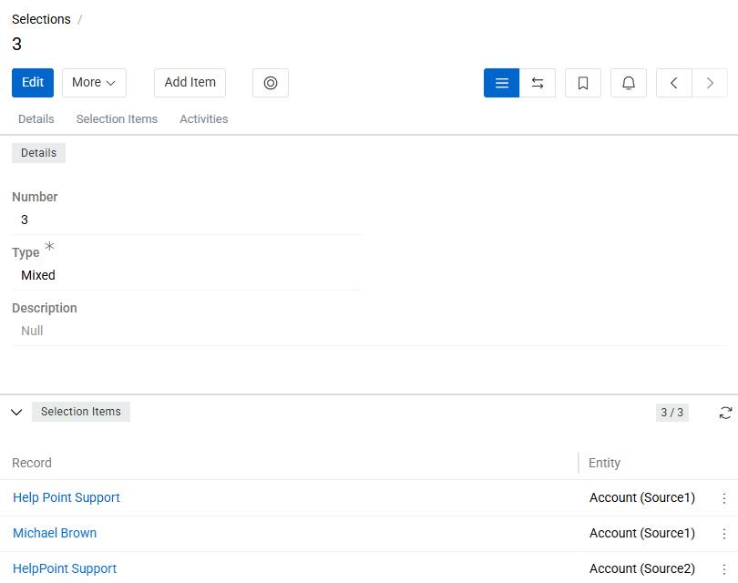{.medium}

### Basic Configuration

All Selections share these common configuration fields:

- **Number**: A unique read-only auto-incremented identifier, assigned automatically.
- **Type**: Defines the scope of the selection – either Uniform or Mixed.
- **Selection Records**: Records that will be included in the comparison table.

You can add records to the table using the `Add Item` option in the entity header.

Please, note that for Uniform selections, the Entity field cannot be changed once one or more Selection Items have been linked (including deleted ones).

### Selection Types

| Type | Description |
|---|---|
| **Uniform** | All items belong to the same entity or its derivative (staging) entities. The Entity field is required and is always set to the master entity. Enables direct comparison of records across an entity and its derivatives. |
| **Mixed** | Items can belong to different, unrelated entities. The Entity field is not available. |

### Adding Items to a Uniform Selection

For Uniform selections, if the selected Entity has a Staging derivative entity, the Add Item button includes a dropdown on the right with the option to add a record from that Staging entity. If no Staging entity exists for the selected Entity, the dropdown is not shown.

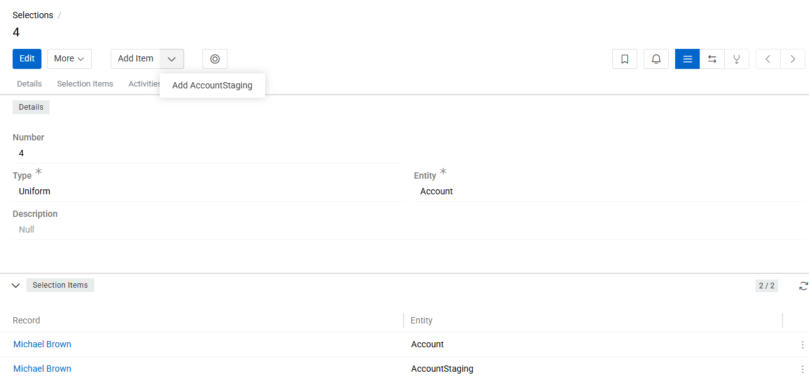{.medium}

When creating a new Uniform selection directly from the Selection page, you will be prompted to select the Entity before the record is saved.

### Selection View Modes

The Selection entity has three view modes, switchable via buttons in the header panel:

1. **Standard view**: default mode, displaying the entity fields and relation panel.
2. **Comparison view**: activated by clicking compare button. Displays a comparison table with fields and attributes of the selected records.
3. **Merging view**: activated by clicking merge button Allows merging of selected records.

The options Select, Compare, and Merge are also available in the action menu of the list view for any entity (except system entities). If the action is executed from the list view a Selection will be created automatically. You can rename it later if needed.

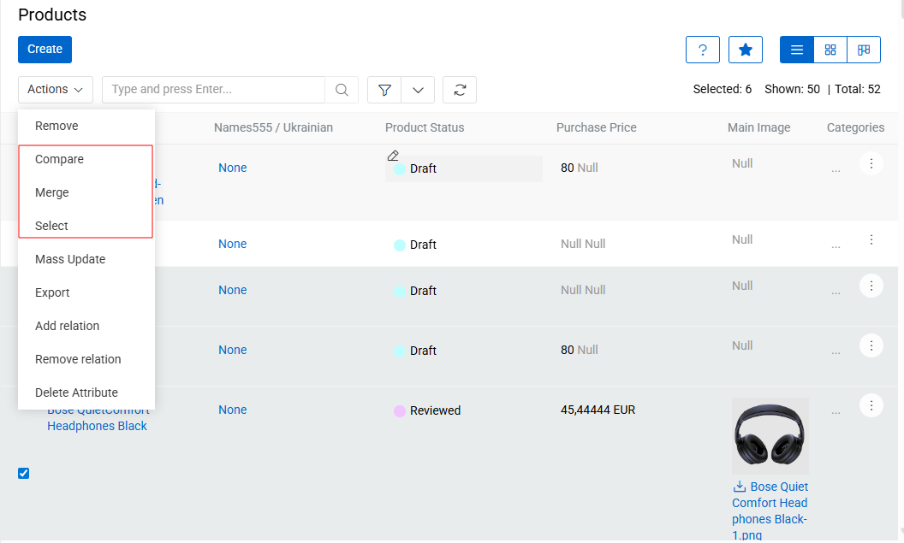{.medium}

When the Select action is triggered from any record list page, the Current Selection is updated according to the following rules:

- If the selected record belongs to a staging entity, the Selection type is set to Uniform and the Entity is set to the master entity of that derivative.
- If the Select action is triggered for a record that does not belong to the selection's current Entity or its staging entity, the selection type is automatically changed to Mixed, the Entity field is set to NULL, and the new item is added to the selection.

## Compare Records

The functionality of comparing entity records allows you to see the difference between the values of the same fields, relation panels and attributes.

Records within the same entity can be compared in two ways:

1. Using the Compare Action from the List View

To compare records without creating a selection, select two or more records (up to 10) in the entity List View and apply the `Compare` action from the Actions menu.

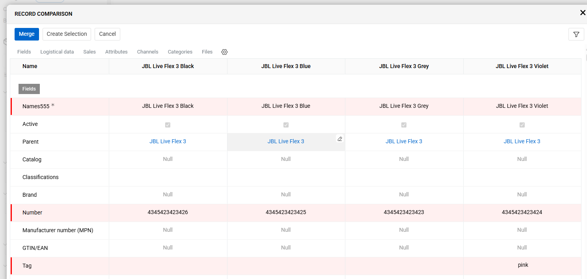{.large}

A window will open displaying a comparison table for the selected records. Field and attribute values that differ between records are highlighted with a vertical red line.

2. Using a Predefined Selection

If you want to save a set of records and return to it later, you can create a Selection. Indicate the selection either by using the `Select` action in the List View or by creating it directly within the Selection entity and switch to Comparison View by clicking the corresponding button.

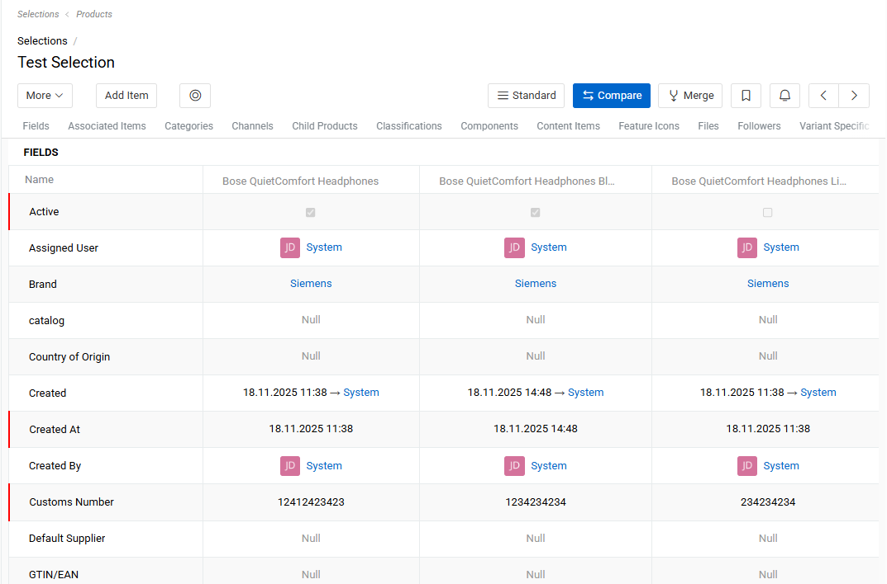{.large}

The comparison table contains all the data about the selected records, divided into panels, as it is done on the Detail page of the entity. You can also apply a filter to the table rows by clicking on the content filter button (a circle icon inside a square, located to the right of the `Add Item` button) to keep only required, empty, or filled field (attribute) values.
From the comparison table, you can go directly to the record merge functionality by clicking the `Merge` button.

In Comparison View, you can also edit fields and attributes directly. To edit a value in the table, click on the field or attribute in any cell and enter the desired value. Click outside the cell to save the value.

Additionally, you can manage records in the comparison table:

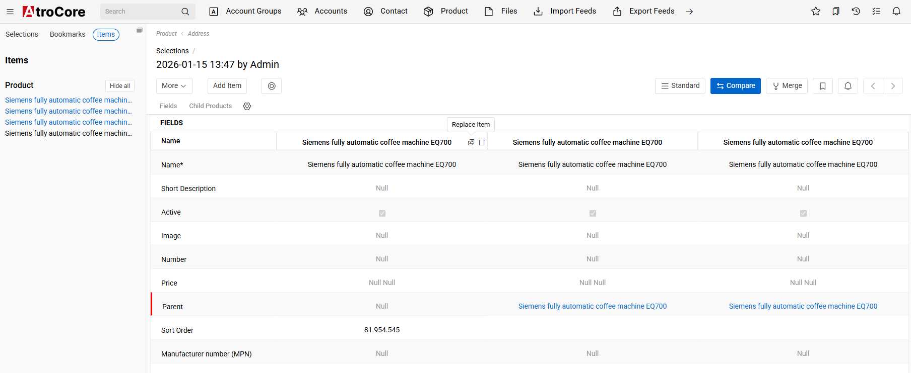{.large}

- Add a new record: Click the `Add Item` button.
- Replace an existing record: Use the `Replace Record` icon.
- Remove a record: Click the `Delete Record` icon located to the right of the record name.
- Add or remove records without modifying the selection: Use the `Items` panel in the left sidebar to add or remove records from the comparison table without changing the underlying selection

### Compare records from multiple entities

Record comparison is also possible across multiple entities. To compare records from different entities, you must create a Selection of type `Multiple Entities`.

When a selection of this type is used, adding a record to the comparison table will prompt you to choose both the Entity and the Entity Record you want to include.

Unlike comparisons within a single entity, the multi-entity comparison table has a different interface. It is divided into separate columns, one per record, where each column scrolls independently and has its own layout defined for the corresponding entity.

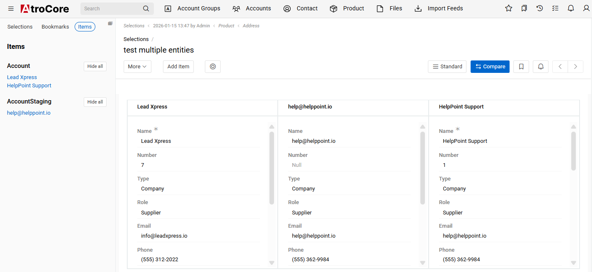{.large}

The comparison table for records from different entities does not highlight differences between field or attribute values.

### Configuring the Comparison Table Layout

By default, the comparison table displays the entity fields that are included in the entity’s default Detail View layout. However, this layout can be customized to better fit your needs.

You can extend the comparison layout by adding additional fields, attributes, or relation panels. This can be done in two ways:

1. Via the [Layout Manager](../03.administration/13.user-interface/02.layouts/docs.md#configuration-options)

Navigate to `Administration / Layouts` and select one of the following View Types:

- Selection
- Selection Relations

2. Directly from the Comparison Table

- For Single Entity selections, click on one of the gear icons in the table header.
- For Multiple Entities selections, select the needed gear icon at the bottom of each entity column.

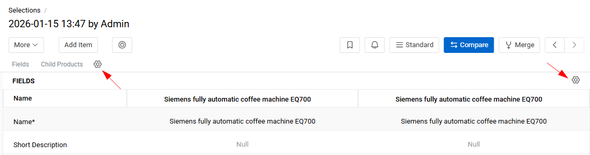{.medium}

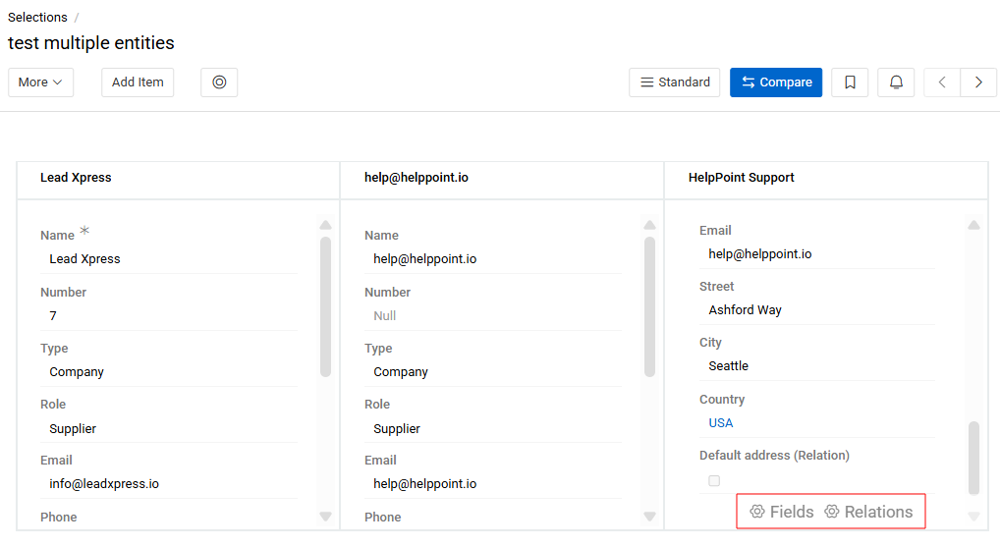{.medium}

Layout changes apply per entity and determine how records are displayed in the comparison table.

## Merge records

The Merge functionality allows you to create a new record based on existing ones while preserving selected field values. This is especially useful for cleaning up duplicates within an entity.

To merge records, start by selecting several similar records that you want to consolidate. Then, choose one record as the base. The system will create a new record with a different ID, inheriting fields from the chosen base record. Before finalizing the merge, you can modify specific field values or take them from other records, ensuring the new record contains the most accurate and relevant information.

### Ways to Merge Records

You can initiate merging in three ways:

1. From List View: select the necessary records and choose `Merge` from the action menu.
2. From Comparison Table: switch to the Merging View by clicking the `Merge` button in the comparison table.
3. From a Selection: create or open the desired Selection and click the `Merge` button to enter merging mode.

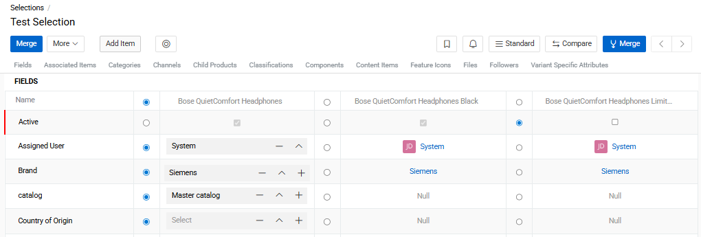{.large}

Before each column with record data, you see a column with a radio buttons. By default, the merged record will contain all the values from the first record. If you want to save the value of a field or attribute from another record, place the radio button against the value that you want to keep. You can also change it manually to any other value.

For [many-to-many](../03.administration/11.entity-management/07.fields-and-relations/docs.md#many-to-many-relationships) relationships, select the checkbox next to all records that should be linked to the merged record.

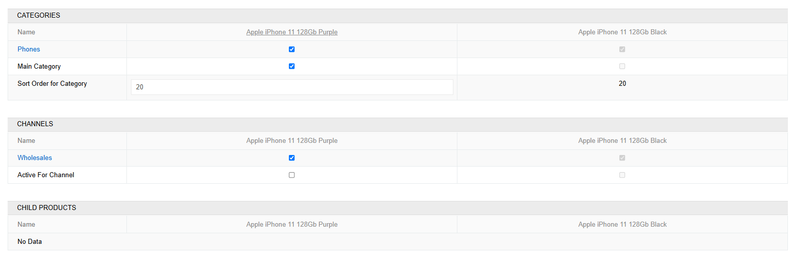{.large}

Just like on the product page, you can switch between panels using the anchor navigation and use date filters.
After you have determined the values of all fields for the resulting record, click the `Merge` button.

You will see the message “Merged” on the screen and will be redirected to the newly created record, which means that the resulting record has been saved and the rest of the records have been [deleted](../08.record-management/docs.md#deleting-records). As with any deleted records, they will be stored in the database for a certain period of time and you can restore them if necessary.

## Current Selection

The Current Selection feature allows users to collect records across different entities into the same Selection without the need to manually create and open a Selection entity each time. Each user has one Current Selection at a time. It is stored per user in the database and persists across sessions.

### Current Selection Popup

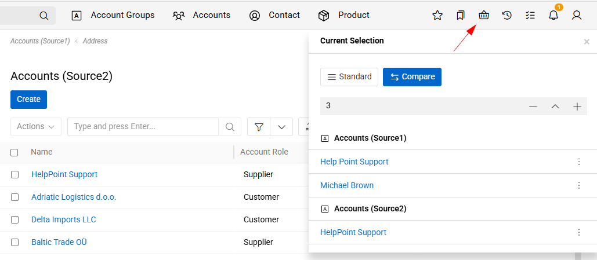{.large}

Clicking the `Current Selection` icon (located in the application header) opens a popup window showing all records currently in the selection, grouped by entity.
Each record in the popup has an item menu from which you can remove that record from the Current Selection.

From the popup or the header indicator, users can:

- Change the Current Selection – switch to a different existing Selection, making it the active one.
- Unset the Current Selection – deactivate the current one without deleting it.
- Open current selection in the Standard or Comparison view.

### Adding records to Current Selection

To add a record to the Current Selection, click the `Select` button available in the action menu of any record in a List or Detail View.

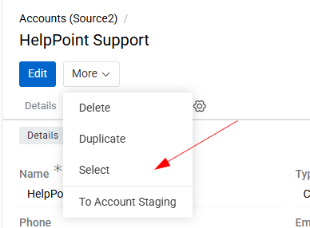{.small}

The following rules apply:

- If no Current Selection is set – a new Selection is created automatically and set as the current one.
- If a Current Selection already exists and the record belongs to the same entity – the record is added to it.
- If the record belongs to a different entity – the type of the Current Selection is updated automatically to "Mixed" and the record is added.

To perform Compare or Merge actions on the collected records, open the Current Selection as a standard Selection entity and switch to the desired view mode.

## Access management

Selection is a standard entity that can be chosen within the scope of entities in role settings. You can configure the same [access permissions](../03.administration/14.access-management/docs.md) for Selections as for any other entity (create, read, edit, delete).

Access to Compare and Merge actions is determined by permissions for the Selection entity and the entity for which these actions are being performed.

### In the Modal Window

- If the user has permission to create records in the entity, they can perform Merge.
- If the user has permission to view records in the entity, they can perform Compare.
- The button to navigate to Selection (in the modal window) and the Select action are visible only if the user has access to the Selection entity.

### On the Selection Page

- Merge is available if the user has permission to create records of the entity used in the selection.
- Compare is available if the user has permission to view records of that entity.
- If the user has permission to edit the selection, they can add or remove items from it.
- If the user has permission only to view the selection, they can see the records and perform actions if they are available.
