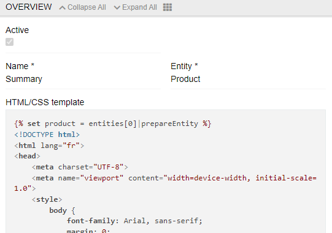
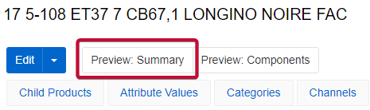
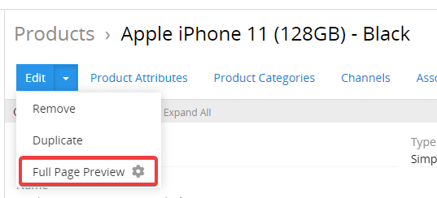
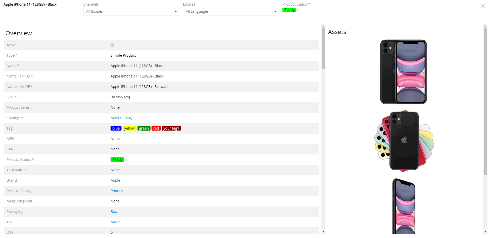
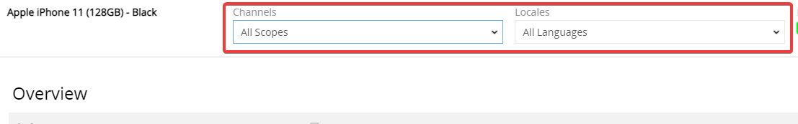
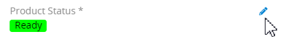

The Preview feature enables you to see how different entities appear on third party websites. This feature uses HTML/CSS templates to display records in a preview window, allowing you to review how your data will look when displayed externally.

## Preview templates

To create a preview, you must first create a template. Each template is used for one entity type, and each entity can have several templates. To create a template, go to Administration / Preview Templates.

You will then need to create an HTML/CSS template with all the pre-defined properties, including the desired screen sizes.

{.large}

## Usage of templates in entities

To see how templates are applied to a record of a selected entity, go to any record of that entity and click on the button with the name of the template. It will appear in the header of the record.

{.large}

## Product Preview (Predefined Template)

For products, AtroCore provides a predefined template that offers comprehensive product information review capabilities. This built-in preview allows you to:

- Review all product fields (including meta information), all product attributes and all product images
- Filter data by channel using the "Channels" drop-down list to see product attributes from the perspective of that specific channel
- Filter by language using the "Languages" selection list to see product information as it appears in different languages
- Change the product status directly from the preview page after reviewing all information

{.large}

To access the product preview, click on the "Full Page Preview" button in the main action menu on the product detail page. The preview appears in a large overview window. To close the preview, click the "x" icon in the upper right corner.

{.large}

### Product Preview Features

The product preview displays comprehensive information including:

- All product fields and meta information
- All product attributes
- All product images
- Channel-specific attribute views
- Multi-language support

{.large}

After reviewing all product information, you can change the product status directly on the preview page.

{.large}

If inconsistencies in the product information are found, close the preview and correct them on the product detail page.
