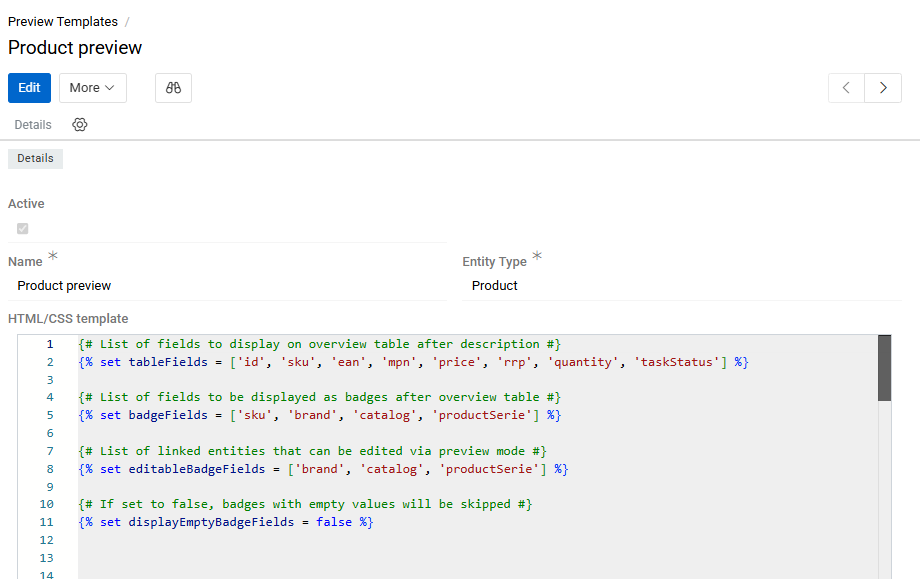
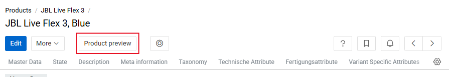

The Preview feature enables you to see how different entities appear on third party websites. This feature uses HTML/CSS templates to display records in a preview window, allowing you to review how your data will look when displayed externally.

## Preview Templates

To create a preview, you must first create a template. Each template is used for one entity type, and each entity can have several templates. To create a template, go to `Administration / Preview Templates`.

You will then need to create an HTML/CSS template with all the pre-defined properties, including the desired screen sizes.

{.large}

You can edit the existing template or create new ones if they are needed. As soon as you create a new template, an action with the corresponding name is automatically added to the selected entity.

## Usage of Templates in Entities

To see how templates are applied to a record of a selected entity, go to any record of that entity and click on the button with the name of the template. It will appear in the header of the record.

{.large}

## Product Preview (Predefined Template)

For products, AtroCore provides a predefined template that offers comprehensive product information review. This is a variant of Record Preview — it displays the values of product fields and attributes according to the specified template. You can find the default template at `Administration / Preview Templates / Product preview`.

The default template includes the product name, a long description, some fields in the form of a table (the list of these fields is configured in the `tableFields` section of the template), separately badged fields (`badgeFields`), and the main image. Fields defined as `editableBadgeFields` can be edited directly in the template. All table fields are editable by default.

After the list of fields, the product files, attribute table, and components (if any) are displayed.

{.large}

### Editing from Preview

By default, product fields and attributes can be edited directly from the preview. To do this, click on the required element — it will be displayed on the right side of the screen.

{.large}

By clicking on the square icon, you will be able to see all the elements that can be edited. The other three icons allow you to evaluate the view of the product card on different devices (phone, tablet, or desktop).

> If the **Auto-save** checkbox is selected, the changes will be saved automatically. You can uncheck it if you want to save changes by clicking the corresponding button.

### Multi-language Support

If the interface has several languages, you can switch the preview language at the top right of the page. As a result, the names of the fields and attributes and the values of multilingual attributes will be displayed in the selected language.

{.large}

You can also display field values in all languages at once by using the `getAllLanguageFields` function. Pass the entity name and an array of fields (or a single field as a string) to return values for all languages:

```twig
getAllLanguageFields('Product', 'name')
```

### Filtering and Status

The product preview also allows you to:

- Filter data by channel using the **Channels** drop-down to see product attributes from the perspective of that specific channel
- Change the product status directly from the preview page after reviewing all information

If inconsistencies in the product information are found, close the preview and correct them on the product detail page.
