AtroCore provides Search and Filtering to locate and limit records displayed in entity list views. Search is used to find records within the currently opened entity based on matching field values, while filtering works also on the related records, which are configured by the administrator.

Use the [global search](../05.toolbar/docs.md#global-search) if you wish to search globally across all the entities in the system.

The filters in AtroCore let you control which records are displayed. There are three types:

- **General filters** – prebuilt on/off filters available for every entity by default, such as Active or Deleted
- **Saved filters** – advanced filters that were saved and can be reused, with visibility set to private or public
- **Advanced filter** – a flexible tool for creating complex filters for entities by combining multiple rules and conditions, allowing precise control over which records are included.

## Search

Search allows quick access to records by entering text that matches field values. These sections are automatically available on each entity [list](../04.understanding-ui/docs.md#list-view) view page:

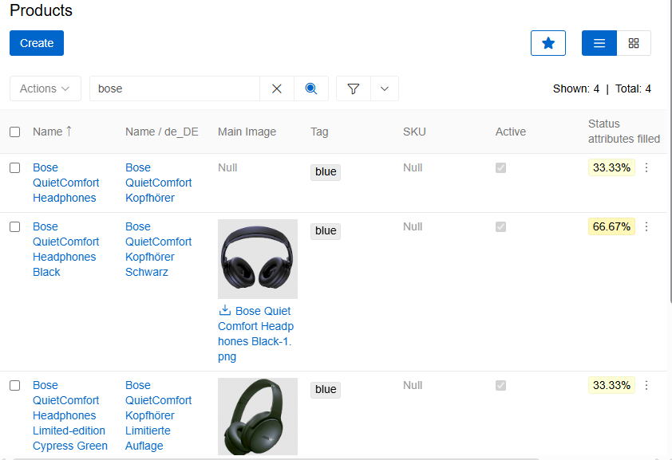{.large}

To perform a search operation, enter the search query into the search field and press `Enter` or click the `Search` button (magnifying glass). To reset search, click the `Search reset` button.

The search function looks through the record [identifiers](../03.administration/11.entity-management/02.data-types/docs.md#identifiers), text fields ([string](../03.administration/11.entity-management/02.data-types/docs.md#string), [text](../03.administration/11.entity-management/02.data-types/docs.md#text), [email](../03.administration/11.entity-management/02.data-types/docs.md#email), [URL](../03.administration/11.entity-management/02.data-types/docs.md#url), [HTML](../03.administration/11.entity-management/02.data-types/docs.md#html)), and numeric fields ([integer](../03.administration/11.entity-management/02.data-types/docs.md#integer), [float](../03.administration/11.entity-management/02.data-types/docs.md#float)). Search is case-insensitive.

A match in any searched field returns the record. If no matches are found, an empty result is displayed. Search can be used alone or combined with filters for more precise results.

### Search Behavior

Search behavior depends on query length and field type:

**For numeric fields:**

Numeric fields require the full value to be entered in a valid format. In the case of Float values, the format must include the appropriate decimal separator.

**For queries shorter than 4 characters:**

- Text fields match values that **start with** the entered text
- Example: "pos" finds "position" but not "outpost"

**For queries 4 characters or longer:**

- Text fields match values that **contain** the entered text anywhere
- Example: "post" finds both "position" and "outpost"

String fields have different filtering behavior compared to other text fields. By default, string fields do not use the contains operator when filtering.
This behavior can be modified for text fields through the `Use 'contains' operator when filtering varchar fields` setting in [System Settings](../03.administration/01.system-settings/docs.md). When enabled, String fields use "contains" matching for queries 4 characters or longer, similar to text fields.

### Wildcards

Wildcards can be used at any place in the search string, separately or in combination:

| **Character**    | **Use**                                           |
| :--------------- | :------------------------------------------------ |
| % or *           | Matches any number of characters, including zero  |
| _                | Matches only one character                        |

> The search is performed strictly according to the specified pattern, rather than using the default behavior. The entered value is interpreted as a search pattern, not as a literal string.

Examples:

- "*smith" finds values ending with "smith"
- "test*" finds values starting with "test"
- "*test*" finds values containing "test"

### Search Limitations

Direct text search does not operate on values stored in [Reference-type](../03.administration/11.entity-management/02.data-types/docs.md#reference-types) fields, as these fields contain references to related records rather than plain text data. Such fields, including those configured as lists or links, are not searchable via the standard search input.

However, Reference-type fields can be used in Advanced Filters, where filtering is performed based on referenced entities and their attributes.

> Fuzzy search – tolerant matching that handles typos and partial words – is available with the [Advanced Data Management](https://store.atrocore.com/en/advanced-data-management/20113) module.

## General and Saved filters

**General filters** are predefined on/off filters. The following are available for all entities:

- **Deleted** – soft-deleted records
- **Bookmarked** – records bookmarked by the current user

The following filters appear only when the entity supports the corresponding feature:

- **Active** – active records only (entities with an `isActive` field, configured via [Entity Management](../03.administration/11.entity-management/docs.md#configuration-fields)).
- **My / Owned by me / Assigned to me** – records associated with, owned by, or assigned to the current user (entities with [Owner or Assigned User](../03.administration/11.entity-management/docs.md#access-management-panel) enabled).
- **Multiple Classifications** – records with more than one [classification](../03.administration/12.attribute-management/04.classifications/docs.md) assigned.
- **Without main image** – records with no main image set ([Products](../../05.pim/03.products/docs.md) only).

**Saved filters** are advanced filter configurations that have been saved for reuse. They can be marked as Public or Private and function as prebuilt on/off filters.

Both General and Saved filters are displayed in the header panel next to the Search bar and in the right sidebar under the `Filters` section.

To apply a filter, check the corresponding box in either panel. Changes are applied immediately. When multiple filters are active, they work with AND logic—records must match all selected filter conditions to be displayed.

To reset filters, use the `Reset Filter` button in the Header Bar or click `Unset All` in the right sidebar. To remove a specific filter, uncheck its box.

> The reset button is shown when the advanced filter is set.

Search and filters are independent mechanisms. Clearing the search does not affect active filters, and resetting filters does not clear the search field. Both must be cleared separately to return to default view.

Filters can be used together with Search or Advanced Filter, or on their own. If no records match the applied criteria, an empty result is displayed.

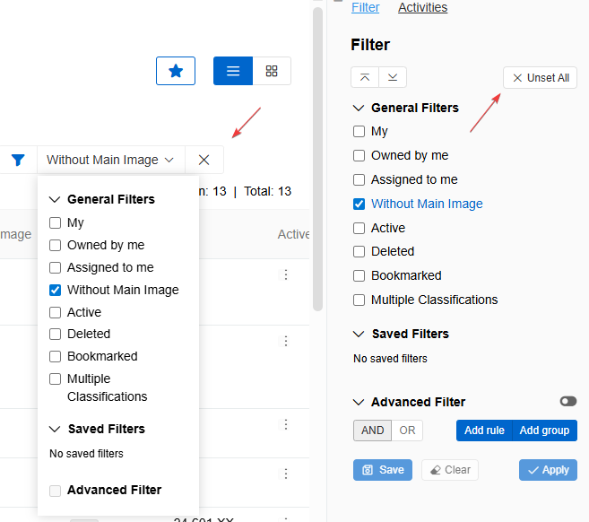{.medium}

## Advanced Filter

The **Advanced Filter** is available in the list view for all Basic, Archive and Hierarchical [entities](../03.administration/11.entity-management/docs.md).

Advanced Filter enables finding specific records by applying rules to fields or attributes of an entity. Multiple rules can be added, combined using "AND" or "OR" operators, grouped together for complex queries, and saved for future use.

> Filter settings are stored in local storage. This means that the filter remains active even when switching between entities, until it's manually disabled.

### Advanced filter configuration

To filter records by certain fields or attributes, click the `Add Rule` button in the "Advanced Filter" section of the right sidebar. A window for selecting a rule for the field or attribute appears. Additional rules can be added by clicking the button again.

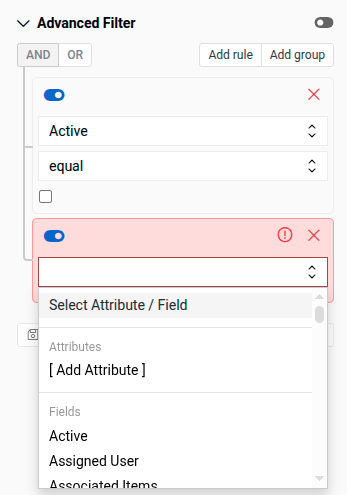{.small}

Click inside the `Select Field/Attribute` field and select from the drop-down list or start typing the name of the desired field. If the entity [has attributes](../03.administration/12.attribute-management), the "Attributes" section will exist in the drop-down list. Click `[Add Attribute]` and select one of the entity's attributes to create a rule for it.

Several rules can be combined with the "AND" or "OR" operators. Groups of rules can also be added and combined with other rules or groups.

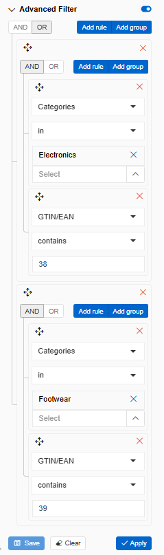{.small}

The filter in the example above consists of two groups joined by the "OR" operator. It finds all Products from the Electronics Category whose EAN number contains "38" or products from the Footwear Category whose EAN number contains "39".

Once configured, click `Apply`. The toggle next to "Advanced Filter" indicates if the filter is active. The filter can be disabled using this toggle—the configuration will remain saved in local storage. Click `Clear` to remove all rules.

### How to deactivate a rule in a filter

Configured rules within a filter can be temporarily disabled without being removed. To deactivate a rule, click the slider control located next to the corresponding rule.

When a rule is deactivated:

- The rule is excluded from filter evaluation.
- All rule configuration and parameter settings are preserved.
- The rule can be re-enabled at any time by toggling the slider back to the active position.

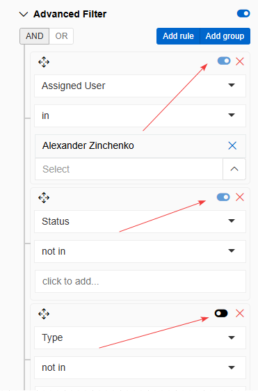{.medium}

Deactivating a rule does not delete the rule or reset its configuration. This allows users to quickly test or adjust filter behavior without losing previously defined criteria.

### How to save a filter

Configured filters can be saved as **Private** (for individual use) or **Public** (for all system users). To save a filter, create it in the Advanced Filter panel by adding one or more rules, apply it, and click the `Save` button.

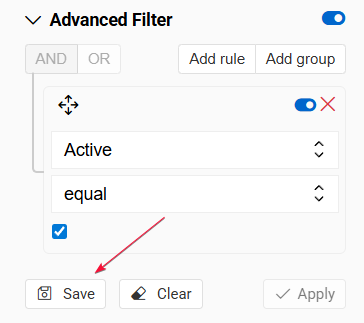{.small}

In the modal window, set the name of the filter and whether it should be public.

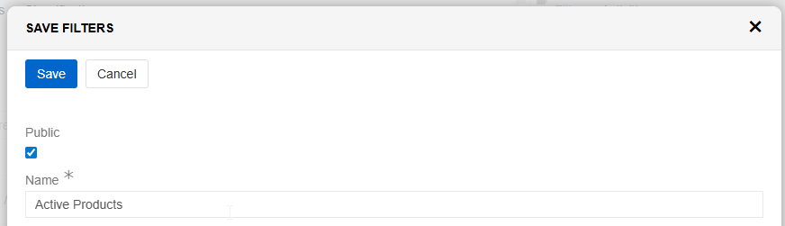{.medium}

Saved filters appear in the Filters panel for the entity. Available actions include:

- **Edit** – Modify the filter rules
- **Copy** – Duplicate the configuration into the Advanced Filter panel for further editing
- **Rename** – Change the name or visibility of the filter
- **Delete** – Remove the filter

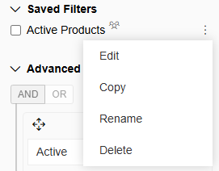{.small}

### Available Filtering Criteria

Depending on the [field/attribute type](../03.administration/11.entity-management/02.data-types/docs.md), the following filtering criteria can be applied:

| **Field / Attribute Type** | **Filtering Criteria** | **Input** |
| :--- | :--- | :--- |
| **Integer, Integer Range, Float, Float Range, Auto-increment** | Is Null / Is Not Null | – |
| | Equals / Not Equals | Input field |
| | Less / Less or Equal | Input field |
| | Greater / Greater or Equal | Input field |
| | Between | 2 input fields |
| **String, Text, HTML, Markdown, URL, Email, Identifier, Script, Color** | Contains / Not Contains | Input field |
| | Equals / Not Equals | Input field |
| | Is Null / Is Not Null | – |
| **Boolean** | Equals / Not Equals | Checkbox |
| | Is Null / Is Not Null | – |
| **Date, DateTime** | Equals / Not Equals | Date picker |
| | Is Null / Is Not Null | – |
| | Less / Less or Equal | Date picker |
| | Greater / Greater or Equal | Date picker |
| | Between | 2 date pickers |
| | Last X Days / Next X Days | Input field |
| | Older Than X Days / After X Days | Input field |
| | Last Month / Next Month / Current Month | – |
| | Last Year / Current Year | – |
| | Past / Today / Future | – |
| **File, Multiple Link** | In / Not In | Value list, Multiselect |
| | Is Empty / Is Not Empty | – |
| **List, Link, Multi-value List, Measure, Array, Static List, Static Multi-value List, Currency List, Language Code, Language Codes, Route(s)** | In / Not In | Value list / multiselect |
| | Is Null / Is Not Null | – |
| **User-type fields** *(e.g., Assigned User)* | In / Not In | User picker |
| | Is Me / Is Not Me | – |
| | Is Member of My Team | – |
| | Is Null / Is Not Null | – |

### Filtering Values with Measures

Fields that store values with measures (e.g., length, weight, volume) can be filtered with consideration of the measurement unit assigned to the value. During filtering, the system automatically recalculates values based on the configured conversion rules to ensure accurate comparison across different units.

To enable correct filtering across multiple measurement units, conversion factors must be defined in the Measures configuration. Navigate to [Measures](../03.administration/09.measure-units/docs.md) and configure the `Multiplier` parameter for each unit. The multiplier defines the conversion ratio relative to the base unit of the measure.

When a filter condition is applied, the system uses the configured multipliers to normalize values before performing the comparison.

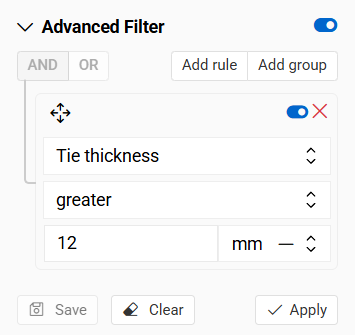{.medium}

Example:
If a filter condition is defined as Length > 1 meter, the system will also return records where the length is stored in other units that satisfy the condition after conversion. For instance, a record with 150 centimeters will be included in the result because it corresponds to 1.5 meters when recalculated.

The same principle applies to currency values. When filtering monetary values, the system uses the configured currency exchange rates to normalize amounts before evaluation.

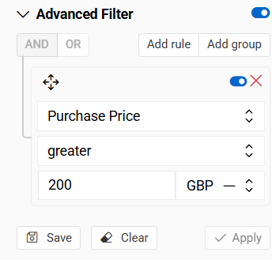{.medium}

Currency exchange rates can be configured in the [Currency](https://store.atrocore.com/en/pricing/20171) settings section. Once defined, these rates are automatically applied during filtering and comparison operations.

### Subfilters

Additional sub-filters can be added when creating filters. For example, to filter products by specific Files (main filter) and limit those files to a certain type—such as only Image Files—a sub-filter within the main filter is needed. This sub-filter refines the main filter criteria to include only the desired file types.

To create such a filter:

- Add a rule for Files with the criteria set to "In", then click `Select` to open a modal window for selecting files
- Filter data in the popup window according to the needed criteria and apply the filter inside the modal window
- Check all filtered records using the `Select All` checkbox and click `Select`

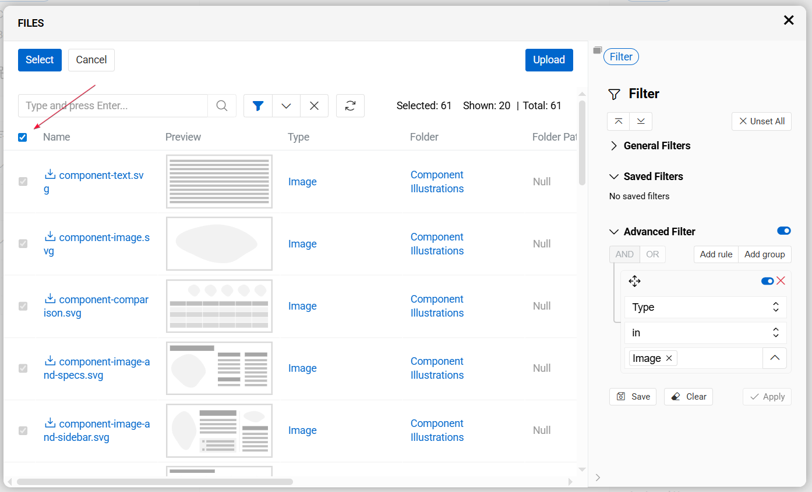{.large}

The modal window will close and the main filter will be shown as below:

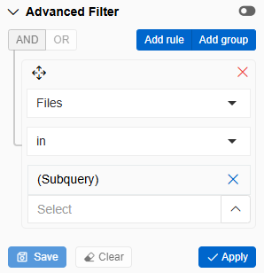{.small}

This approach is more accurate than manually selecting individual results because it is faster, especially with large result sets, and automatically updates when the database changes—no manual filter updates are needed.

> When using `select all results` option, all additional data that fit the filters will be automatically added if the filtering is reused.

## Left Sidebar Search

For all entities there is an additional panel where records can be searched and filtered by Link or [Link Multiple](../03.administration/11.entity-management/07.fields-and-relations/docs.md) fields. For example, for the Product entity, these can be Categories, Brands, Classifications, Catalogs, etc.

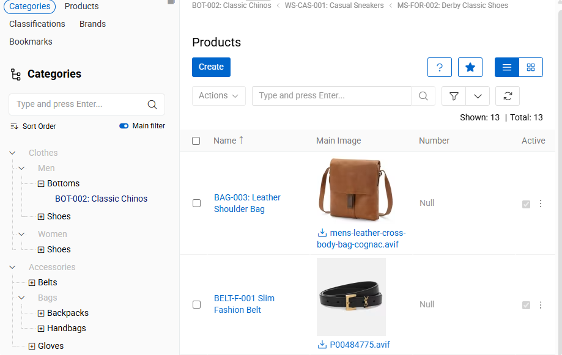{.large}

### Tree Navigation and Display

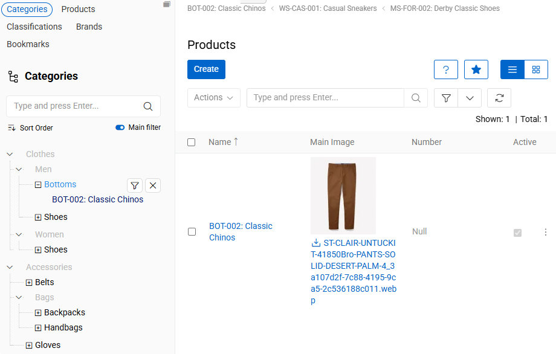{.large}

The entity can be viewed by its [hierarchy](../03.administration/11.entity-management/04.hierarchies-and-inheritance/docs.md), as a tree. Press arrows to proceed down by hierarchy to see more records. Selecting a record opens the details menu. In the details menu, the hierarchy panel shows the path to the record. If viewing by category, for example, it will show the category the product is in. If there is no such category, it will show the general tree.

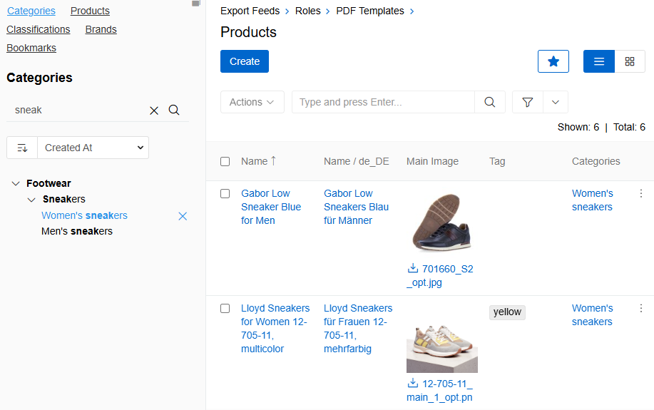{.large}

### Multi-Selection in Left Sidebar

For relationship fields displayed in the left sidebar, multiple items can be selected simultaneously to filter the main list. Selected items appear as badges at the bottom of the left sidebar, each showing an icon, name, and a remove button.

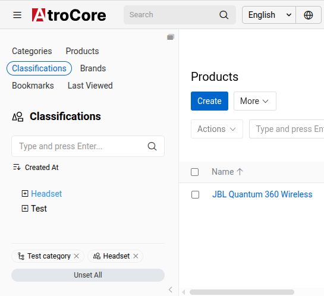{.large}

**Key features:**

- **Select multiple items** – click any item in the left sidebar to add it to the active selection
- **Visual feedback** – selected items are highlighted in the tree and displayed as badges at the bottom
- **Remove individual selections** – click the × button on any badge to remove that item from the filter
- **Clear all selections** – use the **Unset All** button to remove all selected items at once

**Interaction with Advanced Filter:**

When items are selected in the left sidebar, they automatically create filter rules in the right sidebar. These automatic filters:

- Cannot be edited directly in the right sidebar
- Can only be removed by clearing the selections in the left sidebar badges
- Disable the **Advanced Filter** toggle and **Reset Filter** button until all selections are cleared

To modify or reset all filters when items are selected in the left sidebar, first clear the selections using the badges or the **Unset All** button.

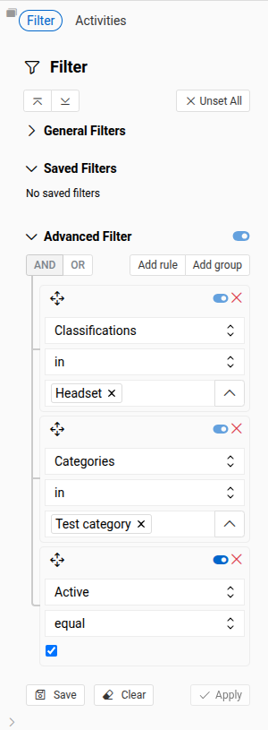{.medium}

In addition to relationship fields, there is a [Bookmarks](../05.toolbar/01.bookmarks/docs.md) link at the top of the left sidebar.

Bookmarked records can be filtered by any filter and searched both in the left sidebar and on the main page.

## Automatic Search Mask Recognition *(in development)*

AtroCore has automatic search mask recognition. This can be considered as a quick search function—when typing begins, the system automatically determines the search mask type of the search string. Automatic search mask recognition is available for the following [field types](../03.administration/11.entity-management/02.data-types/docs.md): Text, Number, Date, and Time.

Depending on the search mask type, the system searches through all entity fields of the appropriate field type. A pop-up with auto-suggestions appears with information about field name and amount of search results for that field, e.g., "Address: 3 results", and text links to show the results.

If nothing is chosen from the auto-suggesting pop-up, clicking the magnifier icon performs normal search (only through the fields listed in the metadata for this entity).

After clicking on the search results, the appropriate filter will be set automatically and the search field will be left empty.

|   **Search Mask Type**  |        **Field Types to Be Searched**        | **Applied Filter Criteria** |
| :---------------------- | :------------------------------------------- | :-------------------------- |
| Text, e.g. "atro 123"   | Address, Number, Varchar, Text, URL, Wysiwyg | Starts with                 |
| %Text, e.g. "%atro 123" | Address, Number, Varchar, Text, URL, Wysiwyg | Consists                    |
| Numbers, e.g. "123"     | Address, Number, Varchar, Text, URL, Wysiwyg | Starts with                 |
| Numbers, e.g. "123"     | Auto-increment, Currency, Integer, Float     | Is                          |
| Date, e.g. "12.12.2018" | Date, DateTime                               | On                          |
