Mass actions are applied to one or more selected entity records from [list view](../../01.atrocore/04.understanding-ui/docs.md#list-view), i.e. records with a tick in the checkbox.
Use [search and filtering](../../01.atrocore/11.search-and-filtering/) to find what you need and check all results you need.

To select all entity records, click the checkbox to the left of the 'Name' column heading. You can also use the SHIFT+click method to select all records between two specific records, or SHIFT+click the checkbox above to select all records currently displayed or click the checkbox above to select all records:

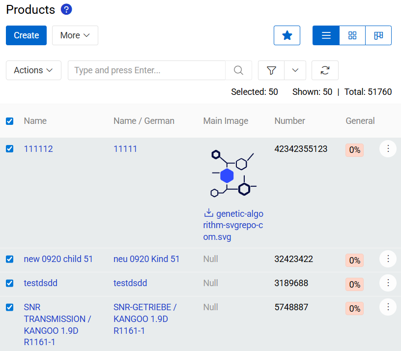{.medium}

The following mass actions are available by default in the AtroCore system:

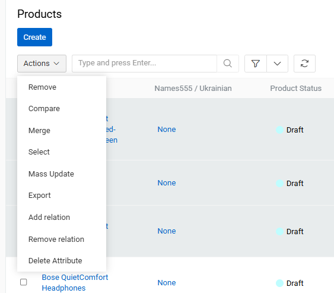{.small}

- **[Remove](#remove)** – to remove the selected entity records.
- **[Compare](#compare)** – to compare the selected entity records.
- **[Merge](#merge)** – to combine the selected entity records.
- **[Select](#select)** - to create a new Selection based on the selected records
- **[Mass update](#mass-update)** – to update several selected entity records at once.
- **[Export](#export)** – to export the desired data fields of the selected entity records in the XLSX (Excel) or CSV format.
- **[Add relation](#add-relation)** – to relate the selected entity records with other entities (or entity).
- **[Remove relation](#remove-relation)** – to remove the relations that have been added to the selected entity records.
- **[Delete attribute](#delete-attribute)** – to remove attributes from records of entities that have attributes enabled.

Additional options may be added by additional modules, such as **Translate** option added by [Translations](https://store.atrocore.com/en/translations/20191) module. You can also [create](#custom-mass-actions) your own mass actions.

Mass actions are also available in the [small list](../04.understanding-ui/docs.md#small-list-view) view. To select one or more records, hover over the items in the list and check the boxes next to the records you want to include. You can also select all records at once by using the checkbox located at the top of the panel.

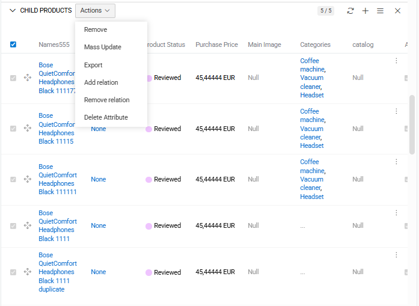{.medium}

When at least one record in the list small is selected, the Actions button becomes visible. By clicking this button, you can choose and execute any action that is available for the entity’s records based on your user permissions.

## Remove

Remove is a tool used to quickly delete multiple different records. You will need to confirm that you want to delete records. This action uses [Soft Delete](../08.record-management/docs.md#soft-delete) method.

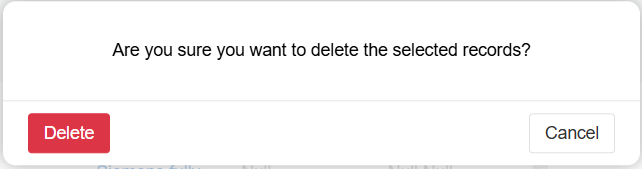{.small}

## Compare

Compare is a tool used to compare multiple different records. For more information visit [Merge and comparison](../09.comparison-and-merge/docs.md#compare-records) article.

## Merge

Merge is a tool used to merge multiple different records. For more information visit [Merge and comparison](../09.comparison-and-merge/docs.md#merge-records) article.

## Select

Select is a tool used to add records to a Selection for further comparison or merging. For more information visit [Merge and comparison](../09.comparison-and-merge/docs.md#selection) article.

## Mass Update

Mass update is a tool used to quickly modify information that is the same for different records. You can mass update all the fields and/or attributes for records. To do this, first select the records you want to update. Then select Actions/Mass Update to proceed to the mass update pop-up.

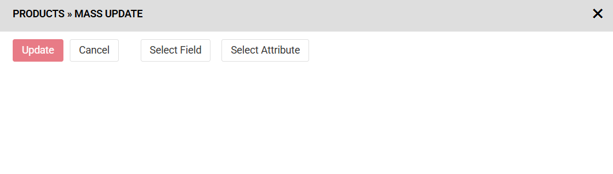{.medium}

You can select any number of fields and/or attributes to update.

To select mass update first select records you want to update. Then select `Actions/Mass Update` to proceed to Mass update popup.

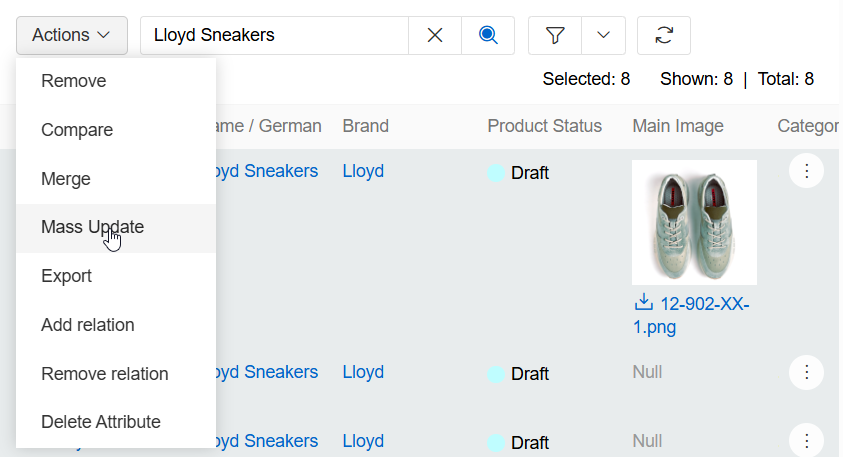{.large}

When all fields and/or attributes you wanted are selected and their values are set press `Update` to start updating process. If everything is ok you will see `Success` message.

### Mass update to fields

To update field select `Select Field` in Mass update popup. Then select a field you need from a new popup menu. Then apply field value as usual. If the field is already selected, it will not be shown in the list. You can select multiple fields at once.

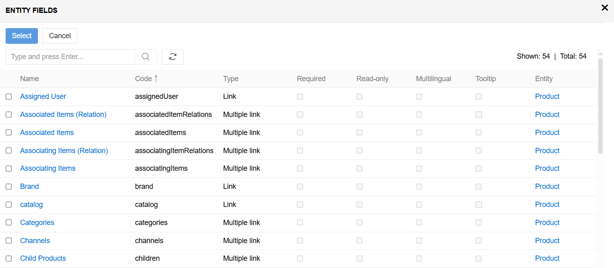{.large}

> Unique to each record fields (such as Id) can not be mass updated.

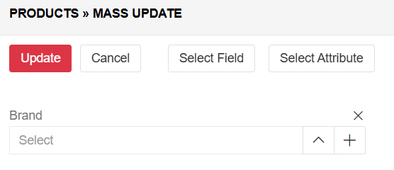{.medium}

### Mass update to attributes

To update an attribute, select `Select attribute` in the `Mass update` pop-up. Then select the attribute you need from the new pop-up. You can select multiple attributes at once. If an attribute is already selected, selecting it again will have no effect. You can filter attributes in this popup.

If any/all of your products selected to be mass updated have no attribute the attribute will be linked to the product.

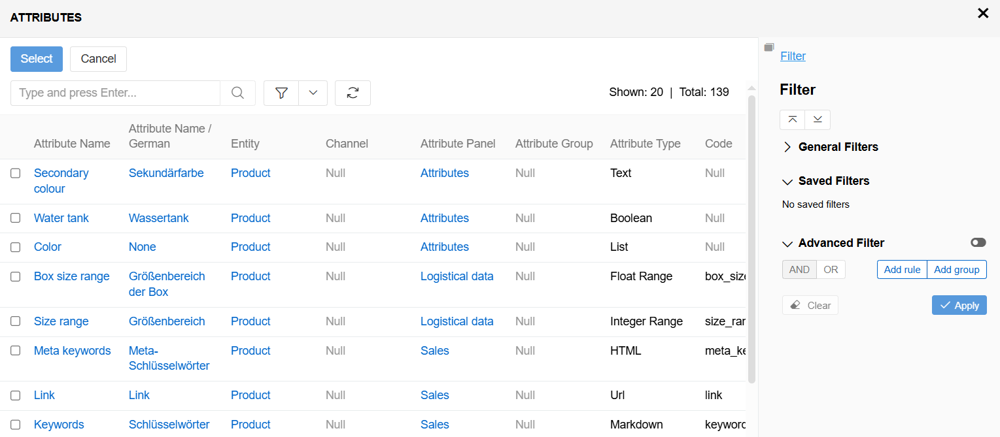{.large}

If an attribute is multilingual it will be added in all available languages.

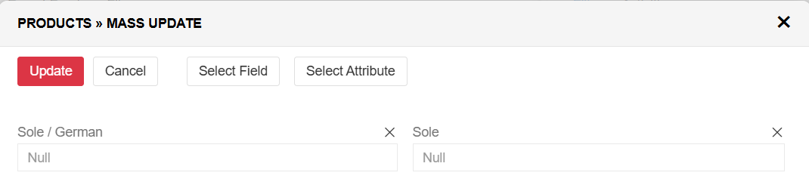{.medium}

> Attributes with different language are treated as different attribute values.

## Export

Users can export via the `Mass Actions` option. To do this, first select the records you want to update. Then select Actions/Export to proceed to the export pop-up. After making your selection, press the `Export` button. The pop-up will close and a new export execution will be created. You will see the export result in [Notifications](../../01.atrocore/03.administration/10.notifications/).

### Export using existing export feed

To use existing export feed for the records check `Use existing export feed` checkbox and then select the feed you want.

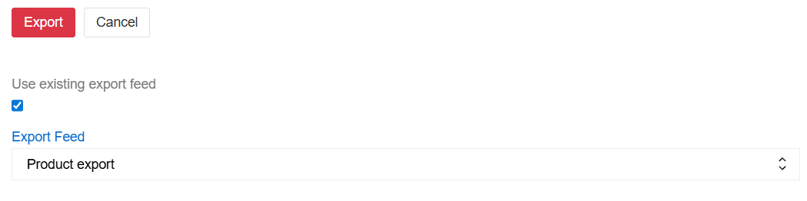{.medium}

This will use [Export Feeds](../../02.data-exchange/02.export-feeds/) logic but only for the products you selected.

### Export not using existing export feed

You can also export fields and attributes without any export feed pre-written. To do so, select format (CSV or XLSX) and the fields you want to export. Press `Export All fields` if you want to select all available fields. Press `Add Attribute` in the `Field List` if you want to select attributes.

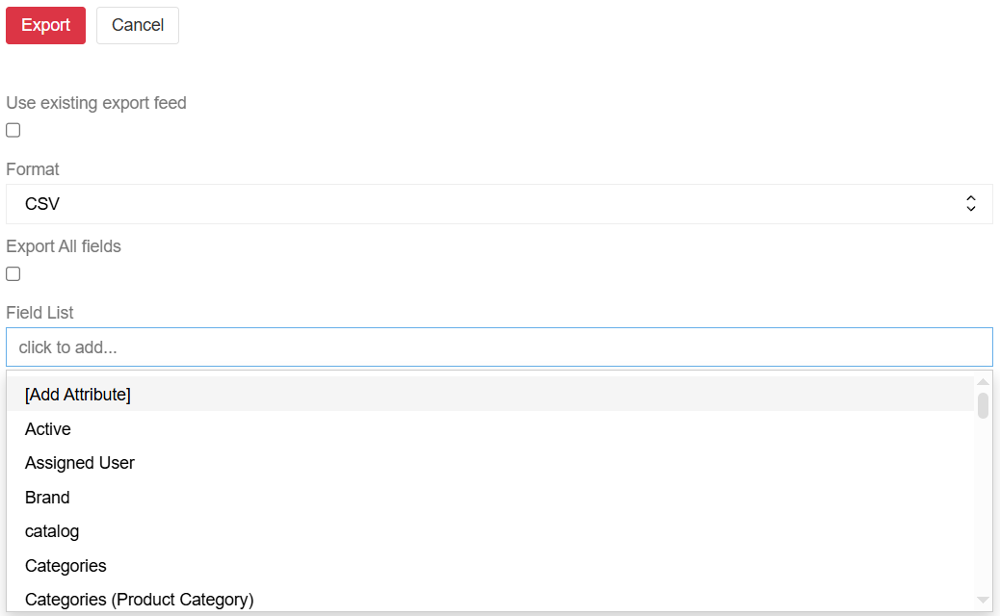{.large}

> Fields and attributes can be exported by this method without any modifications.

> The `~` symbol is used as the delimiter for multi-value lists (fields, attributes).

## Add relation

Add relation is a tool used to quickly add relations that is the same for different records. To do this, first select the records you want to update. Then select Actions/Add relation to proceed to the mass add relation pop-up.

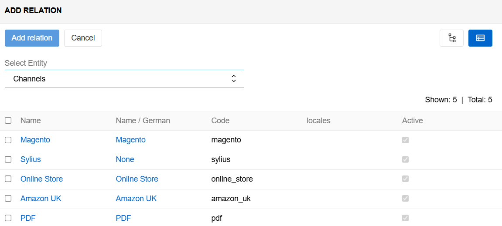{.large}

You can now select an entity that is linked to the selected entity (Select Entity), and then select the record(s) of that entity. The type of link is determined by the system settings. Records of the entity you selected can be filtered.

For more information on relation management go to [Record Management](../08.record-management/docs.md#linking-and-unlinking-related-records) documentation.

## Remove relation

Remove relation is a tool used to quickly remove relations that are the same for different records. To do this, first select the records you want to update. Then select Actions/Remove relation to proceed to the remove relation pop-up.

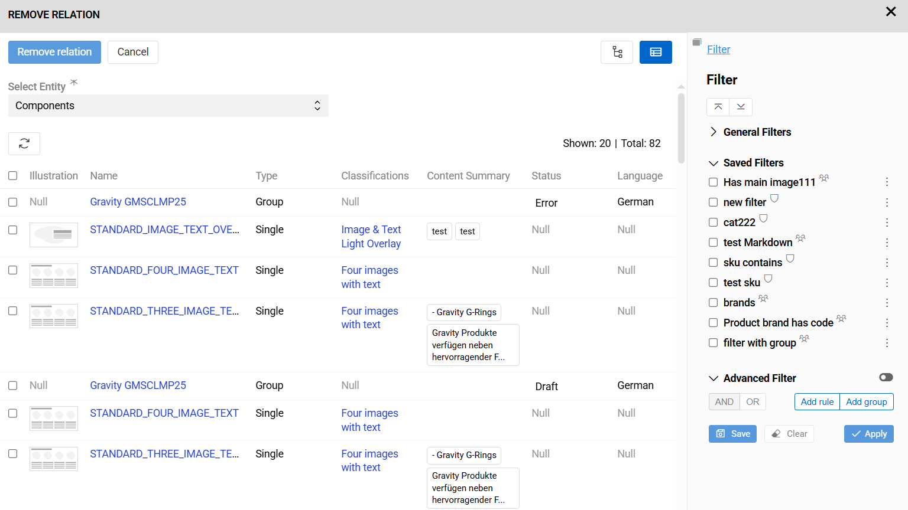{.large}

You can now select an entity that is linked to the selected entity (Select Entity), and then select the record(s) of that entity. The type of link is determined by the system settings. All additional fields of the relationship (except ID) can also be edited. Records of the entity you selected can be filtered. Any relations that did not exist prior to removal will be ignored.

For more information on relation management go to [Record Management](../08.record-management/docs.md#linking-and-unlinking-related-records) documentation.

## Delete attribute

Delete attribute is a tool used to quickly remove attributes that are the same for different records. To do this, first select the records you want to update. Then select Actions/Delete attribute to proceed to the delete attribute pop-up. Any attributes that did not exist prior to removal will be ignored.

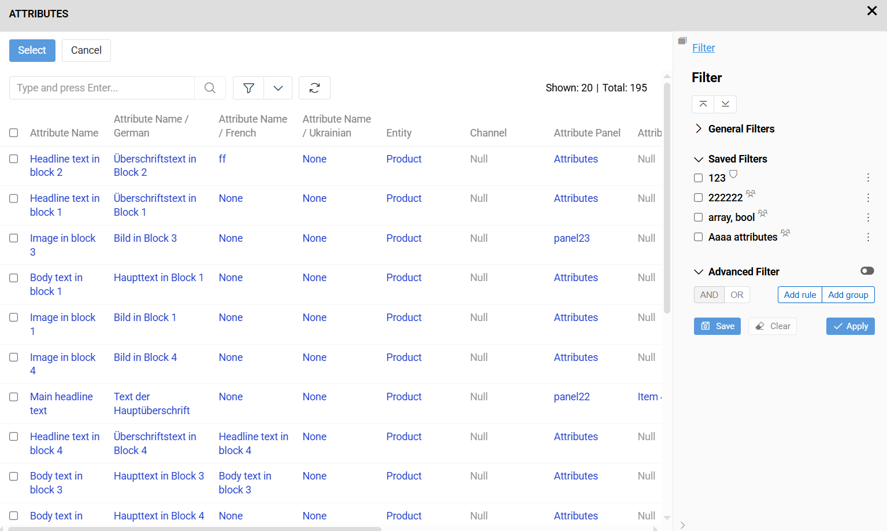{.large}

> Delete Attribute function is only visible on entities that have enabled attributes. For more information on attribute management, please refer to the [Attribute Management](../../01.atrocore/03.administration/12.attribute-management/) documentation..

## Custom mass actions

Users can create their own mass actions. For detailed information about how to create custom actions see the [Actions](../03.administration/06.actions/) documentation.
