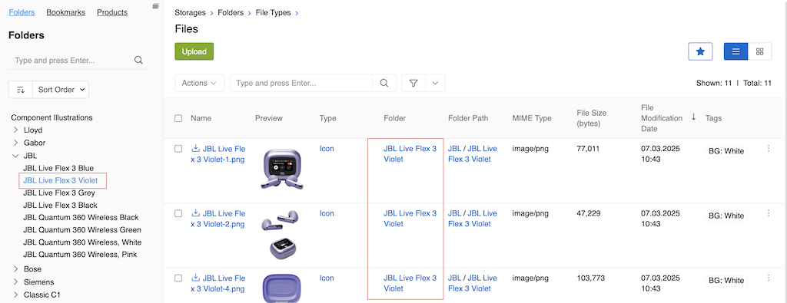
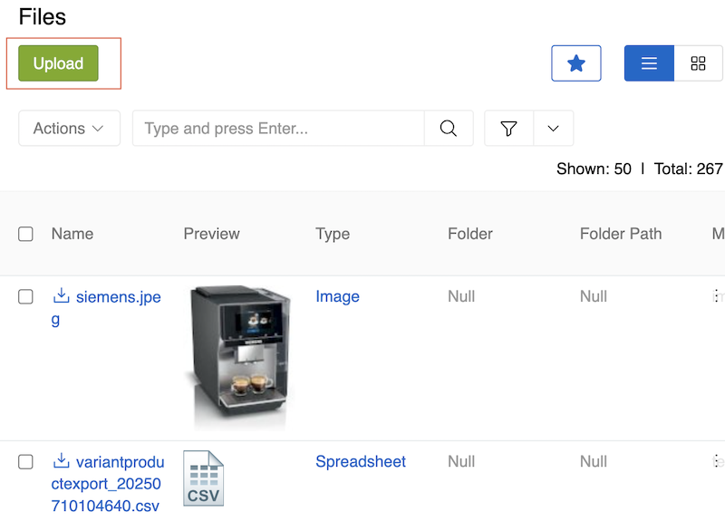
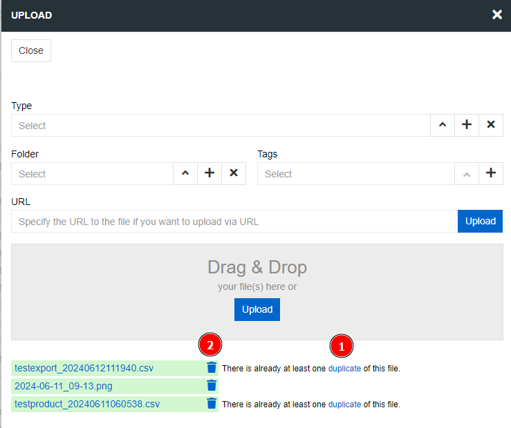
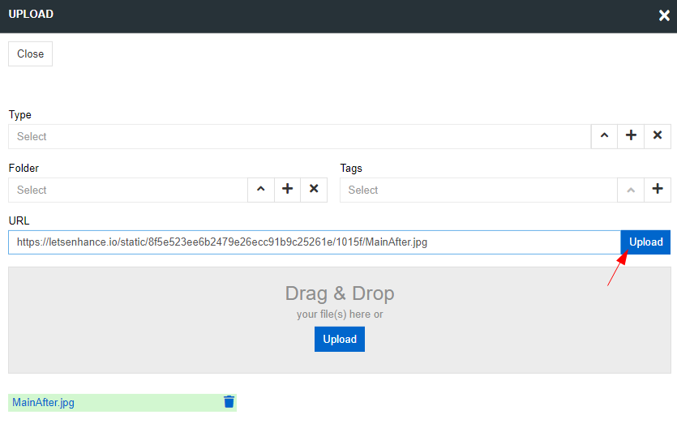
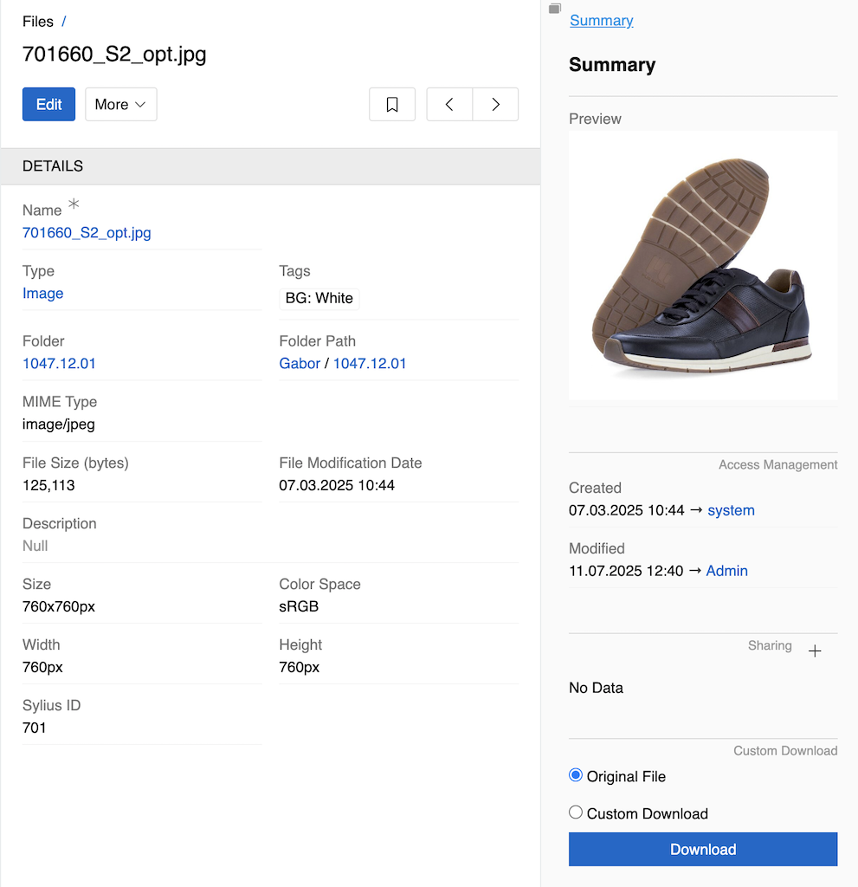
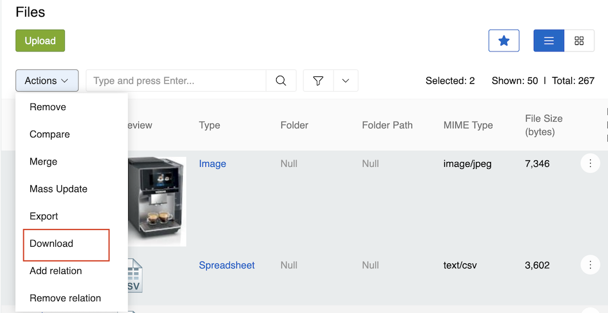
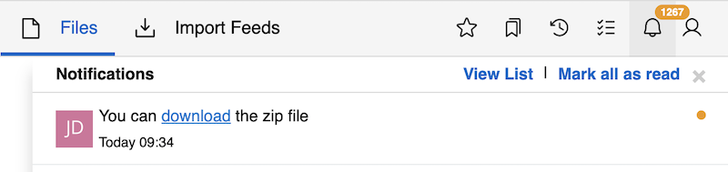
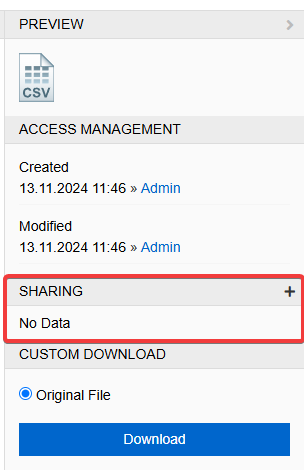
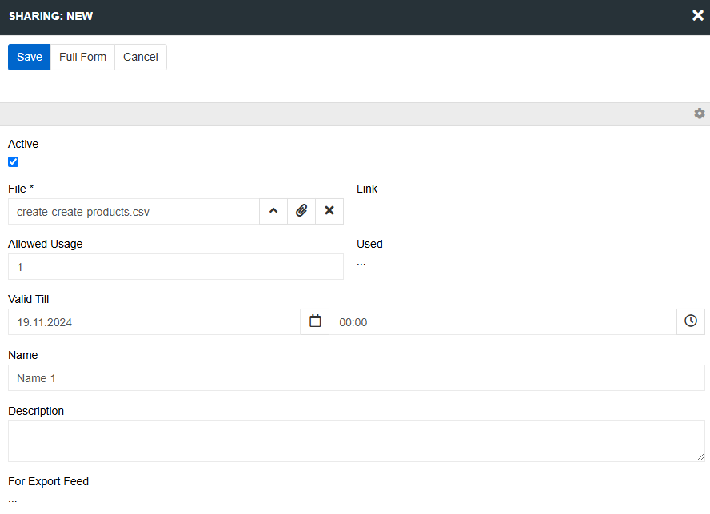
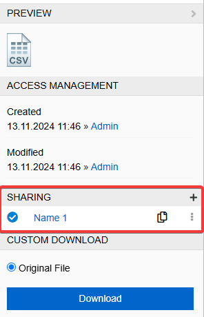

All the capabilities for efficiently storing, organizing, managing, retrieving and distributing files are available to the users as soon as they install the system. With the help of AtroCore, you can store files of various types, manage them, link them to products and other entities, import and export them. We have implemented the File first concept, which allows the user to add, delete and modify files and folders both inside the system and externally - directly on the server.

The AtroCore file system includes the following entities:

-   **Storage** - a place where a file is physically stored.
-   **Folder** - the folder to which the file belongs. One file can exist in only one folder
-   **File** - a document that can be used as an attachment to products and other entities.

## Storages

Storages are locations where your files are physically stored. Each file can be stored in only one Storage, while many files and folders can be stored in the same Storage.

By default, you have access to the Local (Linux) Storage. Additional storage types become available when you install paid modules (for example, MS SharePoint Storage is provided with the Microsoft 365 Connection module).

The Base Storage exists in the system by default and serves as the primary storage location. When you upload files without specifying a particular folder, they are automatically placed in the Base Storage. Once files and folders are created in a Storage, they cannot be moved to another Storage.

**Important:** Files and folders that were added to a Storage before it was deactivated will remain attached to products but will not be available for downloading or viewing.

> For information about creating and managing storages, see [File Management](../03.administration/15.file-management/docs.md#storages) in the Administration section.

## Folders

Folders help you organize your files by creating a hierarchical structure within a Storage. When you upload files without specifying a folder, they are automatically placed in the root of the Base Storage.

**Using the Folder Tree:**

-   You can see the folder hierarchy in the left menu when viewing Folder or File entities
-   To filter files by folder, go to the File entity and select the desired folder in the tree
-   To upload files to a specific Storage other than the Base Storage, you need to select a folder that belongs to that Storage

**Note:** The File entity contains a Folder field but not a Storage field, so you control which Storage your files go to by selecting the appropriate folder.

> For information about creating and managing folders, see [Folder Management](../03.administration/15.file-management/docs.md#folder-management) in the Administration section.

## File Types

File types help categorize and organize your files. Each file can have only one type, and the type field is optional. By default, AtroCore includes these file types: Presentation, Graphics, Archive, Video, Audio, Icon, Image, Spreadsheet, Document, and File.

**How File Types Work:**

-   File types can be assigned automatically based on validation rules (if configured by administrators)
-   You can set the file type when uploading a file
-   You can change the file type after uploading by editing the file

File types help the system understand how to handle different files and may affect how they are displayed or processed within the system.

> For information about creating and managing file types, see [File Types](../03.administration/15.file-management/docs.md#file-types) in the Administration section.

## Uploading Files

There are several ways to upload a file to the system in AtroCore:

-   via the Upload button in the File entity, or any other linked entity
-   via URL
-   through an import feed

### Create a File using the Upload button

In order to upload a new file to the system, open the File entity and click the `Upload` button.

{.medium}

The window for uploading a File opens. You can upload one or more Files with the specified parameters at the same time. If necessary, select the File Type and the Folder to which you want to upload. If these fields are not specified, the File will be uploaded to the root of the Base Storage, and the type will be assigned automatically - the one with the highest priority of those for which the validation rules are being met. These parameters can be changed later after the File is uploaded. In the window that opens, click the Upload button and select the Files you want to add to the system.

{.medium}

If a File with identical content already exists in the system, uploading the same File again — even under a different name — will be recognized as a duplicate and a warning message will be shown. Duplicate detection is performed by comparing the file content using a secure hash (MD5). If a File with identical content was previously deleted, uploading it again will not trigger a duplicate warning.

You can immediately delete the uploaded File by clicking on the trash icon. The same Folder cannot contain Files and Folders with the same name.
### Upload a file via the link

To upload a file from the user interface using a URL, click the `Upload` button in the File entity, paste the link into the appropriate field, and click `Upload`.

{.medium}

## File Fields

{.medium}

The File entity comes with the following preconfigured fields:

| **Field Name**         | **Description**                                                                                                    |
| ---------------------- | ------------------------------------------------------------------------------------------------------------------ |
| Name                   | The file name. The value is set automatically and can be modified by the user                                      |
| Preview                | Preview of the file                                                                                                |
| Type                   | The file type                                                                                                      |
| Tags                   | Allows selection of multiple tags from the File Tags [list](../03.administration/08.lists/)                        |
| Folder                 | The folder where the file is located                                                                               |
| Folder path            | The path to the folder where the file is located                                                                   |
| MIME Type              | indicates the nature and format of a file                                                                          |
| File Size              | File size in bytes                                                                                                 |
| File Modification Date | The date and time when the file was last modified.                                                                 |
| Description            | The description of the file                                                                                        |
| Size                   | File width by height in pixels. Set automatically for images and PDF files                                         |
| Color Space            | A characteristic that describes a fixed range of possible image colors. Set automatically for images and PDF files |
| Width                  | Width of the file. Set automatically for images and PDF files                                                      |
| Height                 | Height of the file. Set automatically for images and PDF files                                                     |
| ExportFeed             | Link to the export feed that created this file                                                                     |
| ExportJob              | Link to the export job that created this file                                                                      |
| ImportFeed             | Link to the import feed that created this file                                                                     |
| ImportJob              | Link to the import job that created this file                                                                      |
| PDF feed               | Link to the PDF feed that created this file                                                                        |

The [ExportFeed](../../02.data-exchange/02.export-feeds/docs.md), [ExportJob](../../02.data-exchange/02.export-feeds/docs.md#export-executions), [ImportFeed](../../02.data-exchange/01.import-feeds/docs.md), [ImportJob](../../02.data-exchange/01.import-feeds/docs.md#import-executions), and [PDFFeed](../../07.publishing/01.pdf-generator/docs.md#pdf-feeds) fields establish bidirectional relationships between files and export/import operations. These fields are read-only and are not shown on layouts by default. When viewing a file record, you can see which export or import feed and execution created it. For export-generated files, this corresponds to the `Exported File` field on the related [Export Execution](../../02.data-exchange/02.export-feeds/docs.md#export-executions) record; for import-generated files, it corresponds to the `Imported File` field on the related [Import Execution](../../02.data-exchange/01.import-feeds/docs.md#import-executions) record. Conversely, you can filter files in the File entity by these fields to find all files created by a specific export or import operation.

! You can add and configure [custom fields](../03.administration/11.entity-management/03.fields-and-attributes) for Files just like for any other entity in the system. This allows you to tailor the File entity to your specific business needs by adding additional information or attributes as required.

## Downloading Files to an archive

Files support all standard [mass actions](../12.mass-actions/), along with a unique Download option specific to the File entity. This Download action allows you to create an archive containing all selected files in its root folder, ensuring that duplicate files are included only once in the archive.

To download files to the archive, select all the Files you want to download (there must be at least two) and click on `Download` button in the dropdown list.

{.medium}

A message "Job has been created to prepare your zip file" will appear. You can monitor its progress in the [Job Manager](../05.toolbar/03.job-manager/).

As soon as the archive is ready for download, you will receive a [Notification](../05.toolbar/04.notifications/).

{.medium}

Click on the **download** link to download the archive to your computer.

## Deleting and Restoring Files

File deletion and restoration follows the same process as other records in AtroCore. You can delete files individually or use [mass actions](../12.mass-actions/docs.md) to delete multiple files at once.

For detailed information about the deletion process, restoration procedures, and safety measures, see the [Deleting Records](../08.record-management/docs.md#deleting-records) and [Restoring Records](../08.record-management/docs.md#restoring-records) sections in Record Management.

For information about configuring deletion settings for the File entity, see [Entity Management](../03.administration/11.entity-management/docs.md) in the Administration section.

## File Transformations

File Transformations allow you to automatically generate derivative files (renditions) from originals using server-side CLI tools. This feature is available with the [Renditions](https://store.atrocore.com/) premium module.

## File sharing

If you want to share a file from your AtroCore, you can of course download it and share it by other means, but there is an easier way. You can create a share link for the selected file so that non-AtroCore users can see it. To do this, go to the File details view and click on the Sharing submenu in the right panel.

{.medium}

Here you can set options for the link:

{.medium}

1. File is automatically added to the current file (although you can still edit it) and is only mandatory field.
2. Link will be created automatically.
3. Allowed usage is the number of successful transitions using this link. If it is not set, there is no such parameter.
4. Used shows the number of successful transitions through this link.
5. Valid Till is the time limit for the link. Note that there is no validation, so you can have an expired link for historical reasons.
6. Name is necessary if you want to name this link in AtroCore.
7. Description is for AtroCore use only.
8. For export feed is automatically created if the link is used in export feed. You cannot edit it.

{.medium}

Now you can see what the link looks like and edit/delete it.