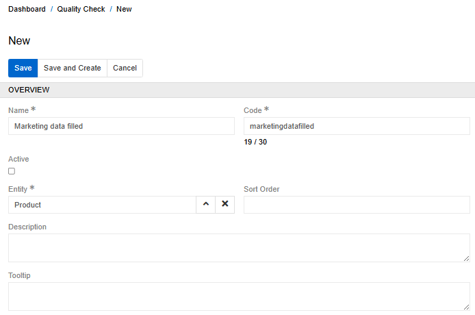
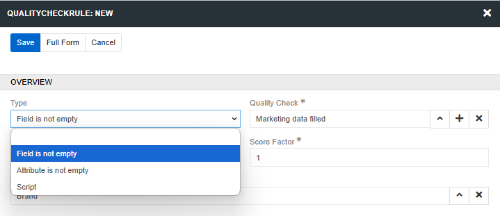
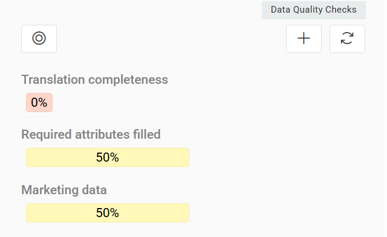
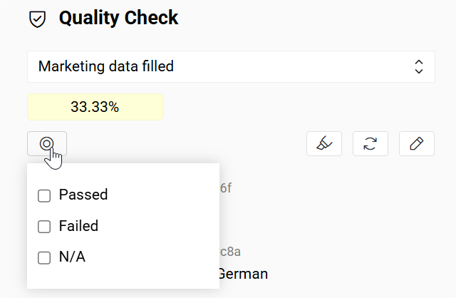
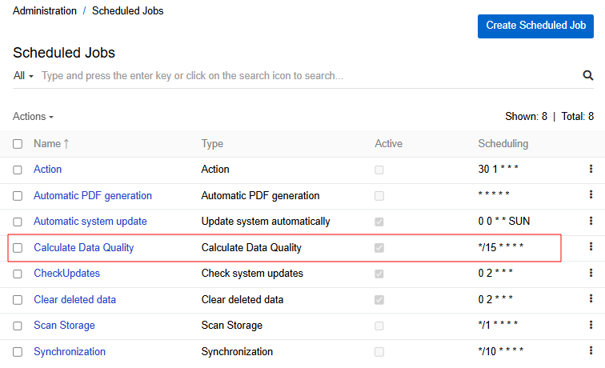
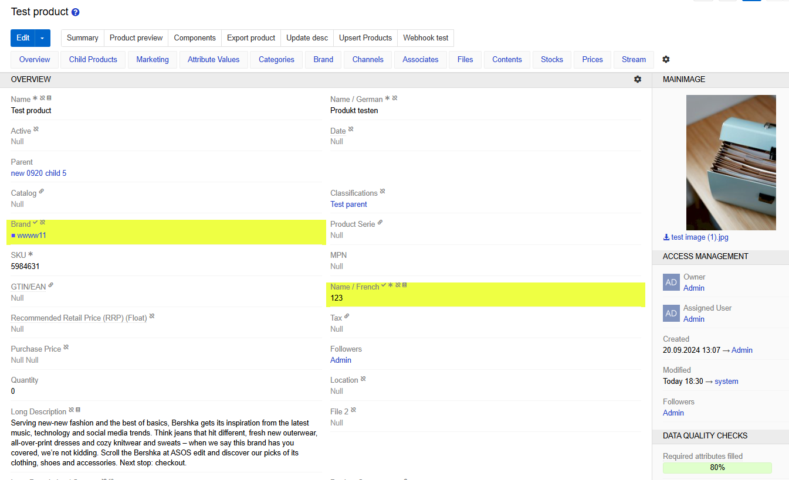
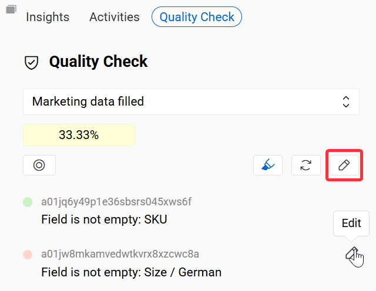
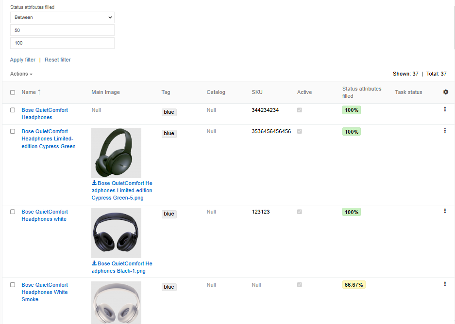
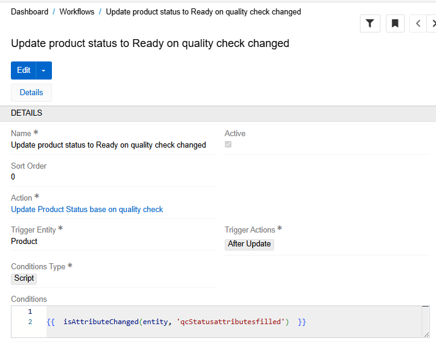
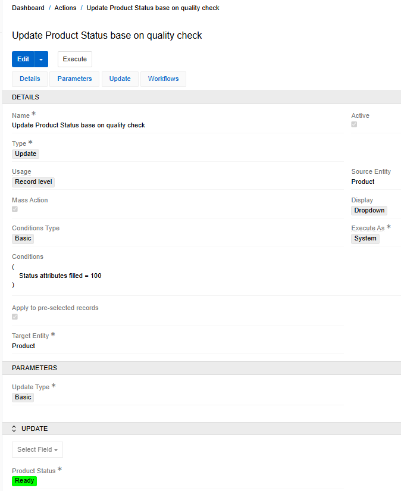

The [Data Quality](https://store.atrocore.com/en/data-quality/10095.1) module allows you to evaluate the quality of information completeness of a particular record, expressed as a percentage based on the filling of specific fields or attributes included to the uality check rule, as well as other more complex conditions described by the script.

With the help of such indicators, you can assess the quality of filling in product information according to various criteria (marketing data, technical information, delivery data, etc.) that will not overlap. Using the Script type, you can describe more complex rules that not only check the presence of a value, but also its compliance with certain requirements (sufficient number of description characters, presence of the main image of the product, etc.), as well as set rules that must be executed under certain conditions (for example: the "Storage temperature" attribute is involved in the Quality Check only if the product category is "Frozen food").

## Create Quality Check

In order for the quality assessment indicator to appear on the page of a particular entity, you need to create a Quality Check for it. To do this, go to `Administration \ Quality Check` and click the `Create Quality Check` button. The following page will open:

{.large}

Set the name and the code of the Quality Check and select the entity for which it should be applied. For a check to appear on the entity page, it must be active. You can activate it after you set all the necessary rules.

### Add Quality Check rule

A separate rule should be created for each field or attribute that is involved in the Quality Check. To create a rule, click the `Create` button in panel `Quality Check rules`. A modal window for creating a new rule will appear.

{.large}

There are currently three types of rules available:

- **Field is not empty** - returns "true" if selected field is not empty;
- **Channel Completeness** - calculates the percentage of attributes filled in for a specific channel;
- **Language Completeness** - calculates the percentage of fields and attributes filled in for a specific language;
- **Attribute is not empty** - returns "true" if selected attribute is not empty (available only for Product Quality Check);
- **Script** - allows you to describe the rule and the conditions under which it should be applied in the form of a script.

The importance of the rule can be adjusted using the Score Factor field. It determines the coefficient in which a rule is involved in the Quality Check calculation. An attribute can be considered only when it is added to a product or in any case. This is determined by the `If added` checkbox.

Fill in the required fields in the form and click the Save button. You can add multiple rules of different types to a single Quality Check.

## Displaying on entity page

After a Quality Check has been activated, it appears on the entity page as a percentage-based scale. It is also displayed in the right panel of the entity page as a [widget](../04.understanding-ui/docs.md#quality-check-tab). The desired quality check can be selected from a dropdown menu, where the first option is chosen by default. Below the dropdown, a filter for rules is available, along with a progress bar showing the percentage results and a refresh button that recalculates all checks.

{.medium}

The filter allows you to narrow the displayed rules by status:

- Passed – rules that are fulfilled.
- (Partly) Failed – rules that are not fulfilled.
- N/A – rules that have not been applied (for example, if the condition under which the rule should be applied has not been fulfilled).

{.medium}

If none of the filters are selected, only Failed and Passed rules are displayed.

> If you see three dots instead of a value, it means that the value has not yet been calculated and will be calculated the next time when job "Calculate Data Quality" is executed.

{.large}

By default, the job runs every 15 minutes, but you can adjust this time. In case of massive changes (when importing or changing the rules of a particular Quality Check), the value is always reset and recalculated by this job. If the value of a field or attribute was changed manually for a specific product, the value is updated instantly. To force the value to be updated, you can click on the Quality Check scale.

The fields and attributes involved in the quality calculation are marked with the ✔ icon. Each field displays a single icon regardless of how many Quality Checks reference it. If a field belongs to multiple Quality Checks, hovering over its icon shows a tooltip listing all associated Quality Checks.

To highlight all fields and attributes that belong to a particular Quality Check, click the corresponding icon next to the Quality Check label. Clicking it again deselects them.

{.large}

## Quick editing

Users with edit permissions for a Quality Check have access to additional editing controls directly from the entity page.

A pencil button in the Quality Check panel header allows quick access to the edit page of the current Quality Check. This button is placed to the right of the Highlight and Refresh buttons.

{.medium}

Each individual rule row also has an edit icon that appears on hover, aligned to the right side of the row. Clicking it opens the edit page for that rule.

## User functions

After creating a Quality Сheck in a certain entity, it becomes a regular field, which can be displayed in layouts in the list view, exported, displayed on a dashboard, or used in a workflow. You can also filter entity records by their quality levels.

{.large}

### Use in the workflow

One of the examples of using Quality Check fields in the workflow is to change the status of a product according to quality indicators.

Let's say that the status of a product directly depends on its quality, and when all the necessary fields and attributes are filled in, the status should automatically change to "Ready". To do this, we will create a workflow for the Product entity that will listen for changes in the Quality Check field.

{.large}

Link an Action that will change the status of the product to "Ready" when the corresponding quality indicator becomes 100 to the workflow.

{.large}

Learn more about how you can use Workflow for data enrichment [here](https://store.atrocore.com/en/workflows/20193).

### Translation Completeness

If the [Translations](https://store.atrocore.com/en/translations/20191) module is installed for your entity, you can create a Quality Check with the **Translation Completeness** rule. This rule allows you to monitor the percentage of translated or approved multilingual fields for each record in the entity.

- If the Approved checkbox is enabled for multilingual fields, the percentage shows how many fields are "Approved" relative to all multilingual fields.
- If the Approved checkbox is disabled, the percentage shows how many fields have the "To translate" status relative to all multilingual fields.
