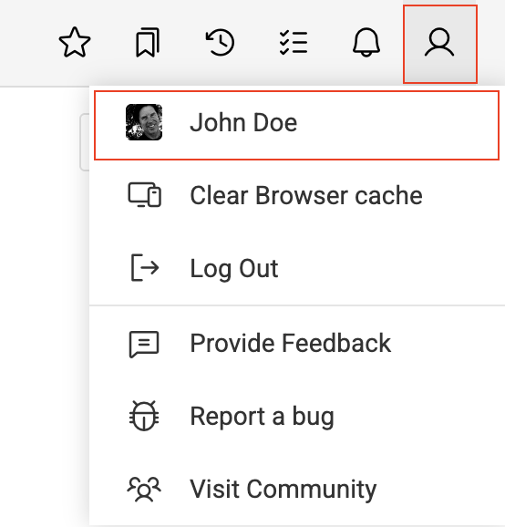
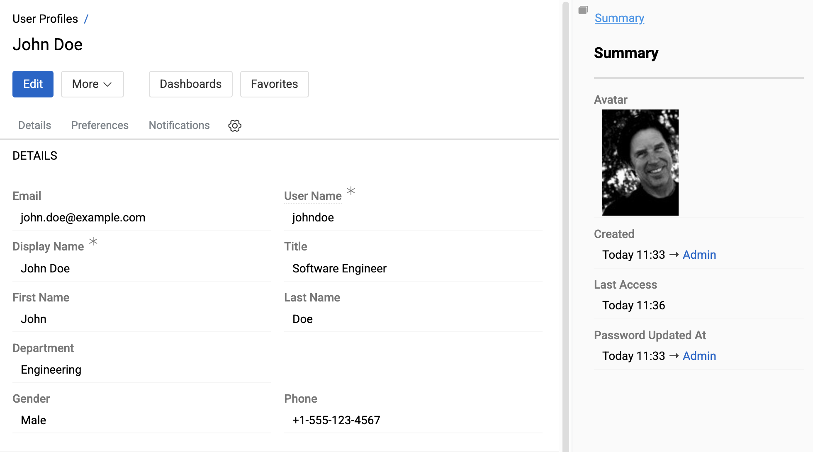
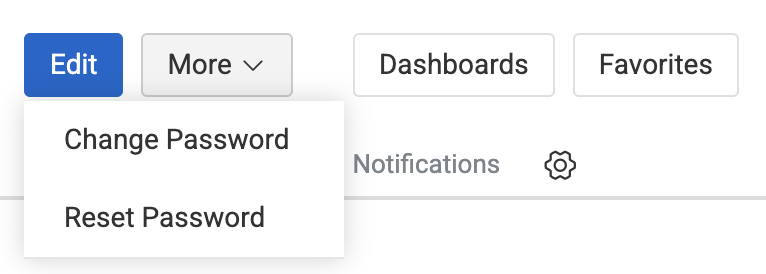
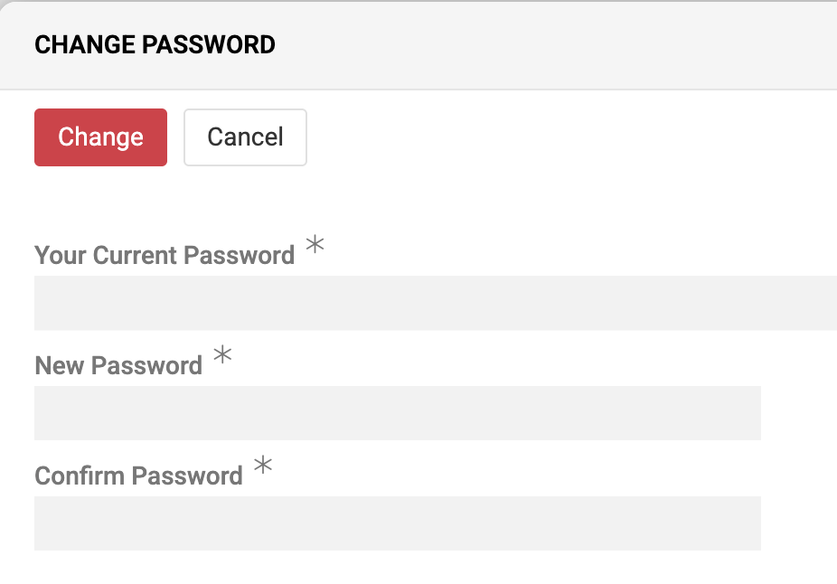
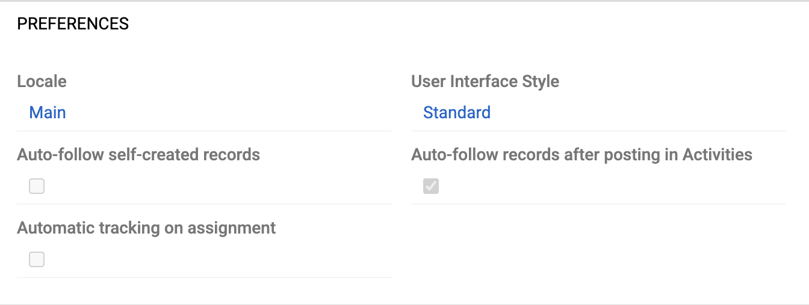
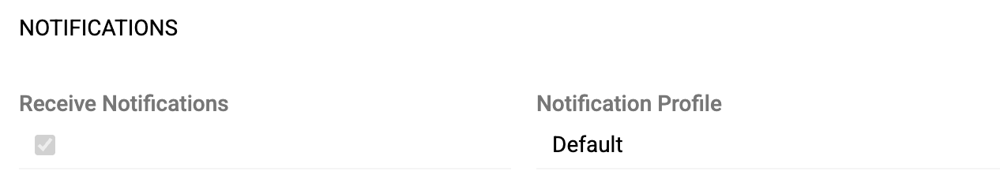

Click the user profile icon on the far right of the [toolbar](../05.toolbar/index.md#user-menu) to open the user menu:

{.small}

Then click your username to open your **user profile** page:

{.large}

The current user personal data is given on the `Details` panel and avatar is shown on the right sidebar in the `Summary` panel by default. It is possible to set up [layout](../03.administration/13.user-interface/02.layouts/) for user profile as for any other entity.

Users can edit their user profile record as any other entity record - see [Record management](../08.record-management/) for details, but only their own.

> If you are not able to edit your user profile, please, contact the administrator.

## Managing User Password

{.medium}

There are two options available for a user without administrator rights in the AtroCore:

- **Change Password**: Change your password by entering your current password
- **Reset Password**: Receive a password reset link by email (requires email configuration)

> After using the Reset Password option, you will be automatically logged out of your account and your old password will no longer be valid.

{.medium}

The Change Password dialog provides the following options:

- **Your Current Password** (*): Enter your current password
- **New Password** (*): Define the new password
- **Confirm Password** (*): Re-enter the new password to ensure accuracy

## Interface Settings

The Preferences section allows you to customize your interface settings:

{.medium}

- **Locale**: Select your preferred language and regional settings – see [Locales](../03.administration/02.locales/)
- **User Interface Style**: Choose your preferred interface style – see [User Interface](../03.administration/13.user-interface/)

{.medium}

The `Dashboards` and `Favorites` buttons in the header allow you to set up [Dashboard](../07.dashboards/) and [Favorites](../05.toolbar/02.favorites/) for your user profile.

## Notification Settings

General notification settings are available in the Notification panel:

{.medium}

- **Receive Notifications**: Enable or disable all system [notifications](../05.toolbar/04.notifications/) (disabled by default)
- **Notification Profile**: Select your notification profile

Additional notification behavior options can be configured in the Preferences panel:

{.medium}

- **Auto-follow self-created records**: Automatically follow records you create to receive notifications about updates
- **Auto-follow records after posting in Activities**: Automatically follow records when you post activities or comments
- **Automatic tracking on assignment**: Automatically follow records when you are set as Assigned user