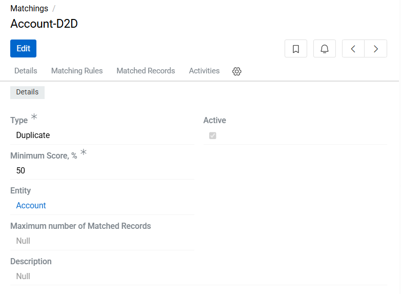
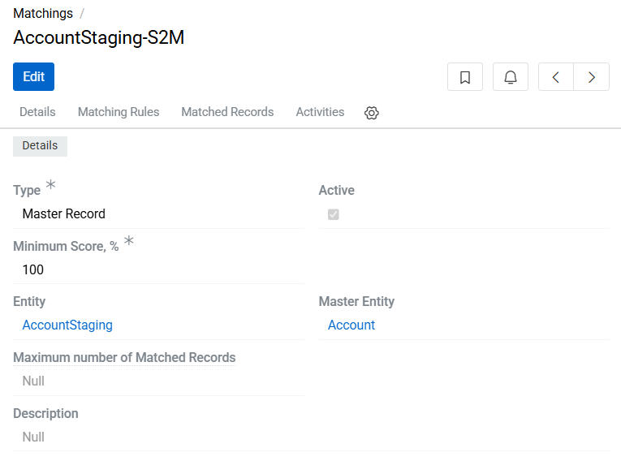
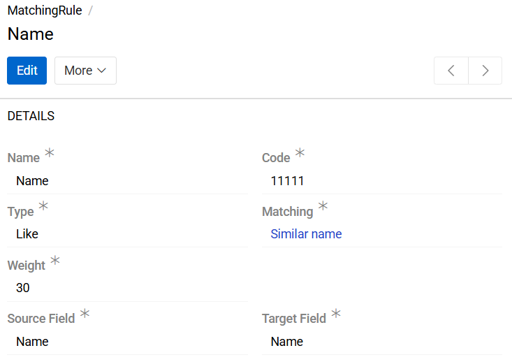
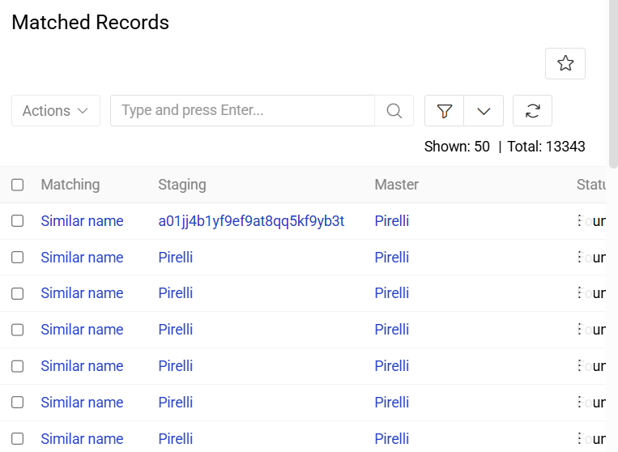

AtroCore provides an automated mechanism for identifying similar or duplicate entity records. This functionality is configured through the Matchings feature.

To define similarity criteria, navigate to the Administration/Matchings entity and create a Matching configuration record. The matching operations run in the background through a dedicated [scheduled job](../../../01.atrocore/03.administration/05.system-jobs/01.scheduled-jobs/docs.md#find-matches). This scheduled process automatically evaluates new and updated records against the defined Matching Rules.

## Matching Configuration

A Matching record defines similarity rules and determines how the system evaluates entities for potential duplicates.
The following parameters are available when configuring a Matching:

- Name – the label for the Matching configuration.
- Code – a unique system identifier. This field is immutable after creation.
- Active – when enabled, the system evaluates matching conditions automatically:
  - On creation of new records in the selected entity.
  - Whenever a field used by Matching Rules is modified.
- Type – determines how the system compares entities. This field is immutable after creation and accepts the following values:
  - Duplicate – compares records within the same entity to detect duplicates.
  
  {.medium}

  - Master Record – compares records between staging entity and an master entity.
    
  {.medium}

- Description – optional text describing the matching logic or purpose.
- Minimum Score, % – a threshold defining the minimum weighted score required for a successful match. The system evaluates Matching Rules based on their individual weight values, and if the resulting score meets or exceeds the defined percentage, the records are considered similar.
  - Example: If two matching rules have weights of 20 and 30 and the minimum score is set to 50%, at least one rule with a combined weight of 50% must evaluate as true for matching to occur. In this case, this can only be the matching rule with a weight of 30 or both rules.
- Entity – specifies the entity where the similarity search will be applied (e.g., Product, Account).
- Maximum number of Matched Records – defines the maximum number of matched records allowed for a single record. If the number of matched records exceeds this value, the matching process for that record is automatically deactivated. Leave this field empty to allow an unlimited number of matched records.

## Matching Rules

Matching Rules define the individual comparison criteria used within a Matching configuration. Multiple Matching Rules can be associated with a single Matching record.

{.medium}

The following parameters are available when defining a Matching Rule:

- Name – descriptive label for the rule.
- Code – unique system identifier. Immutable after creation.
- Type – determines how field values are compared. Immutable after creation. Available types:
  - Equal – strict equality between values.
  - Similar – pattern-based similarity.
  
  For array-based fields ([array](../../03.administration/11.entity-management/02.data-types/docs.md#array), [multi-value list](../../03.administration/11.entity-management/02.data-types/docs.md#multi-value-list), [static multi-value list](../../03.administration/11.entity-management/02.data-types/docs.md#static-multi-value-list)), values are considered similar if they contain the same elements regardless of order.
  Example: [1,2,3] and [1,3,2] are considered similar.
  - Contains – checks if the source value contains the target value.

  For array-based fields (array, extensibleMultiEnum, multiEnum), this means that all elements of the source value must be present in the target value.
  Example: [1,2] and [3,1,2] – the second value contains the first.
  
  - Set – represents a grouped collection of subordinate Matching Rules that are evaluated together. A Set rule enables composite matching logic by aggregating multiple conditions into a single weighted rule. A Set has an Operator parameter that defines how its sub-rules are evaluated:
    - Operator: AND - All sub-rules within the Set must evaluate to true for the Set to be considered true.
    - Operator: OR - At least one sub-rule must evaluate to true for the Set to be considered true.
- Matching – references the parent Matching configuration. Immutable after creation.
- Weight – numerical value defining the rule’s importance in the overall similarity score.
- Staging Entity (Unidirectional only) – entity from which external or temporary data originates. Inherited from parent Matching. Immutable.
- Master Entity (Unidirectional only) – primary entity containing the reference data. Inherited from parent Matching. Immutable.
- Source Field – field from the selected entity being evaluated.
  - For Bidirectional, this refers to the field used to compare values between two records within the same entity.
  - For Unidirectional, this refers to the field in the Staging Entity.
- Target Field – field against which the source is compared.
  - For Bidirectional, this may be the same as Source Field.
  - For Unidirectional, this refers to the field in the Master Entity.

> Each Matching Rule can belong to one Matching only. A Matching can contain multiple rules.

## Viewing Matched Records

All matched records resulting from Matching configurations can be reviewed in two ways:

- Matched Records entity – displays a comprehensive list of all detected matches across the system, regardless of the Matching configuration or entity involved.
- Matched Records panel in a Matching record – shows only the records that matched according to that specific Matching configuration. This view is useful for reviewing rule-specific match results in context.
- Right sidebar in the matched entity record – when opening a record, the `Matched records` panel in the [Insights tab](../../../01.atrocore/04.understanding-ui/docs.md#insights-tab) displays all matching or potentially duplicated records detected for that specific entity item. This allows users to quickly assess similarities without navigating to the Matchings module.

{.medium}

Both views allow users to quickly identify and manage potential duplicates or record similarities based on defined Matching Rules.

> In case of duplicates, records are stored bilaterally.

## Managing Match Status

Each matched pair of records includes a Status field. Users can manually update this status to validate or invalidate the detected similarity between records.

Supported status values:

- Found – default system-assigned value indicating that the record pair was automatically detected as a potential match.
- Rejected – indicates that the user has reviewed the pair and determined that the records are not similar or should not be treated as duplicates.
- Confirmed – indicates that the user has verified the match.

Updating these statuses allows users to:

- Validate the accuracy of automated matching results.
- Exclude false positives from further processing.