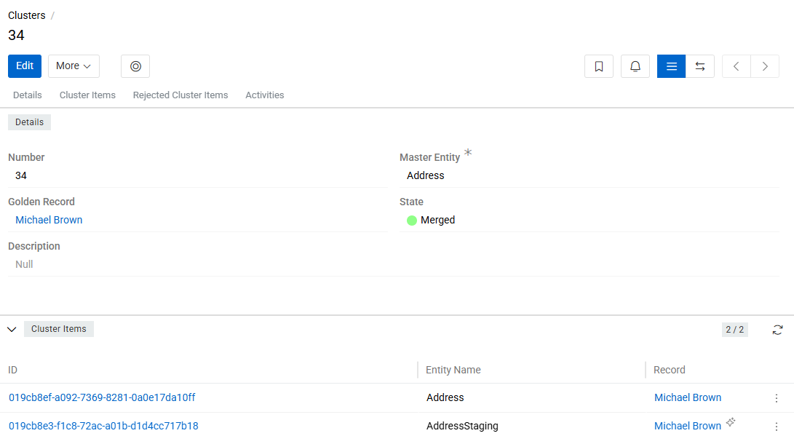
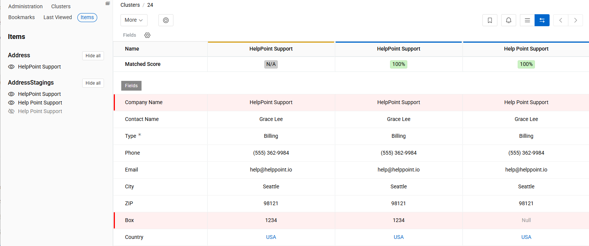
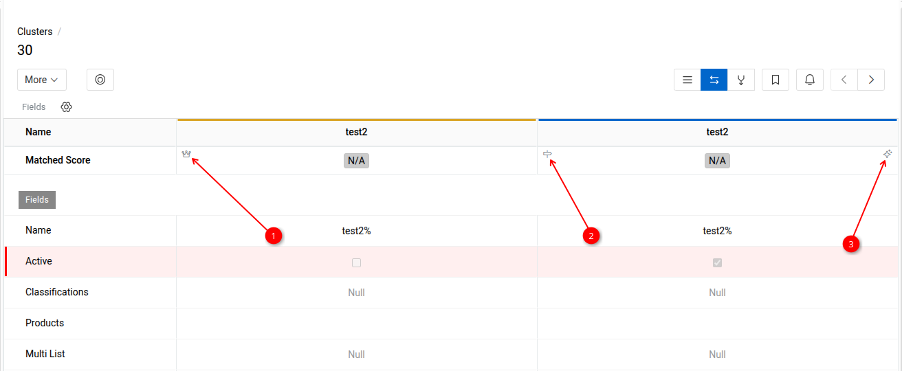
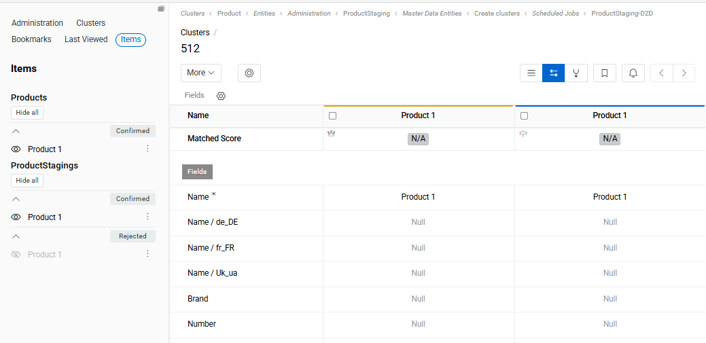
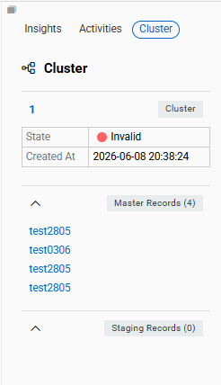
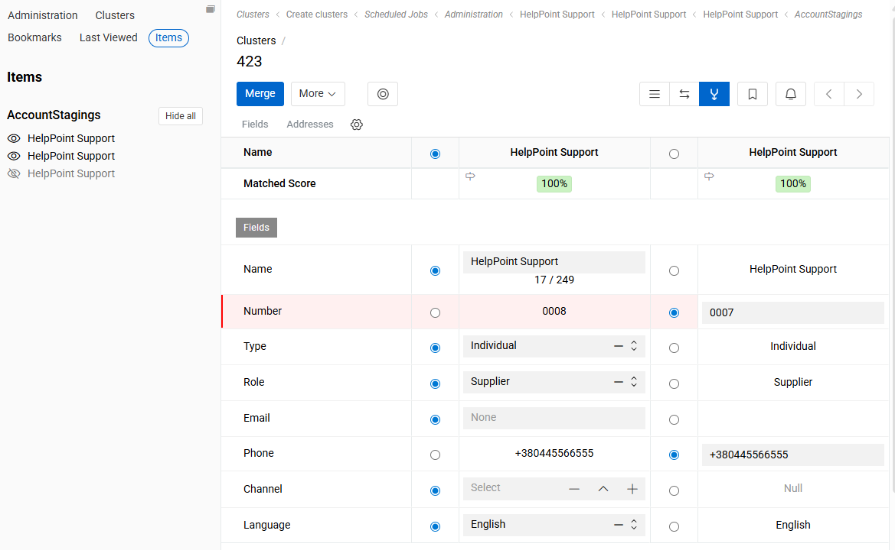
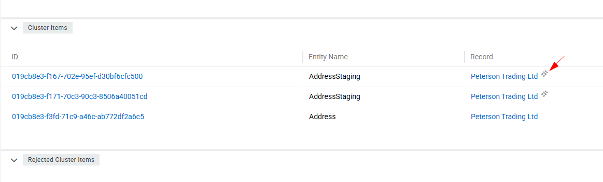

A Cluster is a system entity that virtually groups one or more records based on the [Matching Rules](../17.matching/index.md#matching-rules) defined for a given entity. Unlike standard relationships, the connection between records within a cluster exists on a virtual level – no physical link is created between them at this stage.

Clusters are used as part of the duplicate detection workflow. When duplicate search is enabled for an entity – within the master data, within the contributor data, or between master and contributor – the system automatically groups the detected duplicates into clusters to facilitate review and processing.

A correctly formed cluster contains one master record and one or more contributor records. Once the user confirms a cluster item, a real relationship between the master and contributor records is established.

## Creating and Deleting Clusters

Clusters are created automatically by a [scheduled job](../../../01.atrocore/03.administration/05.system-jobs/01.scheduled-jobs/index.md#create-clusters) based on the Matching Rules configured for the entity. Users cannot create clusters manually, nor can they add or remove cluster items manually.

Regardless of the cluster's current state, items may be added to or removed from it on each subsequent job run.

A cluster can only be deleted if it has no cluster items (i.e., its state is Empty).

## Cluster Fields

{.medium}

| Field | Description |
|---|---|
| **Number**             | A unique auto-incremented identifier, assigned automatically by the system. Read-only.|
| **Master Entity**       |  The master entity this cluster belongs to. A cluster is always scoped to a single entity and may only contain records from that master entity and its corresponding contributor entity.|
| **Golden Record**      |The primary master record to which contributor records will be linked upon confirmation. Only one Golden Record can be set per cluster. If the Golden Record is deleted, all contributor items are unlinked from it. |
| **State**              |  A read-only, dynamically calculated field reflecting the current state of the cluster. Updated automatically on any change to cluster items.|
| **Contributor Item Count**  |  The number of contributor records currently linked to the cluster. Read-only.|
| **Master Item Count**   |  The number of master records currently linked to the cluster. Read-only.|

The State field of the Cluster can have the following values:

- **Empty** – the cluster has no cluster items.
- **Review** – the cluster has items, but is not yet fully merged.
- **Merged Manually** – all cluster items have been confirmed, and at least one was confirmed manually.
- **Merged Automatically** – all cluster items have been confirmed automatically.
- **Invalid** – the cluster contains more than one master record, or contains no contributor records.

## Cluster Items

Cluster Items panel lists all master and contributor records that the system has linked to the current cluster based on the entity's Matching Rules. Each item displays the Entity Name, the linked Record, and its Matched Score.

Cluster items cannot be added or removed manually. If a Matched Record is deleted, the corresponding Cluster Item is not removed – instead, it is reassigned to another cluster (existing or newly created).

Every contributor record must belong to a cluster. If the system detects no duplicates for a given record, a cluster with a single item is created and that item is confirmed automatically.

Cluster items are created, populated, and automatically confirmed by the Create Clusters scheduled job. If matching rules change, or a record is created or updated causing a Matched Records pair to be added, removed, or have its Matched Score changed, the cluster is not updated immediately – changes take effect on the next job run.

## Cluster View Modes

The Cluster entity supports three view modes, switchable via the buttons in the cluster detail view:

- **Standard View** – displays all cluster fields along with two relation panels: Cluster Items and Rejected Cluster Items.

- **Comparison View** – displays a comparison table with the fields and attributes defined in the [Selection Layout](../../09.comparison-and-merge/index.md#configuring-the-comparison-table-layout) of the corresponding entity.

- **Merge View** – displays all cluster items side by side with radio buttons for selecting field values from each record. Used to manually build or update the Golden Record by choosing specific values from contributor records. See [Merge Cluster Items](#merge-cluster-items) for details.

{.large}

Field values that differ between records are highlighted with a vertical red line. The comparison table shows a maximum of 5 items at a time.

Each column in the comparison table includes a Matched Score row for the corresponding item. Field values in the table can be edited directly.

The Matched Score row in each column shows icons indicating the entity role and confirmation method:

{.large}

- **1** – the record is a master entity record.
- **2** – the record is a contributor entity record.
- **3** – the item was confirmed automatically.

The Golden Record is indicated by a horizontal gold line in the comparison table. A confirmed contributor record is indicated by a horizontal blue line.

To control which items are shown in the comparison table, open the `Item` tab in the left sidebar. It lists all items belonging to the cluster, grouped by entity. Use the eye icon next to each item to show or hide it in the table.

Items in the left sidebar are grouped by status within each entity section:

- **All items** – all items that have not been rejected, shown at the top of the section.
- **Confirmed** – a collapsible group listing confirmed items.
- **Rejected** – a collapsible group listing rejected items; collapsed by default.

Grouping is applied separately for Master and Contributor entities. Each item in the sidebar has an actions button (⋮) that provides item-level actions directly from the sidebar without opening the item's detail page.

{.large}

## Cluster Information in Record Detail View

When a record belongs to a cluster, a Cluster Information block is displayed in the right sidebar of the record's detail page. This block provides a quick overview of the associated cluster without navigating to the cluster itself.

{.medium}

The block includes the cluster status (e.g., Merged) and the date of last modification.

Below the cluster summary, two collapsible panels are displayed:

- **Master Records** – lists all master records linked to the cluster.
- **Contributor Records** – lists all contributor records linked to the cluster.

Record names within both panels are clickable links that open the respective record's detail page.

The status of each item is visually indicated by a colored horizontal line on the left side of the record name. Items confirmed automatically display an additional icon.

## Merge Cluster Items

The Merge View allows you to manually create or update the Golden Record within a cluster by selecting individual field values from contributor records via radio buttons.

{.large}

The merge action is available only for clusters in the "Review" or "Merged" state.

All cluster items are shown in the merge view by default. To exclude an item from the merge, use the unset icon in the left sidebar. Only items that were removed from the merge interface are considered non-participating – all others are treated as participating in the merge.

**Behavior on execution:**

- If no Golden Record exists, it is created; if one already exists, it is updated.
- Field values are taken from the contributor records based on the radio button selection in the merge view.
- Participating contributor records are **not** processed through the [Consolidation Script](#consolidation-script) – selected values are applied directly.
- Participating cluster items have their state changed to Confirmed after the merge is executed.
- Contributor records that did not participate in the merge (i.e., removed from the merge interface) remain unchanged.
- If a field in the Golden Record is locked via a value lock, the lock is ignored – the selected value is applied regardless.

## Cluster Item Actions

The following actions are available for cluster items in both Standard and Comparison views:

- **Confirm** – creates a link between the contributor and master records. Two scenarios apply:

  - If a master record already exists in the cluster, the contributor record is linked to it.
  - If no master record exists yet, a new master record is created based on the selected contributor record and linked to it.

    An already confirmed item cannot be confirmed again.

- **Reject** – removes the cluster item from the current cluster and reassigns it to another cluster (existing or newly created). The rejected item remains visible in the `Rejected Cluster Items` panel. If a confirmed master record is rejected, all already confirmed contributor records in the cluster are automatically unconfirmed and the link between the master and contributor records is removed. If a confirmed contributor record is rejected, that record is unconfirmed. Available as a mass action – can be executed for multiple cluster items at once.

- **Unreject** – Available for items in the `Rejected Cluster Items` panel. Returns the item to the cluster. If the item was previously confirmed, then rejected, and then returned to the cluster, it will have an unconfirmed status and must be confirmed again.

- **Unmerge** – detaches the cluster item from the current cluster and moves it into a new separate cluster. If the item was previously confirmed, its confirmation is automatically reset after the unmerge. Available as a mass action – can be executed for multiple cluster items at once, but only for items belonging to the same cluster.

- **Move** – transfers the cluster item to an existing cluster selected by the user. A cluster picker dialog opens, filtered to clusters of the same master entity. If the item was confirmed, its confirmation is reset before the move. The item cannot be moved to a cluster where it was previously rejected. Both the source and target clusters record the move in their activity streams.

- **Delete** Deletes the corresponding record and its cluster item.

## Confirming Cluster Items

When a cluster item (master or contributor record) is confirmed, the system creates a Golden Record for the cluster if one does not yet exist. If a Golden Record is already set, confirming additional items links the corresponding contributor records to that master record. The linked contributor records become visible in the relevant relation panel on the master record's detail page.

### Consolidation Script

During confirmation, all cluster items are processed through the Consolidation Script defined in the [Consolidation](../index.md#consolidation) configuration for the corresponding master entity.

This script describes the logic by which the master record is created or updated based on the contributor record – specifying which fields should be copied, under what conditions, and whether any field transformations should be applied.

### Automatic Confirmation

Cluster items can be confirmed manually by the user or automatically by the `Create Clusters` scheduled job.
To enable automatic confirmation, check the `Confirm Automatically` checkbox in the Consolidation record of the corresponding master entity. When enabled, the Minimum Matching Score field becomes required and defines the threshold for automatic confirmation.

A cluster item is confirmed automatically if its Matched Score is greater than or equal to the Minimum Matching Score. If the score falls below this threshold, the item will not be confirmed automatically, even if the setting is enabled for the entity.

Items confirmed automatically are marked with a dedicated icon in the cluster.

{.medium}

> The Matched Score is copied from the corresponding Matched Record to the cluster item. If the matching chain is A → B with a score of 80 and B → C with a score of 60, the scores assigned to the cluster items will be: A – 80, B – 80, C – 60.

### Automatic Master Update

When Update Master Automatically is enabled in the Consolidation configuration, any update to a contributor record will automatically trigger an update of the corresponding master record according to the Consolidation Script – without requiring a manual re-confirmation.

If automatic [field locking](https://store.atrocore.com/en/advanced-data-management/20113) on manual modification is enabled, updates from contributor records will not overwrite fields in the master record that have been modified manually.

### Automatic Removal of Invalid Masters

When **Delete Invalid Masters Automatically** is enabled in the Consolidation configuration, the system automatically removes invalid master records from clusters that already have a Golden Record set.

A cluster is considered to have invalid masters when it contains more than one master record — a state reflected by the **Invalid** cluster state. In this situation, all master records in the cluster except the designated Golden Record are considered invalid. With this option enabled, those excess master records are deleted automatically during the `Create Clusters` job run.

This setting is useful to automatically clean up master data in scenarios where duplicate detection identifies master records that should not coexist independently and should instead be consolidated under the cluster's Golden Record.

## Purging Clusters

Purging permanently deletes one or more clusters along with all their ClusterItems and RejectedClusterItems. Unlike the standard delete action, which requires a cluster to be in the Empty state, purge removes a cluster regardless of its state.

> This is a hard delete. Purged clusters and their items cannot be recovered.

### Purge All

The **Purge All** button is available in the top-left area of the Cluster list view. It purges every cluster in the system regardless of any active filters or selection. A confirmation dialog is shown before execution.

### Purge selected

To purge a specific set of clusters, select them in the list view, open the mass action menu, and choose **Purge**. A confirmation dialog is shown before execution.

### Sync vs. async execution

| Clusters affected | Behaviour |
|---|---|
| Up to 200 | Executed immediately; the UI waits for completion |
| More than 200 | Dispatched as background jobs; progress can be monitored in the Job Manager |

## Activity Stream

Each Cluster has an activity stream that records all significant events on its items. The following events are tracked:

| Event | Description |
|---|---|
| **Linked** | A record was added to the cluster |
| **Unlinked** | A record was removed from the cluster |
| **Rejected** | A Cluster Item was rejected |
| **Reincluded** | A previously rejected item was returned to the cluster |
| **Moved** | An item was unmerged and moved out of the cluster |
| **Confirmed** | A Cluster Item was confirmed |
| **Golden Record** | A record was set as the Golden Record |
| **Deleted** | The underlying record was deleted |
