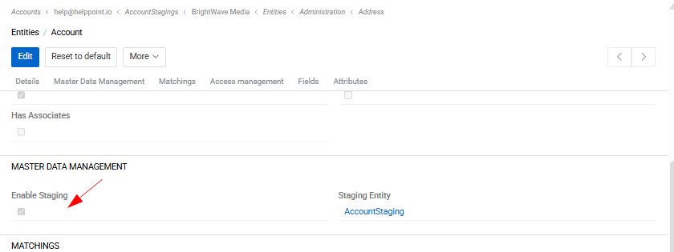
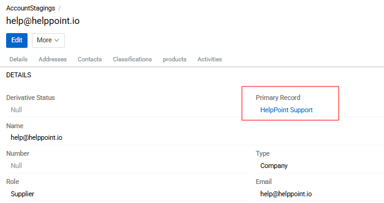
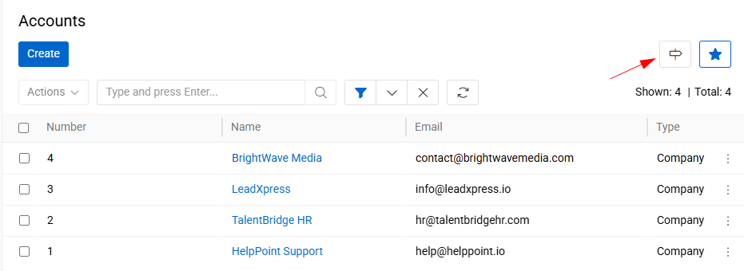
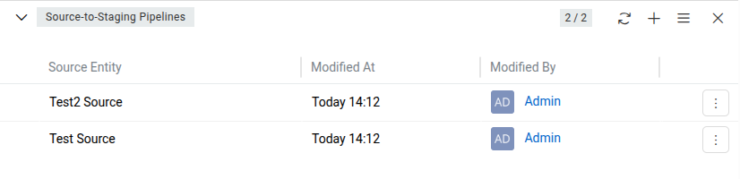

AtroСore can be used as a Master Data Management (MDM) system. This means that users can import data into the platform in any convenient way. Inside AtroСore, this data can then be improved, structured, and enriched if necessary, and finally exported to external systems such as marketplaces or other platforms.

Imported data can be modified during the import process. However, in some cases it is important to preserve the original data exactly as it was received and not modify it, while at the same time creating new records in other entities based on this data. This is especially relevant when data comes from multiple source systems that may differ in their field sets, data formats, or structures.

To manage such scenarios, AtroСore provides the concept of Master Data Management (MDM). With this approach, the data structure consists of three main layers: Source Entities, Staging Entity, and Master Entity.

## Source Entity

A Source Entity is the initial entity (or multiple entities) into which users import unmodified or minimally modified data from one or more external systems.

- A source entity can have an arbitrary set of fields, depending on the structure of the incoming data.
- It reflects the raw or near-raw data as provided by external systems.
- Multiple source entities can exist if data is coming from different systems with different schemas.

## Staging Entity (Derivative Entity)

The Staging Entity (also called a Derivative entity) is used as an intermediate layer between source data and master data.

It is a full copy of the Master Entity and reproduces its data model exactly, with only one important difference – it does not contain any mandatory or unique fields.

- The staging entity is always a single entity per master entity.
- It is linked to the master entity with a one-to-one relationship.

### Create Staging entity 

To enable derivative (staging) entities, activate the `Enable Staging` checkbox in the Master Data Management panel of the corresponding entity settings under `Administration / Entities`.

 {.medium}

Once enabled, a staging entity is created automatically and displayed in the corresponding field.

The staging entity contains a Primary Record field, which can be used to link the staging record to the corresponding record in the master entity.

 {.medium}

The staging entity fully inherits the fields, attributes, and layouts of the master entity. These settings cannot be modified manually for the staging entity, as they are always inherited automatically from the master entity.

### Navigation between Staging and Master entities

For convenient navigation between Staging and Master entities, a button "Open Staging/Master Entity" is available in the top-right corner of the list view.

 {.medium}

This button allows users to quickly switch from a Staging entity to its corresponding Master entity and vice versa.

Please note that the button is displayed only if the user has permission to view the corresponding entity. If the user does not have the required access rights, the button will not be visible.

### Source-to-Staging Pipelines

To define how source data is transferred to the staging entity, configure one or more **Source-to-Staging Pipelines**. Each pipeline connects one source entity type to a staging entity and defines the transformation logic.

Pipelines are managed from the **Source-to-Staging Pipelines** panel on the staging entity's detail page.

{.medium}

Each pipeline record contains the following fields:

- **Staging Entity** – the staging entity this pipeline writes to.
- **Source Entity** – the source entity type this pipeline reads from.
- **Merging Script** – a Twig script that defines how source record data is transformed and mapped to the staging record.

Both the Staging Entity and Source Entity fields are locked after the pipeline is created and cannot be changed.

#### Merging Script

The merging script is a Twig template that must return a JSON object with the key `stagingRecordData`, containing the field values to write to the staging record:

```twig
{# {
  "stagingRecordData": {
    "name": "{{ sourceRecord.name }}"
  }
} #}
```

Two variables are available in the script:

- `sourceRecord` – the source record that triggered the sync.
- `stagingRecord` – the existing staging record, or `null` when the staging record does not yet exist.

#### Automatic synchronization

Once a pipeline is configured, the system automatically:

- **Creates** a new staging record when a source record is saved and has no linked staging record yet.
- **Updates** the staging record when the source record is saved and is already linked.
- **Re-applies** all pipelines for the staging entity when the staging record itself is updated.

All synchronization operations are performed on behalf of the system user, regardless of who triggered the save.


### Data Unification and Deduplication

At the staging level, data is prepared for consolidation into the master entity. Two key processes take place here: data unification and duplicate detection.

Data unification means bringing data into a consistent and standardized format. This may include, for example, representing phone numbers in a single unified format, normalizing country codes, aligning date formats, or standardizing naming conventions. Such transformations ensure that data coming from different source systems becomes comparable and consistent.

Duplicate detection is performed using the [Matching](./17.matching/index.md) mechanism in PIM. In this mechanism, you can define matching rules that determine how potential duplicates are identified. These rules may be based on one or multiple fields (for example, name, email, phone number, external ID, or combinations of these) and can include exact or fuzzy matching logic.

After unification and duplicate detection, unified and validated data is transferred to the Master Entity, where it forms a single, consolidated, and reliable version of each record.
