The [Advanced Data Management](https://store.atrocore.com/en/advanced-data-management/20113) module extends AtroCore's data management capabilities by enabling full configuration of Relation entities, providing Script type for fields and attributes, and implementing dynamic relationship management. This module enables complex data structures and automated data processing through script-based calculations and dynamic selections.

## Relation Entity Management

Relation entities are automatically created when establishing [Many-to-Many relationships](../07.fields-and-relations/docs.md#many-to-many-relationships) between entities. The Advanced Data Types module enables full management of these Relation entities, allowing you to customize their structure and behavior beyond the basic relationship functionality.

! For general guidance on working with entities, refer to [Entity management](..).

[Relation entities](../01.entity-types/docs.md#relation) are automatically generated with:
- Two [link](../02.data-types/docs.md#link) fields connecting the related entities
- Standard system fields (ID, Created At, Created By, etc.)
- Entity name formed by combining the related entity names

> Relation entities are also created for [hierarchical entities](../01.entity-types/docs.md#hierarchy) to manage parent-child relationships (e.g., ProductHierarchy for Product entity).

With the Advanced Data Management module, Relation entities can be fully customized:

- **Field Management**: Add custom fields to store additional relationship data - see [Fields and Attributes](../03.fields-and-attributes)
- **Navigation Integration**: Display Relation entities in [Navigation](../../13.user-interface/01.navigation) and [Favorites](../../../05.toolbar/02.favorites) menus
- **UI Configuration**: Modify labels, set Text Filter Fields, and configure Default Order - see [Entity management](../docs.md#configuration-fields) for details
- **Additional Relationships**: Create links with other entities - see [Fields and Relations](../07.fields-and-relations)

!! [Attributes](../../12.attribute-management) cannot be used with Relation entities.

As an example, the "Product Channels" entity links [Products](../../../../06.pim/03.products) and [Channels](../../../../06.pim/06.channels), and includes an "Active" checkbox field to control product availability per channel — demonstrating how Relation entities can store relationship-specific data.

## Field Value Lock 

The Field Value Lock functionality provides the ability to protect fields from being modified by the system when they have been manually changed by a user or explicitly locked. This configuration is defined at the entity level and applies to all fields and attributes of the entity by default. It can also be disabled for specific fields or attributes individually.

### Enabling Field Value Lock

To enable field value locking, go to the [Entity Manager](../../11.entity-management/docs.md), open the needed entity page and select the checkbox `Enable Field Value Lock`.

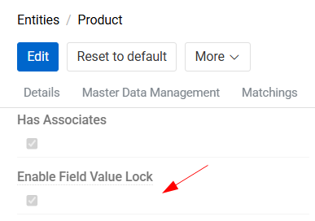{.small}

When this option is enabled, any field (attribute) that is manually changed by a user via the UI will automatically become locked. A lock status icon appears next to the field to indicate that it is protected from changes by the system.

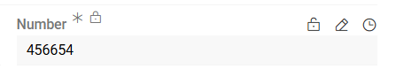{.small}

Users can also manually control field locking – a field can be locked or unlocked by clicking the `Prevent value from being changed by the system` button, which appears when hovering over the field. The same action is available in the [record comparison](../../../09.comparison-and-merge/docs.md#compare-records) interface. 

To remove locks from all fields and attributes of a record at once, use the `Clear value locks` action from the record’s action menu.

Locked fields cannot be modified by system-driven processes such as imports, workflow actions, or other automated operations. Any system-originated changes to a locked field will be ignored.

For complex fields (such as fields with units or range-based fields), locking and unlocking works as follows:

- If a user modifies any part of the field, all parts of the field become locked.
- Using the inline lock/unlock action on an individual part of the field affects the entire field, not just that part.

### Disabling Value Lock for Specific Fields and attributes

If field value locking should be enabled for an entity but excluded for the specific field (attribute), select the checkbox `Disable Value Lock` on the field (attribute) [configuration page](../../11.entity-management/03.fields-and-attributes/docs.md#configuration-options).

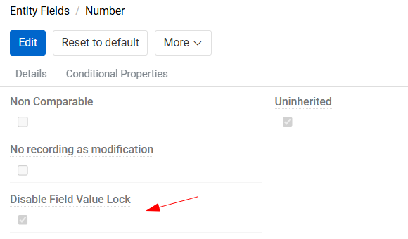{.medium}

Fields with this option enabled will not display the lock icon and will not be locked when modified via the UI. All changes made by the system will be applied to them.


## Script Attributes and Fields

New [data type `Script`](../02.data-types/docs.md#script) for attributes and fields is included in this module to enable dynamic value calculation using [Twig Templating](../../../../11.developer-guide/80.twig-tutorial). This functionality allows you to create computed values based on existing data, perform conditional logic, and reference related entity information.

! Refer to [Fields and Attributes](../03.fields-and-attributes) and [Attributes](../../12.attribute-management/01.attributes) on how to work with fields and attributes in general.

### Script Configuration

Script attributes and fields are configured with:

1. **Output Type Selection**: Choose the data type for the script result, such as Text, Integer, Float, Boolean, Date, or Date-time. For attributes additional type HTML is available. The output type cannot be changed afterwards.

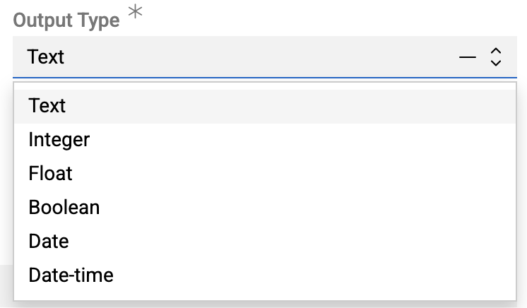{.small}

2. **Script Definition**: Write Twig code to define the calculation logic

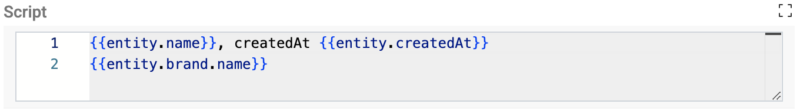{.medium}

3. **Preview**: Use the "Script value" field to preview the calculated result

{.small}

The preview uses a random entity record (e.g., "test"). The preview updates only after saving the script field.

### Script Nuances

Script fields are primarily designed for export purposes, allowing you to collect additional data and present it in the formats expected by external systems. Script values are stored in the database, meaning they can be searched and filtered like any other field.

Script fields and attributes are recalculated whenever a record is updated. Recalculation is also performed immediately when the script, field or attribute is changed or created. Additionally, recalculation occurs every time a record is opened or exported if the script field value is null.

A Scheduled Job "Calculate script fields" is also automatically set up. This checks every two hours to see if there are any script-type fields or attributes with a null value, and recalculates them if any are present. We do not recommend changing or deleting this job due to it being a safeguard for when there are problems with the instance.

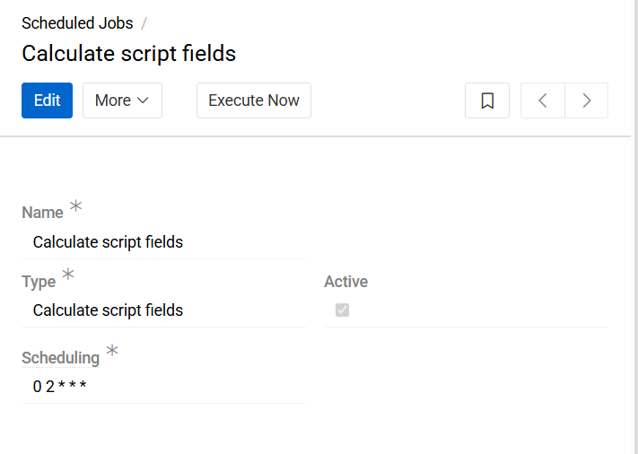{.medium}

You can also manually start the recalculation of the script values for any field or attribute by clicking the "Recalculate script" button.

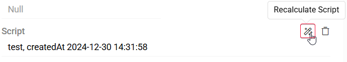{.medium}

### Script Examples

#### Product-Specific Value Selection

This example demonstrates finding a specific product and extracting related information:

```twig
{# Find the product entity by name #}


{# Display product name and creation date #}
{{ product.name }}, createdAt {{ product.createdAt }}

{# Get all assets related to the product #}


{# Loop through assets and display the main image #}

    
        Main image - {{ productAsset.file }}
    

```
Keep in mind that this script always searches for the product named 'test', so it displays data for that product regardless of which record you run it from.

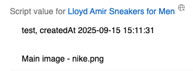{.medium}

#### Attribute Value Referencing

You can simply reference the attribute of current entity using its code (or ID if the code is not set), for example: {{ entity.attribute_code }}.

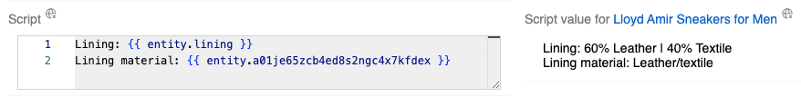{.large}

And if you need to reference the attribute of a different entity - use function `putAttributesToEntity` first and then reference them as usual.

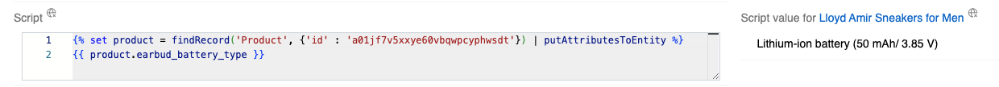{.large}

#### Conditional Logic

Scripts support conditional statements for dynamic value calculation:

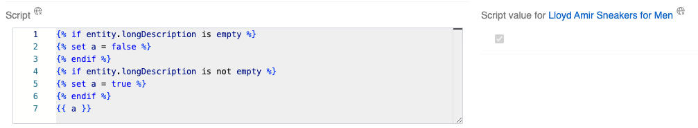{.large}

This example checks if a product `Long Description` is empty and returns a boolean result accordingly.

## Dynamic Relations

Dynamic Relations provide efficient entity linking through filter-based selections without creating physical database relationships. This approach is particularly valuable for large datasets where traditional many-to-many relationships would be impractical or when selection criteria change frequently.

Dynamic Relations work by:
- Creating virtual relationships based on search criteria
- Displaying filtered records in related entity panels
- Enabling real-time updates when criteria change
- Supporting one-way relationships (from target to source entity)

! **Performance**: Dynamic Relations are ideal for large datasets (e.g., 3 million products) where direct linking would be time-consuming and maintenance-intensive.

### Creating Dynamic Relations

Dynamic Relations are managed through `Administration \ Dynamic Relations`.

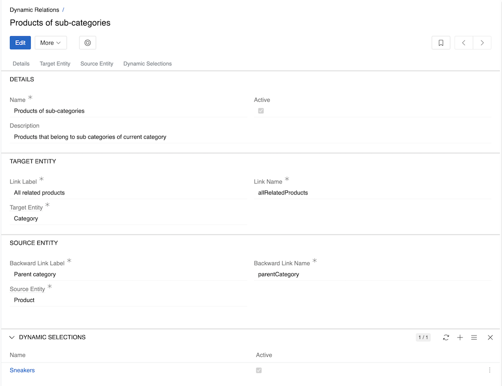{.large}

Configure the Dynamic Relation settings:

- **Active**: Enable the Dynamic Relation
- **Name**: Unique identifier for the relation
- **Target Entity**: Entity where the filtered panel will appear
- **Source Entity**: Entity to filter records from
- **Link Label**: Panel title on the target entity page
- **Backward Link Label**: Panel title on the source entity page

### Creating Dynamic Selections

Dynamic Selections define the filtering criteria for Dynamic Relations. Add them through the relation panel in Dynamic Relations or directly from the entity page `Dynamic Selection`.

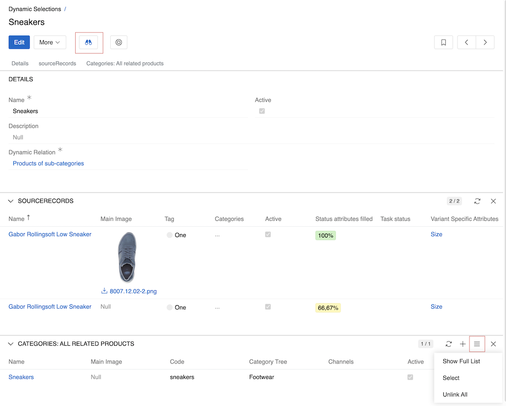{.large}

> Relation panels and filter button become available only after the Dynamic Selection record is saved.

Fields:

- **Name**: Descriptive name for the selection
- **Active**: Enable the Dynamic Selection
- **Dynamic Relation**: Choose the previously created Dynamic Relation

`Source records` panel shows records of the **Source entity**. To set or change the filter, press the filter button in the header. Set the necessary filter in the right panel as described in [Search and filtering](../../../11.search-and-filtering) and apply it by pressing the `Apply Search` button. Results appear in the `Source records` panel.

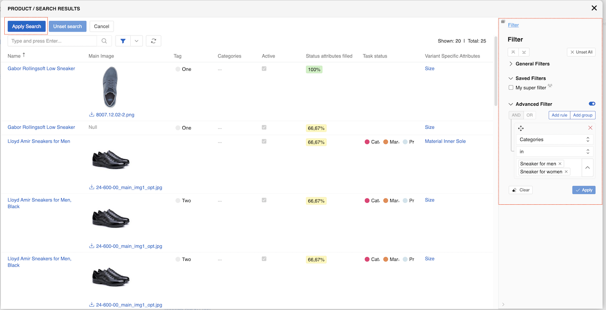{.large}

The bottom panel shows records of the **Target entity** for which this particular selection will apply (Category in this case). Manually add or remove desired records for this panel using the panels menu. See [Record management](../../../08.record-management/docs.md#linking-and-unlinking-related-records) for details.

### Using Dynamic Relations

Once configured, Dynamic Relations can be added in [layouts](../../13.user-interface/02.layouts) for entity detail page (both Target and Source entities):

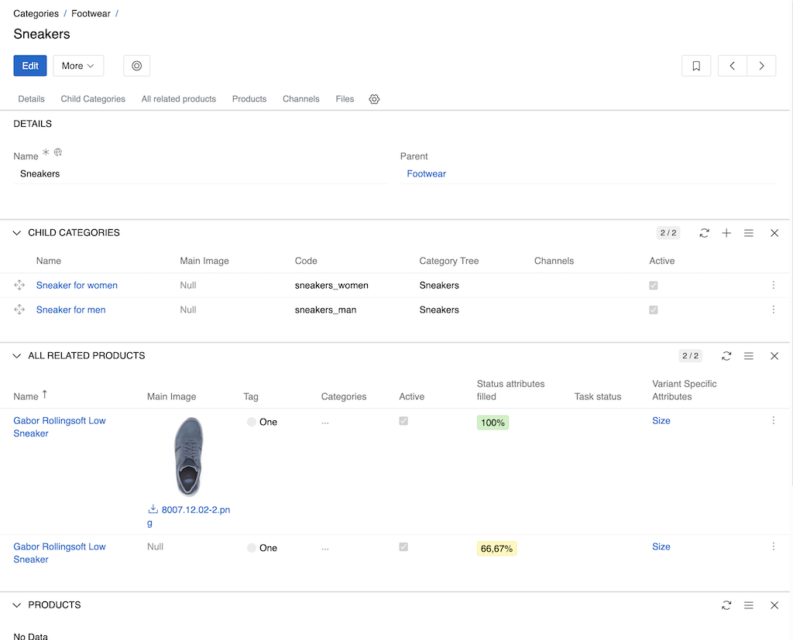{.large}

The panel displays records matching the defined criteria, updating automatically when the source data changes.

### Enabling Bidirectional Navigation

Dynamic Relations work primarily in one direction (from target to source entity). For example, when viewing a Category, the system displays all Products that match the selection criteria. However, viewing the reverse relationship (from Product to Category) requires additional processing.

To enable bidirectional navigation, use the [Refresh Cache for Dynamic Relations](../../05.system-jobs/01.scheduled-jobs/docs.md#refresh-cache-for-dynamic-relations) scheduled job, which caches all dynamic selection results and allows backward navigation from source to target entities.

!! **Caching**: The system includes caching mechanisms and job scheduling options to optimize performance for large datasets. Caching is also required for bidirectional navigation to function properly.