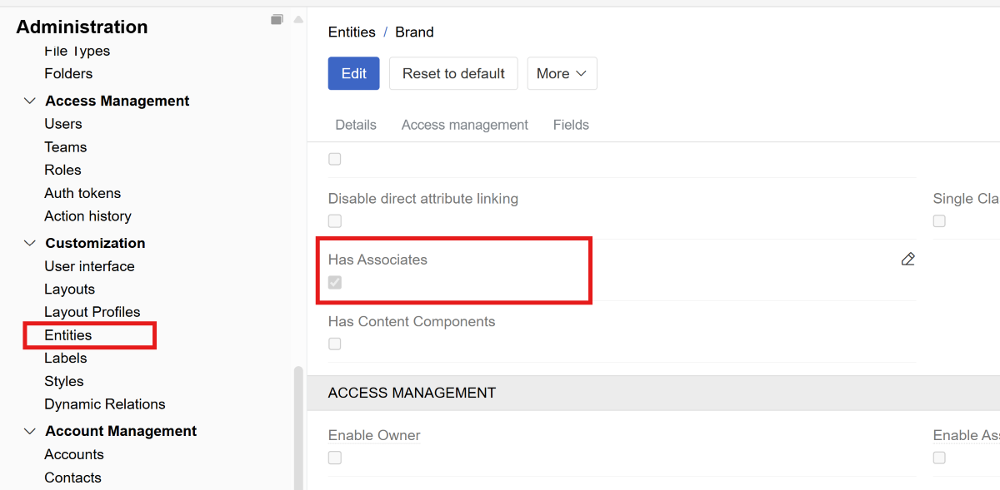
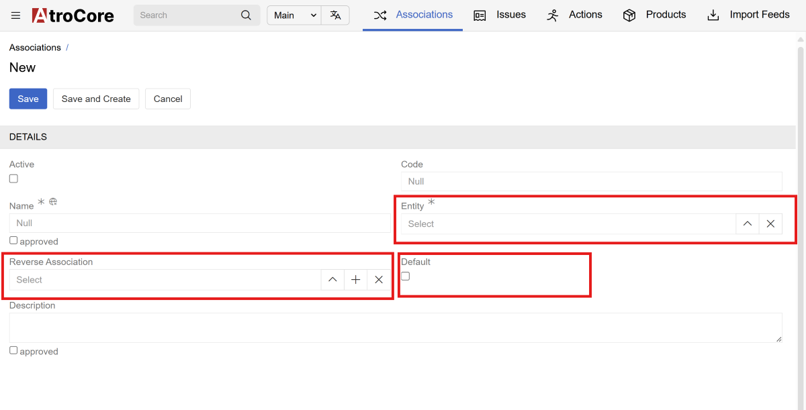
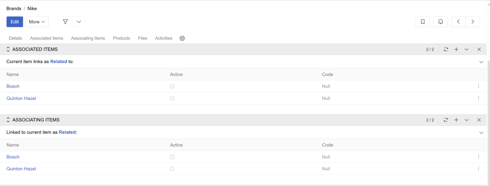
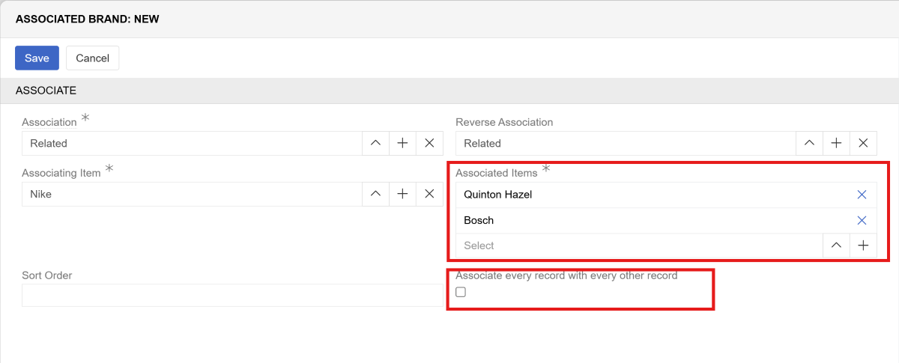

**Association** – a type of the relationship between records, where one in some way is dependent on the other one(s), or can influence the other one(s). Associations can be used for various purposes such as marketing strategies (cross-sell, up-sell), product bundles, component relationships (is part of/consists of), complementary products, alternative options, and many other business scenarios. Each record can associate different records and can be associated from different records.

## Main vs Related Records

Associations are **directional** relationships with two distinct roles:

-   **Main record** – the primary record from which the association is created
-   **Related record** – the record that is associated with the main record

**Example:** If Product A is associated with Product B as a "cross-sell" option, this only means Product B is a cross-sell option for Product A. To make Product A a cross-sell option for Product B, you need to create a separate association, it will not be created automatically.

You may configure association types to automatically create reverse associations when linking records, eliminating the need to manually create separate associations for bidirectional relationships.

## Activation

Enable associations for an entity by activating the `Has Associates` checkbox in [Administration → Entities](../../11.entity-management/docs.md#entity-configuration). This setting is available only for entities of type [Base](../01.entity-types/docs.md#base) or [Hierarchy](../01.entity-types/docs.md#hierarchy).

 {.large}

## Association types

Create association types specific for your entity in the `Association` entity (available in [Navigation menu](../../13.user-interface/01.navigation/) by default).

 {.large}

| Field                   | Description                                                                                                                          |
| ----------------------- | ------------------------------------------------------------------------------------------------------------------------------------ |
| **Entity**              | Select the entity type for this association (required)                                                                               |
| **Reverse Association** | Automatically creates a reverse association when linking records. You can select the same or a different association type for the reverse. |
| **Default**             | Automatically selects this association type when linking records. Only one association type for an entity can be marked as 'Default' |

## Display Panels

When associations are [activated](#activation) for an entity, two panels appear in the [details view](../../../04.understanding-ui/docs.md#detail-view):

 {.large}

-   **Associating Items** – records where the current record is the main record
-   **Associated Items** – records where the current record is the related record

> With bidirectional associations (reverse association enabled), related records appear in both panels.

! Common practice is to remove the second panel from the layout as it's usually not required. See [Layouts](../../13.user-interface/02.layouts/) for configuration.

It is possible to customize the layout of the panels (Associated Items/Associating Items) - selecting fields of the associated/associating records to be shown in columns. The Configuration button is shown on hover of the records header.

## Creating Associations

Link records by selecting an association type and choosing one or more associated items. If a `Default` association type is set, the creation window will be pre-filled with it. Linking is available via the plus button from either of the Display panels.

 {.large}

| Field                                              | Description                                                                                                                                        |
| -------------------------------------------------- | -------------------------------------------------------------------------------------------------------------------------------------------------- |
| **Association**                                    | Select the association type to use for linking                                                                                                     |
| **Reverse Association**                            | If selected, creates additional association record where the related record becomes the main record and links back to the original main record using the reverse association type.                 |
| **Associated Items**                               | Choose one or more records to associate                                                                                                            |
| **Associate every record with every other record** | Links all selected records to each other (only visible when **Reverse Association** is the same as **Association** and more than 2 items are selected) |
| **Amount**                               | The number of associated [products](../../../../06.pim/03.products/docs.md). This is not displayed by default in layouts. This field only exists for product associations. It does not exist for other entities. It can be used to create product bundles.                                                                                                           |

## Managing Associations

It is also possible to remove or edit associations - as usual related records - by the records menu in the panel (three dots) and menu items **Unlink** and **Edit**.

Additionally, it is possible to:
- Delete all associations of some type - by the arrow button on the level of the type and **Delete**
- Delete all associations - by the panel menu item button **Delete All**