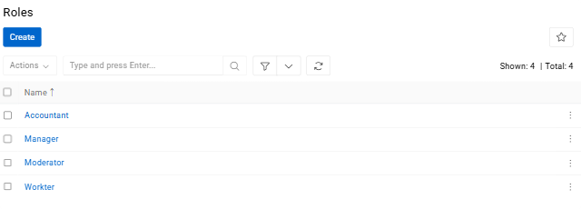
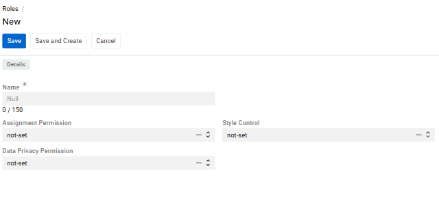
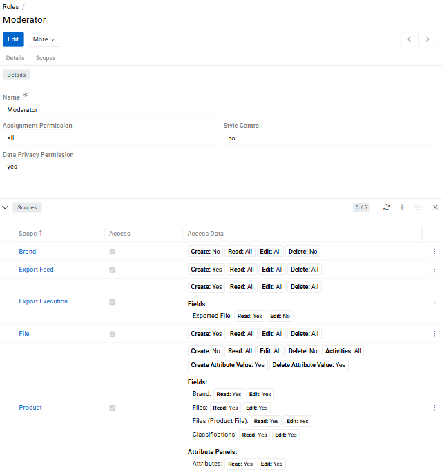
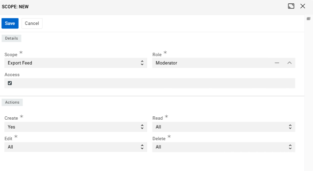
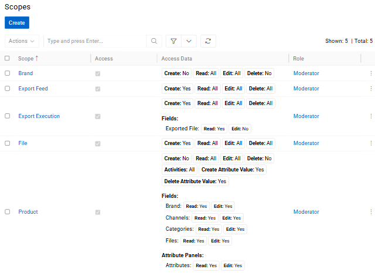
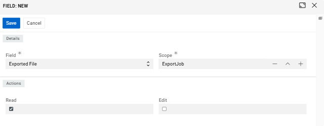
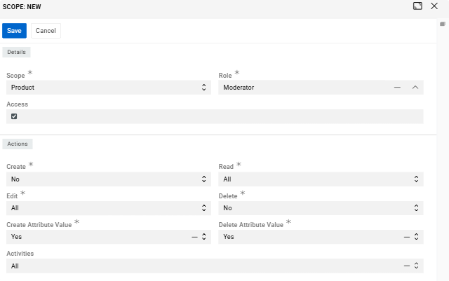
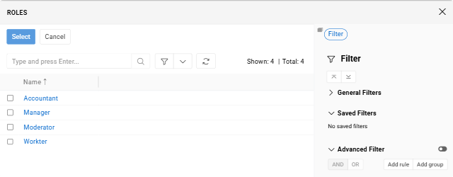

A **Role** defines what a user is allowed to do in the system. Each role contains a set of permissions that control which entities a user can see, create, edit, or delete — and at what access level. Every user is assigned one or more roles, and their total access is the combined sum of all permissions from those roles.

{.medium}

Navigate to `Administration / Roles` to see all created roles.

## Creating a Role

Click `Create` to open the role creation form.

{.medium}

- **Name** is the display name of the role used throughout the system.
- **Assignment Permission** restricts who a user can assign records to and send messages to.
- **Data Privacy Permission** controls whether the user can view and erase personal data.
- **Style Control** controls whether the user has access to style settings.

## Configuring Permissions (Scopes)

After creating a role, open its detail view to configure permissions. Permissions in AtroCore are defined through **Scopes** — each scope sets access rules for one specific entity, such as [Products](../../../../06.pim/03.products/docs.md), [Categories](../../../../06.pim/05.categories/docs.md), or [Attributes](../../12.attribute-management/01.attributes/docs.md).

{.medium}

To add a scope, click the `+` button in the **Scopes** panel.

{.medium}

- **Scope** field defines which entity the permission applies to. 
- **Role** field links it to the current role. 
- **Access** checkbox is the main switch — when unchecked, the scope is inactive and the user has no configured access to that entity. When checked, the **Actions** panel appears where you configure what the user can actually do.
 
> A role may contain multiple scopes that define permissions for different entities.  

> If several roles require permissions for the same entity (for example, Products), a separate scope must be created within each role.

### Actions

When **Access** is enabled, the following actions can be configured for the scope:

- **Create** (`Yes` / `No`) — controls whether the user can add new entries for this entity.
- **Read** (`All` / `Team` / `Own` / `No`) — controls whether the user can view entries and at what level.
- **Edit** (`All` / `Team` / `Own` / `No`) — controls whether the user can modify existing entries and at what level.
- **Delete** (`All` / `Team` / `Own` / `No`) — controls whether the user can remove entries and at what level.
- **Activities** (`Yes` / `No`) — controls whether the user can access the activity stream and history for entries of this entity.

### Access Levels

For Read, Edit, and Delete, the access level determines which specific entries the user can act upon — not just whether they can perform the action at all.

- `all` gives the user access to every entry in the system for that entity, regardless of who created it or which team it belongs to.
- `team` limits access to entries that are assigned to one of the [teams](../02.teams/docs.md) the user is a member of. This is useful for organizations where different teams manage separate sets of records and should not see each other's work.
- `own` is the most restrictive level — the user can only access entries where they are either the **Owner** or the **Assigned User**. Ownership is set automatically when a record is created; the assigned user can be set manually on each entry.
- `no` completely blocks the action, regardless of ownership or team membership.

> Entries can be assigned to one or more **Teams** directly on the record. Any user who belongs to one of those teams will be able to access the entry if their role's access level is `team` or higher.

The **Owner**, **Assigned User**, and **Teams** fields appear on records when the corresponding access control options are enabled in the [Access Management panel](../../11.entity-management/docs.md#access-management-panel).

### Viewing All Scopes

{.medium}

All configured scopes for a role are visible in the **Scopes** list. For each scope, it shows the entity name, the Access checkbox status, and a summary of all configured actions — including any field-level and attribute-level rules.

## Field Level Permissions

In addition to entity-level permissions, you can restrict access at the **field level**. This is useful when a user needs access to an entity's records but should not be able to see or change specific fields within those records.

{.medium}

To configure this, open the scope's detail view and go to the **Fields** panel. Click the dropdown to select a field available for that scope. Once a field is added, you can set two independent permissions for it: **Read** (whether the user can see the field's value) and **Edit** (whether the user can change it). Both are checkboxes — checked means the permission is granted, unchecked means it is denied.

A practical example: a data entry specialist has edit access to Products, but you don't want them touching the `SKU` or `Product Status` fields. By unchecking Edit for those fields in their role's scope, the fields remain visible but become read-only for that user specifically.

## Attribute Permissions

Scopes for entities that support attributes — such as **Product** — offer additional attribute-level permission controls.

{.medium}

When creating or editing such a scope, two additional actions appear alongside the standard ones:

- **Create Attribute Value** (`Yes` / `No`) — controls whether the user can add an attribute to records of this entity.
- **Delete Attribute Value** (`Yes` / `No`) — controls whether the user can remove an attribute from records.

Once the scope is saved and you open its detail view, two additional panels appear below the **Fields** panel:

- **Attribute Panels** represents attribute groups. It works the same way as field-level permissions — select an attribute panel from the dropdown and control `Read` and `Edit` access via checkboxes.
- **Attributes** allows you to set permissions on individual attributes. Each attribute is added the same way as a field, and you can independently check or uncheck `Read` and `Edit` for each one.

This level of control matters in real collaborative workflows. For example, a copywriter may need to edit marketing-related attributes like `Description` or `SEO Title`, but should not be able to touch technical attributes like `Weight` or `Dimensions` — even though both types live on the same product record. Attribute permissions make this separation possible without creating complex workarounds.

> If the `Edit` checkbox is unchecked for a specific attribute, that attribute will appear as read-only on the record page — even if the user otherwise has full edit access to the entity. If the `Read` checkbox is unchecked, the attribute will not be visible to that user at all.

## How Roles Interact with ACL

AtroCore includes an **Access Control List (ACL)** system that works alongside roles to determine the effective access a user has. The key setting is **ACL Strict Mode**, which controls how the system handles entities and actions that have not been explicitly configured in any role.

By default, ACL Strict Mode is **disabled**. In this state, if a user's role has no scope configured for a given entity, the user can still access it freely. This means unconfigured permissions are treated as "open by default," which can lead to users having more access than intended — especially after installing new modules that add entities to the system.

When ACL Strict Mode is **enabled**, the logic is reversed: anything not explicitly configured in a role is blocked. A user with a role that has no scope for a particular entity will not see or interact with it at all. This is the recommended setup for any production environment.

The specific case of `no` permission works the same regardless of the mode — it always explicitly blocks the user from that entity or action.

> For maximum security and predictable access control, always enable ACL Strict Mode and configure permissions explicitly for each role. See [Access Management](../docs.md#acl-strict-mode) for setup instructions.

## Assigning Roles to Users

{.medium}

Once a role is created, it becomes available when creating or editing a **User** record. A user can be assigned one or more roles — their effective permissions are the combined sum of all assigned roles. If one role grants Read access to an entity and another grants Edit access, the user will have both.

For more details on user management, see [Users](../01.users/docs.md).

## Best Practices

- **Follow the principle of least privilege.** Only grant the access a user actually needs to perform their job. Broad permissions increase the risk of accidental changes and data exposure.
- **Be careful with Delete.** It is advisable not to set the Delete access level above `own`. This way, users can only delete records they created themselves and cannot accidentally remove other people's work.
- **Use attribute permissions for collaborative product data.** When multiple roles work on the same product records, attribute-level permissions help protect critical values from being changed by the wrong person.
- **Enable ACL Strict Mode right after installation.** It is far easier to add permissions as needed than to discover that users have had unintended access for weeks.
- **Review roles when teams change.** As people move between teams or take on new responsibilities, outdated role configurations can quietly grant or restrict access in unintended ways.