Dashboards are designed for quick navigation within the AtroCore entities data displayed on separate dashlets. The dashboard is the starting page of AtroCore that can be reached any time via clicking the [Header Logo](../05.toolbar/docs.md#header-logo) located in the upper left corner of the AtroCore pages:

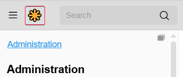{.small}

Both dashboards and dashlets are user customizable, i.e. you can add, rename and delete dashboards, as well as modify the dashlets layout. Some of dashboard and/or dashlet types can only be added after purchasing additional modules.

## Dashboards

The `My AtroCore` dashboard comes out-of-the-box and is displayed on the AtroCore starting page by default. It can be customized by adding the desired [dashlets](#dashlets) and configuring them. Some dashboard types are added by modules.

### Creating a Dashboard

It is also possible to create custom boards. To do this, click the pencil icon on the AtroCore starting page and enter the desired dashboard name in the editing pop-up that appears and hit `Enter`:

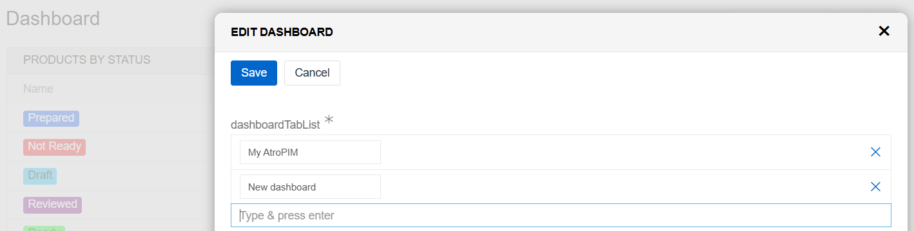{.medium}

Click the `Save` button to complete the operation or `Cancel` to abort the process.

Please, note that in the given editing pop-up you can create as many dashboards as needed, but their customization is performed separately for each dashboard.

Creating new dashboards is useful if you wish to group a different set of dashlets, consisting of certain information of the same nature or type, to help you make the right decision.

### Editing a Dashboard

To change the dashboard name, click the pencil icon and make necessary changes in the corresponding dashboard name field in the editing pop-up that appears:

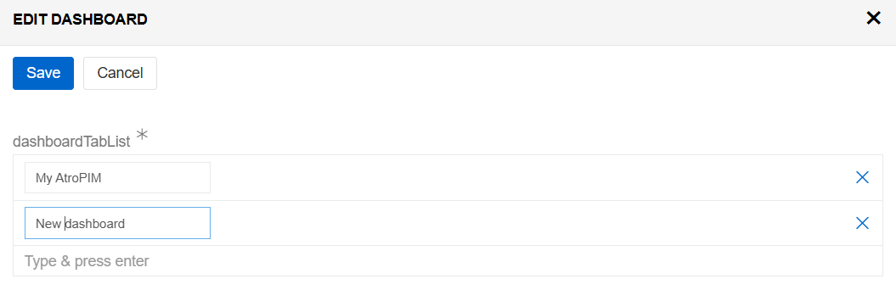{.medium}

In the given pop-up you can also remove the desired dashboard (or dashboards) by clicking the corresponding `x` button:

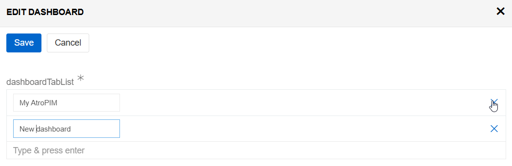{.medium}

### Switching between Dashboards

In order to switch between dashboards available in the system, click the button with the desired dashboard name located in the upper right corner of the AtroCore starting page:

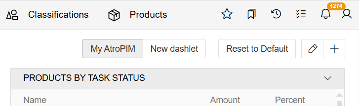{.medium}

## Dashlets

Dashlets are user-configurable blocks, which can be placed via drag-and-drop anywhere on the dashboard, giving you a quick overview of your records and activity.

Dashlets provide you with valuable information regarding records of specific entities.

### Adding a Dashlet

Use the `+` button to add as many dashlets as needed:

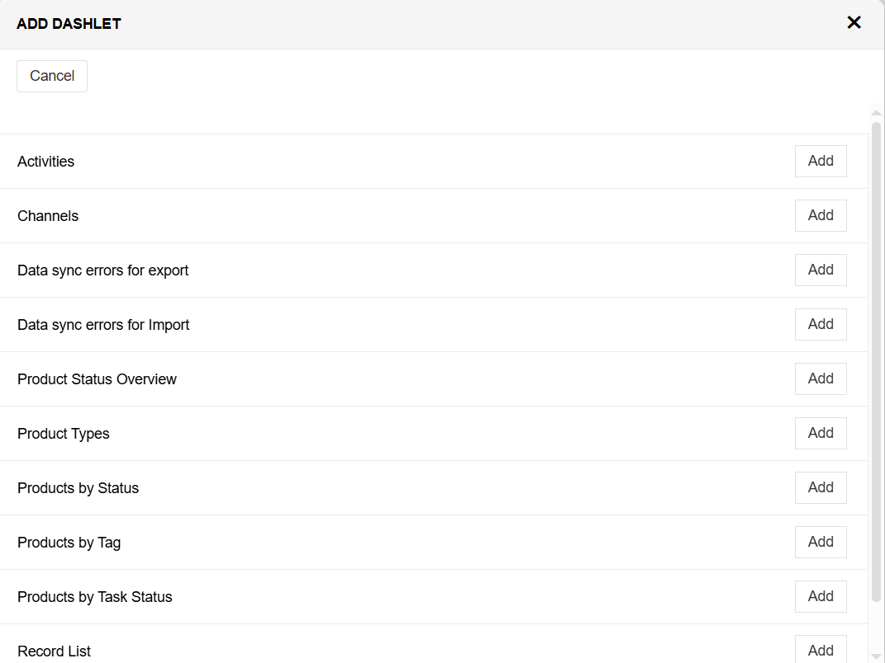{.medium}

The added dashlets can be resized using the double-headed arrow in the bottom right corner of each block:

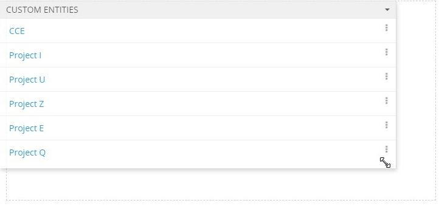{.large}

### Available Dashlets

The following dashlets are available in AtroCore:
- Activities
- Channels
- Data sync errors for export/import
- Product Status Overview
- Product Types
- Products by Status
- Products by Tag
- Record List
- First Steps
- Entities

#### Activities dashlet

This type of dashlet enables you to display a list of activities from users. It takes data from [Activities](../06.activities/) and auto-refreshes. You can also create posts from this dashlet and access Activities directly.

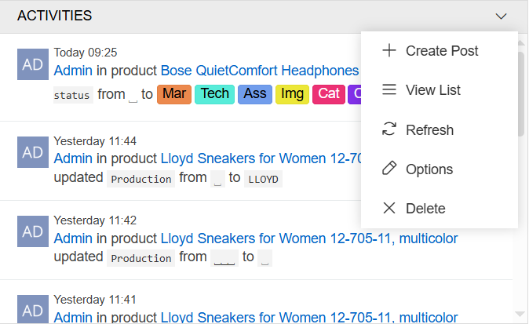{.medium}

You can customize the number of records displayed and the auto-refresh interval.

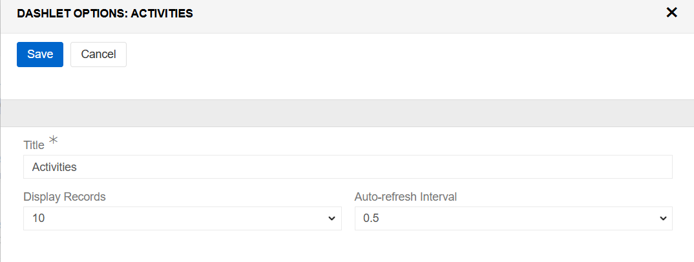{.medium}

#### Channels dashlet

This type of dashlet is a list of [channels](../../06.pim/06.channels/) containing both active and inactive products in each channel can be displayed with this type of dashboard.

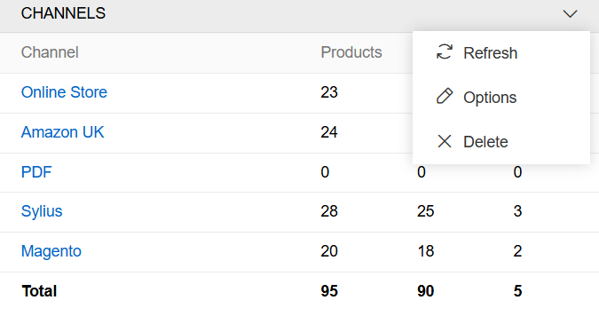{.medium}

You can customize only the auto-refresh interval.

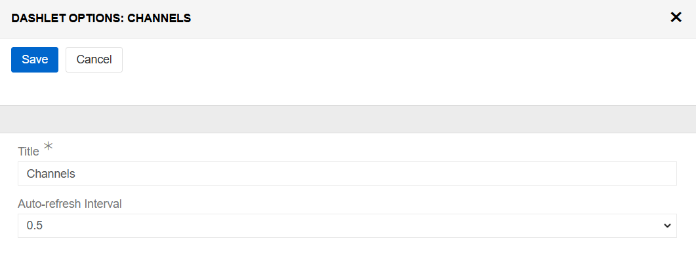{.medium}

#### Data sync errors for import dashlet

This type of dashlet displays a list of [import feeds](../../03.data-exchange/01.import-feeds/) that failed within a certain timeframe.

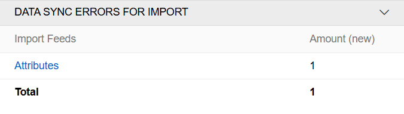{.medium}

You can customize the timeframe in hours for import feeds that failed, as well as the auto-refresh interval.

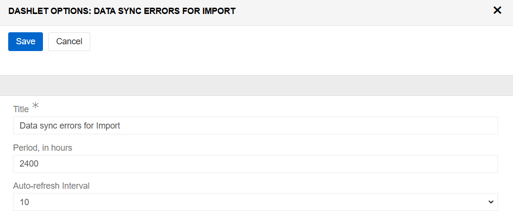{.medium}

#### Data sync errors for export dashlet

This type of dashlet functions in the same way, but is used for [export feeds](../../03.data-exchange/02.export-feeds/).

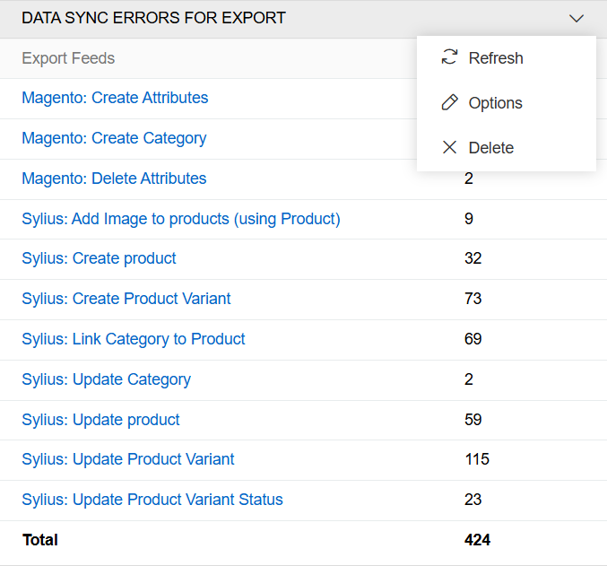{.medium}

Customization is also the same.

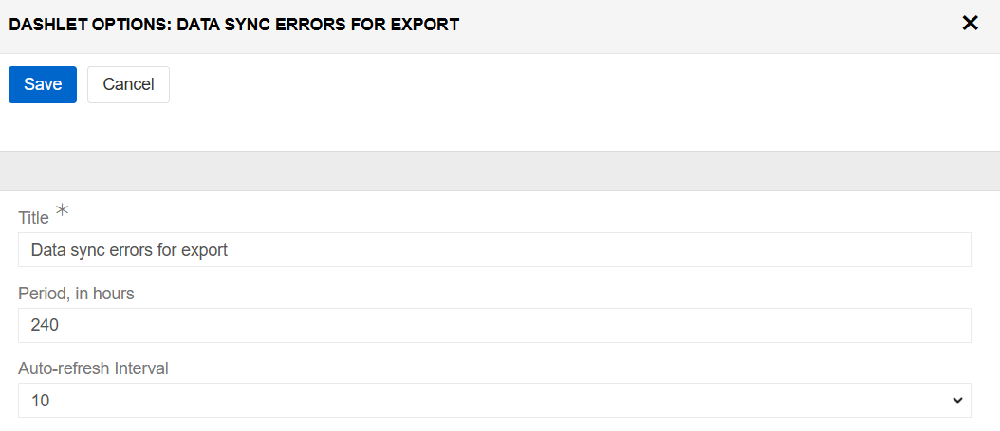{.medium}

#### Product status overview dashlet

This type of dashlet displays [products](../../06.pim/03.products/) grouped by status in the form of a pie chart.

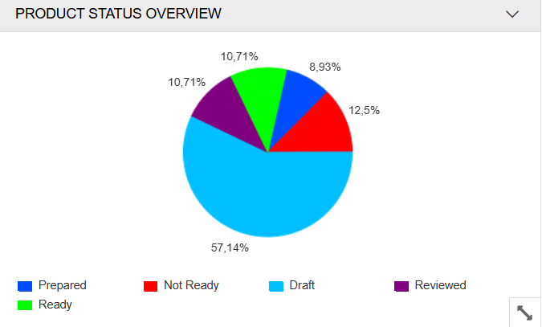{.medium}

You can customize only the auto-refresh interval.

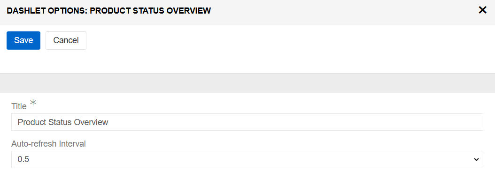{.medium}

#### Products by status dashlet

This type of dashlet works in the same way, but displays information in table format rather than as a pie chart.

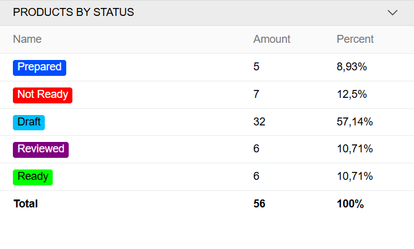{.medium}

Customization is also the same.

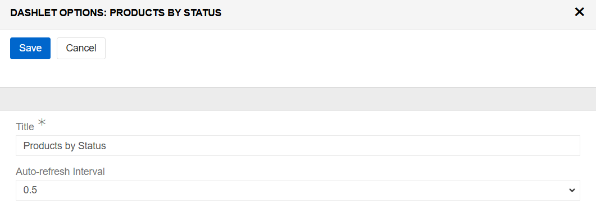{.medium}

#### Product types dashlet

This type of dashlet displays products grouped by types, such as hierarchies and bundles.

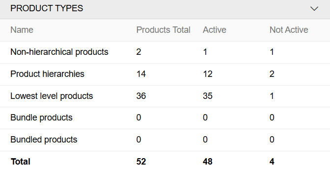{.medium}

You can customize only the auto-refresh interval.

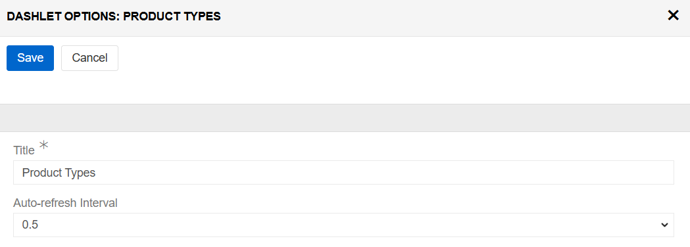{.medium}

#### Products by tag dashlet

This type of dashlet displays products grouped by tags.

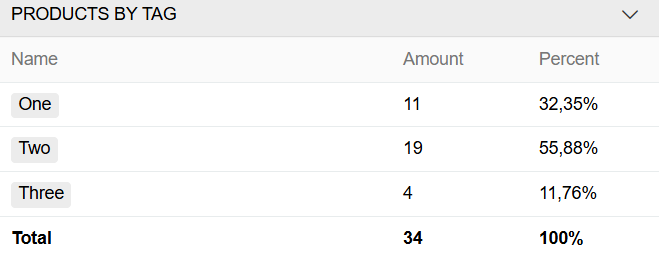{.medium}

You can customize only the auto-refresh interval.

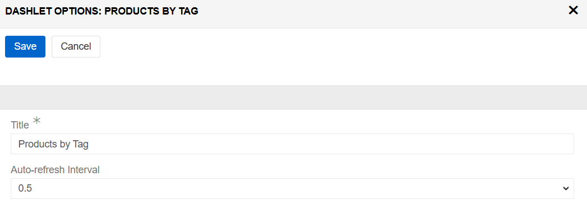{.medium}

#### Record list dashlet

This type of dashlet displays a record of the selected [entity](../03.administration/11.entity-management/) in the selected order.

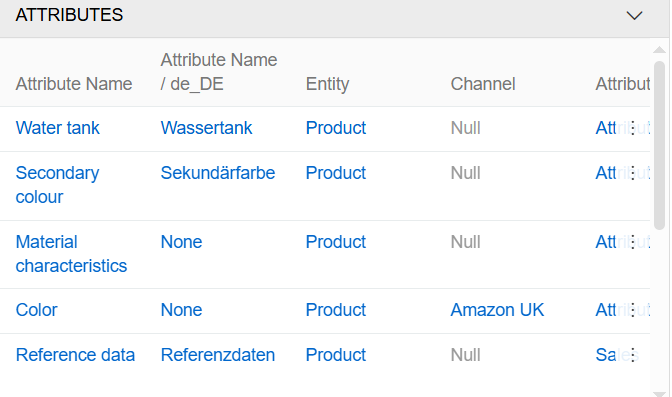{.medium}

Customization includes selecting the entity, choosing the number of records to display, selecting the order and setting the auto-refresh interval.

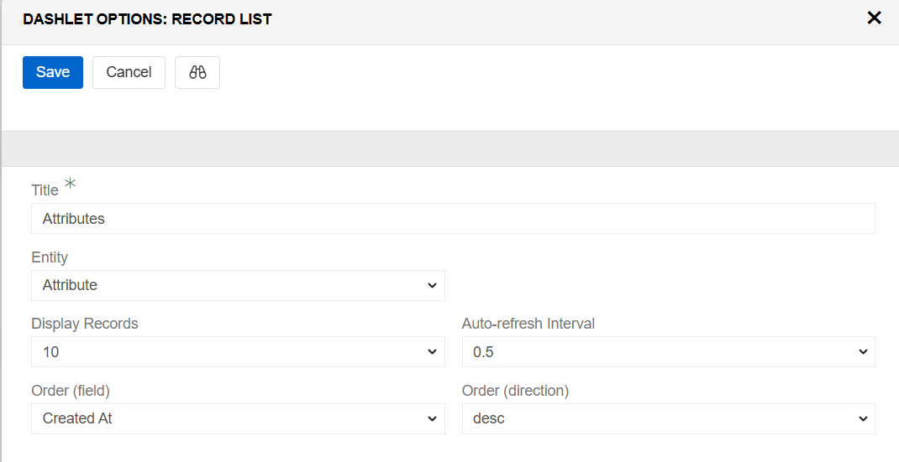{.medium}

#### First Steps dashlet

This dashlet is set up during system configuration and is intended to provide admin users with guidelines during this process. It contains links to documentation and the main entities used during this process.

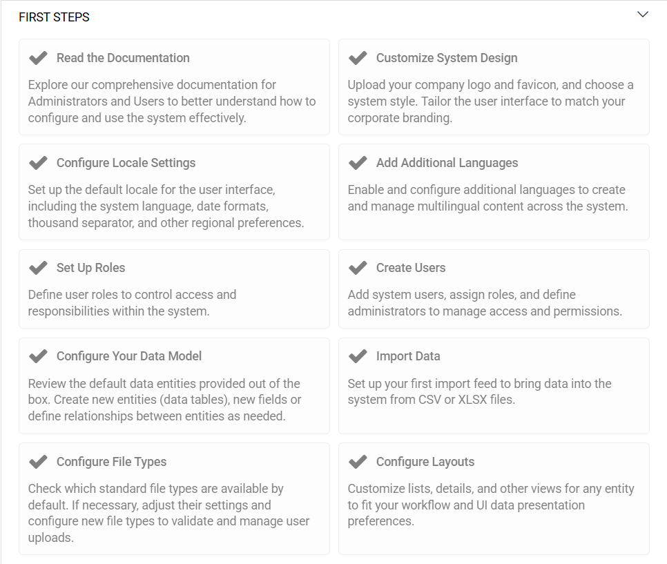{.medium}

!! We recommend removing First Steps dashlet after use. If it is left in place, it will be available to all users and cause a 403 error due to their non-admin status.

#### Entities dashlet

This dashlet displays a list of entities. The user can choose which entities to display: All, [Navigation Items](../03.administration/13.user-interface/01.navigation/docs.md) or [Favourites](../../02.atrocore/05.toolbar/02.favorites/docs.md).

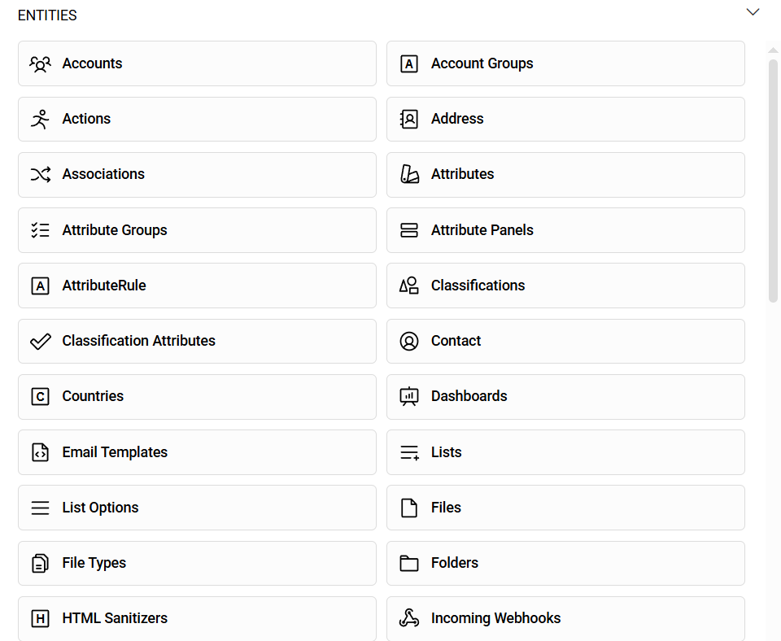{.medium}

You can customize only Entity List Type you choose to display.

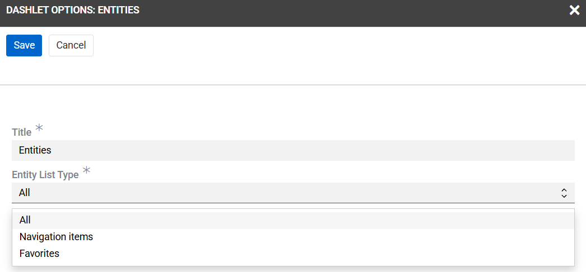{.medium}

#### Records by translation status

This type of dashlet displays the distribution of [translation statuses](../../05.collaboration/04.translations/docs.md#translation-status-field) among the entity’s records as a percentage.

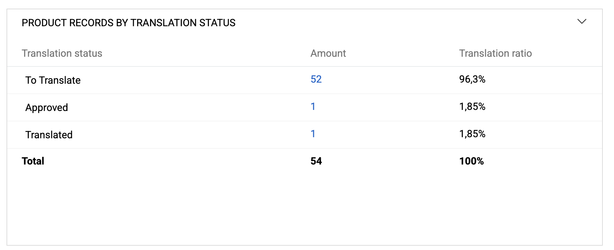{.medium}

Customization includes selecting the entity and setting the auto-refresh interval. The dashlet is added by [Translation](../../05.collaboration/04.translations/docs.md) module.
