The Import Feeds module enables bulk data import for any entity in AtroCore, including related entities and their creation. Import feeds use the AtroCore REST API, ensuring data validation follows the same rules as manual record creation.

Data import can be performed:

- **Manually** – using configured import feeds directly
- **Automatically** – via [scheduled jobs](../../01.atrocore/03.administration/05.system-jobs/01.scheduled-jobs/)

The free module supports file-based imports (CSV, Excel, JSON, XML). Additional modules extend import feed capabilities:

- [Import: Database](https://store.atrocore.com/en/import-database/20148) – MSSQL, MySQL, PostgreSQL, Oracle, HANA database imports
- [Import: HTTP Request](../08.import-feeds-http-request/) – REST API and HTTP request imports
- [Import: Remote File](https://store.atrocore.com/en/import-remote-file/20154) – automated imports from FTP, sFTP, or URL sources
- [Synchronization](https://store.atrocore.com/en/synchronization/20124) – orchestrates multiple import and export feeds for complex data exchange

## Administrator Functions

After installation, two entities are created: `Import Feeds` and `Import Executions`. These can be enabled/disabled in [navigation menu](../../01.atrocore/03.administration/13.user-interface/01.navigation/) and [favorites](../../01.atrocore/05.toolbar/02.favorites/), with [access rights](../../01.atrocore/03.administration/14.access-management/) configured as for other entities. Layout configuration is not available for these entities.

!! Users must have the following permissions configured via [Roles](../../01.atrocore/03.administration/14.access-management/03.roles/docs.md) (Scopes panel): `Import Feeds`, `Import Execution` and `Files`. Without these, feed import execution will be denied. In  [Access Control List](../../01.atrocore/03.administration/14.access-management/docs.md#acl-strict-mode) strict mode, these permissions must be granted explicitly — they are not given by default.

## User Functions

Users can work with import feeds according to their assigned role permissions after administrator configuration.

## Import Feed Creation

Navigate to **Import Feeds** and create a new import feed.

### Details Panel

Define main feed parameters:

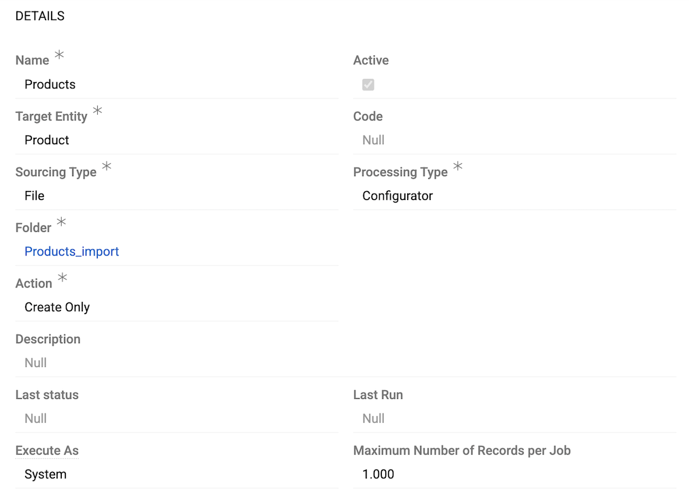{.medium}

- **Name** – import feed identifier
- **Active** – enables/disables the import feed
- **Target Entity** – select entity for imported data from available entities
- **Code** – unique import feed code
- **Sourcing Type** – import feed type (cannot be modified after creation). Default: **File**; other types are available upon installation of additional modules.
- **Processing Type** – default: **Configurator** (extensible by developers - see [Processing Type](../../10.developer-guide/50.processing-type/) for details).
- **Folder** – the [folder](../../01.atrocore/03.administration/15.file-management/docs.md#folder-management) where files created by this import feed will be stored. This field is required.  
! It is recommended to create a separate folder for each import feed to keep files organized and easier to manage.
- **Action** – defines import behavior:
    - *Create Only* – creates new records only
    - *Update Only* – updates existing records only
    - *Delete Only (found records)* – deletes records present in import data
    - *Delete Only (for not found records)* – deletes records absent from import data
    - *Create and Update* – creates new and updates existing records
    - *Create and Delete* – creates new and deletes absent records
    - *Update and Delete* – updates existing and deletes absent records
    - *Create, Update and Delete* – full synchronization
- **Description** – usage notes and reminders
- **Execute As** – user context for import execution:
    - *System* – runs with system-level permissions
    - *Same user* – runs with current user permissions.  When selected, the corresponding user appears as a link following System in the **Created** and **Modified** fields in the [Summary](../../01.atrocore/04.understanding-ui/docs.md#insights-tab) panel of the Side View for changed records.

    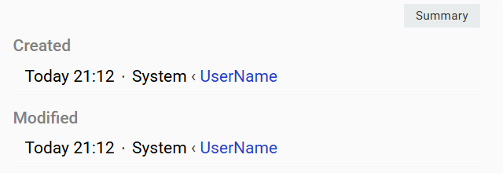{.medium}

- **Maximum Number of Records per Job** – limits records per job for performance optimization

### Data Sourcing

The `Data Sourcing` section is type-dependent—each import feed type has its own specific settings. This article describes settings for the **File** type (the default). For other types, see the respective module documentation:

- [Import: Database](https://store.atrocore.com/en/import-database/20148) – database connection and SQL query settings
- [Import: HTTP Request](../08.import-feeds-http-request/) – REST API and HTTP request settings
- [Import: Remote File](https://store.atrocore.com/en/import-remote-file/20154) – FTP, sFTP, and URL source settings

**File type settings:**

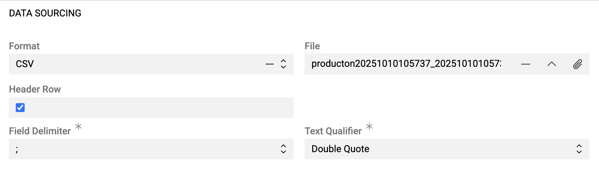{.medium}

- **Format** – file format: CSV, Excel, JSON, XML
- **File** – upload import file or sample for configuration (UTF-8 encoded)

**CSV specific:**

- **Header row** – activate the checkbox if column names are included in the import file, or leave it empty if the file has no header row with column names
- **Field Delimiter** – field delimiter used to separate fields. Options: `,`, `;`, `/t`. Default value is `;`
- **Text Qualifier** – options: `Double Quote`, `Single Quote`

**Excel specific:**

- **Sheet** – select worksheet for import
- **Header row** – activate the checkbox if column names are included in the import file, or leave it empty if the file has no header row with column names

! If the XLS file is too large to import, you can convert it to CSV.

**JSON/XML specific:**

- **Root Node** – element containing all records
- **Excluded Nodes** – elements to exclude from source fields
- **Array Nodes** – nodes treated as leaf elements

### Data Processing

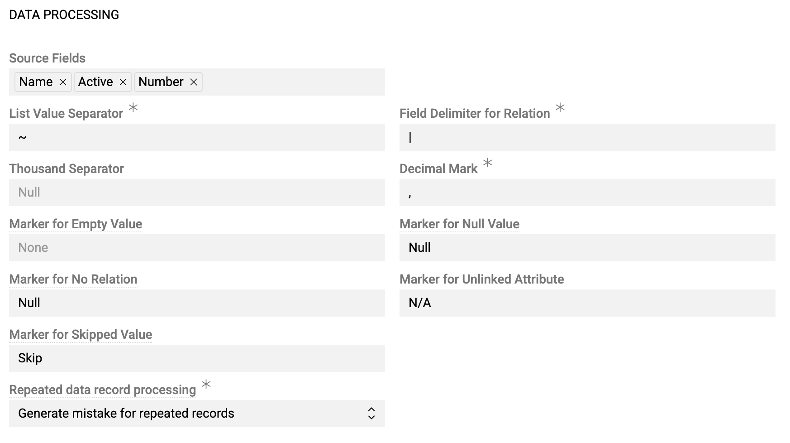{.medium}

- **Source Fields** – this field is initially empty. After uploading the file in the `Data sourcing` panel, you will see here the list of available columns from the imported file.
- **List Value Separator** – separator for multi-value fields ([Multi-value List](../../01.atrocore/03.administration/11.entity-management/02.data-types/docs.md#multi-value-list), [Array](../../01.atrocore/03.administration/11.entity-management/02.data-types/docs.md#array))
- **Field delimiter for relation** – separator for fields of related records
- **Thousand separator** – optional thousand separator symbol. Numerical values without thousand separator will also be imported (e.g., both values 1234,34 and 1.234,34 will be imported if "." is defined as a thousand separator).
- **Decimal mark** – decimal separator. Usually `.` or `,` should be defined here.
- **Marker for Empty Value** – symbol interpreted as empty value, in addition to the empty cell
- **Marker for Null Value** – symbol interpreted as NULL
- **Marking for No Relation** – symbol for unlinked relations
- **Marker for Skipped Value** – symbol to skip during import, regardless of whether it is a field or a relation
- **Repeated data record processing** – duplicate handling:
    - *Generate mistake for repeated records* – error on duplicates
    - *Allow repeated data record processing* – process duplicates. For feeds of type "Update", this results in existing data being replaced with the last processed value. If your feed allows creating new records, both duplicate records will be created.
    - *Skip repeated data records* – ignore duplicates

!! All marker and separator symbols must be different.

## Configurator

The configurator displays field mapping rules for data import. Initially empty, it populates after saving the import feed.

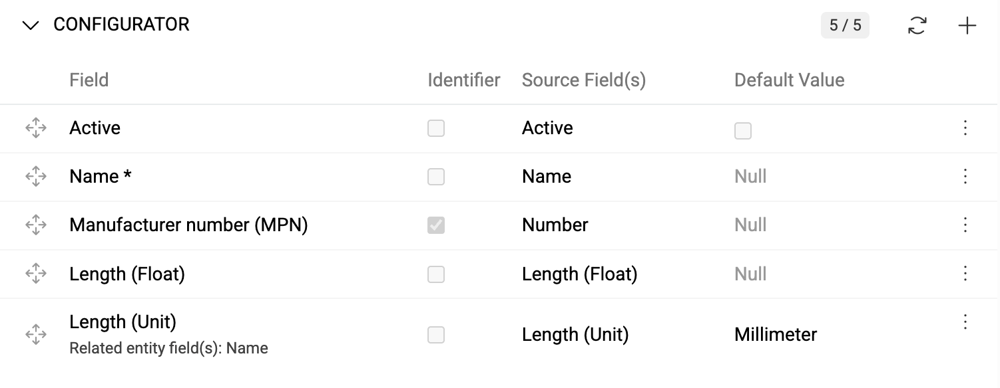{.medium}

Click `+` to create mapping rules and fill the pop-up window:

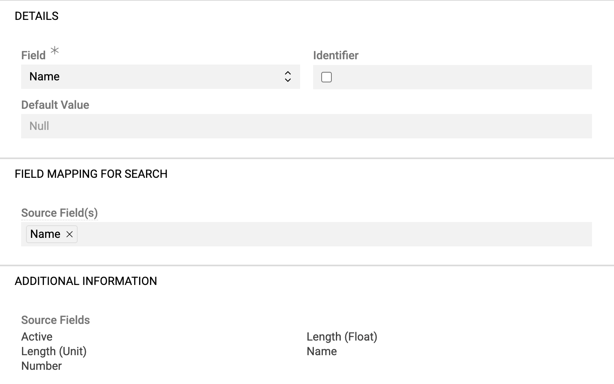{.medium}

- **Field** – target field or [attribute](#attributes) for the selected entity
- **Identifier** – marks the column value as an [identifier](#identifier)
- **Default Value** – value used when cell is empty, "empty", or "null"
- **Source Field(s)** – source columns for data

! Columns can be used multiple times in different rules.

Use [single record actions](../../01.atrocore/04.understanding-ui/docs.md#single-record-actions) to edit or delete mapping rules.

### Identifier

Define which fields serve as identifiers for record matching. Multiple identifiers can be selected and are used together for database searches. If no identifier is selected, only new records can be created (updates require identifiers).

### Default Value

Set default values for fields when source data is empty. Default values can be used without source fields to apply the same value to all records (e.g., assigning all products to a specific catalog).

### Attributes

Available for entities with enabled [attributes](../../01.atrocore/03.administration/12.attribute-management/). Select `[Add attribute]` to choose required attributes, which appear as dropdown options.

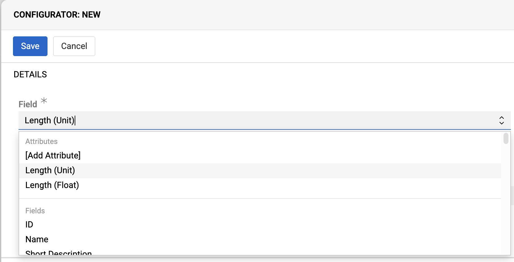{.medium}

Configure attributes like regular fields.

### Marking Attributes as Not Linked

When importing entity fields and attributes simultaneously, use `Marker for Unlinked Attribute` to explicitly mark attributes that should not be linked to records. Default: `N/A`.

Example using `---` as marker:

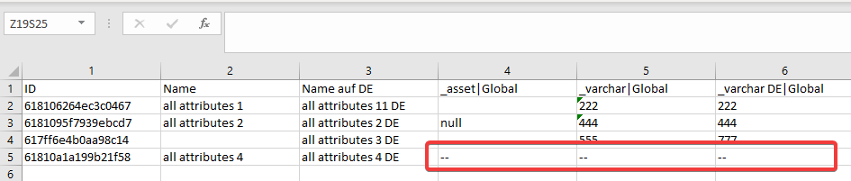{.large}

Record "all attributes 4" will not have attributes "_asset", "_varchar", and "_varchar DE" linked.

### Boolean Fields and Attributes

For [Boolean](../../01.atrocore/03.administration/11.entity-management/02.data-types/docs.md#boolean) fields/attributes:

- `0` and `False` (case-insensitive) → FALSE
- `1` and `True` (case-insensitive) → TRUE  
- Empty values → FALSE (when NULL not allowed for a field/attribute)

### Range Fields and Attributes

For [Integer Range](../../01.atrocore/03.administration/11.entity-management/02.data-types/docs.md#integer-range) and [Float Range](../../01.atrocore/03.administration/11.entity-management/02.data-types/docs.md#float-range) fields and attributes, values must be imported from two separate columns in your source file:

- One column for the `From` value (minimum value)
- One column for the `To` value (maximum value)

In the configurator, it is needed to create two separate mapping rules for each Range field/attribute: select your Range field or attribute and choose `field name (From)` and `field name (To)`.

### Multi-value List and Array Fields

Import [Multi-value list](../../01.atrocore/03.administration/11.entity-management/02.data-types/docs.md#multi-value-list) and [Array](../../01.atrocore/03.administration/11.entity-management/02.data-types/docs.md#array) values using `List Value Separator`:

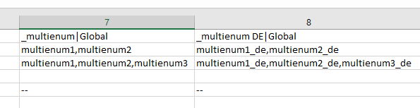.

Invalid values cause the entire row to be skipped.

### Fields with Measure Units

[Numeric](../../01.atrocore/03.administration/11.entity-management/02.data-types/docs.md#numeric-data-types)/[string](../../01.atrocore/03.administration/11.entity-management/02.data-types/docs.md#string) fields with measure units accept values like "9 cm", "110,50 EUR", "100.000 USD".

Configure two mapping rules: one for the numeric/string part and one for the unit part.

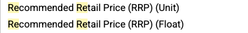

You can also define a `Value Extractor` for each part using regular expressions to extract numeric values and units from complex input strings. Enter the pattern without delimiters:

- `[\d\.,-]+` → extracts float part (e.g., 45.5 from "45.5 EUR")
- `[^\d,.\s]+$` → extracts unit (e.g., EUR from "45.5 EUR")

Non-matching values are treated as empty.

### Relations

Import feeds support all [relation types](../../01.atrocore/03.administration/11.entity-management/07.fields-and-relations/): one-to-many, many-to-one, and many-to-many. Related records can be found and linked or created during import.

Configure relations by selecting the relation name as the "Field". Choose search fields for finding related records (ID, Code, Name, etc.).

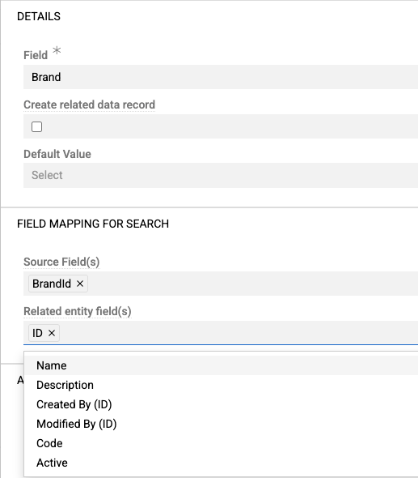{.medium}

To create missing related records, enable "Create related data record" and configure "Fields mapping for insert":

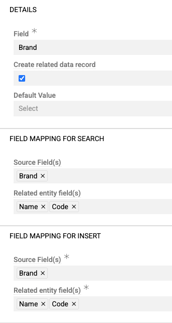{.medium}

Use `Field delimiter for relation` to separate field values in CSV cells if all data for a related record is placed in one cell:

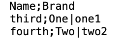{.small}

!! If related record creation fails (for example, if required fields are missing), the entire row import fails.

### Multiple Relations

Multiple relations work like simple relations but allow creating multiple relations simultaneously. Separate related records using `List Value Separator`.

Example for many-to-many product-category relations, where both products belong to categories "One" and "Two" (using the default `~` separator):

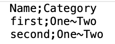{.small}

Configure related entity fields in mapping rules. Use `List Value Separator` to distinguish different records and `Field delimiter for relation` to separate fields within each record.

Missing related records can be created using "Fields mapping for insert" settings. If any relation cannot be found and creation is disabled, the entire row is skipped.

!! All relations must be provided in import data. Missing relations will be unlinked from existing records.

Example: Product A is linked with Category A. Via import feed, you provide Category B and Category C as relations for this product. After the import, Category B and C will be linked with Product A, and Category A will be unlinked because it was not provided in the import file.

### Related Files

**Recommended approach:** Import files separately using Files entity import feed, then link via identifiers during target entity import.

For URL-based file imports, configure the URL field rule. The 'Request headers' panel becomes available for authentication:

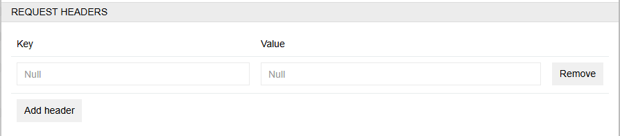{.large}

**Exception:** Product Main Image can be imported with product data. Provide image URL in the "Main Image" field, which will both create the file record and set it as the main image.

## Running Import Feed

Click `Import` to process the configured sample file:

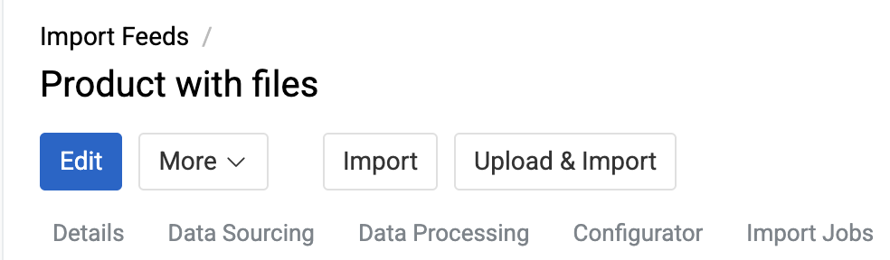{.medium}

Or use `Upload & Import` to import a new file with the same structure:

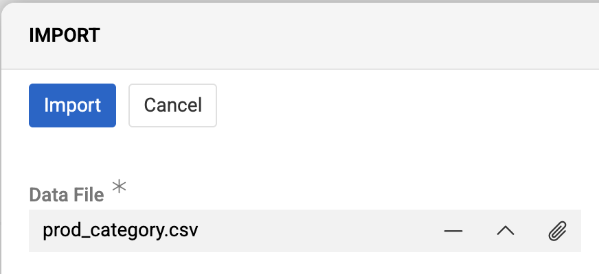{.medium}

Import jobs appear in the [Job Manager](../../01.atrocore/05.toolbar/03.job-manager/) with current status. Errors are displayed there as well.

Executions are added to the "Import Executions" panel with `Pending` status, changing to `Success` upon completion.

Cancel running imports via the right-side menu:

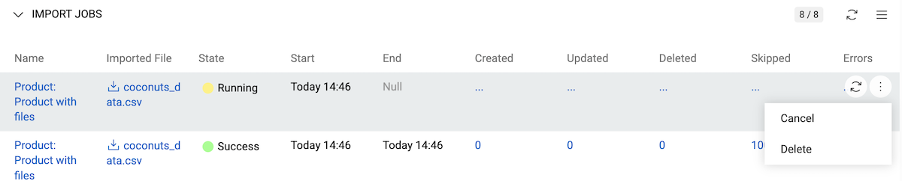{.large}

View last execution time and status on import feed [details](../../01.atrocore/04.understanding-ui/docs.md#detail-view) and [list](../../01.atrocore/04.understanding-ui/docs.md#list-view) views:

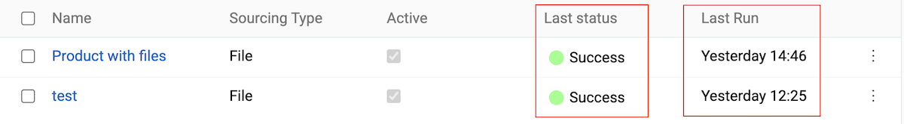{.large}

## Import Executions

Import execution results are displayed in two locations:

**Import Executions panel** (on the respective import feed):
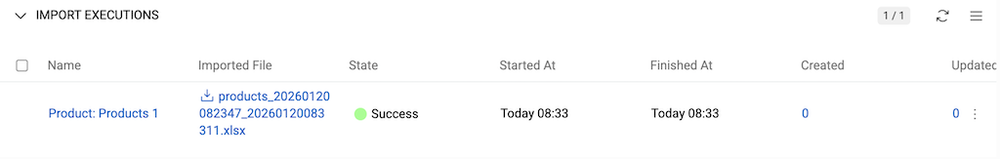{.large}

**Import Executions list view** (all system import executions):
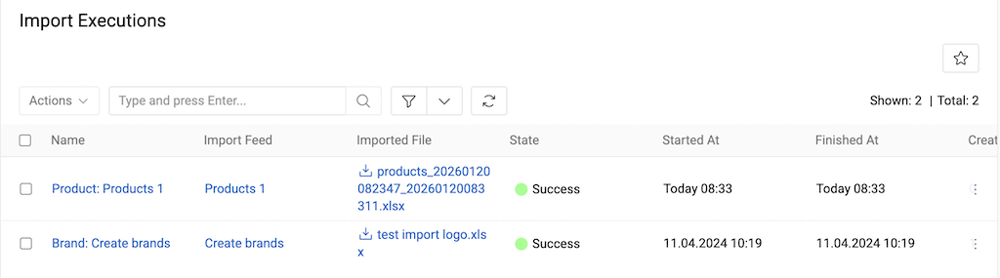{.large}

Execution details include:

- **Name** – auto-generated execution name (click to open [detail view](../../01.atrocore/04.understanding-ui/docs.md#detail-view))
- **Import feed** – source import feed name
- **Imported file** – data file name (click to open/download)
- **State** – current execution status
- **Start At/Finished At** – execution timestamps
- **Created/Updated/Deleted/Skipped** – record counts (click to view filtered lists)
- **Errors** – error count (click to view error details)

! While the import is running, counters for created, updated, or deleted records are not updated live. Click the `Refresh` button next to a running execution to view the latest counts.

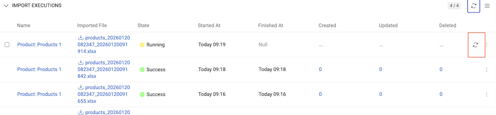{.large}

**Execution States:**

- **Running** – currently executing
- **Pending** – queued for execution
- **Success** – completed (may contain errors)
- **Failed** – technical failure
- **Canceled** – user-stopped

Use [single record actions](../../01.atrocore/04.understanding-ui/docs.md#single-record-actions) to recreate executions or remove them.

The **Recreate** action starts a new import using the same file from the selected execution. This is helpful if you imported a large file that created multiple executions and need to rerun only those that encountered errors.

### Import Execution Details

Click execution name to view details:

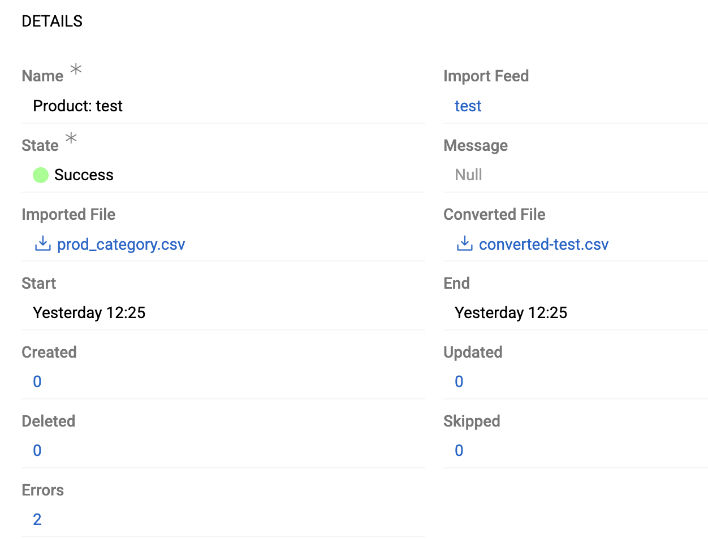{.medium}

Error messages, if any, appear in the `Errors log` panel:

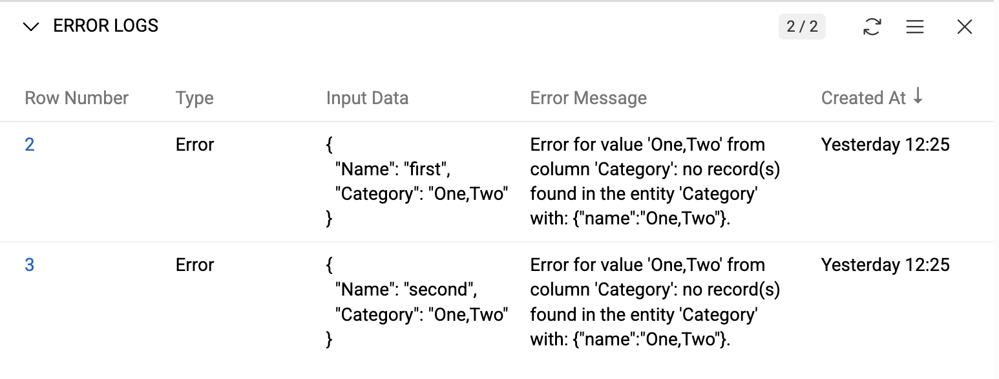{.medium}

Use `Show List` action to view all error records filtered by current execution.

### Generate Files with Import Results

To review exactly what was imported, click the file name in your Import Executions record to download the original imported file. You can also download the converted file from the Import Execution, which contains the final data that was imported after applying the import script.

For each Import execution, you can download result files for created, updated, and deleted records. Files are also available for records skipped by the import script or the system, and for any import errors.

To generate a file, open the execution's record actions menu and choose the type of result file you wish to download.

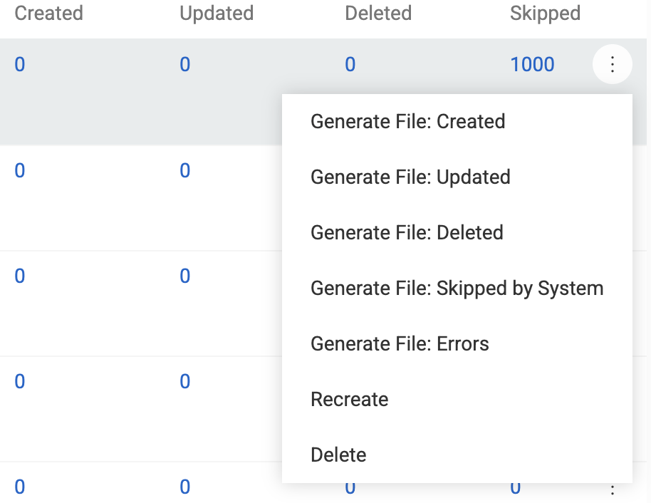{.medium}

Files download immediately and are linked in the job's Files panel.

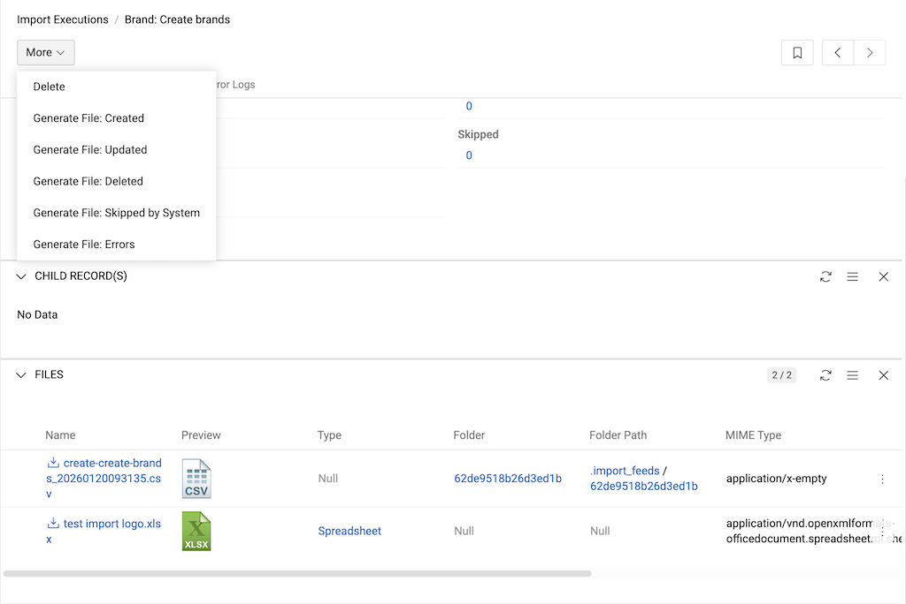{.large}

Files generated during import are linked to both their Import Feed and Import Execution (field name Import Job). You can view or filter files by these fields in the [File](../../01.atrocore/13.file-operations/docs.md) entity to trace their origin.

### Error File

Import data is validated using the same rules as manual record creation. Errors occur for:

- Missing required field values
- Wrong data types (e.g., string in Boolean field)
- Invalid field values
- Missing relations

Import processes rows completely or skips them entirely. Failed rows appear in error files with `Reason` column explaining the failure.

> Processing of a row stops at the first error detected, so an error file shows only one message per row—even if there are additional errors.

[Generate error files](#generate-files-with-import-results) to download, correct data, and reimport.

## Import Feed Actions

Standard [record management actions](../../01.atrocore/08.record-management/docs.md#single-record-actions) are available, including **duplicate** and **remove**.

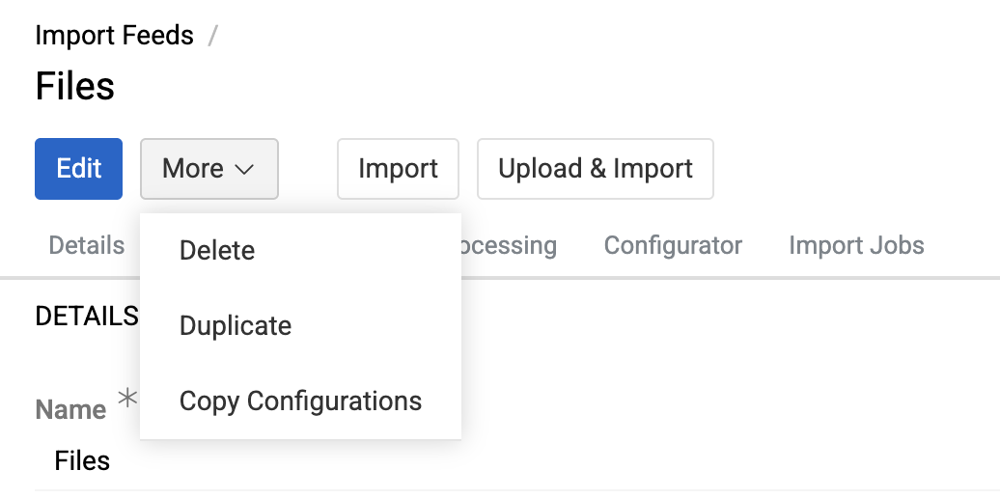{.medium}

**Duplicate** copies all values and mapping rules to a new import feed.

**Copy Configurations** exports configuration as JSON. See [Copying Feed Configurations](../11.copying-feed-configurations/docs.md) for details.

### Creating Import Feed from Export Feed

With the [Export Feed](../02.export-feeds/docs.md) module installed, create import feeds from export feeds using `Duplicate as import`:

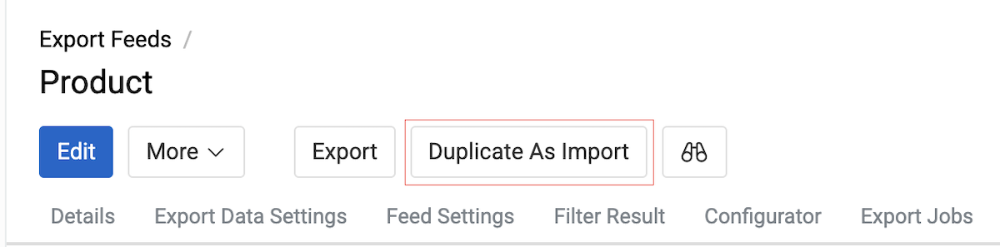{.medium}

This creates a new import feed with matching fields, format, entity, and mapping rules. Action defaults to "update only" with "(From Export)" suffix in the name.

> If an export feed is copied as an import feed, the export rule for all attributes is skipped.

!! Mapping rules for protected fields are excluded, as [protected](../../01.atrocore/03.administration/11.entity-management/03.fields-and-attributes/docs.md#protected) fields cannot be imported.
