The ["Synchronization"](https://store.atrocore.com/en/synchronization/20124?instanceId=584006b6d1d152963e684) module allows you to orchestrate multiple [Import](../01.import-feeds/docs.md) and [Export](../02.export-feeds/docs.md) feeds, of any type. You can set the sort order for the execution of your feeds, run the sequence automatically as a scheduled or event-based job, or manually, in just one click. Also it adds additional functions to export and import feeds.

## Main Functions

The "Synchronization" module was created primarily to be used together with Export and Import feeds, so further description of the module is given in the context of them.

> Menu item "Synchronizations" should be [added](../../01.atrocore/03.administration/13.user-interface/01.navigation/docs.md#adding-and-removing-items) by your Administrator. 

From there you can see all existing synchronizations, edit them, delete or create new.

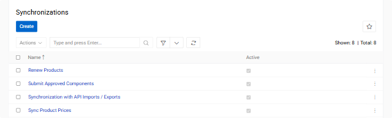{.medium}

### Creating Synchronization

To create a synchronization click `Create` button. You will see next menu

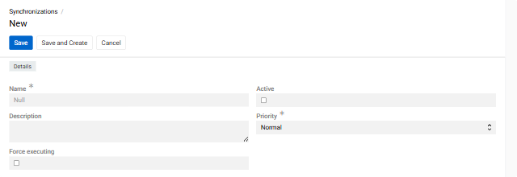{.medium}

! You can create a synchonization [Action](../../01.atrocore/03.administration/06.actions/docs.md#synchronization) to operate with your synchronization in [Scheduled jobs](../../01.atrocore/03.administration/05.system-jobs/01.scheduled-jobs/docs.md) or [Workflows](https://store.atrocore.com/en/workflows/20194).

Set the name, description and press the checkbox if you want it to be active. Then press `Save`. The menu next is the same as editing menu.

### Editing Synchronization

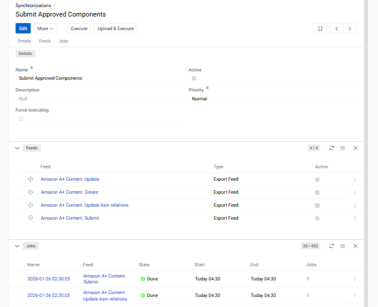{.medium}

In the `Feeds` section you can add or unlink Export or Import feeds. To add one press arrow and select `Select: Import Feed` or `Select: Export Feed` for import and export feeds apparently. To unlink one press tree dots and select `Unlink`.

You can also change the order of feeds to benefit your task. To do so, just grab and pull the feed.

### Running Synchronization Jobs

To execute all import and export jobs assigned to a Synchronization press `Execute` button. This will launch all the feeds you selected in `Feeds` section. The order of the feeds launched will be from the top feed down to the last. 
By default, feeds execute sequentially - each feed starts only after the previous one completes with a [`Success`](../../01.atrocore/03.administration/05.system-jobs/docs.md#job-statuses) status. If any feed fails, the remaining feeds in the sequence are cancelled and will not execute.

> You can override this behavior by enabling the `Force executing` checkbox in the [Detail view](../../01.atrocore/04.understanding-ui/docs.md#detail-view) of the Synchronization record. When enabled, the synchronization will continue executing all feeds in sequence even if previous feeds encounter errors, ensuring that all feeds are attempted regardless of individual feed failures.

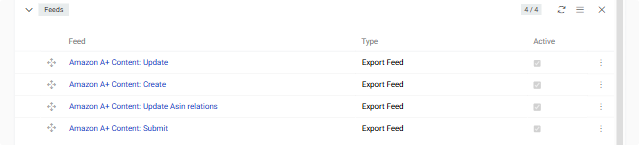{.medium}

This will make sure your intent is achieved.

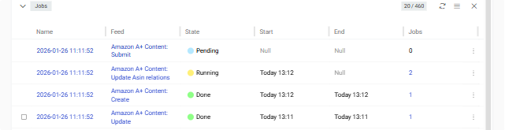{.medium}

### Synchronization Priority

Synchronizations and individual feeds both support priority settings. By default it is "Normal" - on the same level as all basic tasks. If set low or high, the respective Job will be executed with the low or high priority. The priority of the feed(s) mentioned in a synchronization is not changed, so if run without a synchronization they will refer to their own priority.

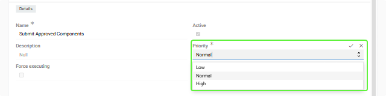{.medium}

> If the feed is run from an export of import feed then the priority of a feed takes place. If feed is run from a synchronization then priority of a synchronization takes place.

## Enhanced Import/Export Feed Features

When the Synchronization module is installed, your Import and Export Feeds gain additional capabilities. It includes additional filtering and value modifiers.

### Additional Filtering

You can filter by related fields (even one you do not export). This includes all filters you can apply by using filter in main system.

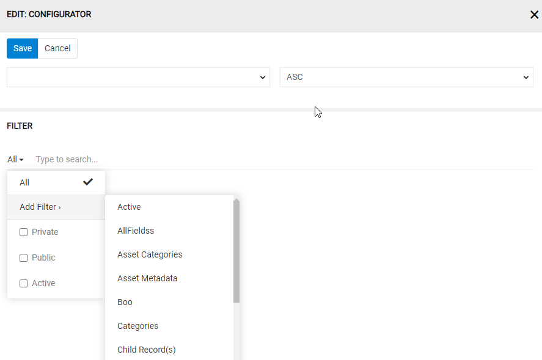{.large}

### Value Modifiers

You can modify data from your AtroCore database for a better user experience. Possible modifiers are:

| Modifier | What It Does | Example Input → Output |
|----------|--------------|------------------------|
| **preg_replace** | Uses pattern matching to find and replace parts of text. Useful for reformatting product codes, SKUs, or standardizing data patterns. | `shoes_color:preg_replace('/(\w+)(\d+),(\d+)/i', '${1}1, $3')` Input: `"RED23,45"` Output: `"RED1, 45"` |
| **date** | Converts dates into a specific format. The format is specified in parentheses using standard date formatting codes. | `release_date:date('Y-m-d')` Input: `"January 15, 2024"` Output: `"2024-01-15"` |
| **trim** | Removes extra spaces and invisible characters (tabs, line breaks) from the beginning and end of text. Cleans up messy data imports. | `brand_name:trim` Input: `"  La Maison  "` Output: `"La Maison"` |
| **lower** | Converts all letters to lowercase. Useful for creating consistent product tags or search terms. | `shoes_color:lower` Input: `"PURPLE"` Output: `"purple"` |
| **capitalize** | Makes only the first letter uppercase, all others lowercase. Good for proper names and titles. | `shoes_color:capitalize` Input: `"PURPLE"` Output: `"Purple"` |
| **title** | Capitalizes the first letter of each word, making all other letters lowercase. Perfect for product names and headings. | `product_name:title` Input: `"noble purple shoes"` Output: `"Noble Purple Shoes"` |

! You can combine multiple modifiers by chaining them together. When processing modifiers, the system applies them from top to bottom. So, in the example below you can change from " LA MAISON " to "La maison".

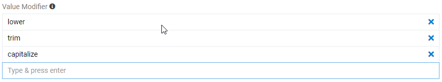{.large}

When exporting attribute values, for better display of the values you would like to modify data. To do so, in `CONFIGURATOR` for value fields ve have `Value Modifier`. As you can see on a picture below it can have multiple modifiers for multiple values. Any value can have more then one or no modifier. Value codes are used for this in formulas (see picture below).

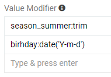{.large}

Modifiers, their description and examples are in the table under the `Value Modifier` as the one you can see on the picture below.

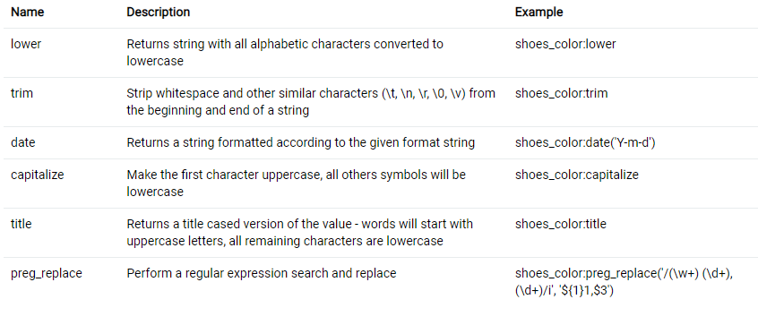{.large}

> When exporting attribute values, you can also modify them, but, because one entity can have different attributes, attribute modifiers have to be written in formulas.

### "Data sync errors" Widgets

You can monitor export and import errors by using "Data sync errors for Import" and "Data sync errors for Export" widgets by adding them to [Dashboard](../../01.atrocore/07.dashboards/docs.md) via `Add Dashlets`.

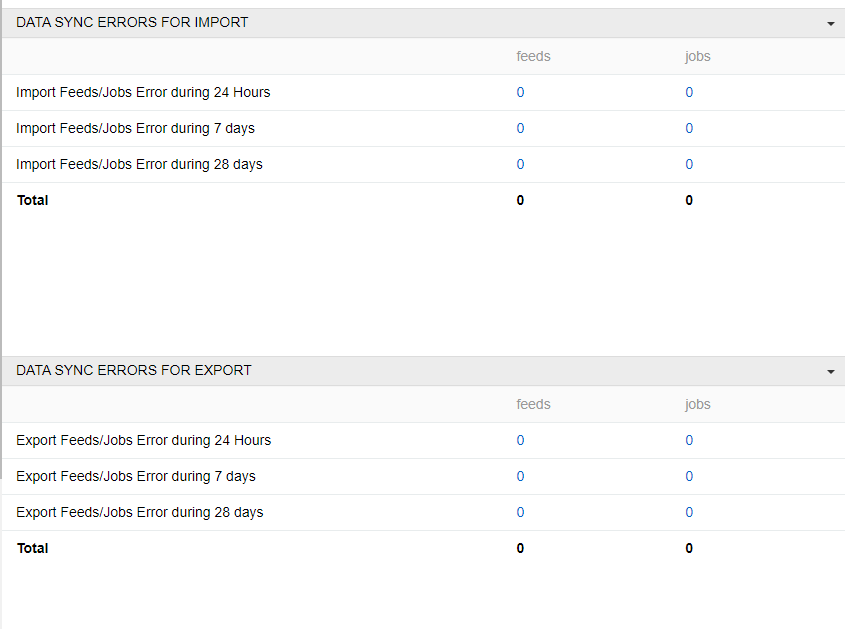{.large}

## Use Cases

The Synchronization module is designed for complex data exchange scenarios where multiple import and export feeds need to be executed in a specific order.

### Multi-Channel E-commerce Export

Export complete product catalogs to e-commerce platforms like [Shopware](https://store.atrocore.com/en/shopware-pim-erp-integration/10030.1), maintaining data consistency across multiple languages and channels. This synchronization orchestrates 16 export feeds to push a complete product catalog to Shopware: 
- categories (4 languages),
- products (4 languages),
- product relations (categories, files, channels),
- product attributes (4 languages), and configuration settings. 

By executing these feeds sequentially, the synchronization ensures that categories exist before products, products exist before their relations are created, and all dependencies are properly maintained across the export process.

### Multi-Sheet Excel Export

The Synchronization module also enables exporting data to Excel files with multiple sheets. When the "Export to Excel with multiple sheets" option is enabled in the export feed settings, you can configure multiple sheets within a single export feed. Each sheet can export data from different entities with its own filters, configurators, and settings. For example, you can create an export feed with one sheet for products, another for categories, and another for attributes - all exported to a single Excel file with one click. 

This is particularly useful for creating comprehensive data exports or reports where related information needs to be organized across multiple sheets. To do this, select the appropriate checkbox in the data feed settings.

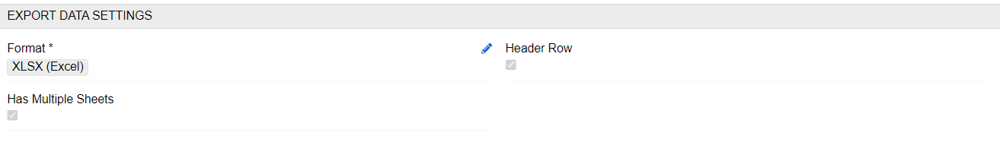{.large}

After selecting this checkbox and saving the export feed, you will see the `Sheets` panel under the `Feed settings`. To create a new sheet, click on the `+` button. The following pop-up will appear

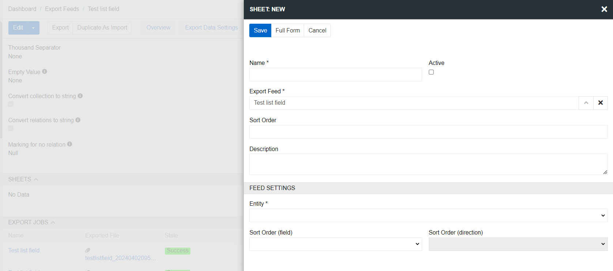{.large}

Here you can set the name of the sheet, the export feed to which it belongs, the sort order, and the entity from which the export will be performed. For the sheet to be exported, it must be Active. After you save the sheet, it will appear in the corresponding panel of the export feed.

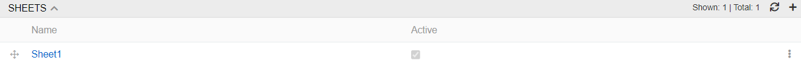{.large}

Click on an sheet to configure it. The sheet page contains the same panels as the export feed: Overview, Feed settings, Filter, Filter results and configurator.

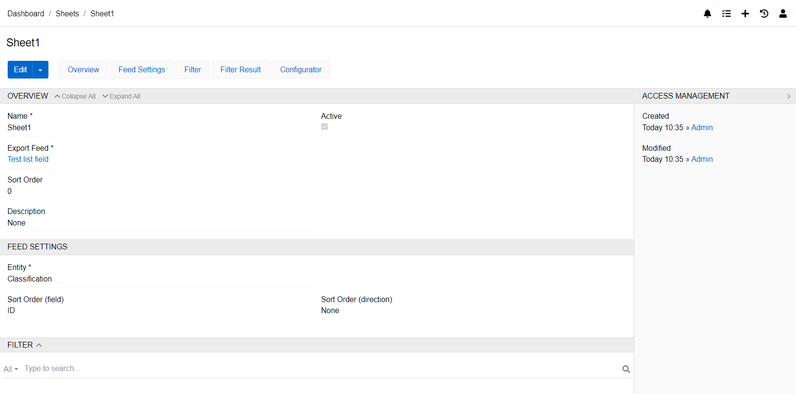{.large}

All these settings are set separately for each sheet. An excel export feed can have any number of sheets. All of them are exported with a single button to a single file.

### Remote File Processing and Scheduled Updates

Combine [Remote File](../06.import-feeds-remote-file/docs.md) import feeds to process files from different FTP/SFTP locations or network paths in a coordinated sequence. Configure synchronizations to run automatically via [Scheduled Jobs](../../01.atrocore/03.administration/05.system-jobs/01.scheduled-jobs/docs.md) for regular data updates without manual intervention. 

For example, a nightly refresh synchronization can import updated product data from an ERP system, import new asset files from a shared network drive, update product attributes from a marketing database, and export the refreshed catalog to multiple sales channels - all executed automatically in the correct sequence.