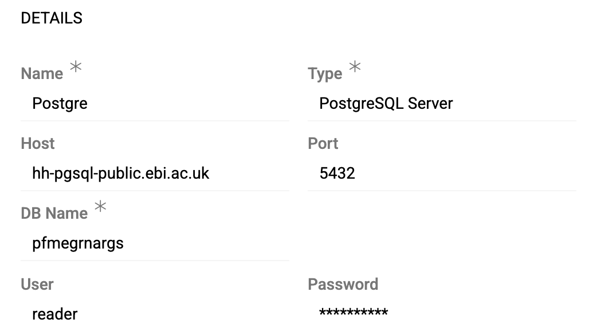
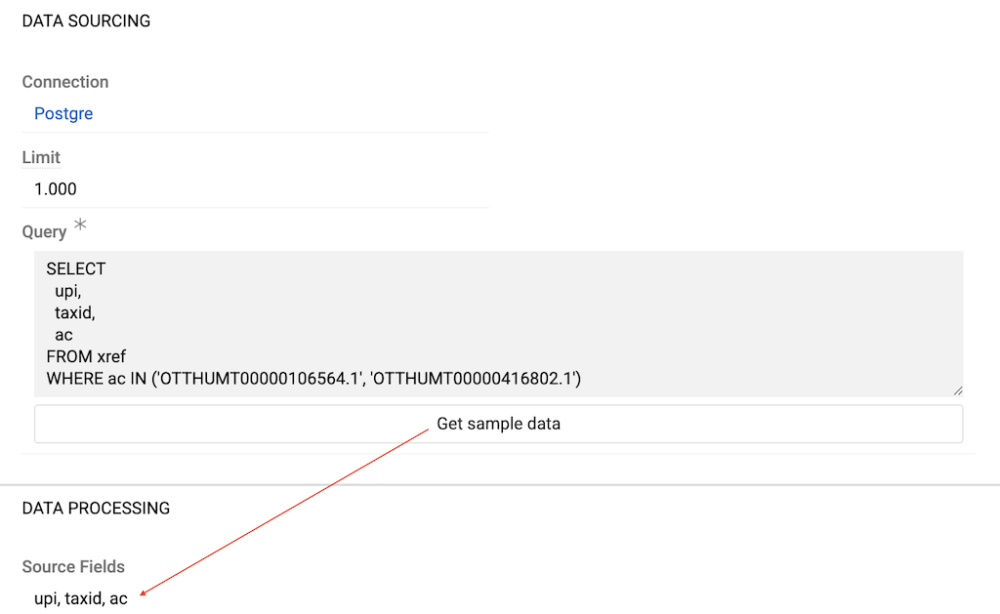

Module [Import:Database](https://store.atrocore.com/en/import-database/20148) extends [Import Feeds](../01.import-feeds/) to automate data synchronization directly from your remote databases, eliminating the need for manual file exports and uploads. 

Connect to your existing MySQL, PostgreSQL, or MSSQL databases and import data using flexible SQL queries that can join multiple tables, filter records, and transform data on-the-fly. 
Schedule regular imports via [Scheduled Jobs](../../01.atrocore/03.administration/05.system-jobs/01.scheduled-jobs/) to keep your AtroCore data synchronized automatically, ensuring your system always has the latest information without manual intervention. 

Other database types (Oracle, HANA, MariaDB, etc.) can be added upon request — contact us if needed.

> Module `Import Feeds` is required for this module to work.

## Configuration

Import feed configuration works the same for all import feed types, except for the `Data Sourcing` section which is specific to each type. See [Import Feeds](../01.import-feeds/docs.md#creating-import-feed-from-export-feed) for general import feed setup—skip the `Data Sourcing` section there as it describes file-based imports.

Create an Import Feed with `Sourcing Type` set to `Database`. In the `Data Sourcing` section:

- **Connection** – select or create a [Connection](../../01.atrocore/03.administration/04.connections/) of the required type: [MySQL](../../01.atrocore/03.administration/04.connections/docs.md#mysql-server), [PostgreSQL](../../01.atrocore/03.administration/04.connections/docs.md#postgresql-server), or [MSSQL](../../01.atrocore/03.administration/04.connections/docs.md#microsoft-sql-server). [PDO SQL](../../01.atrocore/03.administration/04.connections/docs.md#pdo-sql) connections are also available.

{.medium}

- **Limit** – the maximum number of records to retrieve per one database request

! Multiple jobs will be created if the total number of records exceeds the Limit. If the result of one request contains more rows than the `Maximum Number of Records per Job` setting, child jobs are created automatically.

- **Query** – SQL query to select data from your database. You can query a single table or join multiple tables.

{.medium}

After setting up the connection and query, click `Get sample data` to execute the query and populate the Source Fields list based on the results.

### Further Configuration

All other aspects of import feed configuration and usage are the same as for file-based imports: field mapping in the [Configurator](../01.import-feeds/docs.md#configurator), [running imports](../01.import-feeds/docs.md#running-import-feed), [import executions](../01.import-feeds/docs.md#import-executions), error handling, and all other features described in [Import Feeds](../01.import-feeds/docs.md).
