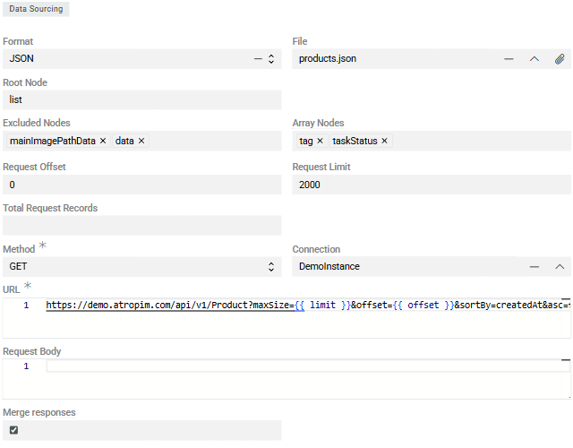
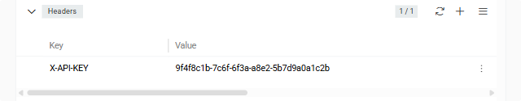

Module [Import: HTTP Request](https://store.atrocore.com/en/import-http-request/20151) extends [Import Feeds](../01.import-feeds/) to automate data imports from REST APIs and HTTP endpoints, eliminating the need for manual file downloads and uploads.

Connect to any HTTP-based data source—REST APIs, web services, or custom endpoints—and import data directly from API responses. The module supports various response formats (JSON, XML, CSV, Excel)

Schedule regular imports via [Scheduled Jobs](../../01.atrocore/03.administration/05.system-jobs/01.scheduled-jobs/) to keep your AtroCore data synchronized automatically, ensuring your system always has the latest information from external APIs without manual intervention.

> Module `Import Feeds` is required for this module to work.

## Configuration

Import feed configuration works the same for all import feed types, except for the `Data Sourcing` section which is specific to each type. See [Import Feeds](../01.import-feeds/docs.md#creating-import-feed-from-export-feed) for general import feed setup—skip the `Data Sourcing` section there as it describes file-based imports.

Create an Import Feed with `Sourcing Type` set to `HTTP Request`.

In the `Data Sourcing` section:

{.medium}

- **Format** – select the API response format: JSON, XML, CSV, or Excel. Most APIs use JSON or XML
- **File** – upload a sample response file to configure field mappings in the Configurator. This should match the structure of actual API responses
- **Request Offset** – starting record number (first record is 0). Used for paginated API requests
- **Request Limit** – maximum records to process per import job. This value is typically passed to the API's limit/pageSize parameter
- **Total Request Records** – total number of records to import across all requests. Leave blank if unknown—the import will continue until receiving an empty response

> If the total number of records exceeds the Request Limit, multiple import executions will be created automatically. If one response contains more records than the `Maximum Number of Records per Job` setting, child jobs are created automatically.

### HTTP Request Configuration

> Although you import from HTTP endpoints, you still need to upload a sample file to set up field mappings in the Configurator.

- **Method** – HTTP request method: GET, POST, PUT, PATCH, or DELETE. In most real-world import scenarios, `GET` or `POST` is used:
  - **GET** – for simple data retrieval. No request body required or supported.
  - **POST** – for imports requiring pagination, sorting, field selection, or associations. A request body is required.
- **Connection** – select or create a [Connection](../../01.atrocore/03.administration/04.connections/) entity for API authentication. This stores credentials and authorization details securely
- **URL** – the API endpoint URL. Supports [Twig syntax](../../10.developer-guide/80.twig-tutorial/docs.md) for dynamic values like pagination parameters

Example URL with Twig template:
```
https://api.example.com/products?limit={{ limit }}&offset={{ offset }}&sort=createdAt&id={{ payload.entityId }}
```

Available Twig variables:
- `{{ limit }}` – value from Request Limit field
- `{{ offset }}` – current offset for pagination
- `{{ payload.* }}` – custom variables passed to the import

- **Request Body** – request body content for POST, PUT, or PATCH requests. The structure may vary depending on the endpoint, but the core elements are usually the same. Not required for GET requests. Below is a typical example of a POST request body used for import operations:
```json
{
  "page": {{page}},
  "limit": {{limit}},
  "sort": [
    {
      "field": "productNumber",
      "order": "DESC",
      "naturalSorting": false
    }
  ],
  "includes": {
    "entity_name": [
      "field1",
      "field2"
    ]
  },
  "associations": {
    "associationName": {}
  },
  "total-count-mode": 1
}
```

- **Merge Responses** – when enabled, all paginated responses are merged into a single dataset before processing, creating one Import Execution instead of multiple

**JSON/XML specific:**
- **Root Node** – element in the response that contains all records to be imported (e.g., `data`, `items`, `results`)
- **Excluded Nodes** – elements to exclude from source fields
- **Array Nodes** – nodes treated as leaf elements—everything beneath is considered a single array value for import

### Headers

Configure custom HTTP headers required by the API (authentication tokens, content types, etc.) in the `Headers` panel:

{.medium}

Common headers include:
- `Authorization: Bearer {token}` – for token-based authentication
- `Content-Type: application/json` – for JSON request bodies
- `Accept: application/json` – to specify expected response format

! Sensitive authentication data should be stored in the Connection entity rather than directly in headers when possible.

## Further Configuration

All other aspects of import feed configuration and usage are the same as for file-based imports: field mapping in the [Configurator](../01.import-feeds/docs.md#configurator), [running imports](../01.import-feeds/docs.md#running-import-feed), [import executions](../01.import-feeds/docs.md#import-executions), error handling, and all other features described in [Import Feeds](../01.import-feeds/docs.md).