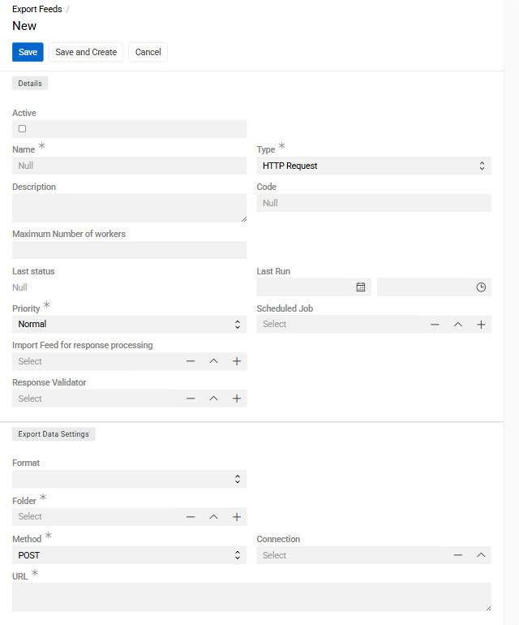
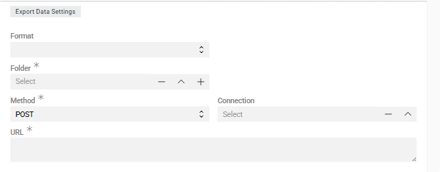
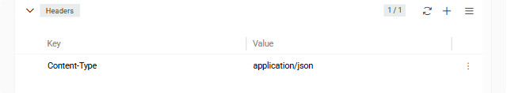

Module [Export: HTTP Request](https://store.atrocore.com/en/export-http-request/201400.1) extends [Export Feeds](../02.export-feeds/docs.md) to automate data exports by sending exported data directly to external systems via HTTP endpoints—eliminating the need to manually transfer files after export.

Connect to any HTTP-based target—REST APIs, web services, or custom endpoints—and push data directly from AtroCore without intermediate file handling. Combined with [Scheduled Jobs](../../01.atrocore/03.administration/05.system-jobs/01.scheduled-jobs/docs.md), you can fully automate recurring exports to keep external systems synchronized with your PIM data.

The key distinction of the HTTP Request type is that it is designed for API-driven integrations: data is pushed to an endpoint, and the response can be inspected and validated using a linked Import Feed and a Response Validator.

> Module `Export Feeds` is required for this module to work.

## Configuration

Export feed configuration works the same for all export feed types, except for the fields specific to each type. See [Export Feeds](../02.export-feeds/docs.md) for general setup—this guide covers only the HTTP Request-specific fields.

Create an Export Feed and set `Type` to `HTTP Request`.

{.medium}

The `Details` panel contains [fields](../02.export-feeds/docs.md#details-panel) common to all export feed types.

### HTTP Request configuration

The following fields are specific to the HTTP Request export type and appear in the `Export Data Settings` panel.

{.medium}

- **Format** – the data format in which records are serialized before being sent in the request body. Available formats are **JSON** and **XML**. For both, a `Template` field is also available for defining the output structure using [Twig syntax](../../10.developer-guide/80.twig-tutorial/docs.md).

- **Folder** – the system folder where a copy of the exported file will be stored. This is required even for HTTP exports, as a local file record is always created. It is recommended to create a dedicated folder for each export feed.

- **Method** – the HTTP method used for the request. Defaults to `POST`. Options are `GET`, `POST`, `PUT`, `PATCH`, and `DELETE`. In most export scenarios, `POST` or `PUT` is appropriate since data is being sent in the request body.

- **Connection** – select an existing [Connection](../../01.atrocore/03.administration/04.connections/docs.md) entity or create a new one. The Connection stores authentication credentials (such as API keys, tokens, or username/password) securely and separately from the feed configuration.

- **URL** – the target API endpoint. Supports [Twig syntax](../../10.developer-guide/80.twig-tutorial/docs.md) for dynamic values, enabling you to construct URLs that vary depending on the exported record or execution context.

  Example URL with Twig template:
  ```twig
  https://api.example.com/v1/products/import?token={{ connection.apiKey }}
  ```

- **Import Feed for response processing** – optionally select an Import Feed that will be used to process the HTTP response returned by the server. This is useful when the target API returns data (for example, created record IDs or validation results) that should be written back into AtroCore. Once this field is filled, an `Import Feed attachment formatter` field appears. It supports [Twig syntax](../../10.developer-guide/80.twig-tutorial/docs.md) and allows you to shape the response before it is handed off to the Import Feed.

  Example `Import Feed attachment formatter`:
  ```twig
  
  

  {{payload|json_encode|raw}}
  ```

- **Response Validator** – optionally define validation logic to inspect the HTTP response and determine whether the export succeeded. If the response does not pass validation, the export execution is marked as failed.

> Once a **Format** is selected, the **Feed Settings** panel is displayed, where you can configure the export options as described in [Feed Settings](../02.export-feeds/docs.md#feed-settings).

### Headers

Configure custom HTTP headers required by the API (authentication tokens, content types, etc.) in the `Headers` panel.

 {.medium}

## Further Configuration

All other aspects of export feed configuration and usage are the same as for file-based exports: field mapping in the [Configurator](../02.export-feeds/docs.md#configurator), [running exports](../02.export-feeds/docs.md#running-an-export-feed), [export executions](../02.export-feeds/docs.md#export-executions).

For full details on export execution states, downloaded files, and error handling, see [Export Executions](../02.export-feeds/docs.md#export-executions) in the Export Feeds documentation.