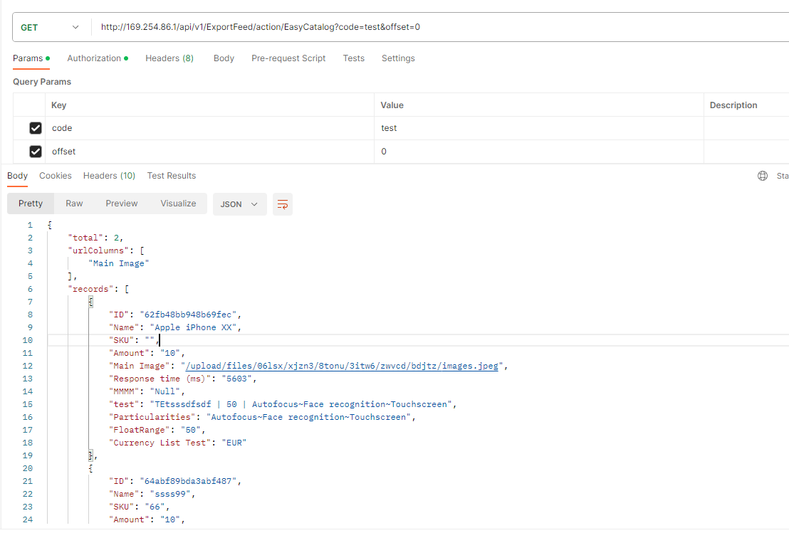
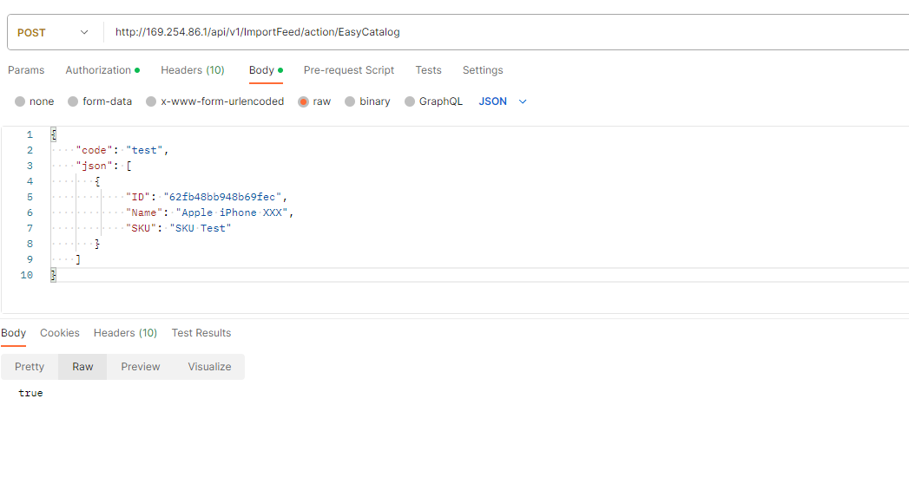

> The endpoints described on this page are provided by the **Import** and **Export** modules.

[Import](../01.import-feeds/docs.md) and [Export](../02.export-feeds/docs.md) Feeds expose REST API [endpoints](../../10.developer-guide/10.rest-api/docs.md) for data exchange. Use these endpoints to integrate AtroCore with external tools, or to set up a custom REST API endpoint by configuring a data feed.

! The ["EasyCatalog Adapter"](https://store.atrocore.com/en/indesign-pim-adapter-for-easycatalog/20157) for Adobe InDesign uses the standard Import/Export Feed REST API.

## Authentication

> **Note:** All endpoint paths are case-sensitive. Use entity and action names exactly as shown (e.g. `ExportFeed`, `ImportFeed`, `exportData`, `runImport`).

All requests require an `Authorization-Token` header. To obtain a token, send a `GET` request to `/api/App/user` with HTTP Basic authentication:

```http
Authorization: Basic <base64(username:password)>
```

The response contains `authorizationToken`. Include this value as a header in all subsequent requests:

```http
Authorization-Token: <authorizationToken>
```

## Export Feed REST API

{.large}

### Get exported data

Retrieves paginated export data from a configured Export Feed by its code. Use this endpoint to read records programmatically without triggering an asynchronous job.

```http
GET /api/ExportFeed/exportData?code=<ExportFeedCode>&offset=<offset>
Authorization-Token: <authorizationToken>
```

**Query parameters:**

- `code` – Export Feed code
- `offset` – Starting record index (default: `0`)

**Response format:**

```json
{
  "total": 100,
  "urlColumns": ["imageUrl"],
  "records": [...]
}
```

- `total` – total number of available records
- `urlColumns` – list of field names that contain asset URLs
- `records` – array of record objects

> Paginate by incrementing `offset` by the number of records returned in each response, until `offset >= total`.

### Trigger export using a saved Export Feed

Schedules an asynchronous export job based on an existing Export Feed configuration.

```http
POST /api/ExportFeed/<ExportFeedId>/exportFile
Authorization-Token: <authorizationToken>
```

- `ExportFeedId` – ID of the Export Feed record

**Response:** `true` if the export job was created successfully, `false` otherwise.

### Trigger ad-hoc export without a saved feed

Generates an export file directly for selected records and fields, without requiring a pre-configured Export Feed. Supports simple field types only — for complex export requirements, configure a dedicated Export Feed and use `exportFile` instead.

```http
POST /api/ExportFeed/directExportFile
Authorization-Token: <authorizationToken>
Content-Type: application/json
```

**Request body:**

```json
{
  "scope": "Product",
  "fileType": "csv",
  "fieldList": ["name", "sku", "price"],
  "entityFilterData": {
    "byWhere": true,
    "selectData": {
      "select": "id,name"
    },
    "where": [
      {
        "type": "isNotNull",
        "attribute": "name"
      }
    ]
  }
}
```

- `scope` – entity type to export (e.g. `"Product"`)
- `fileType` – output format: `"csv"` or `"xlsx"`
- `fieldList` – list of fields to include in the export
- `entityFilterData` – filter configuration to limit which records are exported

**Response:** `true` if the export job was created successfully, `false` otherwise.

### Verify Export Feed configuration

Checks that the Export Feed identified by its code is correctly configured and contains a required ID column.

```http
GET /api/ExportFeed/verifyFeedByCode?code=<ExportFeedCode>
Authorization-Token: <authorizationToken>
```

**Query parameters:**

- `code` – code of the Export Feed to verify

**Response:** a result object indicating whether the feed configuration is valid.

## Import Feed REST API

{.large}

### Trigger import using a saved Import Feed and a file

Schedules an asynchronous import job based on an existing Import Feed configuration and a previously uploaded file attachment.

```http
POST /api/ImportFeed/action/runImport
Authorization-Token: <authorizationToken>
Content-Type: application/json
```

**Request body:**

```json
{
  "importFeedId": "<ImportFeedId>",
  "attachmentId": "<AttachmentId>"
}
```

- `importFeedId` – ID of the Import Feed record
- `attachmentId` – ID of the uploaded file to import

**Response:** `true` if the import job was created successfully, `false` otherwise.

### Import inline JSON data

Imports records provided directly in the request body, using the configuration of a named Import Feed.

```http
POST /api/ImportFeed/action/importData
Authorization-Token: <authorizationToken>
Content-Type: application/json
```

**Request body:**

```json
{
  "code": "<ImportFeedCode>",
  "json": [
    { "ID": "record-id-1", "fieldName": "value" },
    { "ID": "record-id-2", "fieldName": "value" }
  ]
}
```

- `code` – code of the Import Feed to use
- `json` – array of record objects to import

**Response:** `true` if the import was accepted successfully, `false` otherwise.

### Verify Import Feed configuration

Checks that the Import Feed identified by its code is correctly configured and contains a required ID column.

```http
GET /api/ImportFeed/action/verifyFeedByCode?code=<ImportFeedCode>
Authorization-Token: <authorizationToken>
```

**Query parameters:**

- `code` – code of the Import Feed to verify

**Response:** a result object indicating whether the feed configuration is valid.
