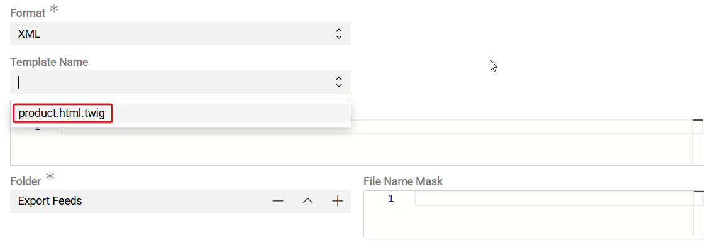
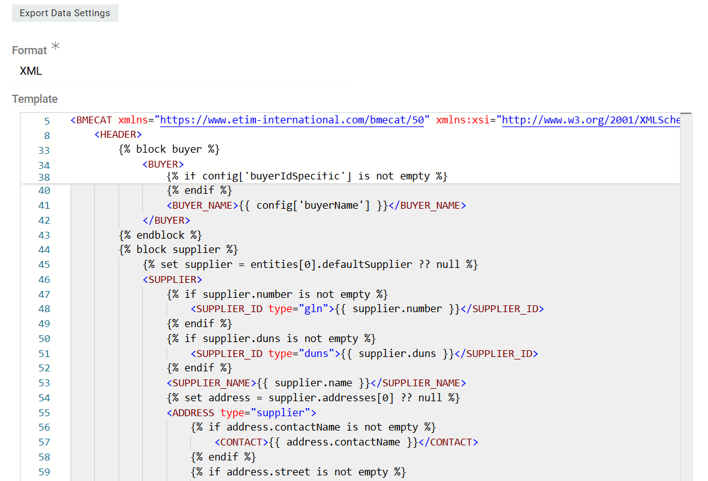

The BMEcat Adapter module enables exporting product data in the BMEcat format, a standardized XML-based exchange format widely used for electronic catalog management and product data exchange between suppliers, manufacturers, marketplaces, and procurement systems.

The module provides a predefined export template that transforms product and attribute data into a structure compliant with BMEcat requirements.

# Prerequisites

Before exporting data in BMEcat format, ensure that the following modules are installed:
- BMEcat Adapter
- Export Feeds

# How to Export via BMEcat Adapter

- Navigate to Export Feeds.
- Create a new Export Feed.
- Configure the feed as follows:
    - Format: XML
    - Template Name: product.html.twig

{.medium}

When the product.html.twig template is selected, the system automatically loads a predefined Twig script provided by the BMEcat Adapter module.

{.large}

The template transforms exported product data and attribute values into a structure compatible with BMEcat specifications. This includes formatting fields, converting values where necessary, and generating the required XML structure.

- Configure the remaining export feed settings as required, including entity selection, filters, and output location.
- Save the Export Feed.
- Execute the export.

After execution, the generated XML file will contain product data formatted according to the BMEcat standard.