The **Export Feeds** module enables structured, configurable data export from AtroCore. An export feed is a reusable template that defines which entity data to export, in what format, and with what field mapping.

With the help of the **Export Feeds** module, data export from the AtroCore system is performed in accordance with the export templates that can be further configured and customized, as well as reused at different time intervals.

Data export can be performed:

- **Manually** – by running configured export feeds directly
- **Automatically** – via [Scheduled Jobs](../../02.atrocore/03.administration/05.system-jobs/01.scheduled-jobs/docs.md#export-feed) or [Workflows](../../05.collaboration/01.workflows/docs.md)

The base module supports file-based exports (CSV, Excel, JSON, XML, SQL). Additional modules extend export feed capabilities:

- [Export: HTTP Request](../09.export-feeds-http-request/docs.md) – exports data via HTTP request.
- [Export: Remote File](../07.export-feeds-remote-file/docs.md) – exports files to FTP, sFTP, or SSH servers.
- [Export: Database](../05.export-feeds-database/docs.md) – exports data to MSSQL, MySQL, PostgreSQL, Oracle, or HANA databases.
- [Synchronization](../03.synchronization/docs.md) – orchestrates multiple import and export feeds for complex data exchange.

## Administrator Functions

> Users can work with export feeds according to their assigned role permissions after administrator configuration.

After installation, two entities are created: `Export Feeds` and `Export Executions`. These can be enabled or disabled in the [navigation menu](../../02.atrocore/03.administration/13.user-interface/01.navigation/) and [favorites](../../02.atrocore/05.toolbar/02.favorites/), with [access rights](../../02.atrocore/03.administration/14.access-management/) configured as for other entities. Layout configuration is not available for these entities.

!! Users must have the following permissions configured via [Roles](../../02.atrocore/03.administration/14.access-management/03.roles/docs.md) (Scopes panel): `Export Feeds`, `Export Execution` and `Files`. Without these, feed export execution will be denied. In  [Access Control List](../../02.atrocore/03.administration/14.access-management/docs.md#acl-strict-mode) strict mode, these permissions must be granted explicitly — they are not given by default.

## Export Feed Creation

Navigate to **Export Feeds** and click `Create`. Enter a name, select a type, and define the owner. The default type is **File**. To export to other destinations, install the corresponding module.

{.medium}

### Details Panel

{.medium}

- **Name** – export feed identifier.
- **Active** – enables or disables the export feed.
- **Type** – set at creation; cannot be changed afterward. Available types depend on installed modules.
- **Code** – unique export feed code.
- **Description** – optional usage notes and reminders.
- **Maximum Number of Records per Iteration** – maximum number of rows exported per iteration.
- **Separate Job per Iteration** – when enabled, each iteration runs as an independent export job.
- **Maximum Number of Workers** – number of workers that can execute this feed in parallel; if not set, all available workers are used.
- **Replace Existing File** – when enabled, the previously exported file is replaced on each run.

Module-specific fields:
- **Priority** – execution priority: `Low`, `Normal`, or `High`. Available with the [Synchronization](../03.synchronization/docs.md) module.
- **Scheduled Job** – links the feed to a [Scheduled Job](../../02.atrocore/03.administration/05.system-jobs/01.scheduled-jobs/docs.md) for automated execution.

### Export Data Settings

{.medium}

> The fields in this panel vary depending on the selected `Type`.

For type-specific configuration, see:
- [Export: Database](../05.export-feeds-database/docs.md)
- [Export: HTTP Request](../09.export-feeds-http-request/docs.md)
- [Export: Remote File](../07.export-feeds-remote-file/docs.md)

! It is recommended to create a dedicated folder for each export feed to keep files organized.

**General fields:**

- **Format** – output file format: **CSV**, **Excel**, **JSON** or **XML**. The **SQL** format is intended for use with the [Export Database](../05.export-feeds-database/docs.md) module.
- **Folder** – [folder](../../02.atrocore/03.administration/15.file-management/docs.md#folder-management) where exported files will be stored. Required.
- **File Name Mask** – filename template using [Twig syntax](../../11.developer-guide/80.twig-tutorial/docs.md)

> Configuration fields vary by selected format.

**CSV and Excel:**

- **Header Row** – when enabled, column names are included in the first row. Enabled by default for Excel.
- **Has Multiple Sheets** – enables multi-sheet Excel export. Requires the [Synchronization](../03.synchronization/docs.md) module. See [Multi-Sheet Excel Export](../03.synchronization/docs.md#multi-sheet-excel-export).

CSV-specific:
- **Field Delimiter** – field separator: `;`, `,`, or `\t`.
- **Text Qualifier** – value enclosure: single or double quotes.
- **Use Quotes for All Values** – when enabled, all values are quoted; otherwise only multi-word text values are quoted.

**XML and JSON:**

- **Template** – output structure defined using [Twig syntax](../../11.developer-guide/80.twig-tutorial/docs.md).
- **Template Name** – select a predefined Twig template.

### Feed Settings

{.medium}

- **Entity** – entity whose records will be exported.
- **Sort Order (Field)** – field used to sort exported records.
- **Sort Order (Direction)** – `ASC` (smallest first) or `DESC` (largest first).
- **Locale** – determines the locale used for localized data export defines with [Locale](../../02.atrocore/03.administration/02.locales/docs.md).

**CSV and Excel:**

- **Marker for Empty Value** – symbol interpreted as an empty value in addition to empty cells.
- **Marker for Null Value** – symbol interpreted as NULL.
- **Marker for No Relation** – label used when a relation is not linked.
- **Marker for Unlinked Attribute** – label used when a channel-specific attribute value is not set.
- **Convert Collection to String** – converts multi-enum, array, and one-to-many relation fields to string.
- **Convert Relations to String** – converts related entity fields to string.
- **List Value Separator** – delimiter for values within list fields.
- **Field Delimiter for Relation** – separator for fields within a relation string.
- **Maximum Depth of Relations to Show** – maximum depth of related entity fields to include.

!! All marker and separator symbols must be different.

Click `Save` to complete the creation.

> To configure the feed, open it and click `Edit`. Inline editing is also supported via the pencil icon next to each editable field.

## Configurator

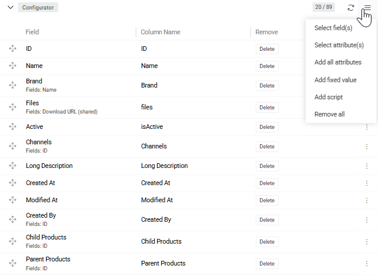{.medium}

> Accessible from the [detail view](../../02.atrocore/04.understanding-ui/docs.md#detail-view) of the export feed after the feed is saved.

The `Configurator` panel defines which fields and attributes are included in the export and in what order. Use the panel menu to add items:

- **Select Field(s)** – opens the `Entity Fields` window to select entity [fields](../../02.atrocore/03.administration/11.entity-management/03.fields-and-attributes/docs.md).
- **Select Attribute(s)** – opens the `Attributes` window to select entity [attributes](../../02.atrocore/03.administration/12.attribute-management/01.attributes/docs.md) (available for entities that support attributes).
- **Add All Attributes** – adds all attributes linked to the entity at once.
- **Add Fixed Value** – adds a constant value column to the export.x`
- **Add Script** – adds a computed column using [Twig syntax](../../11.developer-guide/80.twig-tutorial/docs.md).
- **Remove All** – removes all items from the configurator.

### Field Configuration

Each configurator item has a **Column** setting, which defines the column header name in the output file. Additional settings depend on the field type.

Added items are displayed as a list with `Field`, `Column Name`, and `Remove` columns. Use the single record actions menu on each item to edit its configuration.

> Fields order in the export file is controlled via drag-and-drop in `Configurator`.

### Attributes

Attributes can be added to the export in two ways:

- **Select Attribute(s)** – opens the `Attributes` window to pick one or more specific attributes.
- **Add All Attributes** – adds all attributes linked to the entity at once, which can then be filtered by [channel](../../06.pim/06.channels/docs.md).

**Channel** – filters which attribute values are included based on channel assignment:
  - *No channel selected* – exports only attribute values not assigned to any channel; channel-specific values are excluded.
  - *Single channel selected* – exports values without a channel and values assigned to the selected channel.
  - *Multiple channels selected* – exports values without a channel and values assigned to any of the selected channels.

{.medium}

### Script Type in Configurator

{.large}

The Script type allows exporting computed values using [Twig syntax](../../11.developer-guide/80.twig-tutorial/docs.md). The script has access to the current record via the `record` variable.

Example — exporting the `From` value for Range attributes and the option code for List attributes:
```twig

  {{ record.valueFrom }}

  {{ record.valueOptionData.code }}

```

### Units in Configurator

For fields or attributes that contain unit values, the following export options are available:
- **Script** – exports the full value (numeric + unit name).
- **Value (Numerical)** – exports only the numeric part.
- **Value Unit** – exports only the unit (name, code, or other unit identifier).

### Exporting Files/Images

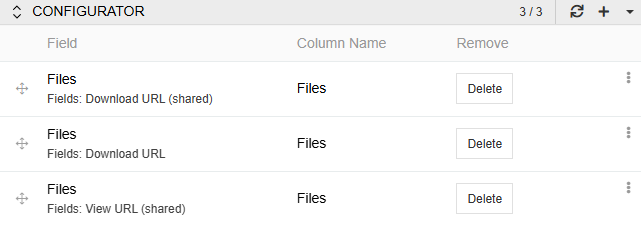{.large}

For files fields, three URL types are available:

- **Download URL (Shared)** – publicly accessible download link; no authorization required.
- **Download URL** – download link that requires authorization.
- **View URL (Shared)** – publicly accessible URL for viewing the image directly in a browser.

{.large}

### Export Files to ZIP Archive

When exporting entities that contain Files fields (e.g., Product, Brand), files can be bundled into a ZIP archive alongside the data file. The archive contains the exported data file and one folder per file field, named after that field.

To enable this, check **Export Files to a ZIP Archive** on the relevant configurator item. This checkbox appears only when the selected field contains files.

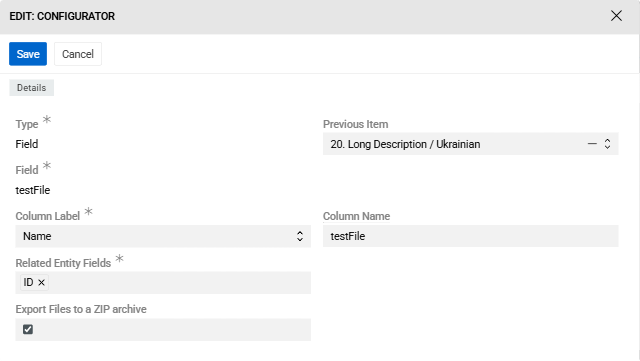{.medium}

The names of the files in the archive correspond to the names of the assets by default. You can change naming using the "File Name Template" field.

{.large}

To set file names you can use the following variables:

- {{currentNumber}} - serial number of the asset in the export entity
- {{fileName}} - the actual name of the file
- {{entity}}- entity object that is exported

By default, the variable {{fileName}} is specified in the "File Name Template" field. This means that if you don't change anything in it, the file will have the original asset name. If you want to add a sequence number to the file name, the template will look like this:

{{fileName}}_{{currentNumber}}

You can also add to the file name the name of object (Product, Brand, etc.) from which the asset is exported. To do this, use the following template:

{{entity}} {{fileName}} {{currentNumber}}

Then when exporting from two products that have two assets each, the naming will be as follows:

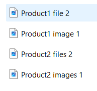{.large}

To add the attribute value to the file name, you can use the findRecord function. As parameters, you need to pass the name of the entity (ProductAttributeValue) and the identifiers of the record (f.e. product Id, attribute Id, channel Id, language).
For example:





 {{pav.value}} {{ fileName }} {{currentNumber}}

 We have attribute value 67 for Product1 and 4435 for Product2 so the file names will look like this:

 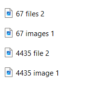

## Filter Result

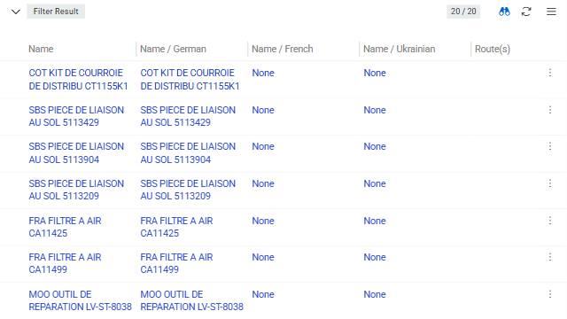{.medium}

The `Filter` panel defines which records are included in the export. Filtering follows the same logic as the entity list view. To learn more, see [Search and Filtering](../../02.atrocore/11.search-and-filtering/docs.md).

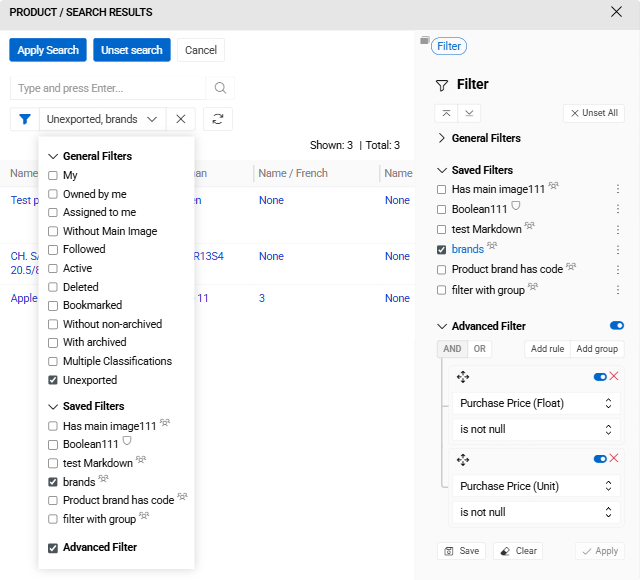{.medium}
To configure the filter, click `Edit` in the top menu of the export feed, then set the conditions in the `Filter` panel. The `Filter Result` panel displays all records matching the defined criteria and updates automatically when the filter changes.

### Exporting Only Modified Records

To export only records changed since the last feed run, apply the **Unexported** boolean filter. This selects records whose `Modified At` date is greater than or equal to the feed's `Last Run` value.

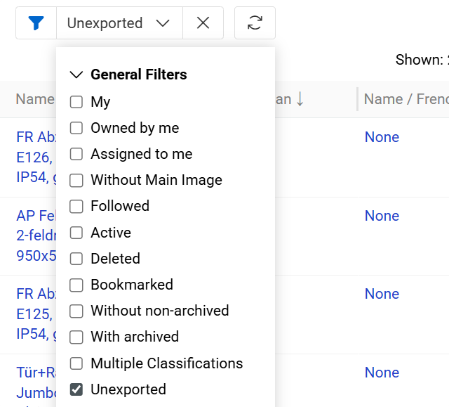{.medium}

The `Last Run` value can be adjusted manually to re-export a specific time range. By default, `Modified At` is updated when entity fields or attributes change. Additional relationships that affect the modification date can be configured in the [entity settings](../../02.atrocore/03.administration/11.entity-management/docs.md#configuration-fields) under `Relations Effecting Modification Date/Time`.

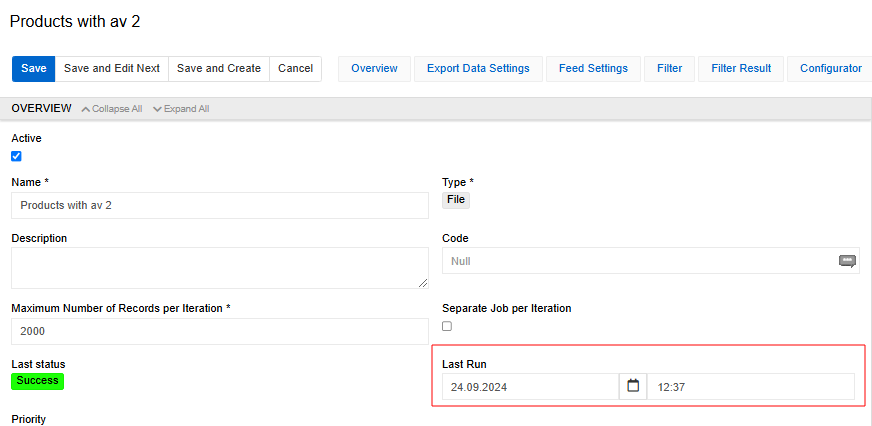{.large}

## Running an Export Feed

Click the `Export` button on the export feed detail view to start the export immediately. 

{.large}

The job appears in the [Job Manager](../../02.atrocore/05.toolbar/03.job-manager/) with its current status. Errors, if any, are also displayed there.

Executions are added to the `Export Executions` panel with `Pending` status, changing to `Success` upon completion.

View the last execution time and status on the export feed detail and list views.

After a successful export, a notification appears in the `Notifications` panel, from which the exported file can be downloaded directly.

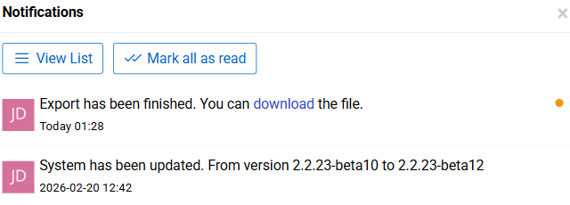{.medium}

Files generated by an export are linked to the corresponding `Export Execution` record via the `Exported File` field, which provides access to the stored file and enables tracing its origin in the [File](../../02.atrocore/13.file-operations/docs.md) entity.

> You can create an export feed [Action](../../02.atrocore/03.administration/06.actions/docs.md#export-feed) to operate in [Scheduled jobs](../../02.atrocore/03.administration/05.system-jobs/01.scheduled-jobs/docs.md#export-feed) or [Workflows](../../05.collaboration/01.workflows/docs.md).

### Exporting from Entity

You can export selected data directly from different entities. 

To do so, navigate to the target entity [list view](../../02.atrocore/04.understanding-ui/docs.md#list-view) or [plate view](../../02.atrocore/04.understanding-ui/docs.md#plate-view) records. Select which ones you want to export.

{.medium}

To export them, after selecting, press `Actions` dropdown and select `Export`. There you will see export popup menu.

{.medium}

You can select an existing Export Feed associated with the current entity and click `Export`.

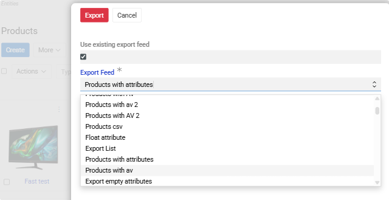{.medium}

> For the purposes of this execution all the configuration will be taken from selected `Export feed` except filters. Only the records explicitly selected in the view will be exported.

Also, you can configure a one-time export directly in the same popup menu. This option supports only CSV and XLSX (Excel) formats and allows you to manually select the entity fields and attributes to be included in the export

## Export Executions

Export execution results are displayed in two locations:

**Export Executions panel** shows executions related to the selected export feed. Use the `Refresh` action next to an active execution to update the displayed counters and status information. Also, you can select `Show List` to open a filtered list of error records associated with the specific execution.

{.medium}

**Export Executions list view** displays all Export executions across the system.
To access it, select Export Executions from the main navigation. 

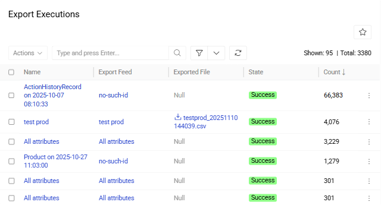{.medium}


> You can use [single record actions](../../02.atrocore/04.understanding-ui/docs.md#single-record-actions) to remove executions.

Execution details include:
- **Name** – auto-generated execution name (click to open [detail view](../../02.atrocore/04.understanding-ui/docs.md#detail-view)).
- **Export Feed** – source export feed name.
- **Exported File** – output file name (click to download).
- **State** – current execution status.
- **Count** – number of exported records.
- **Started At / Finished At** – execution timestamps.

Execution States:
- **Running** – currently executing. Available actions: **Delete**.
- **Pending** – queued for execution. Available actions: **Delete**.
- **Success** – completed (may contain errors). Only **Delete** is available action.
- **Failed** – technical failure. Available actions: **Delete** and **Export Again**.
- **Canceled** – user-stopped. Available actions: **Delete**, **Export Again**.

## Export Feed Actions

Standard [record management actions](../../02.atrocore/08.record-management/docs.md#single-record-actions) and [mass actions](../../02.atrocore/08.record-management/docs.md#mass-actions) are available for export feeds.

{.medium}

- **Export** – executes the feed immediately.
- **Duplicate** – opens the creation page pre-filled with all field values and configurator mapping rules from the current feed.
- **Delete** – removes the feed record.
- **Export Again** action is available for executions, allowing the same configuration to be re-run without creating a new export feed execution.
- **Duplicate as Import** – creates a new [import feed](../01.import-feeds/docs.md#creating-import-feed-from-export-feed) with matching entity, format, and mapping rules.
- **Copy Configuration** – copies the feed configuration as JSON for API-based recreation. See [Copying Feed Configurations](../11.copying-feed-configurations/docs.md).

> **Duplicate as Import** and **Copy Configuration** actions are available exclusively in the [detail view](../../02.atrocore/04.understanding-ui/docs.md#detail-view) of the export feed.