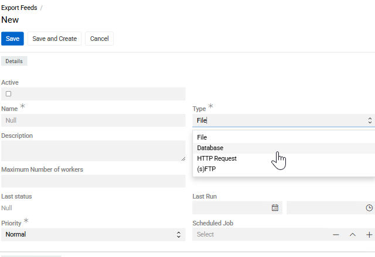
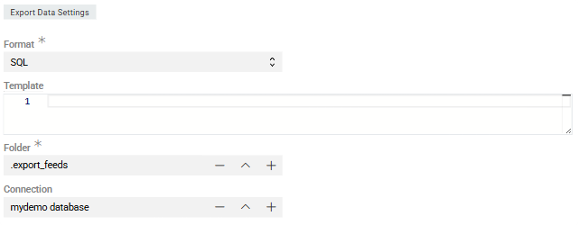
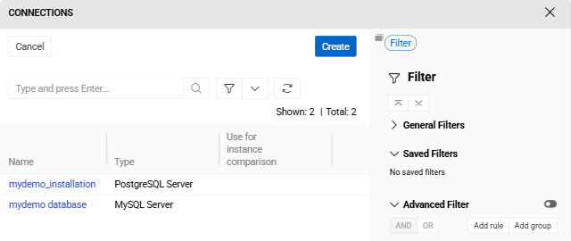

[Export: Database](https://store.atrocore.com/en/export-database/20138) extends [Export Feeds](../02.export-feeds/docs.md) to automate data export directly from AtroCore into external databases, eliminating the need for intermediate file handling. Connect to your existing MySQL, PostgreSQL, or MSSQL databases and push data using configurable SQL templates. 

Schedule regular exports via [Scheduled Jobs](../../02.atrocore/03.administration/05.system-jobs/01.scheduled-jobs/) and [Synchronization](../03.synchronization/docs.md) to keep external systems synchronized automatically.

> Module `Export Feeds` is required for this module to work.

## Configuration

Export feed configuration works the same for all export feed types, except for the `Export Data Settings` section which is specific to each type. See [Export Feeds](../02.export-feeds/docs.md) for general export feed setup.

{.medium}

Create an Export Feed with `Type` set to `Database`. 

{.medium}

In the `Export Data Settings` section:
- **Format** – only `SQL` is available for this export type.

{.medium}

- **Connection** – select an existing [Connection](../../02.atrocore/03.administration/04.connections/docs.md#database-connections) or create a new one. Supported database types: [MySQL Server](../../02.atrocore/03.administration/04.connections/docs.md#mysql-server), [PostgreSQL Server](../../02.atrocore/03.administration/04.connections/docs.md#postgresql-server), [Microsoft SQL Server](../../02.atrocore/03.administration/04.connections/docs.md#microsoft-sql-server), [PDO SQL](../../02.atrocore/03.administration/04.connections/docs.md#pdo-sql), and [Vertica DB](../../02.atrocore/03.administration/04.connections/docs.md#vertica-db).
- **Template** – SQL template defining how data is written to the target database (INSERT, UPDATE, or UPSERT statements).

After saving the connection, it becomes available for reuse across multiple export feeds.

> This export type does not use the `Configurator`. Field selection and mapping are defined directly in the **Template** field.

## Further Configuration

All other aspects of export feed configuration and usage are the same as for standard file-based exports: record filtering in the [Filter](../02.export-feeds/docs.md#filter-result) panel, [running exports](../02.export-feeds/docs.md#running-an-export-feed) and [export executions](../02.export-feeds/docs.md#export-executions).