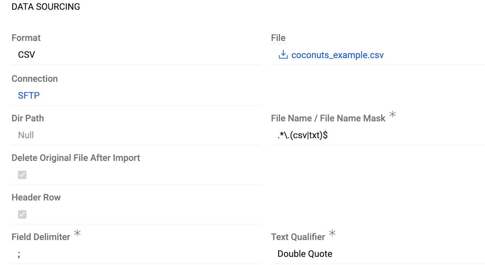
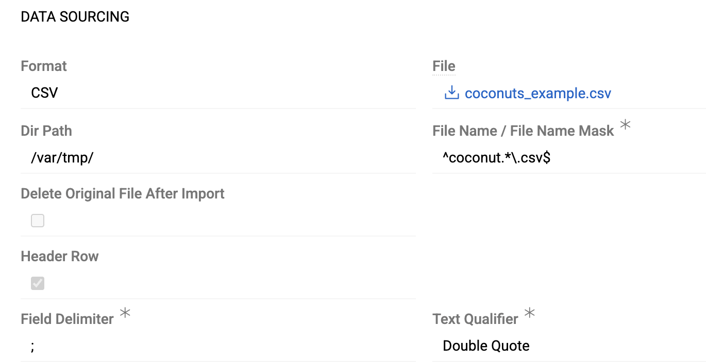

Module [Import: Remote File](https://store.atrocore.com/en/import-remote-file/20154) extends [Import Feeds](../01.import-feeds/) to automate data imports from remote file locations, eliminating the need for manual file uploads. 

Configure your import feed once with a directory path and file name or pattern, and the system automatically fetches and processes matching files when the import runs. This is perfect for scheduled imports that need to run regularly without manual intervention.

You can access files from two types of locations:
- [**FTP/SFTP servers**](#sftp) – via FTP or SFTP protocols using Connection entities, ideal for receiving files from external partners or systems
- [**Local or network paths**](#path) – from the server's file system, including mounted network shares from other machines

Schedule regular imports via [Scheduled Jobs](../../02.atrocore/03.administration/05.system-jobs/01.scheduled-jobs/) to keep your AtroCore data synchronized automatically, ensuring your system always processes new files as they arrive.

> Module `Import Feeds` is required for this module to work.

## Configuration

Import feed configuration works the same for all import feed types, except for the `Data Sourcing` section which is specific to each type. See [Import Feeds](../01.import-feeds/docs.md#creating-import-feed-from-export-feed) for general import feed setup — skip the `Data Sourcing` section there as it describes file-based imports.

Create an Import Feed with `Sourcing Type` set to `(s)FTP` or `Path`.

In the `Data Sourcing` section:

Fields **Format**, **File**, **Header Row**, **Field Delimiter**, and **Text Qualifier** work the same for both (s)FTP and Path types as described in [Import Feeds](../01.import-feeds/docs.md#data-sourcing).

! Although you import from remote locations, you still need to upload a sample file to set up field mappings in the Configurator.

### (s)FTP

Access files from remote servers via FTP or SFTP protocols. Requires setting up a [Connection](../../02.atrocore/03.administration/04.connections/) entity with server credentials of type [FTP](../../02.atrocore/03.administration/04.connections/docs.md#ftp) or [SFTP](../../02.atrocore/03.administration/04.connections/docs.md#sftp).

{.medium}

- **Connection** – select or create a Connection of the required type
- **Dir Path** – path to the directory containing files on the (s)FTP server
- **File Name / File Name Mask** – specify either an exact filename or a regex pattern to match multiple files. If multiple files match the pattern, all matching files will be imported. See [File Pattern Matching](#file-pattern-matching) below for examples
- **Delete Original File After Import** – enable this option to automatically delete successfully imported files from the remote location

### Path

Access files from the server's file system. Can be a folder on the same server or a mounted network share from another machine (e.g., `/var/www/import_data/` or a mounted shared folder).

The server user (typically `www-data`) must have read access to the files. If you enable **Delete Original File After Import**, write permission is also required. All permissions are granted on the server itself.

{.medium}

- **Dir Path** – path to the directory containing files. You can specify:
  - **Relative path** (without leading slash) – searches for files inside the project directory
  - **Absolute path** (starting with `/`) – full path to the directory on the server
- **File Name / File Name Mask** – specify either an exact filename or a regex pattern to match multiple files. If multiple files match the pattern, all matching files will be imported. See [File Pattern Matching](#file-pattern-matching) below for examples
- **Delete Original File After Import** – enable this option to automatically delete successfully imported files from the source location. Requires write permission for the server user.

### File Pattern Matching

Use file masks to process multiple files automatically. The file mask should be either an exact filename or a regex pattern (without delimiters, as they're added automatically in the code).

Common examples:
- Match any CSV file: `.*\.csv$`
- Match files starting with "import" and ending with ".csv": `^import.*\.csv$`
- Match files with date pattern (e.g., "report-2023-11-19.csv"): `^report-\d{4}-\d{2}-\d{2}\.csv$`
- Match multiple file extensions (CSV or TXT): `.*\.(csv|txt)$`

!! Special characters must be escaped since the pattern is used in regex (e.g., `.` should be `\.` for literal dot). Do not include regex delimiters in the file mask value — they are added automatically by the code. The pattern is case-sensitive by default.

For further instructions on regex patterns, see the [PHP preg_match documentation](https://www.php.net/manual/en/function.preg-match.php).

### Further Configuration

All other aspects of import feed configuration and usage are the same as for file-based imports: field mapping in the [Configurator](../01.import-feeds/docs.md#configurator), [running imports](../01.import-feeds/docs.md#running-import-feed), [import executions](../01.import-feeds/docs.md#import-executions), error handling, and all other features described in [Import Feeds](../01.import-feeds/docs.md).

