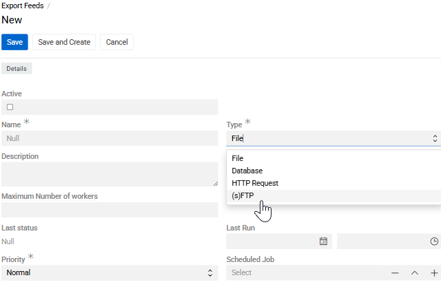
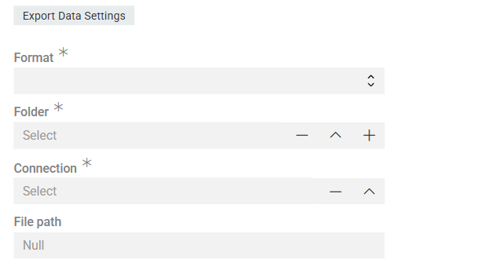
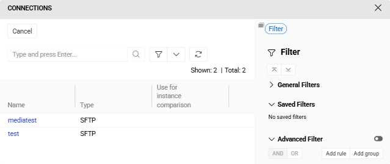

Module [Export: Remote File](https://store.atrocore.com/en/export-remote-file/20144) extends [Export Feeds](../02.export-feeds/docs.md) to automate data exports to remote file locations, eliminating the need for manual file transfers.

Configure your export feed once with a destination directory path and file name, and the system automatically delivers the exported file to the remote location when the export runs.

Schedule regular exports via [Scheduled Jobs](../../02.atrocore/03.administration/05.system-jobs/01.scheduled-jobs/) to keep your remote destinations up to date automatically.

> Module `Export Feeds` is required for this module to work.

## Configuration

Export feed configuration works the same for all export feed types, except for the `Export Data Settings` section which is specific to each type. See [Export Feeds](../02.export-feeds/docs.md) for general export feed setup.

Create an export Feed with `Type` set to `(s)FTP`.

{.medium}

In the `Export Data Settings` section:

Fields **Format**, **File Name Mask**, **Header Row**, **Field Delimiter**, and **Text Qualifier** work the same for both (s)FTP and Path types as described in [Export Feeds](../02.export-feeds/docs.md#export-data-settings).

### (s)FTP

Deliver files to remote servers via FTP or SFTP protocols. Requires setting up a [Connection](../../02.atrocore/03.administration/04.connections/docs.md) entity with server credentials of type [FTP](../../02.atrocore/03.administration/04.connections/docs.md#ftp) or [SFTP](../../02.atrocore/03.administration/04.connections/docs.md#sftp).

{.medium}

- **Connection** – select or create a Connection of the required type (only FTP or SFTP). 
- **File Path** – path to the destination directory on the (s)FTP server.
- **File Name** – the name of the file to be created on the remote server. Supports [Twig syntax](../../11.developer-guide/80.twig-tutorial/docs.md) for dynamic naming (e.g., including a date or timestamp)

### Connection menu

Here you can select established connections or create a new one. Use `Name`, `Host` and `Port` to locate it and  `User` and `Password` for the system to get access to it.

{.medium}

## Further Configuration

All other aspects of export feed configuration and usage are the same as for standard file-based exports: field mapping in the [Configurator](../02.export-feeds/docs.md#configurator), record filtering in the [Filter](../02.export-feeds/docs.md#filter-result) panel, [running exports](../02.export-feeds/docs.md#running-an-export-feed) and [export executions](../02.export-feeds/docs.md#export-executions).