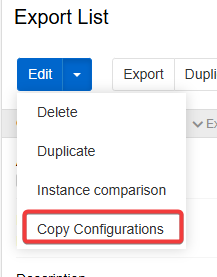
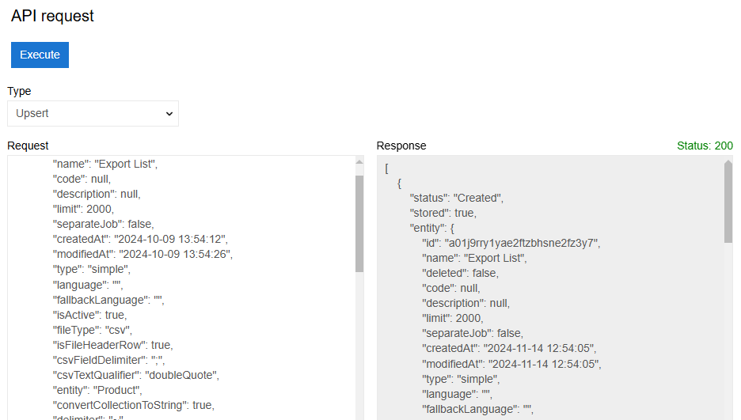
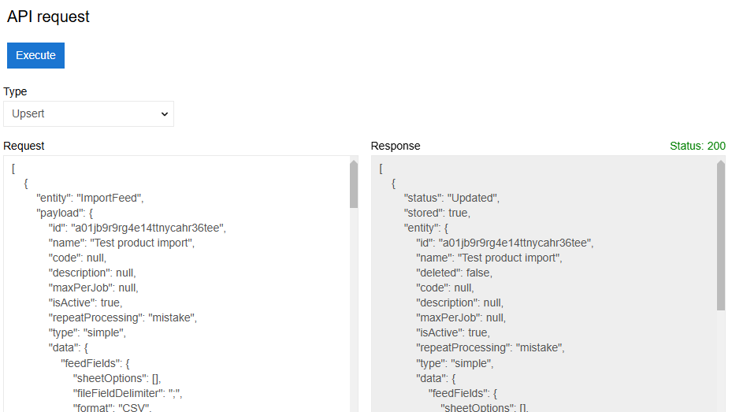

If you want to easily copy configurations for [export](../02.export-feeds/) or [import](../01.import-feeds/) feeds between instances (between test and live for example), you should use the "Copy Configurations" functions. This creates a JSON code that stores the configurations of a feed in the clipboard.

{.large}

## How to copy configuration for export feed

Now you can go to a new instance and execute the code you stored.

Go to Administration → Tools and select [API Request](../../02.atrocore/03.administration/16.tools/01.api-request/). Select the type Upsert and copy the script from the clipboard into the request field. This field will only accept JSON codes. Then press Execute. You will see a response in the response field.

{.large}

>Note that configurations for files and attributes that do not exist in the new system will be skipped.

## How to copy configuration for import feed

The same action will copy and create an Import feed. However, the file is not copied. It will still create all the source fields from it and all the possible configurations. This way you will not be able to use the 'Import' function without re-uploading the file, but you will be able to use the 'Upload and Import' function.

## How to update the existing feed

The same action will update the feed if it already exists in the new system. However, any changes made to it in the new system will be discarded.

{.large}
