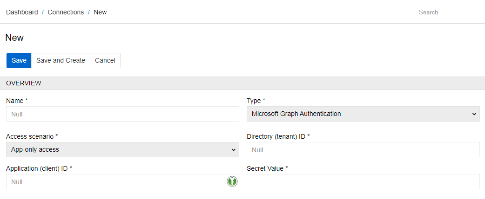
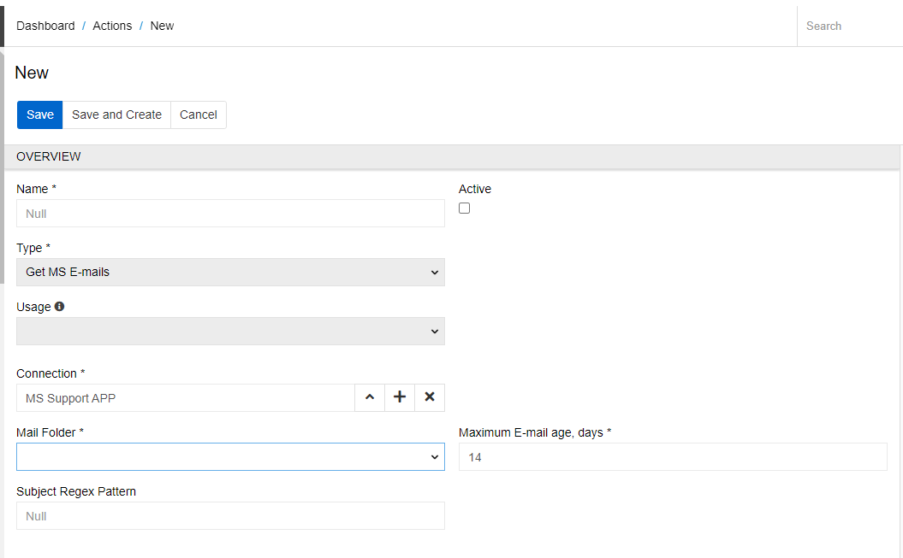
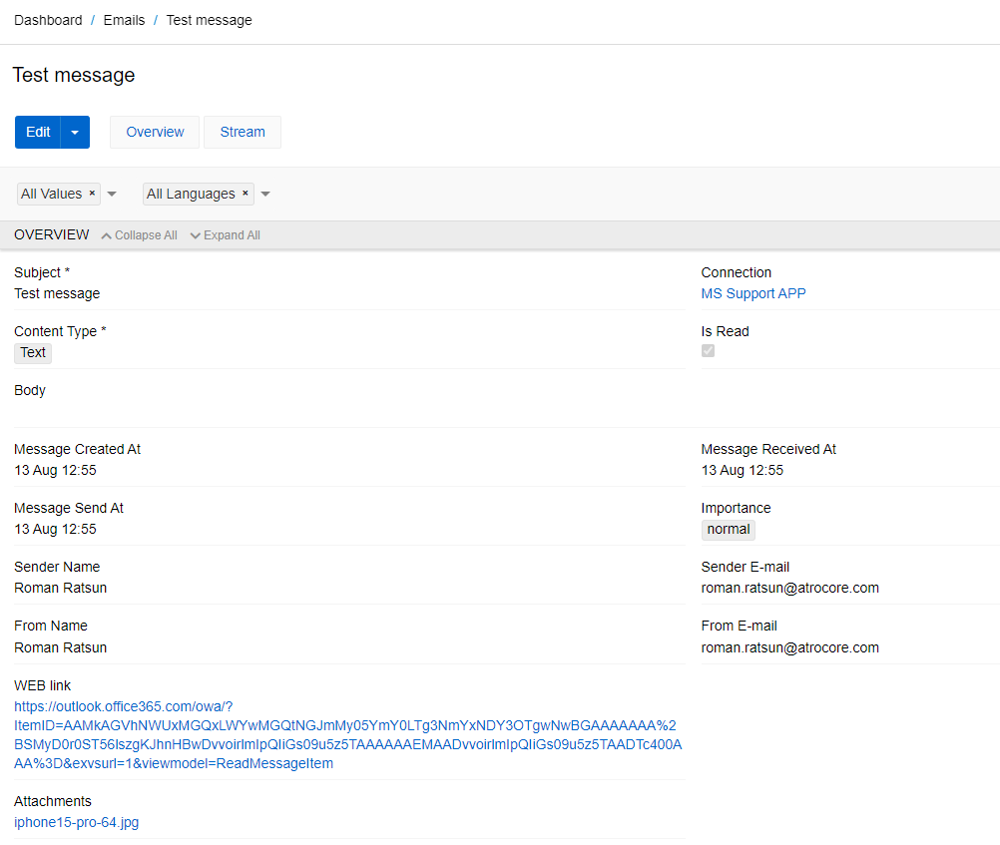

The Microsoft 365 Connector module allows you to create an Action type `Get MS E-mails`. This Action makes it possible to download Emails from any directory of the MS mail server for a specified period of time for further processing. The Action can be run manually or by a cron-job with a certain regularity.

## Create Connection

To create an action for uploading emails, you first need to create a Connection of type `Microsoft Graph Authentication`. To create a new connection, go to `Administration / Connections` and click on the button `Create Connection`. Select the required type of Connection. The following form appears:

{.large}

- **Name** – name of the connection
- **Type** – connection type (Microsoft Graph Authentication should be selected)
- **Access scenario** - the method that an app uses to authenticate with the Microsoft identity platform. This access can be in one of two ways:
    - *Delegated access* - an app acting on behalf of a signed-in user.
    - *App-only access* - an app acting with its own identity.
- **Directory (tenant) ID** - the unique identifier of the Azure Active Directory instance.
- **Application (client) ID** - a unique identifier assigned by the Microsoft identity platform.
- **Secret Value** - a password that your app uses to authenticate with the Microsoft identity platform.

Here you can read more about the access scenarios of Microsoft Graph: https://learn.microsoft.com/en-us/graph/auth/auth-concepts?view=graph-rest-1.0

After creating the Connection, click `Authenticate` to log in and grant access to the user and their emails.

## Create action for downloading emails

The next step is to create an Action for uploading emails to PIM. To create a new Action, go to `Administration / Actions` and click on the button `Create Action`. The window for creating an Action opens. Select the type `Get MS E-mails`.

{.large}

- **Name** – name of the Action
- **Active** – activate the action to be able to execute it
- **Connection** – select a connection of type `Microsoft Graph Authentication` created previously
- **Mail Folder** - the directory which emails should be downloaded (Inbox, Drafts, Archive, Deleted Items, etc.)
- **Maximum E-mail age, days** -  maximum number of days for which emails should be scanned
- **Subject Regex Pattern** - this field can be used to filter emails by subject.

When you click on the `Execute` button, the emails are extracted to the entity `Emails`. This entity is created only for downloading emails from the mail server. You cannot create records in it. You can see an example of such an email below.

{.large}

The record contains information about the sender, subject, and body of the email, as well as attachments, if any. You can also follow the link in the Web link field to open the email directly through the mail server and reply to it.
