In order to setup Mail with Microsoft OAuth2 SMTP, you must first register your application, to do this follow these steps:
1) Log in to the https://entra.microsoft.com/ page with administrator rights.
2) In the Applications section, select App registration and click New registration.

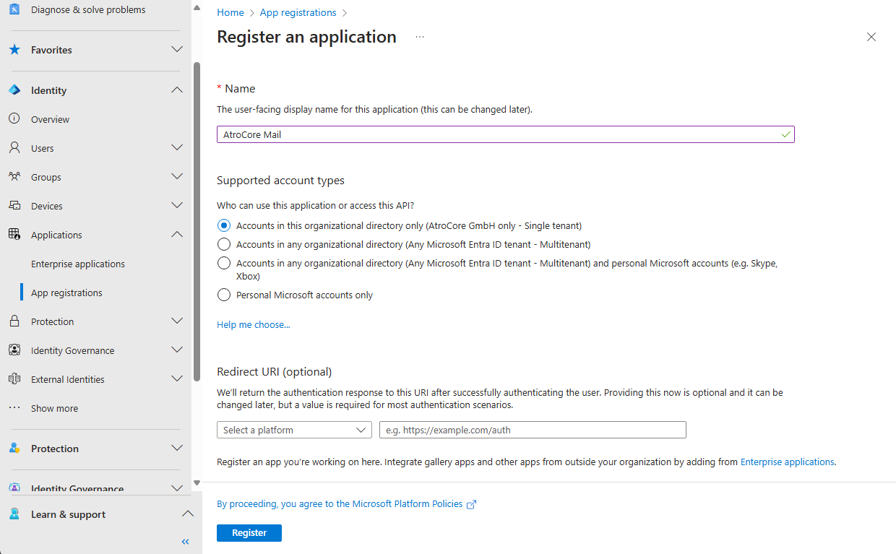{.large}

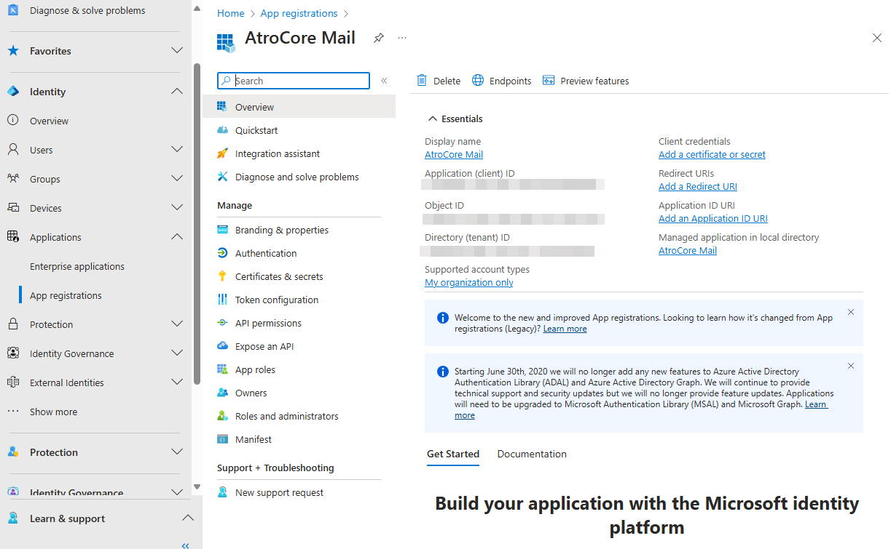{.large}

3) Secret key

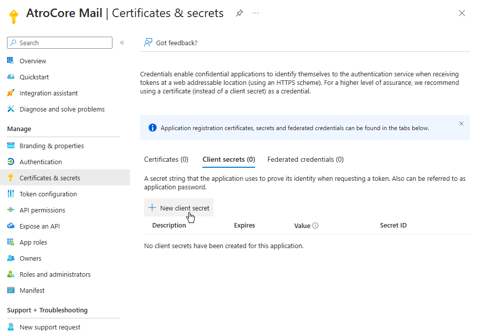{.large}

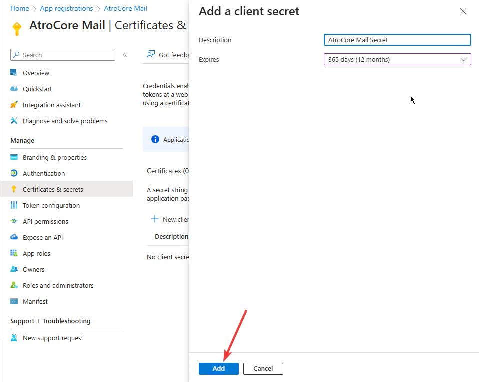{.large}

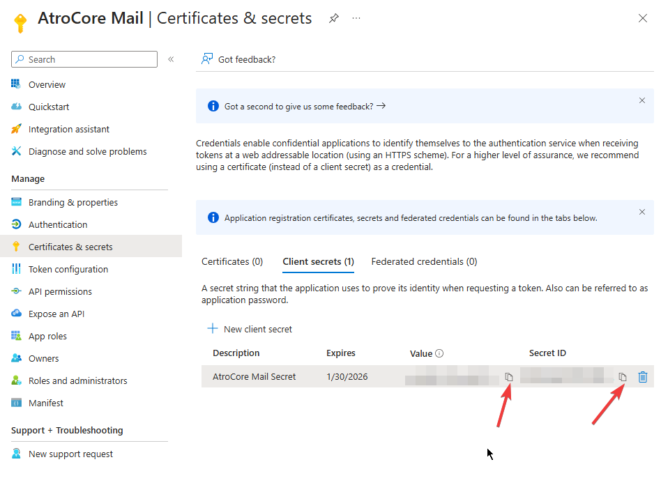{.large}

Copy the value (It is the Client Secret on PIM)

4) Permissions

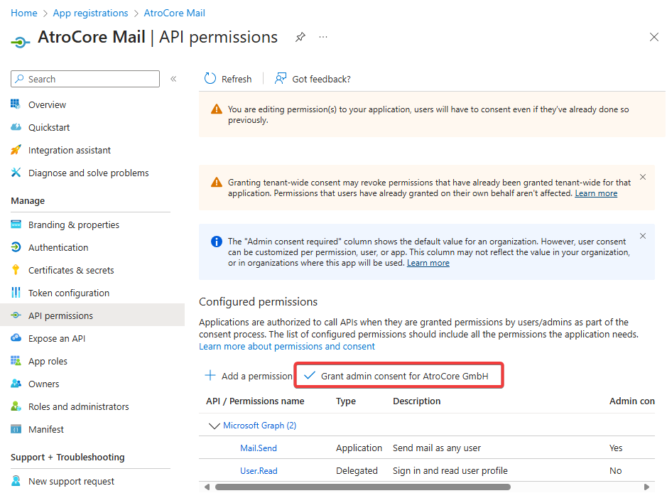{.large}

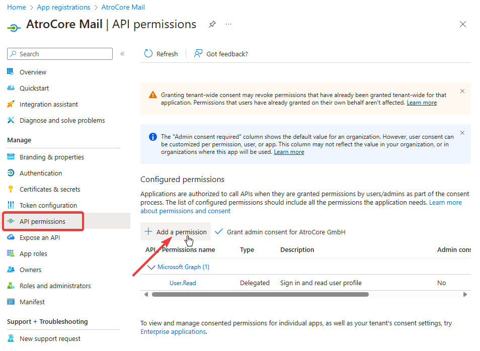{.large}

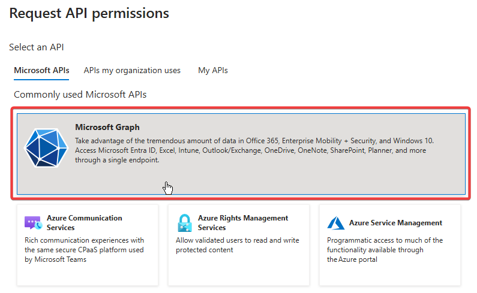{.large}

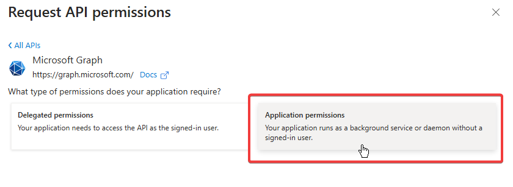{.large}

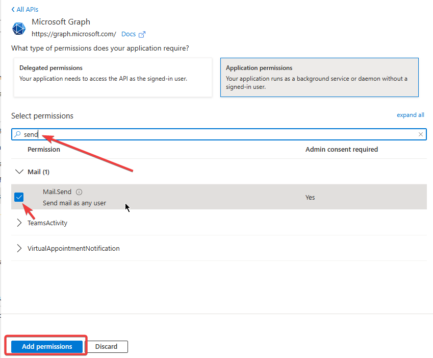{.large}

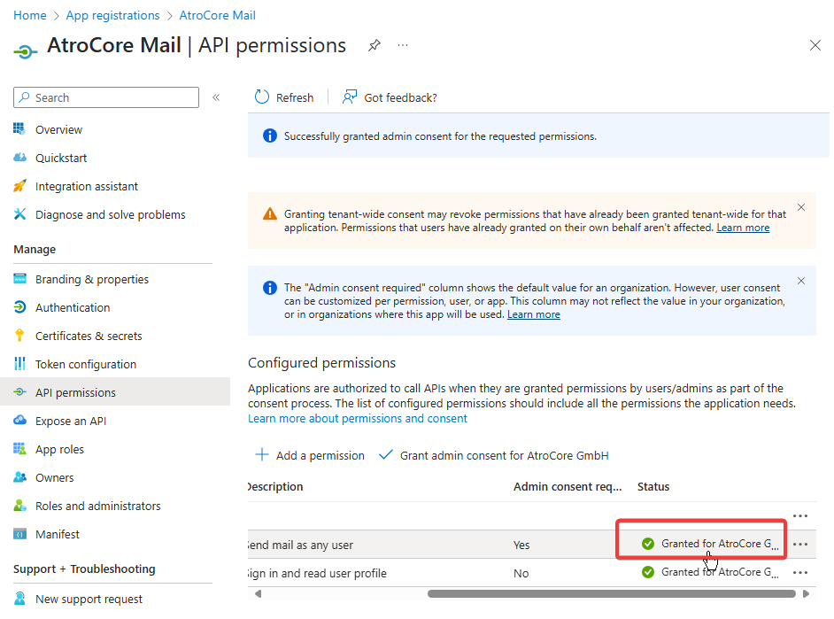{.large}

5) Authentication

{.large}

{.large}

The Redirect Url must be in this format 'https://YOUR_PROJECT/?entryPoint=OauthSmtpCallback'

6) Configuration in PIM

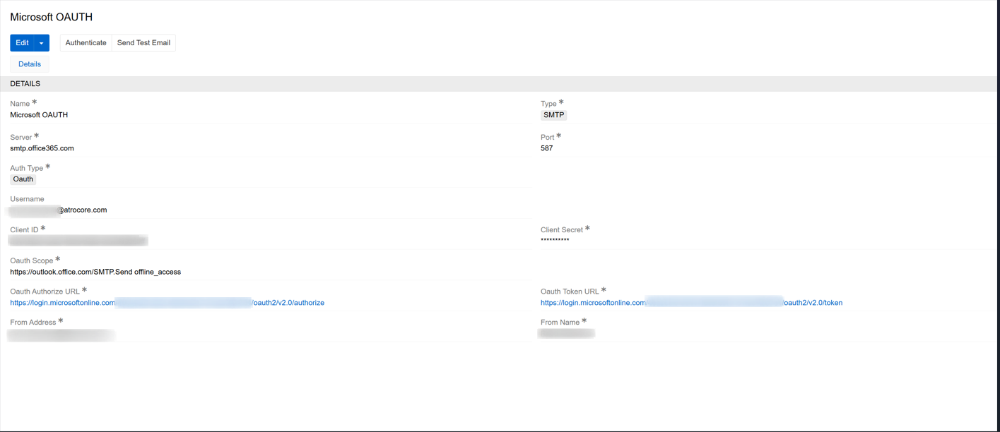{.large}

These are the values you need to set on PIM connection
Server: smtp.office365.com
Port: 587
Auth Type: OAuth
Username: your mail address
Client Id:  obtained in step 2, it is ‘Application (client) ID’
Client Secret: obtained in step 3, it is the ‘Secret Value’
Oauth Authorize URL : https://login.microsoftonline.com/{TenantID}/oauth2/v2.0/authorize
Oauth Token URL: https://login.microsoftonline.com/{TenantID}/oauth2/v2.0/token
TenantID is obtained in step 1, it is ‘Directory (Tenant) ID’
From Address: your mail address
From Name: your name
