Microsoft 365 Connector module integrates AtroCore with Microsoft 365 (e.g. SharePoints, E-Mails, Calenders) and other Microsoft products and services.

## Integration with SharePoint

### Register the application

In order to set up PIM integration with SharePoint, you must first register your application. To do this, follow these steps:
1) Log in to the https://entra.microsoft.com/ page with administrator rights.
2) In the Applications section, select `App registration` and click `New registration`.

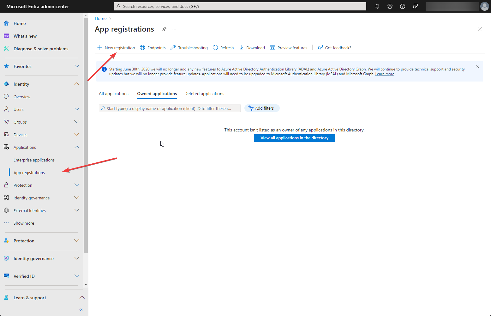{.large}

3) In the appeared window, enter all the necessary data. Enter the display name for your app in the `Name` field. You can change it later. Select "Accounts in this organizational directory only" as Supported account type.
Next, you need to set the `Redirect URI`. Select `Web` as a platform and specify the domain of your project in the required format (authMsGraph should be at the end. Example: ```https://demo.atropim.com/?entryPoint=authMsGraph```). Then click on `Register` button. Now your app is created.

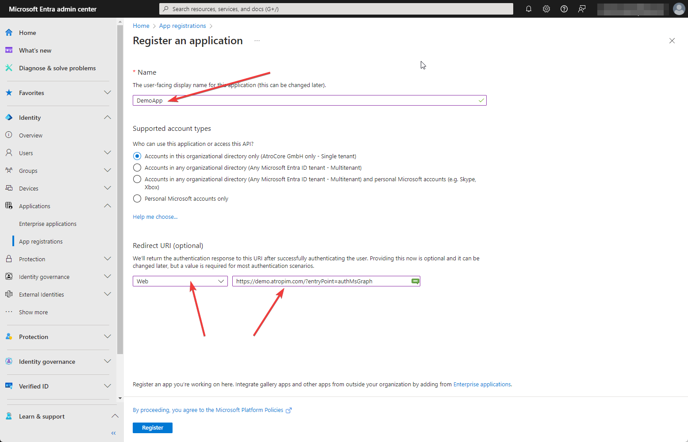{.large}

Go to `Overview` panel to see parameters of your application. For integration with PIM you need Client ID, Directory (tenant) ID and Client credentials.

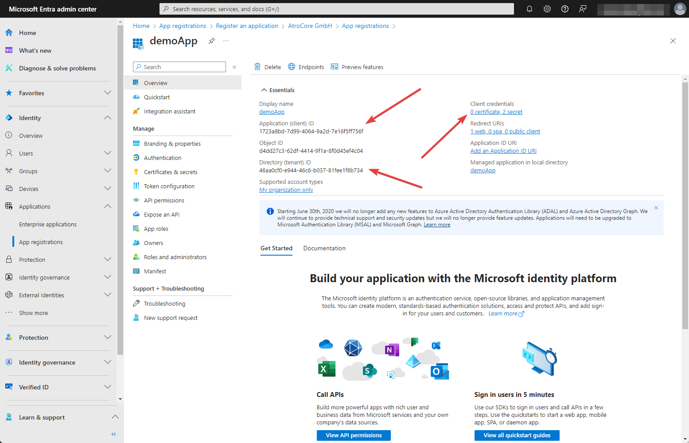{.large}

4) To create customer credentials, click `Add a certificate or secret`. The following page will open

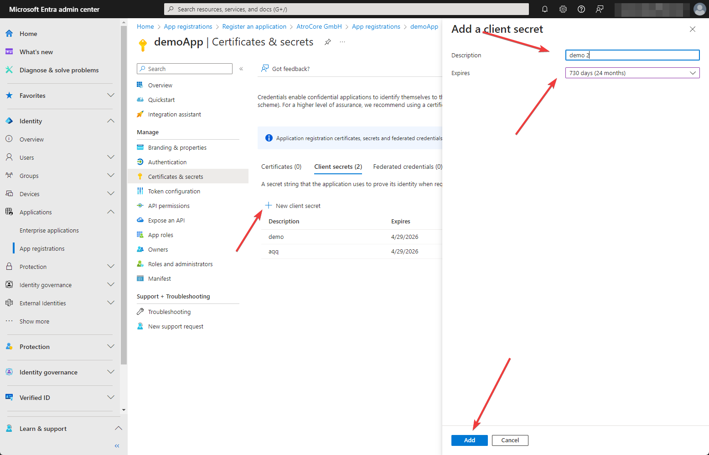{.large}

Click on `New client secret`, enter the description of your secret and select expiration period. It is better to choose the longest possible existence period. Now you can copy the Client secret. This can only be done immediately after creation. Later, this option will disappear.

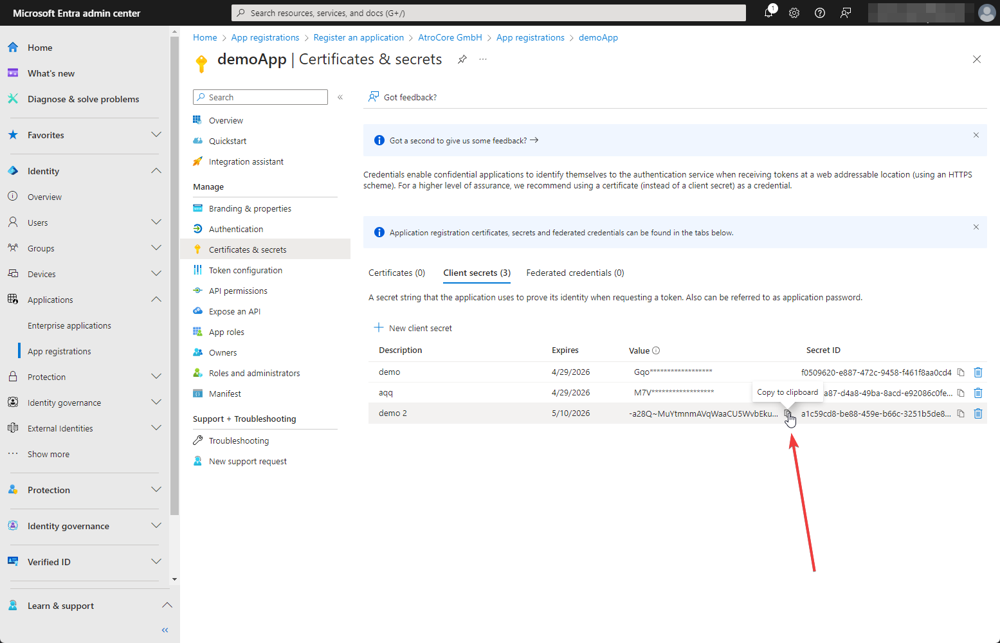{.large}

5) After the application is created, you need to give it the necessary permissions. Go to `API permissions` and click on `Add a permission` -> `Microsoft Graph` -> `Application permissions`.

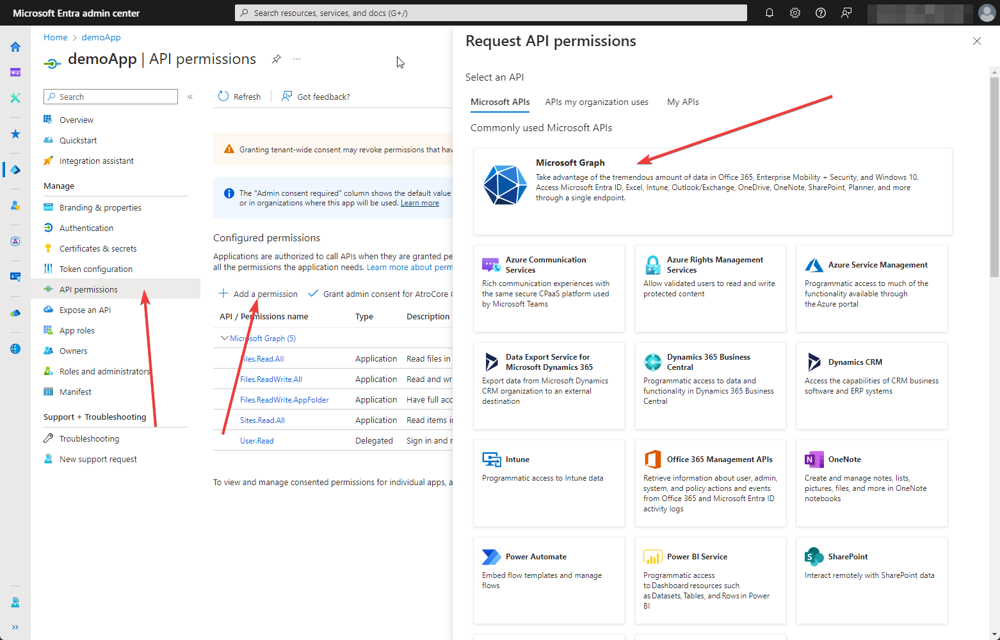{.large}
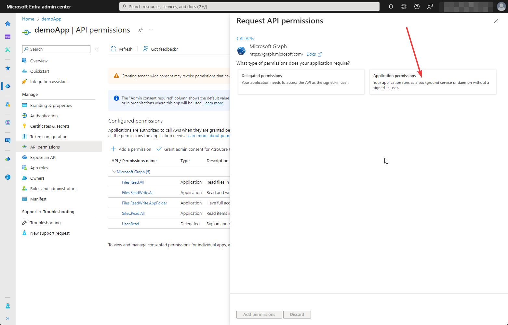{.large}

You need to add permissions to read sites, as well as permissions to see and edit files and folders. Select the appropriate checkboxes in the `Request API permissions` tab and click on `Add permissions`.

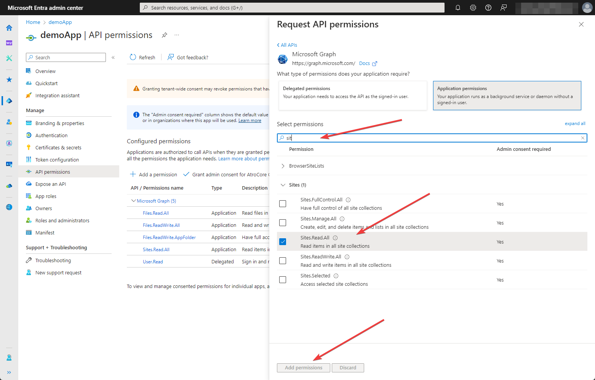{.large}
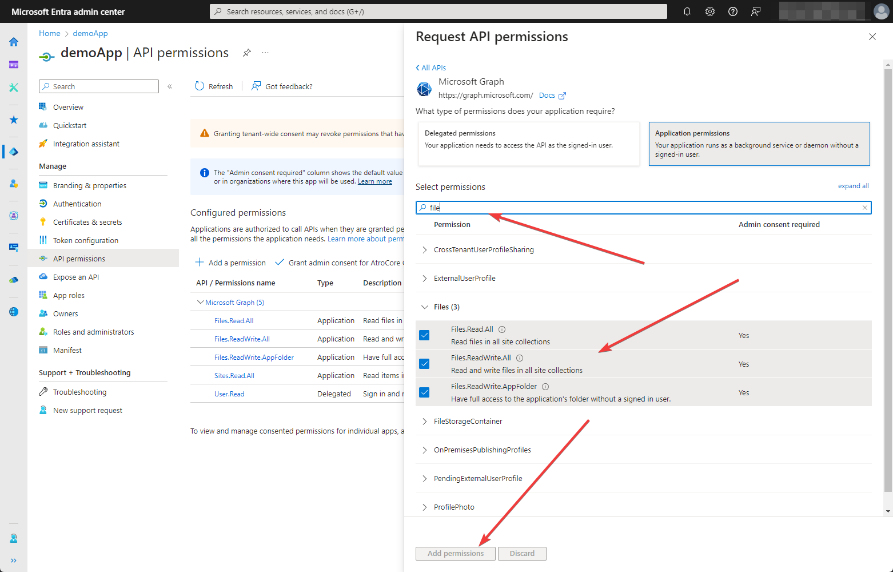{.large}

The selected options will be added to your Configuration permissions. To make them active, click on `Grant admin consent` button

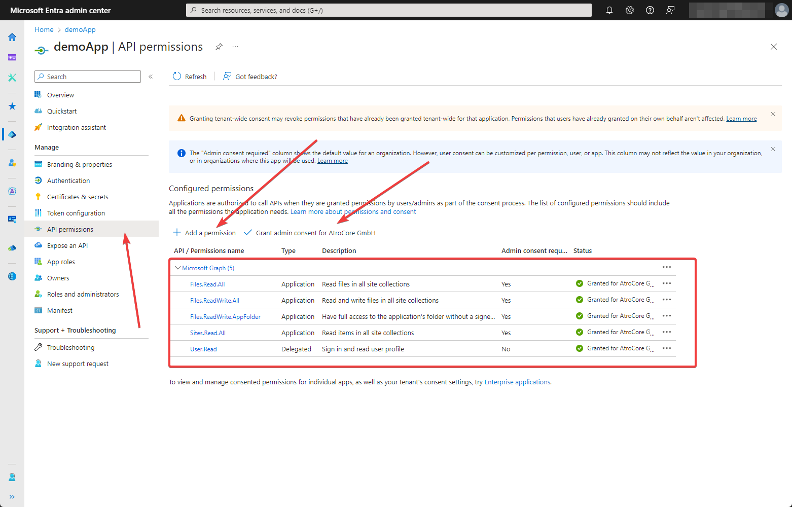{.large}

This completes the creation and configuration of the application.

### Create connection in PIM

To provide the integration with PIM you need to create a connection of type Microsoft Graph Authentication. For this go to `Administration > Connections` and click on `Create connection` button. The following page will appear

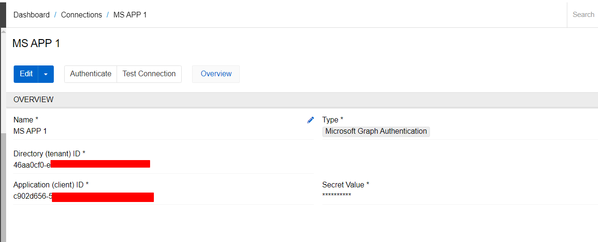{.large}

Enter the name of the connection and select type "Microsoft Graph Authentication". Directory ID, Application ID and Secret value should be taken from your App Essentials. Save your connection and click on `Authenticate` button. You'll be redirected to the Microsoft logging page, where you'll need to select an account with administrator rights and enter your login and password. After that, you will be returned to the connection page. Click on `Test connection` to check if it was configured properly. If you see message "Connection is successfully established", the integration has been successfully configured.

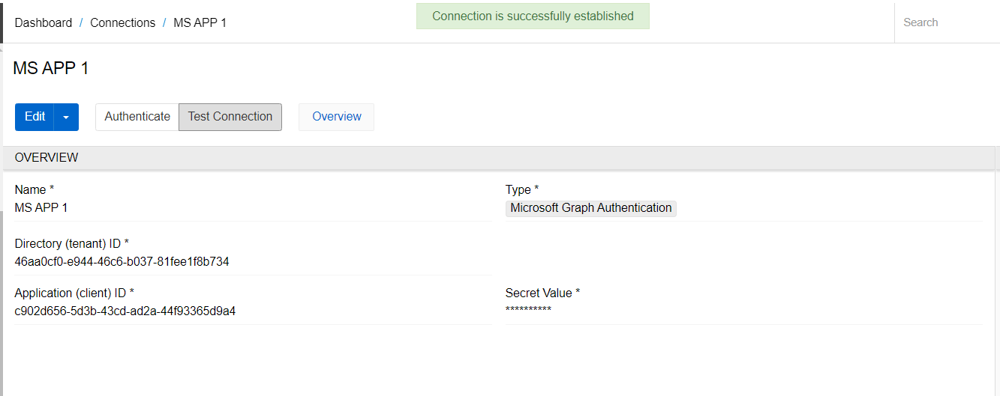{.large}

### Storage creation

In order to access the data on the the SharePoint from the PIM, you need to create a Storage of type 'Microsoft SharePoint'. To do this, go to `Administration` and select `Storages` in File management section. Click on `Create Storage` button.

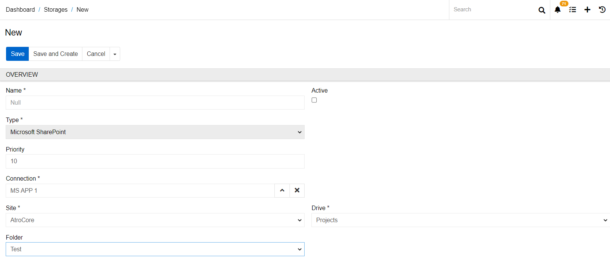{.large}

Enter the name of your storage, select type 'Microsoft SharePoint' and select connection you created in previous point. Specify the path to your folder. To do this, select the required data in fields `Sit`, `Drive`, and `Folder`. Click on `Save` button to save your storage. Now all files that you add (change or delete) to this storage will be automatically synchronized with SharePoint. Synchronization also works in the opposite direction. To synchronize data from SharePoint to PIM, you need to click the Scan button in the storage. You can also set up regular synchronization with SharePoint using a scheduled job of type 'Scan Storage'.

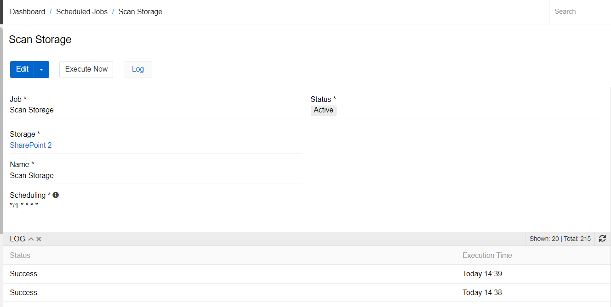{.large}
