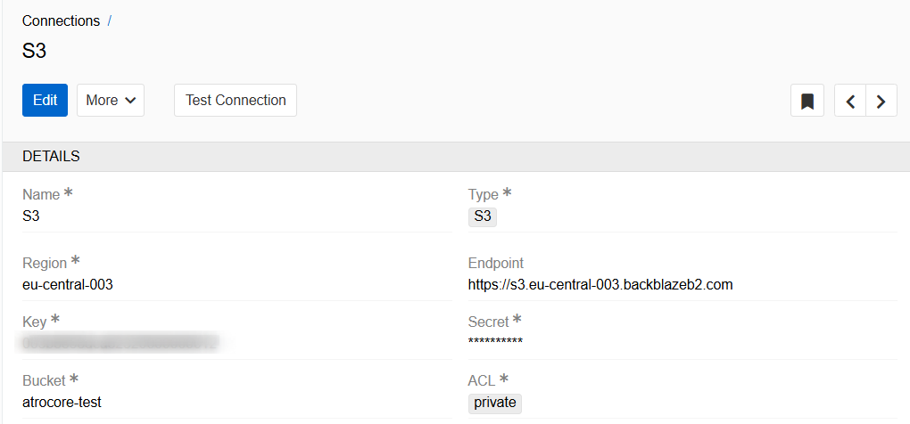
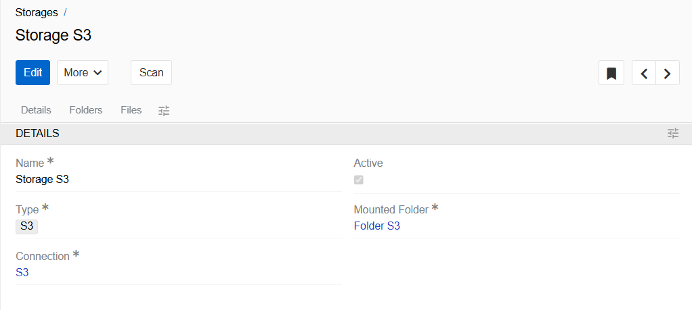

 S3 Compatible Storage is a storage solution that allows access to and management of the data it stores over an S3 compliant interface.

 The S3 Object Storage module allows you to use cloud storage services that support this technology (Amazon S3, Backblaze B2, and Cloudflare R2). You can store files in one of these storages and use them in PIM. The data will be synchronized automatically. In this case, the same options will be available as for files stored on the local server.

 ## Create connection in PIM

 After installing the module, you will be able to create a Connection of type S3, which will be used to synchronize PIM Storage with your S3 Object Storage.

 To provide the integration with PIM you need to create a connection of type S3. For this go to `Administration > Connections` and click on `Create Connection` button.

 

 - **Name** - name of the Connection
 - **Type** - type of Connection (S3 is needed)
 - **Region** - the region where S3 bucket is located
 - **Endpoint** - the path to the storage where the data is located
 - **Key** - authentication data
 - **Secret** - authentication data
 - **Bucket**- the name of bucket in the storage where the files are stored
 - **ACL**- here you can specify the level of access to files (private or public)

Click `Test connection` to check if it was configured properly. If you see message "Connection is successfully established", the integration has been successfully configured.

## Storage creation

In order to access the data on the the S3 Object Storage from the PIM, you need to create a Storage of type "S3". To do this, go to `Administration` and select `Storages` in File management section. Click on `Create Storage` button.

{.large}

Enter the name of your Storage, select type `S3` and select Connection you created in previous point. Specify the Mounted Folder of your Storage.

Now all files that you add (change or delete) to this storage will be automatically synchronized with S3 Object Storage. Synchronization also works in the opposite direction. To synchronize data from S3 to PIM, you need to click the `Scan` button in the storage. You can also set up regular synchronization with S3 Storage using a scheduled job of type `Scan Storage`.

> Please note that Files and Folders stored in S3 Storage cannot be renamed or moved after creation. Otherwise, they are no different from local Files. They can be exported, downloaded, linked to products, etc.
