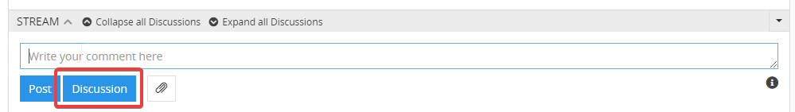
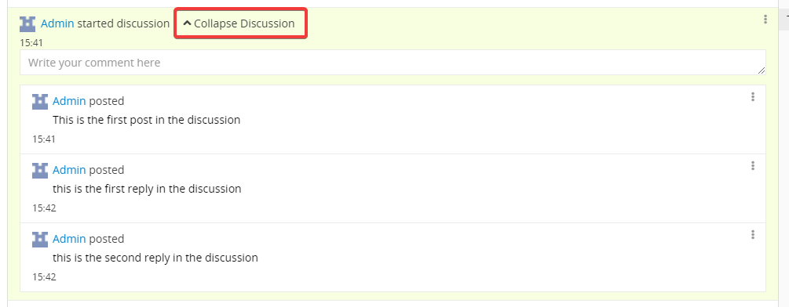
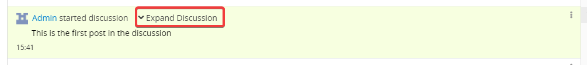
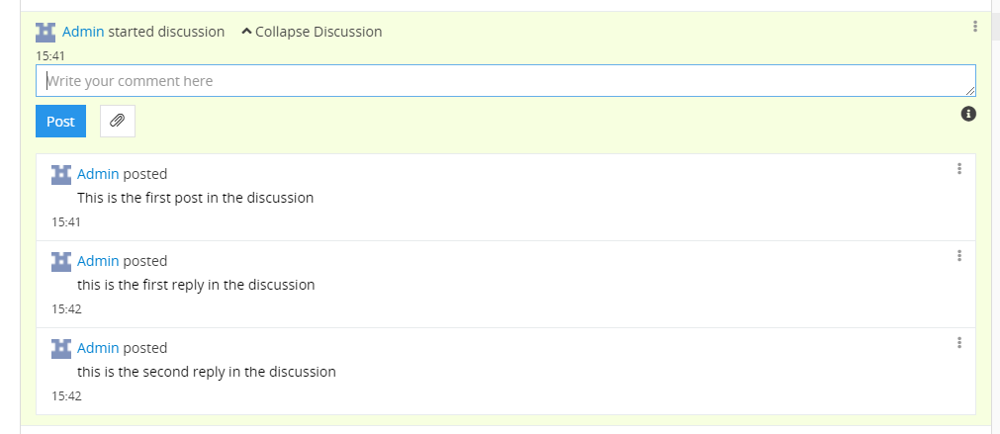

The “Discussions” module enables the discussions in the activity panel (stream) for each entity in the system. All posts within a discussion are automatically grouped together so that you can specifically discuss a certain topic without being rejected by other posts.

After you have installed the module, the `Discussion` button appears in the stream next to the` Post` button. You can have more than one discussion for a dataset.

## Create a discussion

To start a new discussion, enter the message and click on the `Discussion` button.

{.large}

The new discussion is created. This is automatically given a colored background. The color for the background is chosen randomly.

{.large}

The discussion can be collapsed or expanded by clicking on the links `Collapse Discussion` or` Expand Discussion`.

{.large}

To enter a new post in the discussion, enter the message and click on the `Post` button. As with normal messages, you can also upload files. If it is an image, a preview image will be displayed for it directly in the message. You can also mention other users in the messages by using the symbol “@” and the user login or name, e.g. “@admin”. You can also use Markdown in the posts. Click on the information icon on the right below the input field to see how you can use Markdown syntax.

{.large}
