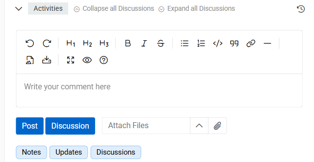
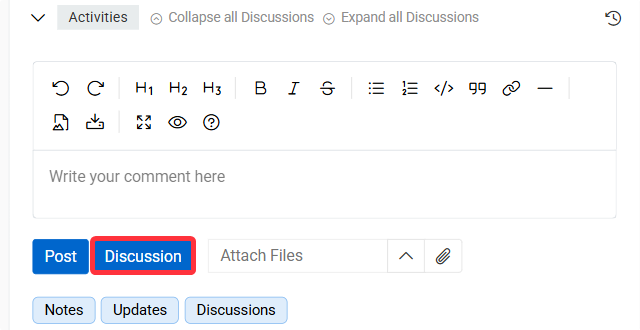
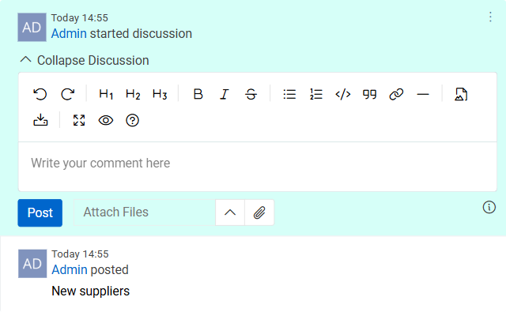
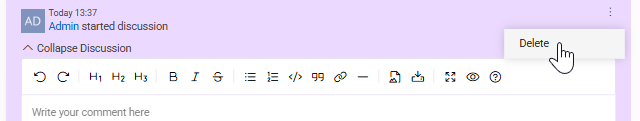
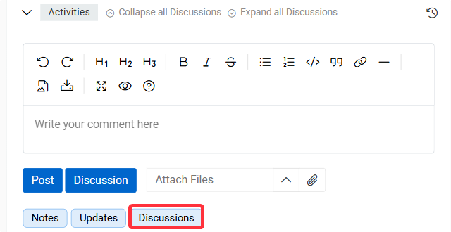

The [“Discussions”](https://store.atrocore.com/en/discussions/20128) module extends the [Activities](../../02.atrocore/06.activities/docs.md) panel with threaded conversations. Instead of standalone notes, a discussion groups all related messages under a single titled thread, keeping your conversations organized even when the activity stream is busy with updates and other notes.

{.medium}

After you have installed the module, the `Discussion` button appears in the stream next to the `Post` button. You can have more than one discussion for a dataset.

## Create a Discussion

> Access to the Activities panel is controlled by your administrator at the role level. To view change history for a specific entity, your role must have [Activities access](../../02.atrocore/06.activities/docs.md#system-activities-records) enabled for that entity. Contact your administrator if you cannot see the Activities panel or specific activity entries on a record.

Users can either create a discussion from scratch or convert a post into one. Once a discussion has been started, any user with access to the Activities can participate by posting messages to it. Messages in a discussion are displayed in order from first to last, but a discussion is not raised in the Activities panel whenever new messages appear

{.medium}

- Type the title or opening message of your discussion in the text input area.
- Click the **Discussion** button (located next to the **Post** button).

> Discussions also appear alongside notes and updates in the [Activities](../../02.atrocore/04.understanding-ui/docs.md#activities-tab) tab.

The discussion is created and automatically assigned a randomly chosen background color to make it visually distinct from other discussions and plain notes. Each discussion on the same record will have a different color.

## Managing Discussions

> A record can have **multiple discussions**, each with its own color and thread.

{.medium}

Each discussion can be **collapsed** or **expanded** for a cleaner view:
- Click **Collapse Discussion** or **Expand Discussion** on the individual discussion thread.
- Use the **Collapse All Discussions** or **Expand All Discussions** actions located next to the Activities panel title to manage all discussions at once.

{.medium}

To **delete** a discussion, use the three-dot context menu on the discussion thread.

{.medium}

To view only discussions, activate the **Discussion** [filter](../../02.atrocore/06.activities/docs.md#system-activities-records) button.

Individual posts within a discussion support the same [actions](../../02.atrocore/06.activities/docs.md#creating-a-post) as regular notes – you can edit, delete, and attach files.