The [Revisions](https://store.atrocore.com/revisions/20179) module enables you to view change history, create versions of records and restore previous values for any field or attribute. Change tracking is available for all entities by default and requires no additional configuration.

## Viewing change history

### From entity fields

Hover over any field or attribute on an entity detail page to see a clock icon in the top right corner. Click it to open a pop-up showing the change history for that field or attribute:

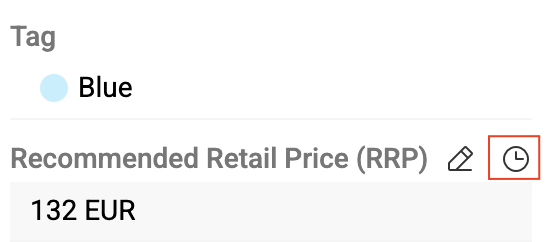{.small}

The pop-up displays:

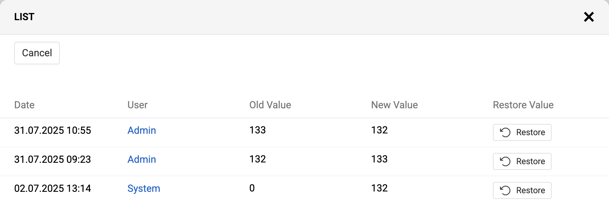{.medium}

- Date and time of each change
- User who made the change
- Previous value (`Old Value`) and new value (`New Value`)

> To view field or attribute history, you need [editing rights](../../01.atrocore/03.administration/14.access-management/03.roles/) for that field or attribute.

### From Activities panel

The [Activities](../../01.atrocore/06.activities/) panel shows record changes with previous and new values together with other types of posts. Click `Change History` in the panel's right corner to view all changes in one window:

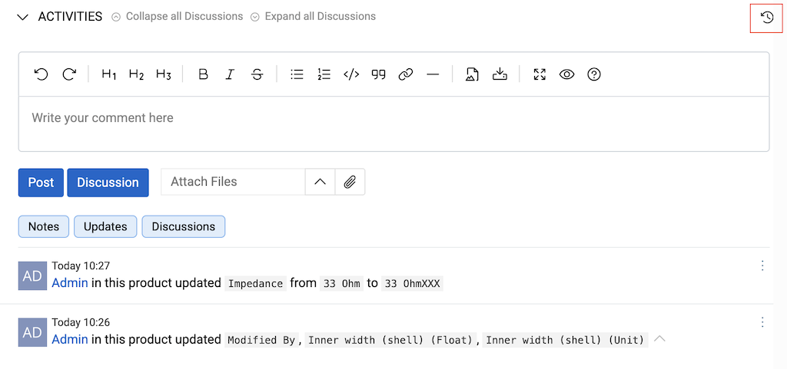{.large}

The table shows the date, change type (create, update, delete, or link/unlink for relations), and old and new values:

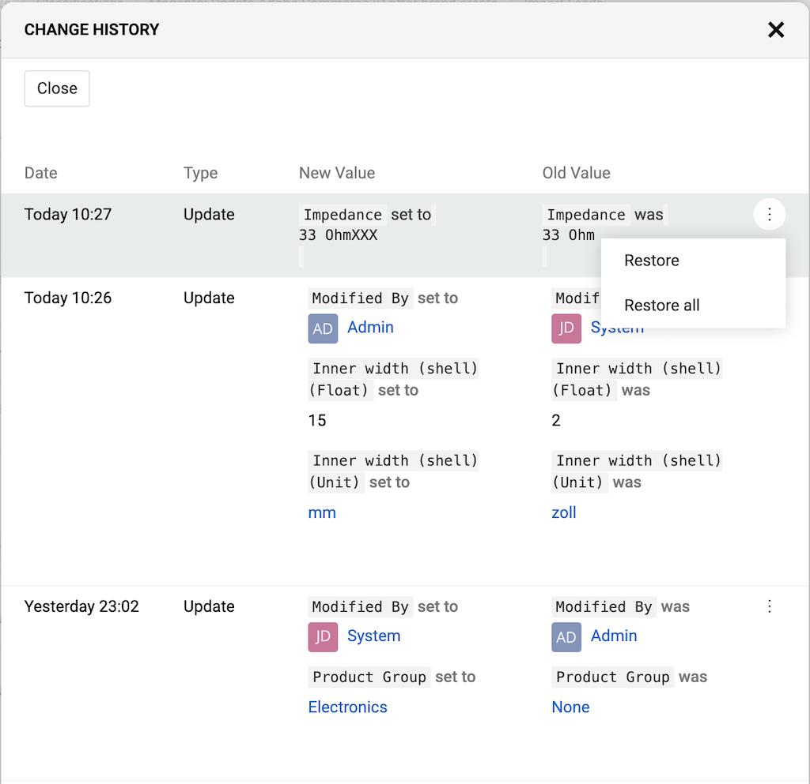{.medium}

## Restoring values

### From single field history

In the field or attribute change history pop-up (opened from the clock icon), click the `Restore` button in any row to restore that field or attribute to its previous value.

### From change history (all fields)

In the change history pop-up (opened from the Activities panel), use the 3 dots menu for:

- **Restore** — restore a single field or attribute value
- **Restore all** — restore all changes made at the same time

### From Activities panel

You can restore values directly from the Activities panel without opening the change history. Select a change in the Activities panel and choose `Restore` from its actions menu:

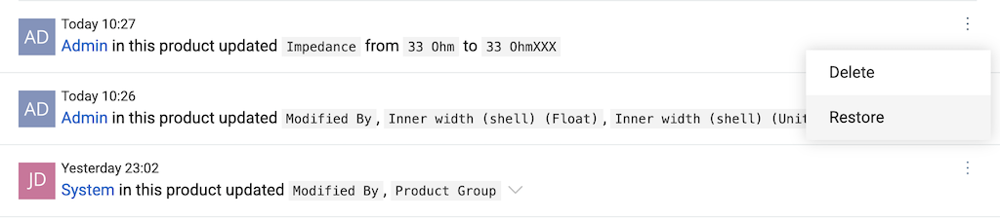{.large}

Restored values are logged as new changes in the Activities panel, showing the date, time, old and new values, and the user who performed the restore.

## Versioning Functionality for Records

The Versioning functionality allows users to create snapshots of a record at specific points in time and compare the current state of the record with any previously saved version. This feature is useful for tracking changes, auditing updates, and reviewing historical data.

### Enabling Versioning

To enable versioning for an entity:

- Navigate to Administration/Entities.
- Select the entity for which versioning should be enabled.
- In the `Versioning` panel, activate the `Enable Versioning` checkbox.
- Optionally, specify a `Default Version Name`, which will prefill the version name when creating new versions for records of this entity.

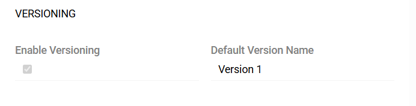{.medium}

Once enabled, a `Create Version` action type is created in the system for the selected entity. This action type can be configured following the same principles as described in the [Action Types](../../01.atrocore/03.administration/06.actions/docs.md#create-version) documentation.

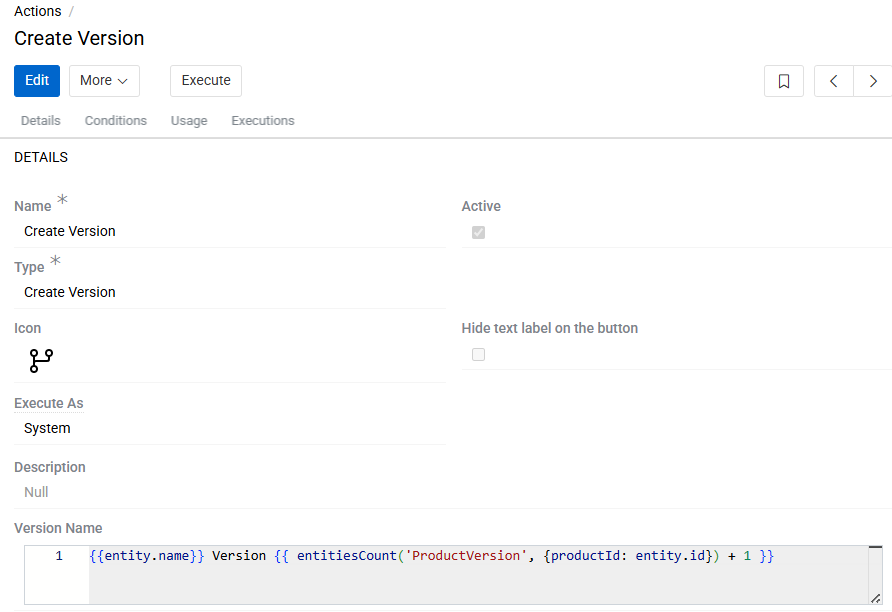{.medium}

By default, the action is created as active, and a corresponding button appears in the Detail View of entity record. A separate action is created for each entity for which the versioning is enabled. If this checkbox is disabled, the corresponding action is removed from the system.

### Creating Versions

To create a version for a specific record:

- Open the record.
- Click the `Create Version` button in the header of the page.

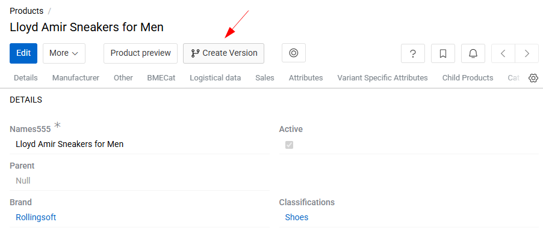{.medium}

- In the popup dialog, provide a version Name if needed.
  -    The name must be unique for each version of the same record.

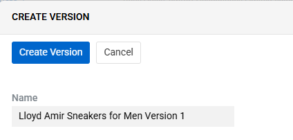{.small}

- Confirm the action to save the version snapshot.

Multiple versions can be created for a single record, allowing comprehensive historical comparison.

### Comparing Versions

When versioning is enabled, a new action Compare Versions appears for all records of the entity.

- Execute the `Compare Versions` action opens a comparison interface.
- Users can select one of the previously created versions to compare against the current state of the record.

### Version Lifecycle

- Versions are read-only and cannot be modified once created.
- Versions are also not deletable individually.
- All versions associated with a record are automatically removed only when the record itself is deleted.

This ensures data consistency and prevents orphaned historical snapshots.

## Change Request Functionality for Records

The Change Request functionality enables users to create snapshots of a record at specific points in time. Users can then develop the record and its snapshot as separate entities, with the option of eventually merging them into one. 

### Enabling Change Request

To enable Change Request for an entity:

- Navigate to Administration/Entities.
- Select the entity for which Change Request should be enabled.
- In the `Versioning` panel, activate the `Has Change Request` checkbox.
- Specify a `Change Request Entity`, which will be the entity in which snapshot is stored.

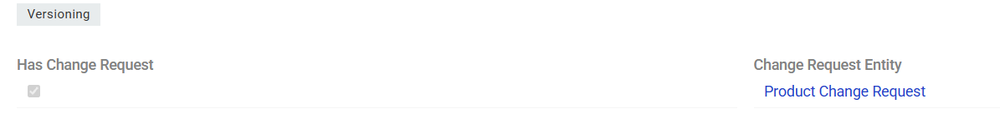{.medium}

Once enabled, an action of `Create Change Request` type is created in the system for the selected entity. This action can be configured following the same principles as described in the [Action Types](../../01.atrocore/03.administration/06.actions/docs.md#create-change-request) documentation.

By default, the action is created as active, and a corresponding button appears in the Detail View of entity record. A separate action is created for each entity for which the change requests are enabled. If this checkbox is disabled, the corresponding action is removed from the system.

### Creating Change Request

To create a change request for a specific record:

- Open the record.
- Click the `Create Change Request` button in the header of the page.

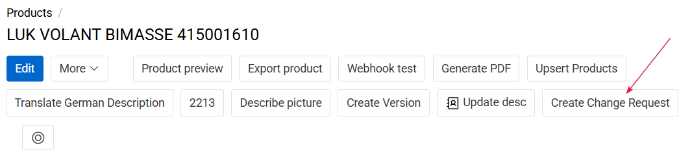{.medium}

- After creation user will automatically be redirected to corresponding Change Request record.
  -    The name of the Change Request record must be unique for each version of the same record.

Multiple change requests can be created for a single record, enabling different change paths.

### Change Request Settings

All metadata related to a Change Request is stored in the `Change Request Settings` tab of the Change Request record. This tab contains system and control fields that define the context, state, and ownership of the change request.

The following fields are available:

- `Master Record` - A reference to the original (master) record for which the change is being proposed. All modifications within the Change Request are evaluated against this record.
- `Change Request Name` - The descriptive name of the Change Request. It is used to identify and distinguish the request in lists, workflows, and approval processes.
- `Change Request Status` - Indicates the current lifecycle state of the Change Request (e.g., Draft, In Progress, On Hold, Rejected, Approved).

### Change Request preview and merge

All Change Requests related to a specific record are displayed in the Change Requests tab within the Insights panel of the Master Record. Change requests without a name are shown by ID.

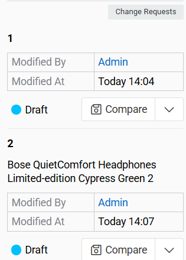{.medium}

From this panel, users can view, edit, delete and merge Change Requests associated with the current Master Record.

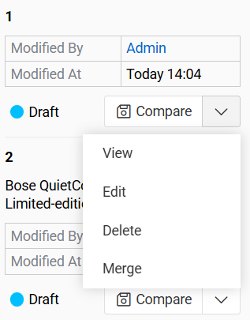{.medium}

#### Change Request edit

Change Requests are edited using the same interface as standard records.

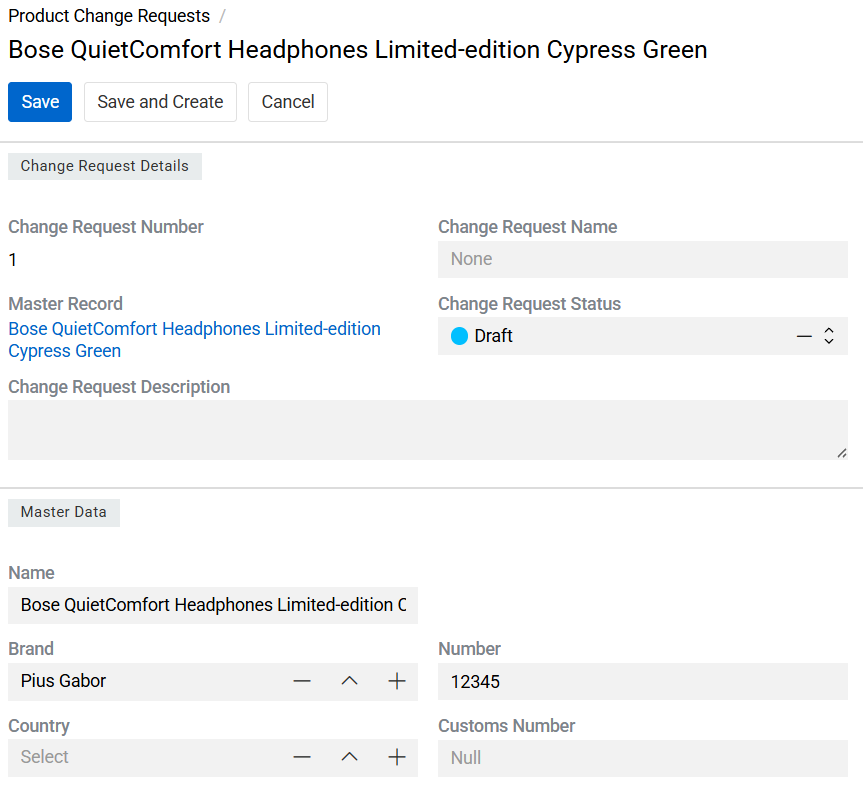{.medium}

> Relations of the Master Record (such as linked records or associations) are not copied to the Change Request record. Only the direct field values of the Master Record are included in the Change Request snapshot.

#### Change Request merge

A Change Request can be merged into the Master Record once it has been reviewed and approved. During the merge process:

- The system presents a field-by-field comparison between the Master Record and the Change Request.
- Users can choose, for each field, whether to:
  -    Apply the value from the Change Request, or
  -    Keep the current value from the Master Record.
- All differences are visually highlighted to support accurate review and decision-making.

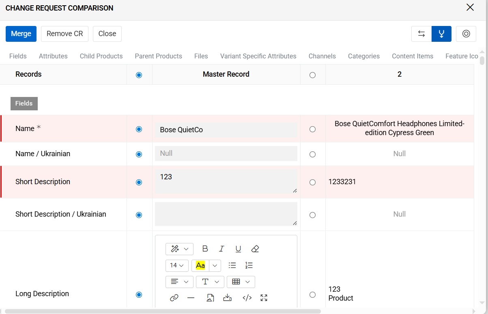{.medium}