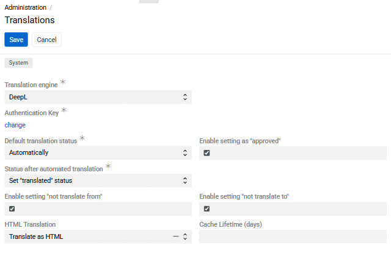
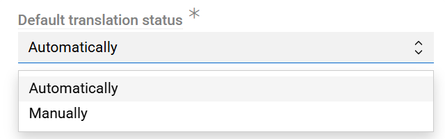
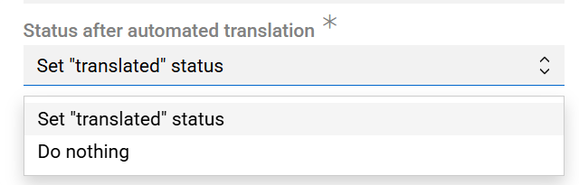
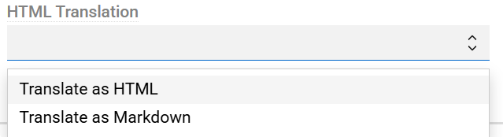
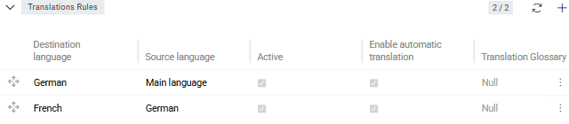
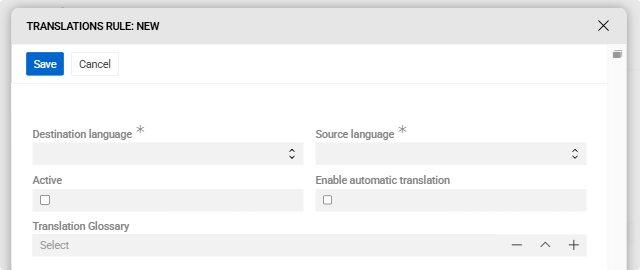
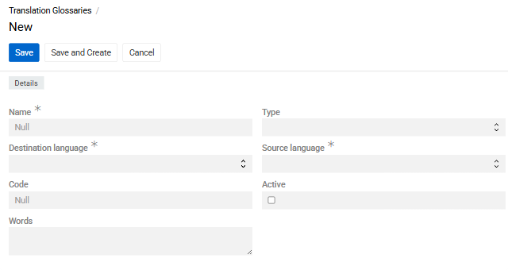
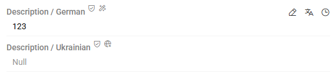
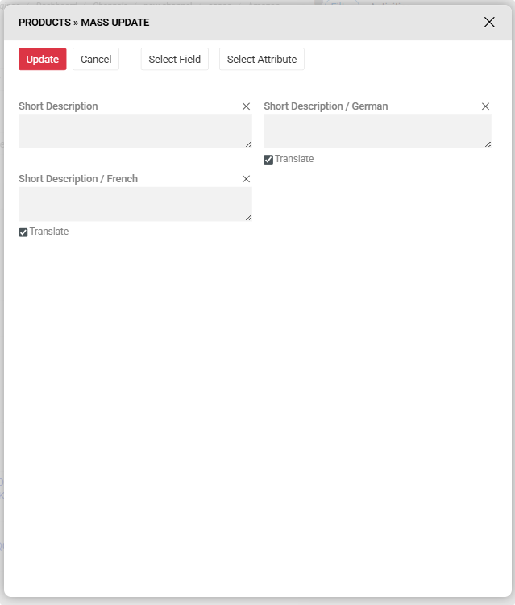

The ["Translations"](https://store.atrocore.com/en/translations/20191) module enables automated and manual translation of multilingual fields, helping you maintain high-quality data across multiple languages. It supports DeepL as machine translation engines.

## Administrator Functions

### Module Setup

To configure the "Translations" module, go to `Administration > Translations`.

{.medium} 

- **Translation engine** – Select the machine translation engine to use for automated translations of [multilingual fields](../../01.atrocore/03.administration/03.languages/docs.md#multilingual-fields).
- **Authentication Key** – Required to access the DeepL translation engine API. Obtain this key by registering on the [DeepL](https://support.deepl.com/hc/en-us/articles/360020695820-API-key-for-DeepL-API) website.
- **Default translation status** – The status automatically applied to all multilingual field values (e.g., on a newly created product or a newly added attribute value). Possible values:
  - *Manually* – The field or attribute value will never be translated automatically.
  - *Automatically* – The field or attribute value will be translated automatically as soon as the source language value changes.

{.medium}

- **Status after automated translation** – Determines the translation status after an automated translation is completed:
  - *Set "Translated" status* – The status is set to "Translated" after automatic translation.
  - *Do nothing* – The status remains unchanged after automatic translation.

{.medium}

- **Enable setting as "Approved"** – Adds an "Approved" option to the translation status. This status must be set manually and indicates that the translation has been reviewed and confirmed.
- **Enable setting "Not translate from"** – Makes the *Not translate from* checkbox available in edit mode for multilingual fields.
- **Enable setting "Not translate to"** – Makes the *Not translate to* checkbox available in edit mode for multilingual fields.
- **HTML Translation** – Choose whether to translate content as HTML or as Markdown.

{.medium}

- **Cache Lifetime (days)** – The number of days that translation results are cached.

### Translation Rules

> Only languages configured in the system can be used in translation rules — see [Languages](../../01.atrocore/03.administration/03.languages/docs.md). If no rule exists for a destination language, the source value is copied without translation.

Translation rules define which languages are translated and how. To manage translation rules, go to `Administration > Translations` and use the **Translation Rules** panel.

{.medium}

To create a new rule, click the `+` button on the panel.

{.medium}

Each translation rule has the following fields:

- **Destination language** – The language to translate into.
- **Source language** – The language to translate from. Only languages supported by the selected translation engine are available.
- **Active** – Whether the rule is active. Inactive rules cannot be used for translation.
- **Enable automatic translation** – Allows this rule to trigger automatic translations.
- **Translation Glossary** – An optional glossary to use with this rule (DeepL only).

A translation rule must be active and have **Enable automatic translation** checked for translations to occur automatically. If no active rule exists for a destination language, neither automatic translation nor manual translation via the `Translate` button will work for that language.

Each rule maps one source language to one destination language. To configure multiple source languages for the same destination language, create multiple rules. The order of rules determines the lookup priority: the system uses the first rule whose source language has an available value. For example, if Spanish has two rules – English first, then German – the system will use the English value if available; otherwise it will fall back to German.

> To change the order of rules, drag and drop them into the desired position in the Translation Rules panel.

**Global Translation**

To translate all records in the system according to a specific rule, open the Translation Rules panel, click the three-dot menu next to the desired rule, and select **Apply globally**.

### Translation Glossaries

Translation glossaries let you control how specific words or phrases are translated, for example to protect brand names from being altered. Glossaries are supported with the DeepL engine only.

To create a glossary, go to `Administration > Translation Glossaries` and click **Create**. Alternatively, click + in the Translation Glossary field when creating a [translation rule](#translations-rules).

{.medium}

- **Name** – A descriptive name for the glossary.
- **Type** – Set to *DeepL* to use the glossary in automated translations. An empty type means the glossary is not used for translation.
- **Source language** – The language of the source terms.
- **Destination language** – The language of the translated terms.
- **Code** – A unique code for the glossary.
- **Active** – Only active glossaries can be assigned to translation rules.
- **Words** – Term pairs, one per line, in the format `source word : destination word`.

To use a glossary, activate it, set its type to *DeepL*, and assign it to a translation rule. A glossary can only be assigned to a rule whose source and destination languages match those of the glossary. Only one glossary can be assigned per rule.

## User Functions

### Translation Status Field

The **Translation Status** field provides an overall translation status for a record. It is read-only and calculated automatically based on the statuses of all multilingual fields in the record:

- **Approved** – All multilingual fields have the status "Approved".
- **Translated** – At least one field has the status "Translated" and no fields have the status "To translate".
- **To translate** – At least one field has the status "To translate".

{.small} 

This field can be added to entity [layouts](../../01.atrocore/03.administration/13.user-interface/02.layouts/docs.md) and used for filtering. To get an overview across an entity, add the [Records by Translation Status](../../01.atrocore/07.dashboards/docs.md#records-by-translation-status) dashlet to your dashboard.

### View Mode

{.small} 

Multilingual text fields may display the following icons:

- **Globe icon** – The field has not been marked as "Approved".
- **Translate icon** – Click to trigger a machine translation for this specific field. This option is only available if a translation rule exists for the field's language.

### Edit Mode

When the Translations module is installed and translation rules are configured, additional controls appear for each multilingual field:

{.small} 

- **Translation status** – A dropdown to mark the field value as *To translate*, *Translated*, or *Approved* (if enabled in module settings).
- **Translate button** – Triggers a machine translation for this field regardless of its current translation status.

To activate automatic translation for a field, check **Translate automatically** in the field or attribute configuration.

When a source language value is changed, the system automatically translates all corresponding fields and attribute values in all destination languages defined in active rules, provided automatic translation is enabled for those rules and the **Translate automatically** option is set for the field.

The **Approved** status serves as an informational marker indicating that the translation has been reviewed. It must be set manually. For each multilingual field, the system also tracks an **Approved** metadata field (true/false) that can be used in mass actions, [import](../../03.data-exchange/01.import-feeds/docs.md) and [export](../../03.data-exchange/02.export-feeds/docs.md) feeds, and search filters.

### Inline Edit Mode

Changing a value through inline editing may trigger automatic translations if *Translate automatically* is enabled for that field. Translations are saved directly to the database without the opportunity to review them first. If you need to review translations before saving, always use the standard edit mode.

> Changing the *Translate automatically* setting to *true* will only trigger an automated translation after the source language value is next edited.

### Mass Actions

**Updating Field Values**

To update multiple records at once, select the records on the list page, click **Actions**, and choose [**Mass update**](../../01.atrocore/12.mass-actions/docs.md#mass-update).

In the **Select field** dropdown, the following options are available for each multilingual field:

{.medium}

- **Translate** – Trigger a machine translation for the selected records, equivalent to clicking the `Translate` button on each record.

A **Translate** checkbox appears in the resulting window. Checking it triggers translation for the selected attribute across all selected records. When this checkbox is active, the value input field becomes inactive and any existing value is cleared.

**Translating All Fields to a Specific Language**

To translate all fields and attributes of selected records into a specific language, select the records, click **Actions**, and choose **Translate / "language"**. The system will use the first active rule for which the chosen language is the destination language and automatic translation is enabled.

**Updating Attribute Values**

The same mass translation actions are available for multilingual attributes. In the Mass update window, click **Select attribute**, choose the desired attribute.

## Translation Completeness

{.small}

If the Quality Check module is installed, you can monitor the percentage of translated or approved multilingual fields per record using the [Translation Completeness](../../01.atrocore/15.data-quality/docs.md#translation-completeness) quality check.
