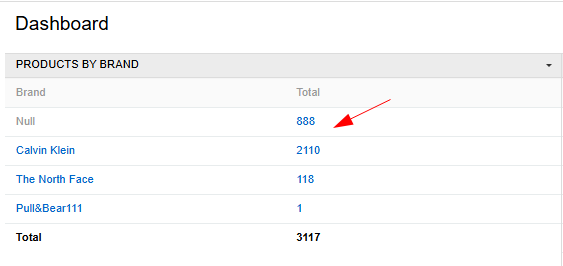
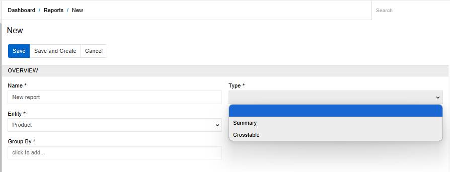
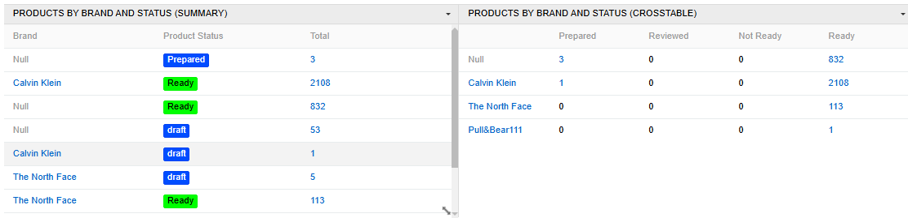
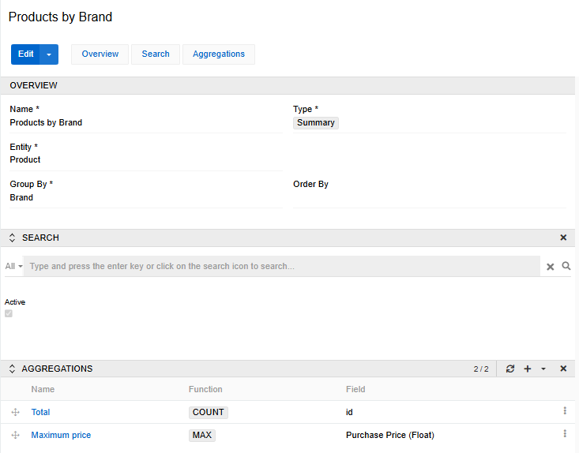
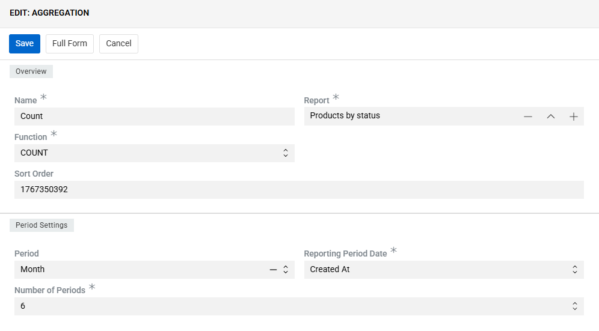
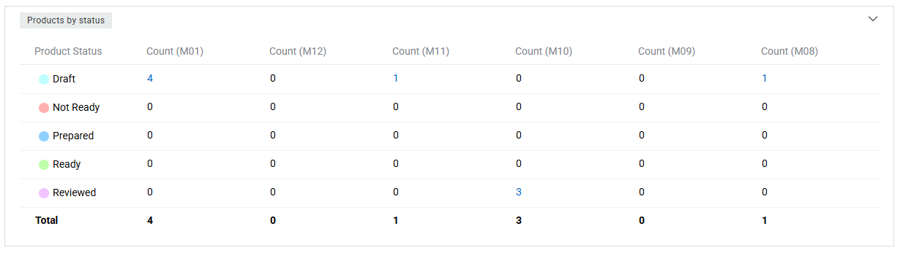
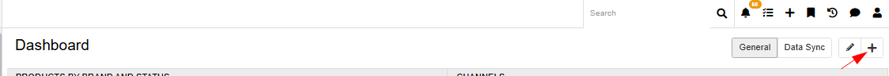
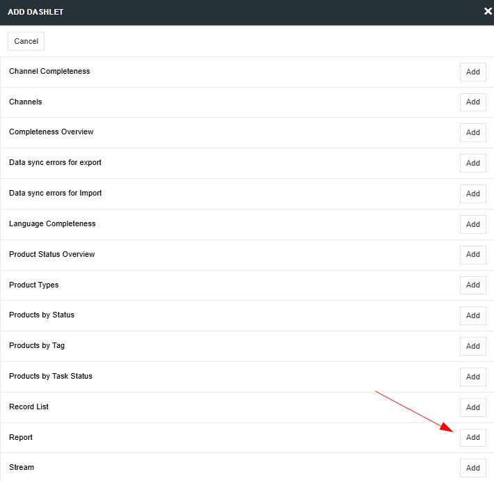

The Reports module allows you to create reports for any entity with grouping records by field(s) of the List or Link type. You can group records by one or more fields using different aggregations (maximum or minimum value, sum, total, and average value). The generated report will be displayed on the [Dashboard](../../01.atrocore/07.dashboards) in the form of a table.

{.large}

Additionally, the values in the aggregation column will be clickable. That is, if you group products by a certain brand and calculate quantity, you can click on the number of products in the column "Total" and the system will redirect you to a page with products filtered by a certain brand.

## Create a report

After installing the module, the Reports entity will appear in the left menu. If not, you can add it in `Administration > User interface`.
To create a new record, go to the Reports entity and click the `Create Report` button. The following pop-up will appear:

{.large}

- **Name** - the name of the report
- **Type** - two types of reports are available: Summary and Crosstable.

Reports of the Crosstable type are grouped by two fields, one of which is displayed horizontally and the other vertically. The summary has no restrictions on the grouped by fields and shows a combination of all the required values. In the screenshots below, you can see the difference between these types.

{.large}

- **Entity** - select the entity for which you want to create a report
- **Group by** - select one or more fields to group records. For a Crosstable report, you need to select two fields. It is possible to select only fields of type List or Link.

Click on the `Save` button to save your report.

{.large}

You can also select an additional filter for the report in the Search panel. For example, you can choose to display only active products or products of certain categories, etc.

Select the aggregations that you want to apply to the report in the corresponding panel. A report of type Crosstable can contain only one aggregation, a Summary report can contain many.

These types of aggregations are available:
- **COUNT** - count the total number of grouped records
- **COUNT(%)** - calculates the ratio of the number of records found to the total number of records in the dataset
- **SUM** - calculates the sum value for a selected field of the float or integer type
- **AVG** - calculates the average value for a selected field of the float or integer type
- **MAX** - calculates the maximum value for a selected field of the float or integer type
- **MIN** - calculates the minimum value for a selected field of the float or integer type

### Period-based aggregation for Summary Reports

For reports of type Summary, it is possible to configure period-based aggregation.
You can define the aggregation periodicity (week, month, or year), select a date or datetime field that will be used to split records into periods, and specify how many periods should be included (from 1 to 12, with a default of 6).

For example, you can display the number of products created over the last six months, split by months and grouped by the product status. The Crosstable report type does not support period-based aggregation.

{.large}
{.large}

## Display a report on the Dashboard

Once a report has been created, you can display it on the Dashboard. To do this, create a new [Dashlet](../../01.atrocore/07.dashboards/docs.md#dashlets) of the Report type and select the desired report to display.

{.large}
{.large}

Click `Options` to set the desired name for the Dashlet and select the report you want to display.
