The [Components](https://store.atrocore.com/en/components/20199) module enables you to generate components for Amazon and other stores using data from your AtroCore system. You can then export these components to any of these stores.

Although components can be added to other entities, they are intended for products by default. Therefore, all of the examples below are suited to products. 

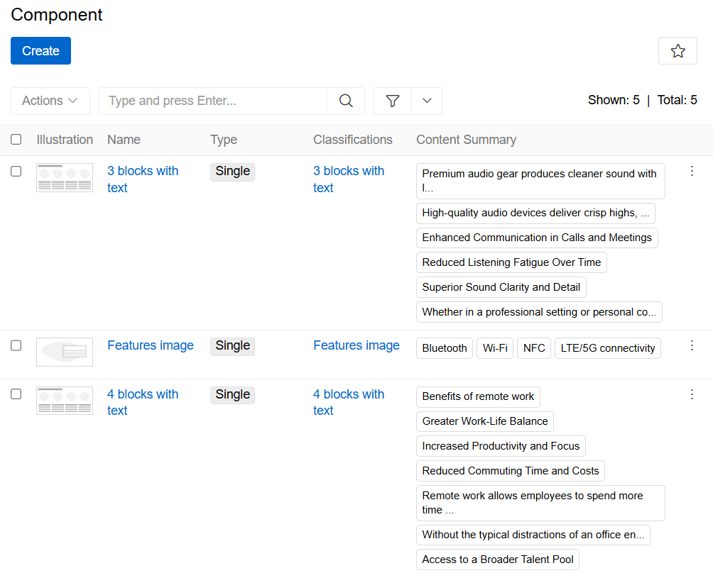{.medium}

> A product can comprise more than one component, and a component can be used in more than one product. Any change to a component will be visible in all products containing that component.

## Creating a Component

Once the module has been installed, you can access the 'Component' entity page from [navigation menu](../../01.atrocore/03.administration/13.user-interface/01.navigation) and create the necessary components. Then select the type of component you wish to create.

### Single type

A single component is the standard version of a component. To create it, you have to select a [classification](../../01.atrocore/03.administration/12.attribute-management/04.classifications). This specifies how the component will look and which attributes will be used, by using an HTML/CSS template. There are many out-of-the-box component classifications, such as three blocks with text, image and highlight, image and text, etc. You can also configure your own classifications.

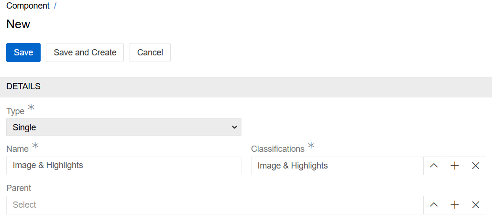{.medium}

After that you can fill in the 'Component Classification' attributes in 'Attributes' panel and link the component to the product(s) at any time, including after the initial setup by adding products to a component or adding components to a product.

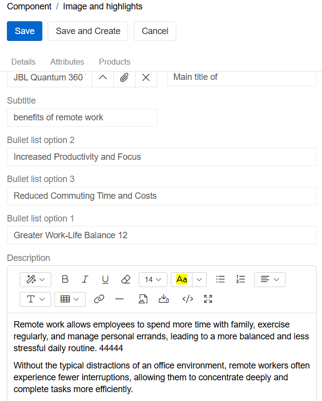{.medium}

### Group type

The purpose of the 'Group' component type is to enable components, whether groups or single types, to be joined together to form a combined component, thereby facilitating ease of use. This adds them as a group to the products and allows them to be managed as a group. To create a 'Group' component, select the components you want to join and link them to the product(s).

## Component Classification

To configure custom components, you first need to create a 'Component Classification' for them. To do this, go to [Classifications](../../01.atrocore/03.administration/12.attribute-management/04.classifications) and create one for the 'Component' entity.

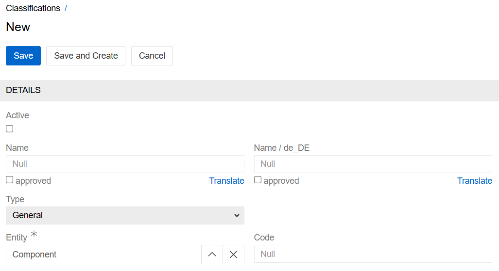{.medium}
 
Next, select the entity in which your component will be used. By default, this is only the product.

The 'Component Classification' illustration is optional and shows the structure of your component.

Then, configure the HTML/CSS template — it uses [Twig](https://help.atrocore.com/developer-guide/twig-tutorial) syntax. First, select the attributes that you want to use, then identify them in Twig by their ID or code. 

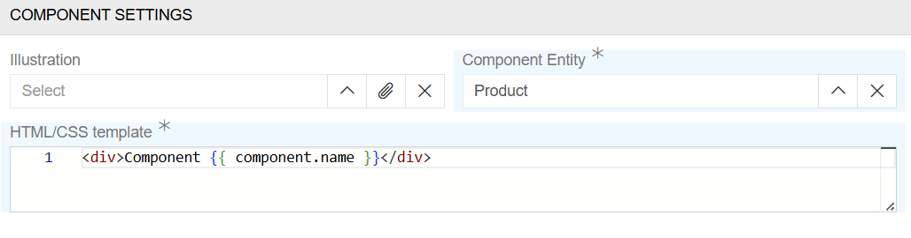{.medium}

In the example below, the component consists of one banner picture identified by the attribute code (attribute_id). 

In this example, create an attribute of type 'File' for the 'Component' entity with the code 'attribute_id'. Link this attribute to the 'Component Classification' in question. You can do this either before or after adding the Twig script, but the attribute must be added for the component to work.

```
 
 
 
 
 
    <div class="component-block image">
        <picture {{ editable(component, [image]) }}>
            
        </picture>
    </div>

    <style>
        .component-block.image picture {
            width: 100%;
        }

        .component-block.image picture img {
            max-width: 100%;
            width: 100%;
            height: auto;
            display: block;
        }
    </style>

```

>Only attributes that have been selected as 'Classification Attributes' can be used in an HTML/CSS template.

## Component Preview

You can preview components in the AtroCore system in the 'Preview and Edit' menu, or as part of the 'Product Preview'.

### Preview and Edit menu

To select this preview mode, go to the 'Components' tab in the 'Products' and click the 'Preview' button in the bottom right corner.

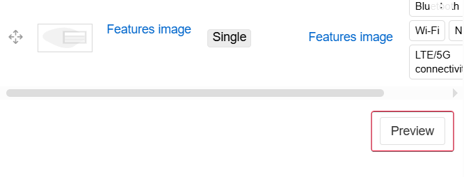{.medium}

After that, you can view and edit any component, as well as changing the order of components, etc.

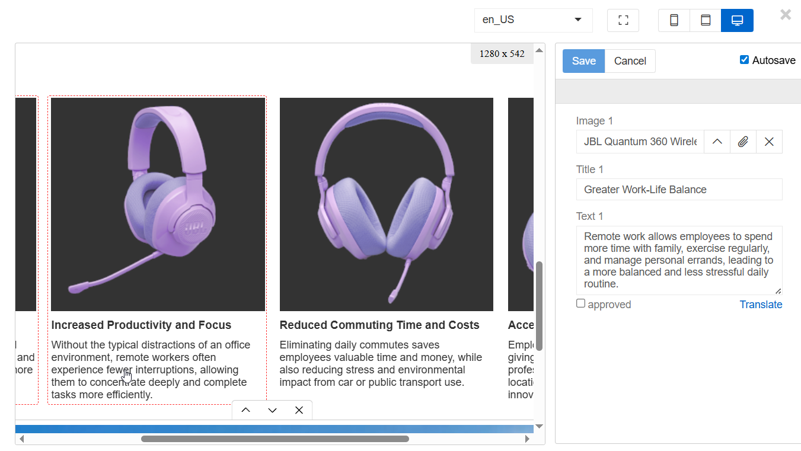{.large}

- To edit a component's content, select it by clicking on it and enter or amend the necessary information. Information that is language-dependent will only be updated in the currently selected language. All non-language-dependent information will be updated in all languages. All changes are the same as in the [Single type](#single-type) menu.
- The autosave option automatically saves all changes made by the user. Use it carefully.
- To change the currently selected language, go to the language selector in the top right-hand corner. This will change the language in which components are displayed and edited. To configure multilingualism, go to [languages](../../01.atrocore/03.administration/03.languages) page.
- To the right of the language selector, you can adjust the view type of the component (phone, tablet or computer screen) and switch to full-screen mode.
- "Translate" option is configured by administrator by using [Translations](../04.translations) module.
- To change the order of a component, either select it or hover the mouse over it and click the up or down button below.
- To unlink a component, select it and click the 'X' button below.

### Product Preview

The Product Preview uses the same view as the [Preview and Edit menu](#preview-and-edit-menu), but it is not possible to change the components using this menu. To access it, click the 'Product Preview' button on the top panel of the product. Components are a part of the Product Preview panel.

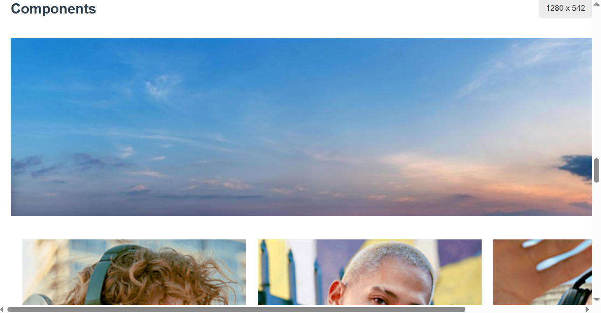{.medium}

[More information on product Preview.](../../01.atrocore/10.html-css-preview)

## Enabling Components for Other Entities

By default, components are only available for products. To enable components for other entities, go to [entity manager](../../01.atrocore/03.administration/11.entity-management/docs.md#configuration-fields) and select the `Has Content Components` checkbox for the desired entity.

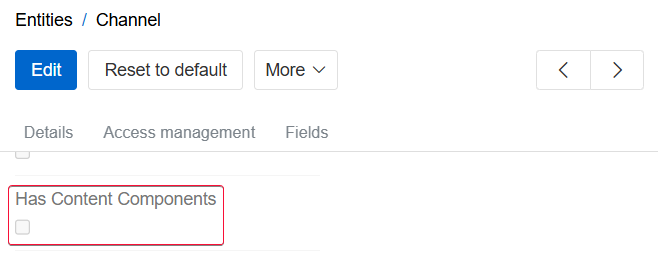{.medium}

> To display the Components panel on the detail view of another entity, you must manually add the Components panel to that entity's layout. Enabling the checkbox does not add the panel automatically.

## Examples

We will go into detail on how you can create your own components, providing a couple of examples.

### Example 1 - An image with a link

This is a simple component consisting of a name, a link and an image. To create it, we will need three attributes: a text attribute (code 'text_attribute_id'), a URL attribute (code 'link_attribute_id') and a file attribute (code 'file_attribute_id'). Let's link them to the classification, and then we can adjust their positions in the HTML/CSS template. This is what the template will look like:

```








<div class="image-container">
    
        <p class="text">{{ text }}</p>
    

    
        <p>{{ url }}</p>
    

    
        
        
            
        
    
</div>

<style>
    .image-container {
        display: flex;
        flex-direction: column;
        max-width: 400px;
        align-items: center;
        text-align: center;
    }

    .image-container .text {
        margin: 1em 0;
    }
</style>
```
Next we will create a component from this classification and add values to attributes we linked to the classification:

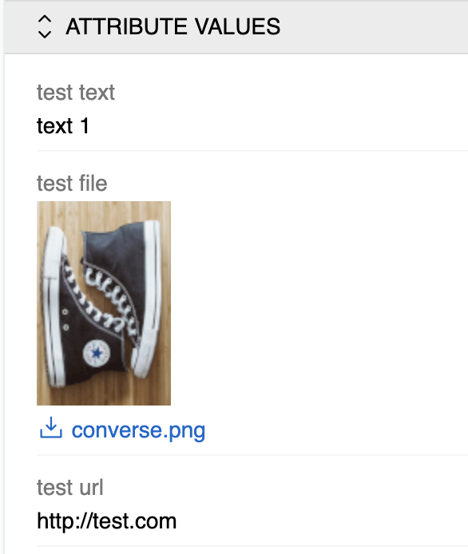{.small}

Now all we need to do is link this component to a product or products.

This is how the end result looks:

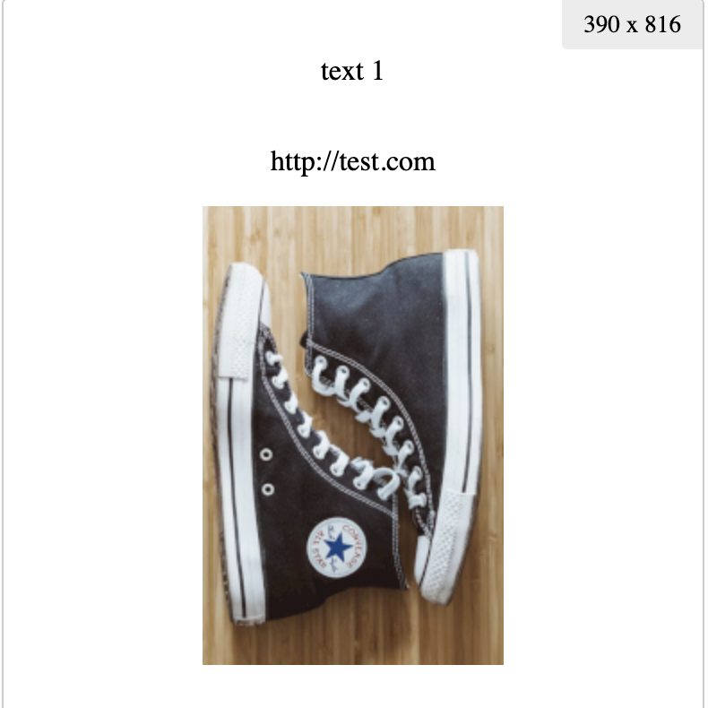{.small} 


### Example 2 - 4 images with text

This is a simple component consisting of four images with text beneath them, arranged in a square. We will need twelve attributes for it: four text attributes for titles, four text attributes for body texts and four file attributes. See expected attribute codes below. Let's link them to the classification, and then we can adjust their positions in the HTML/CSS template. This is what the template will look like:

```


<div class="component-block quadrant">
    
        
        
        

        
            <div class="item" {{ editable(component, [block.image, block.title, block.text]) }}>
                
                <picture>
                    
                </picture>

                <div class="content">
                    
                        <h3>{{ title }}</h3>
                    

                    <div class="description">
                        {{ text|raw }}
                    </div>
                </div>
            </div>
        
    
</div>

<style>
    .component-block.quadrant {
        font-family: sans-serif;
        margin-top: 20px;
        display: flex;
        flex-wrap: wrap;
        gap: 40px;
    }

    .component-block.quadrant > .item {
        flex: 0 1 calc(50% - 40px);
        display: flex;
        flex-wrap: wrap;
        gap: 20px;
    }

    .component-block.quadrant > .item picture {
        flex-basis: 175px;
    }

    .component-block.quadrant > .item picture img {
        width: 100%;
        height: auto;
    }

    .component-block.quadrant > .item .content {
        flex: 1;
        min-width: 0;
    }

    .component-block.quadrant > .item h3 {
        margin-top: 0;
    }

    .component-block.quadrant > .item .description {
        text-align: justify;
    }

    @media (max-width: 800px) {
        .component-block.quadrant > .item {
            flex-basis: 100%;
        }
    }

    @media (max-width: 512px) {
        .component-block.quadrant > .item picture {
            flex-basis: 150px;
        }
    }

    @media (max-width: 400px) {
        .component-block.quadrant > .item {
            gap: 10px;
        }

        .component-block.quadrant > .item picture {
            flex-basis: 100%;
        }
    }
</style>
```
Next we will create a component from this classification and add values to attributes we linked to the component:

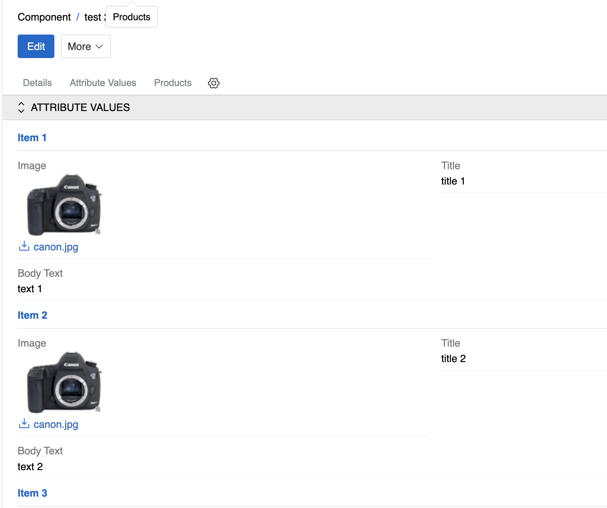{.medium}

Now all we need to do is link this component to a product or products.

This is how the end result looks:

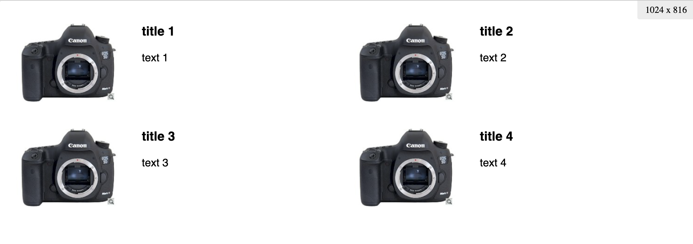{.medium}