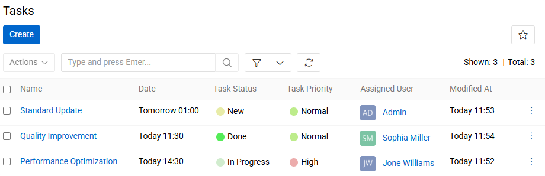
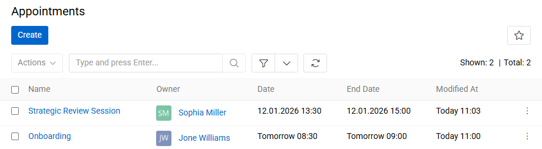
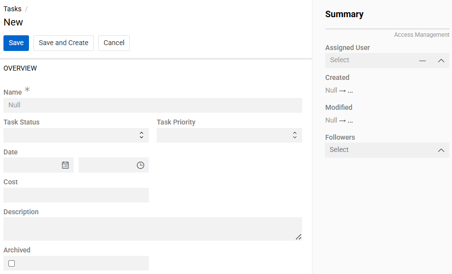
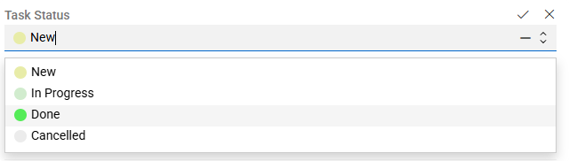
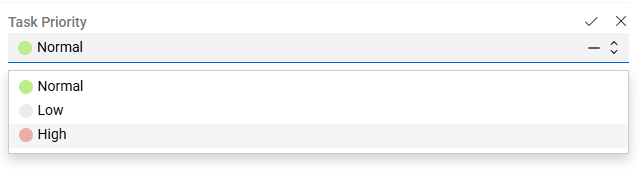
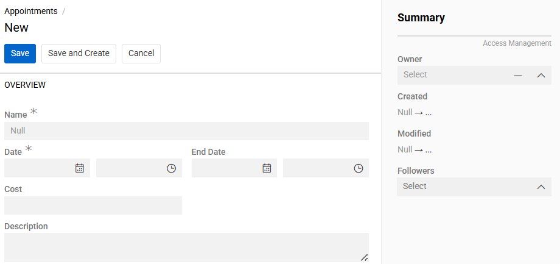

The ["Activities"](https://store.atrocore.com/en/activities/20222) module provides task and appointment management capabilities within Atro. It enables users to manage tasks alongside scheduled appointments in a single, unified module.

The module supports priority-based task creation, deadline tracking, status management, and notification subscriptions.

! Activities integrates with the [Projects](#integration-with-projects) module to enable project-based task tracking and budget connections.

## Activities core capabilities

The Activities module supports two entity types: Tasks for action items requiring completion, and Appointments for scheduled events.

Tasks include priority levels, deadline assignment, status tracking, and cost fields. Users can follow tasks to receive notifications when changes occur.

{.large}

Appointments function as calendar events with time slot allocation and participant management.

{.large}

## Creating tasks

Navigate to `Tasks` and click the `Create` button. Enter the task name and select the task status. Set the priority level and due date for completion.

{.large}

| **Field Name** | **Description** |
|----------------|-----------------|
| Name | Task title or brief description |
| Task Status | Current task state for tracking progress |
| Task Priority | Importance level of the task |
| Date | Deadline for task completion |
| Cost | Value associated with the task |
| Description | Detailed task information and requirements |
| Archived | Checkbox to mark task as archived |

There are [Access Management](../../01.atrocore/03.administration/14.access-management/01.users/docs.md) fiedls on the **Summary** panel:
- **Assigned User** - user responsible for completing the task.
- **Followers** - users following changes in the task.

### Task status options

{.medium}

Four default statuses are available: Done, New, In Progress, Cancelled.

### Task priority options

{.medium}

Three default priorities are available: Low, Normal, High.

> Customize status and priority options by navigating to `Entity Fields / Task Status` or `Entity Fields / Task Priority` for the Task entity and editing values in the `List Options` panel.

## Creating appointments

Navigate to `Activities / Appointments` and click the `Create` button. Enter the appointment name and set the start and end dates with times.

{.large}

| **Field Name** | **Description** |
|----------------|-----------------|
| Name | Appointment title or subject |
| Date | Scheduled beginning date and time |
| End Date | Scheduled ending date and time |
| Description | Appointment details and agenda |

Also, there are [Access Management](../../01.atrocore/03.administration/14.access-management/01.users/docs.md) fiedls on the **Summary** panel:
- **Owner** - user currently responsible for the appointment
- **Followers** - users following changes in the appointment

## Managing Activities module records

Task and appointment [Records](../../01.atrocore/08.record-management/docs.md) appear in their respective list views with sorting and filtering options. Click any record name to open its detail view.

Use the Edit button to modify record details. Status changes in tasks automatically update the modification timestamp for tracking purposes.

Follow specific records to receive notifications when other users make changes. Configure notification preferences in user settings.

Archive completed records using the `Archived` checkbox to maintain a clean active list while preserving historical data. Archived records remain searchable but are excluded from default list views.

## Integration with projects

When the [Projects](../08.projects/docs.md) module is installed, tasks and appointments can be linked to project records. Project detail views display associated activities on dedicated panels.

Create new activities directly within project context using these panels to automatically establish the project relationship. Budget item connections enable financial tracking at both task and project levels.