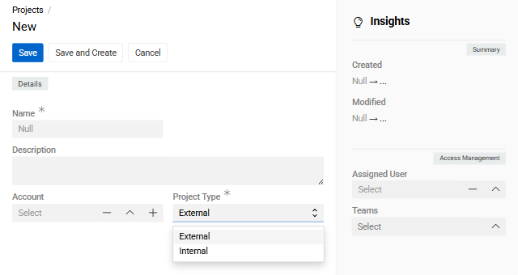
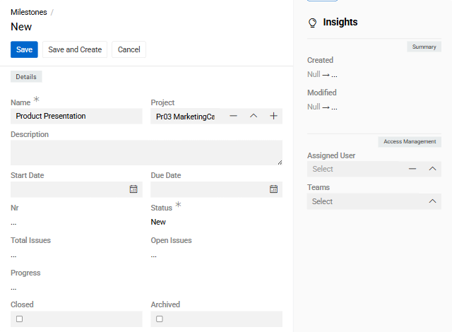
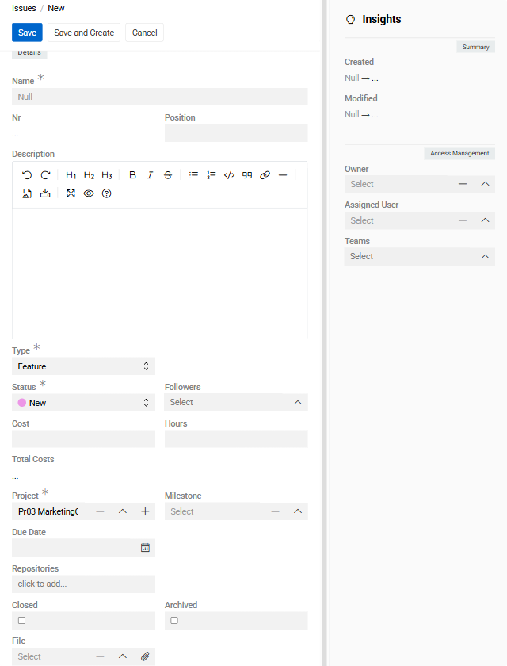
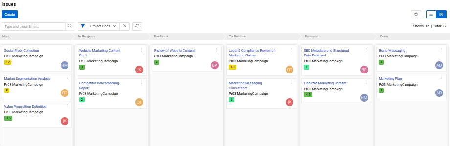

The ["Projects"](https://store.atrocore.com/en/projects/20225) module provides comprehensive project management capabilities within Atro. It enables teams to plan, track, and execute work through organized projects, milestones, and issues with support for both structured planning and agile workflows.

The module supports project creation, milestone tracking, issue management, and label-based workflow organization. Users can monitor overall progress and manage project-level resources.

## Core capabilities

The Projects module supports three primary entity types: 
- **Projects** serve as the top-level container for all related work. Each project includes configurable metadata such as the project name, owner, and etc. You can assign teams or individual members and monitor overall progress from the project detail view.
- **Milestones**  organize a project into time-based or goal-oriented phases. Completion is automatically tracked based on the resolution status of linked issues, giving teams a clear picture of phase-level progress without manual updates.
- **Issues** represent individual work items — features, bugs, requests, and so on. Each issue can be assigned to a user, prioritized, linked to a milestone, and moved through a defined set of statuses to reflect its current state.

! Projects integrates with the [Activities](../07.activities/docs.md) module to enable task and appointment connections within project contexts. This integration enables comprehensive tracking of both structured issues and ad-hoc activities within the same project scope.

The [Insights](../../01.atrocore/03.administration/13.user-interface/02.layouts/docs.md#insights) view group includes the following [Access Management](../../01.atrocore/03.administration/14.access-management/01.users/docs.md) fields, available on every record type (including Projects, Milestones, and Issues):
- **Owner** — the user who created the record.
- **Assigned User** — the user responsible for resolving the record.
- **Teams** — teams associated with this record.

## Creating projects

Navigate to `Projects` and click the `Create` button. Enter the project name and select the project owner. Assign team members and set estimates and deadlines as needed.

{.medium}

| **Field Name** | **Description** |
|----------------|-----------------|
| Name | Project title |
| Project Type | Classification or category of the project |
| Account | Associated account, if applicable |

After creating the project, the detail view displays `Total Issues` and `Current Issues` counts, along with panels for related issues, milestones, and budget items.

## Creating milestones

Navigate to `Milestones` and click the `Create` button. Enter the milestone name, link it to a parent project, and set target dates.

{.medium}

| **Field Name** | **Description** |
|----------------|-----------------|
| Name | Milestone title or phase name |
| Project | Parent project for this milestone |
| Start Date | Planned beginning date |
| Due Date | Target completion date |
| Description | Milestone goals and deliverables |

Milestone completion is automatically calculated based on the resolution status of linked issues.

## Creating issues

Navigate to `Issues` and click the `Create` button. Enter the issue title, select the issue type and priority, and link to relevant milestone or project.

{.medium}

| **Field Name** | **Description** |
|----------------|-----------------|
| Name | Issue title or brief description |
| Type | Classification such as feature, bug, or request |
| Status | Current state for tracking progress |
| Followers |Users following changes in the issue|
| Project | Parent project for this issue |
| Milestone | Associated milestone |
| Description | Detailed issue information and requirements |
| Cost | Estimated or actual cost of the issue |
| Hours | Estimated or logged hours |
| Due Date |Target completion date for the issue|
| File |Attached file or reference document|

## Status and Type management

**Issues** progress through six default statuses that cover the full lifecycle of a work item:

| Status | Description |
|--------|-------------|
| Backlog (New) | Issue has been created but not yet started |
| In Progress | Actively being worked on |
| Feedback | Awaiting input or review from stakeholders |
| To Review | Ready for quality or peer review |
| Released | Delivered to users or staging |
| Done | Fully completed and resolved |

**Issues** also include three default types: Bug, Feature, and Request.

**Milestones** use a simplified set of statuses: New, In Progress, and Completed.

## Kanban view

[Kanban view](../../01.atrocore/04.understanding-ui/docs.md#kanban-view) provides a visual board layout organized by status — useful for teams following agile workflows.

The Kanban board displays issues as cards grouped by their current status. You can drag and drop issues between columns to update their progress directly from the board.

 {.large}

> Kanban view is also available for Milestones, providing the same visual workflow for milestone management.

## Managing Projects module records

Project, milestone, and issue [Records](../../01.atrocore/08.record-management/docs.md) appear in their respective list views with sorting and filtering options. Click any record name to open its detail view.
Use the `Edit` button to modify record details like `Status` in issues.

Follow specific records to receive notifications when other users make changes. Configure notification preferences in user settings.

Archive completed records using the `Archived` checkbox to maintain a clean active list while preserving historical data. Archived records remain searchable but are excluded from default list views.