The ["Workflows"](https://store.atrocore.com/en/workflows/20194) module enables you to implement and manage different processes and actions, triggered by certain events in the system and taking account of certain conditions. 

It tracks changes in any system entities and performs certain actions at the same time. The main purpose of workflow configuration and programming is to automate processes and create/modify data records, to save time, minimize human error, and improve collaboration. The module is designed to support a wide range of workflow scenarios, covering most common automation use cases.

> The detection of an action occurs on the server side and not on the user interface side. So, the changes are tracked via API.

## Concepts

A workflow is a model of a process in your application.
  
## Configure a Workflow

Workflows are created in the same way as other entity [Records](../../02.atrocore/08.record-management/docs.md#creating-records). The system allows you to configure an unlimited number of workflows, and multiple workflows can be attached to a single entity.

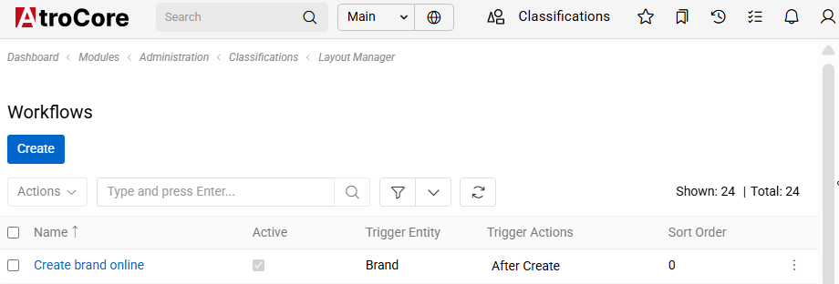{.large}

When creating a workflow, first specify its **Name**, then select the **Trigger entity**, which defines the entity the workflow listens to, for example, Product. Next, choose the **Trigger Actions** that initiate the workflow execution, such as before create or before update. You may also define a **Conditions Type** that determines when the workflow should be executed, for example, only if the entity is active. This condition is optional; if it is omitted or set to always true, the workflow will be triggered every time the specified action occurs.

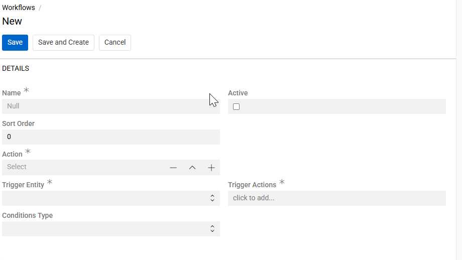{.large}

### Trigger Actions

For workflow to work you must set trigger actions. They are the essence. they can be before or after update, create or delete. When one of mentioned actions is achieved then workflow is started. You can choose multiple actions, but at least one is always required. For more advance settings use conditions.

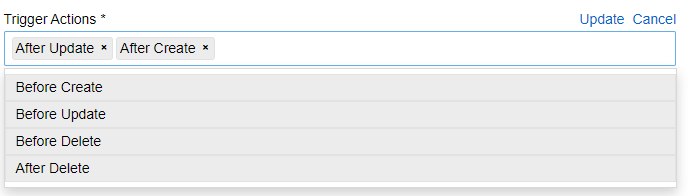{.large}

### Conditions Type

There are two condition types available - "Basic" and "Script". Their logic basically states: "trigger workflow on trigger action when condition is fulfilled (the results are true)".

#### Basic

For easier use you can select [basic](../../02.atrocore/03.administration/11.entity-management/03.fields-and-attributes/docs.md#basic-conditions-type) conditions. They follow common logical operators such as AND, OR, and NOT, which can be combined in any structure. Fields are the end results, and their options to look at are the same as for filtering. In the example below, the workflow is triggered when the Amount field is empty OR the Brand field is set to Xiaomi.

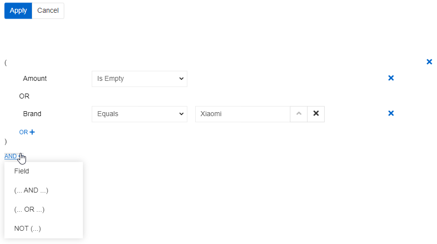{.medium}

Here you can see condition for our first example.

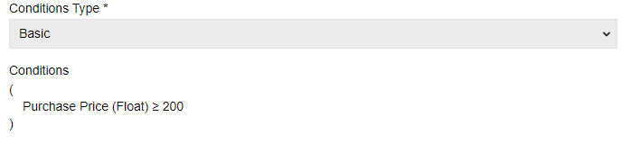{.large}

#### Script

Script is more complicated use case but as a result more versatile. It uses [Twig syntax](../../11.developer-guide/80.twig-tutorial/docs.md) for formulas. To use it you have to set a formula that results in a default Boolean variable "proceed" ().

> Conditions use database query to function. They are launched every time Trigger Actions are made. So, not to overload it with multiple queries, please, minimize amount of database queries by using best practices. For example, for twig you can set variables (like ) instead of doing full blown database queries for every field. You can also check if an entity is linked to another (like ) before setting variables.

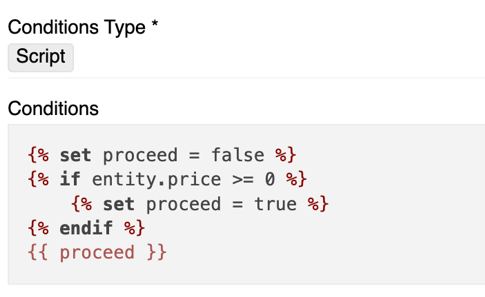{.large}

You can see condition for our second example.

### Workflow Actions

 Workflow [Actions](../../02.atrocore/03.administration/06.actions/docs.md#automatic-execution) are the a separate entity. They are the essential for workflows to work. Workflow actions define what happens when the workflow is triggered and conditions are met. Each workflow can execute one defined action, which can be either a single action or an [Action Set](../../02.atrocore/03.administration/06.actions/docs.md#action-set) containing multiple actions.

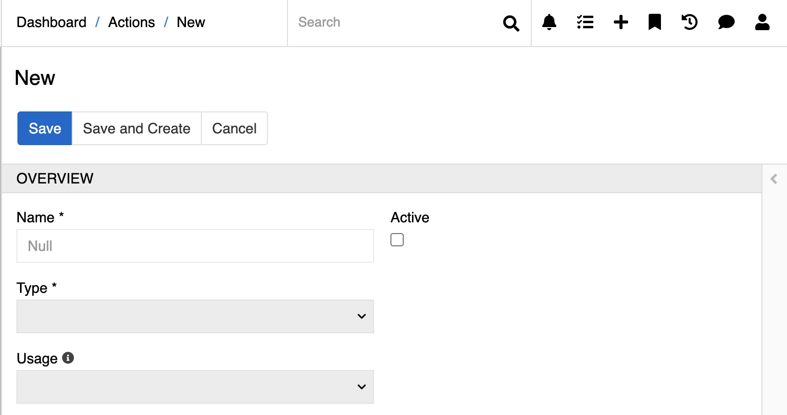{.medium}

 Usage prescribes placement of the action. It can be used a new custom action from record page or as a custom action from entity page.

For more details, refer to the documentation on [Action Types](../../02.atrocore/03.administration/06.actions/docs.md#action-types).

## Examples

### Automatically assign a tag

You can automatically assign a tag to a product when its price exceeds 200 EUR.
For this scenario, the “After Create” and “After Update” triggers are used to ensure that the rule is applied both to newly created products and to existing ones when they are modified. After the record is saved, a condition checks whether the price meets the required threshold, and an automatic action updates the Tag field accordingly. The “After” trigger is required because the workflow modifies data only after it has been persisted.

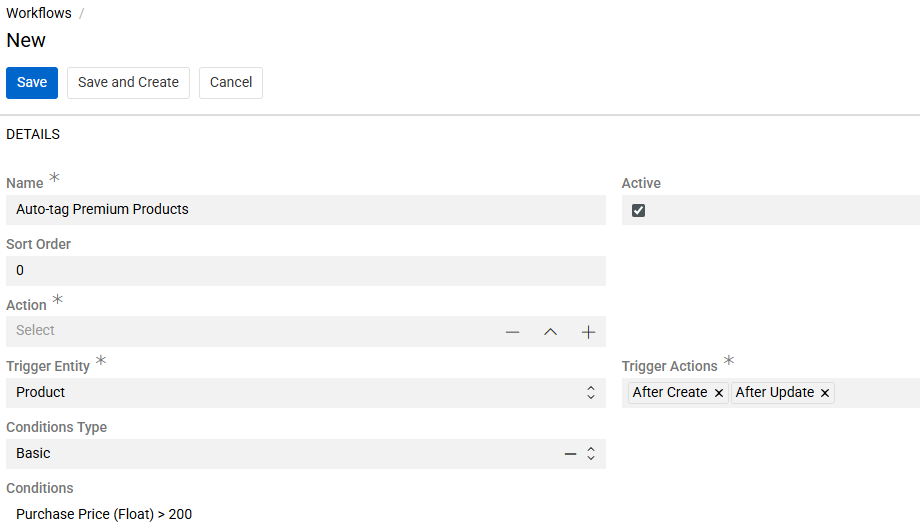

In addition, it is necessary to define an action that updates the Tag field and is executed automatically as part of the workflow. This action is triggered once the workflow conditions are satisfied and performs the required modification of the Tag field without manual intervention, ensuring that the tagging logic is applied consistently and systematically across all relevant records. 

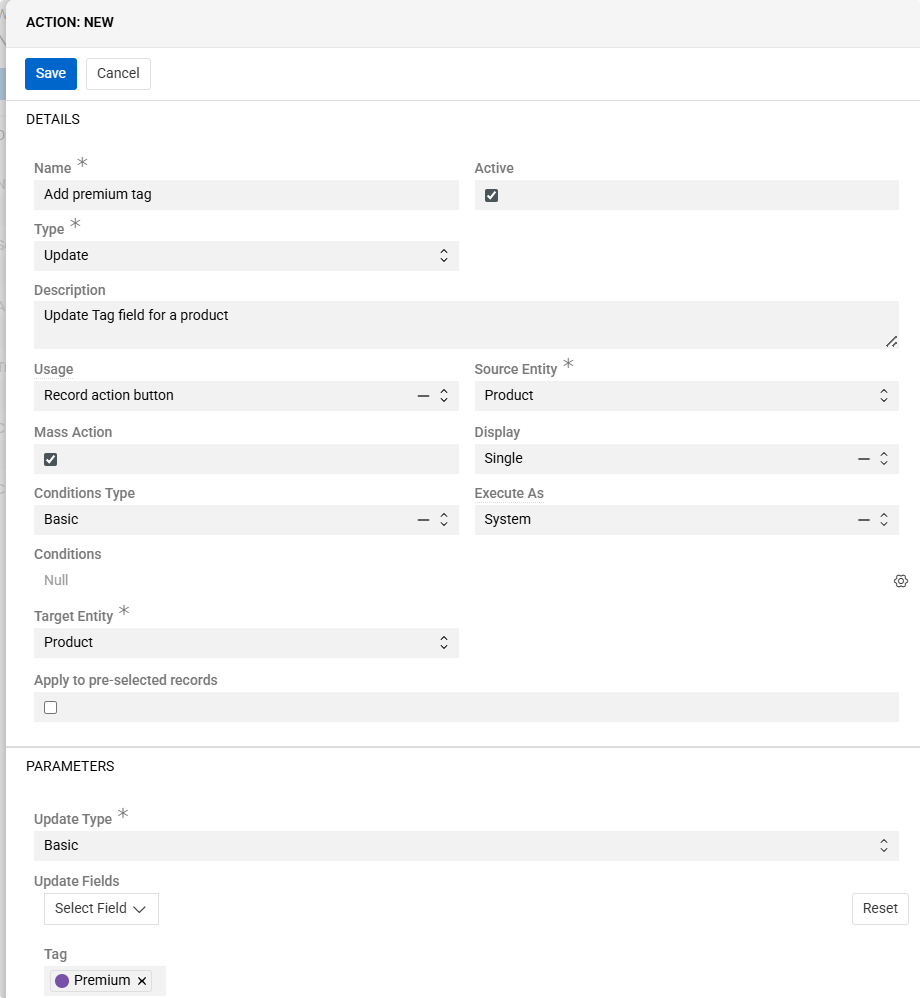

> To update only the currently triggered record, select the **Apply to pre-selected records** chechbox option.

### Displaying an error message

You can prevent a product from being saved by displaying an error message when its price is 0 USD, missing, or invalid.

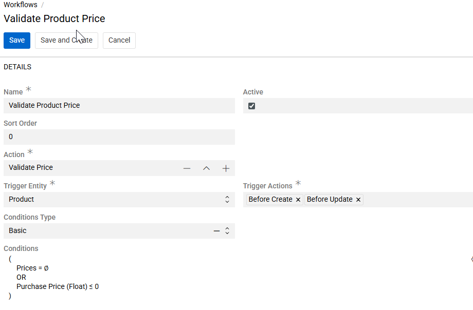

In this case, the “Before Create” and “Before Update” triggers are used to validate the data before it is stored. The condition captures all invalid price values, and the “Before” trigger ensures that incorrect data is blocked at the save stage and never persisted in the system.

### Update attribute value

You want automatically to add an attribute with selected value. For our example we will take "Test value".

We will select "After Update" and then check if the selected by id attribute is in the product.

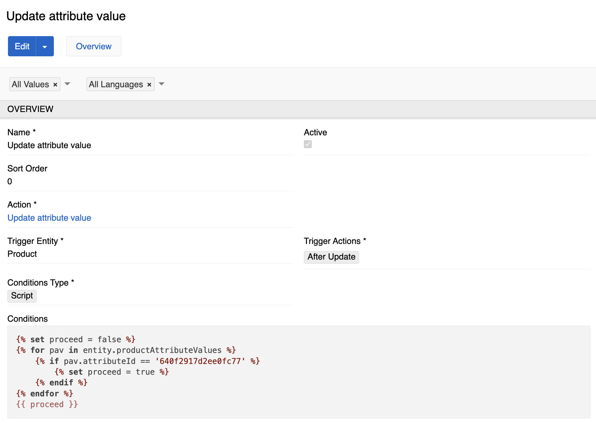{.large}

Then we will update the action.

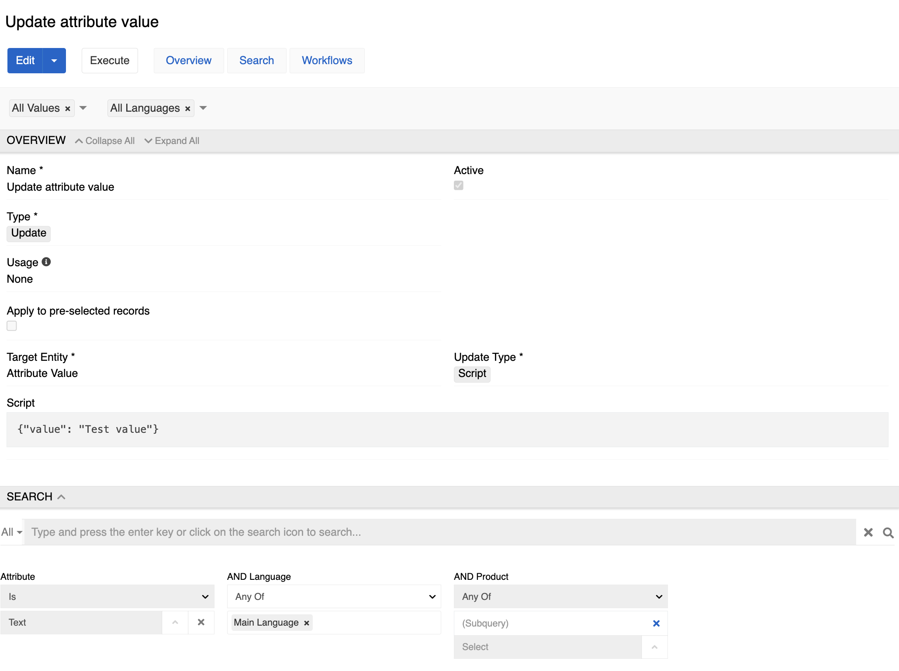{.large}

If the status switches to "Done" and no price greater than 10 is specified, we display a message

First we check if the record receives the "Done" status and no price greater than 10.

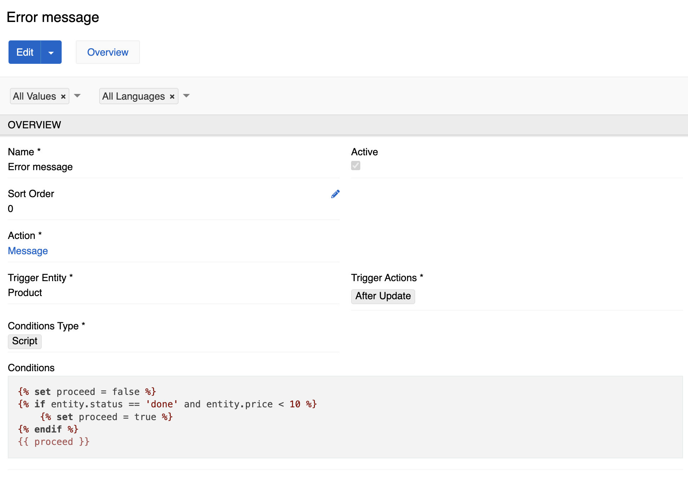{.large}

Then we use message action with custom message.

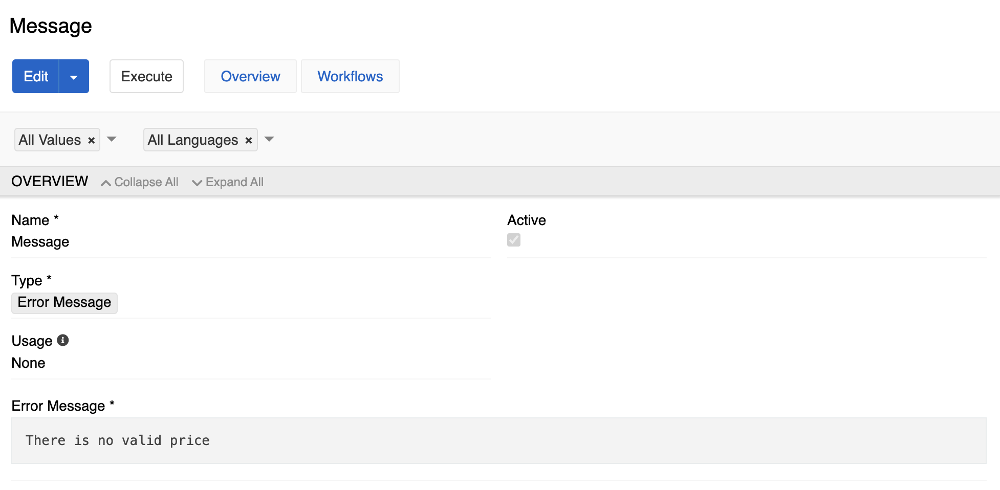{.large}

### Execute export feed when status is changed to “Approved”

When the entity receives the "Approved" status, we execute an export feed that creates a record of this entity on the production server.

First we check if the record receives the "Approved" status.

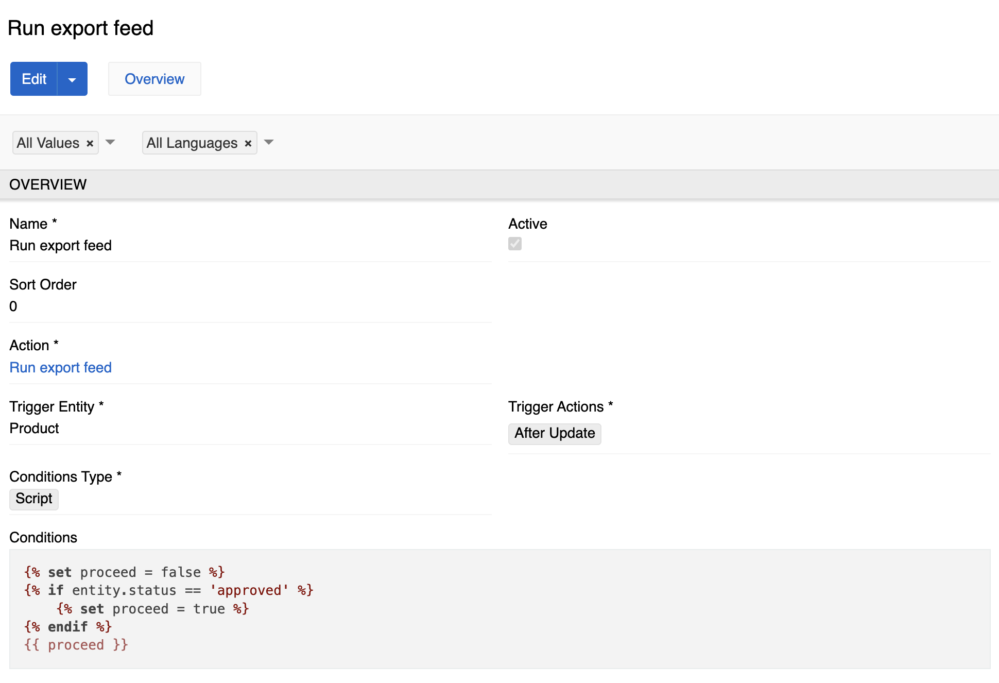{.large}

Then we execute export action with all needed information. For the example below we export only id.

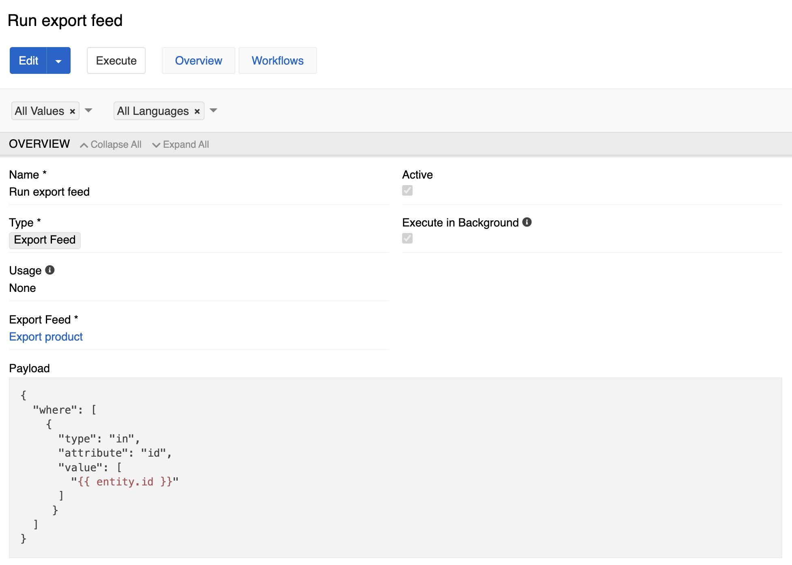{.large}
