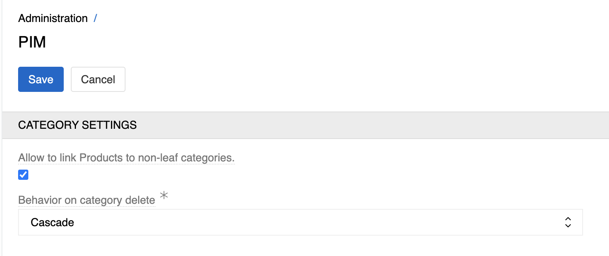

Read [Administration](../../01.atrocore/03.administration/) section for general administration features.

Following settings are specific to PIM, available via **Administration → PIM Settings**.

{.medium}

- **Allow to link Products to non-leaf categories**: If set, you will be able to link products with categories that have child categories.

- **Behavior on category delete**: 
  - **Cascade**: All subcategories of this category will be removed and all products linked to this category or its subcategories will be unlinked.
  - **Restrict**: Prevents deletion when categories contain products or subcategories.

## Required Skills for AtroPIM Implementation

Read Chapter [Required Skills](../../01.atrocore/02.getting-started/01.required-skills) to better understand which skills are required for implementing the AtroPIM software independently. If you would like to outsource the software implementation (or its parts) to AtroCore Company or our Implementation Partners, please contact us.
