**Product** – the item in physical, virtual or cyber form as well as a service offered for sale. Every product is made at a cost and sold at a price.

Product is a [Hierarchy](../../01.atrocore/03.administration/11.entity-management/01.entity-types/docs.md#hierarchy) entity type in PIM. Each product can be assigned to a certain [Classification](../07.classifications/), which will define the attributes to be set for this product. A product can be assigned to several [categories](../05.categories/), be of a certain [brand](../04.brands/), described in several languages and be prepared for selling via different [channels](../06.channels/). A product can be in [association](../../01.atrocore/03.administration/11.entity-management/08.associations/) of the certain type with some other product, and thus within different associations and with different products. It is possible to set different [attribute](../../01.atrocore/03.administration/12.attribute-management/) values for different channels and upload product images.

## Product Fields

The product entity comes with the following preconfigured fields; mandatory are marked with *:

| **Field Name**           | **Description**                            |
|--------------------------|--------------------------------------------|
| Name *			       | The unique product name used for identification and display purposes.	|
| Active		           | Indicates whether the product is active and available for use in the system. Inactive products can be excluded from most operations such as exports and listings.	|
| Brand		    	       | Reference to the brand associated with the product. This field is linked to a [Brand](../04.brands/) entity.	|
| Number			       | The internal or external product number (e.g., SKU, model number, or article number).								|
| Status			       | Defines the lifecycle state of the product (e.g., Draft, Approved). The available values depend on system configuration.						|
| Tag			           | A field used to assign tags for categorization, search, and filtering purposes.	|
| Short Description	       | A brief textual description of the product, typically used in listings or summary views.	|
| Long Description	       | A detailed textual description of the product, used for extended product information, marketing content, or technical specifications.	|
| Classification		   | Specifies the [Classification](../07.classifications/) within which the product is created. The selected Classification determines which attributes are available for the product.	|
| Main Image		       | The primary image associated with the product, used as the default visual representation in the UI.	|

If you want to make changes to the product entity, e.g. add new fields, or modify product, you can do it via administration.

## Listing

To open the list of product records available in the system, click the `Products` option in the navigation menu:

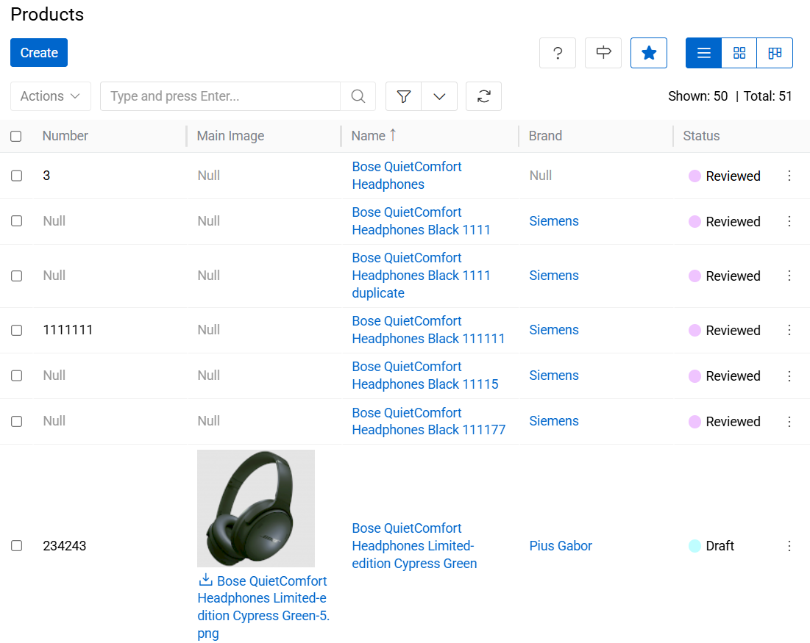{.large}

By default, the following fields are displayed on the [list view](../../01.atrocore/04.understanding-ui/docs.md#list-view) page for product records:
 - Number
 - Main Image
 - Name
 - Brand
 - Status
 - Tag
 - Active
 - Owner

To change the product records order in the list, click any sortable column title; this will sort the column either ascending or descending.

### Mass Actions

The following mass actions are available for product records on the list/plate view page:

- Remove
- Compare
- Merge
- Select
- Mass Update
- Export
- Add relation
- Remove relation
- Delete Attribute

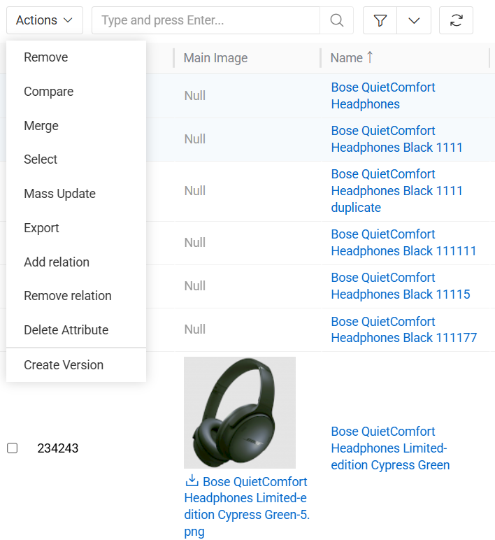{.large}

For details on these actions, refer to the [**Mass Actions**](../../01.atrocore/04.understanding-ui/docs.md#mass-actions) section of the **Views and Panels** article in this user guide.

### Single Record Actions

The following single record actions are available for product records on the list/plate view page:

- View
- Edit
- Delete
- Bookmark

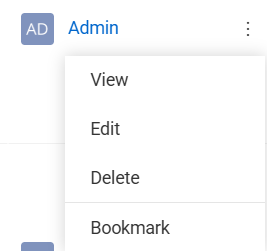{.large}

For details on these actions, please, refer to the [**Single Record Actions**](../../01.atrocore/04.understanding-ui/docs.md#single-record-actions) section of the **Views and Panels** article in this user guide.

### Product-specific filters

The Products entity supports all standard system [filters](../../01.atrocore/11.search-and-filtering/docs.md) and also provides a set of product-specific filters designed to simplify product data management and quality control.

The following product-specific filters are available:

- Without Main Image - Filters and displays only those products that do not have a Main Image assigned. This filter is typically used to identify incomplete product records that require visual content before publication or export.
- Multiple Classifications - Displays products that are assigned to more than one Classification. This filter helps detect potential data inconsistencies or configuration issues, as a product is typically expected to belong to a single Classification.

These filters allow users to quickly identify products that may require additional data enrichment or structural correction.

## Hierarchy in Products

Products is a [Hierarchy](../../01.atrocore/03.administration/11.entity-management/01.entity-types/docs.md#hierarchy) entity type. This means that product records can be organized in a parent–child structure, enabling inheritance of values and properties from parent products to their child products.

Hierarchy functionality allows users to create structured product trees (for example, product families, variants, or grouped items) where child products may inherit attributes, fields, or other configurations from their parent products, depending on the system configuration.

By default, two panels related to the product hierarchy are available in the product detail view.

### Parent Products

This panel displays the parent product of the current product. If the [Multiple Parents](../../01.atrocore/03.administration/11.entity-management/04.hierarchies-and-inheritance/docs.md#core-hierarchy-settings) option is enabled in the entity configuration, the panel may display more than one parent product.

The panel allows users to view and manage parent relationships for the current product. From this panel, users can link an existing product as a parent or remove an existing parent relationship, depending on their access rights.

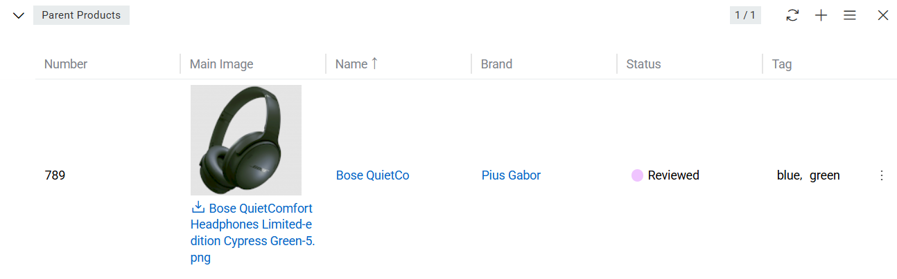{.large}

The fields displayed in this panel correspond to the fields configured for the product [list view](#listing), ensuring consistency in how product records are presented.

### Child Products

This panel displays all child products that are linked to the current product as their parent.

Child products represent records that inherit structural positioning from the current product in the product hierarchy. This allows the creation of structured product catalogs where higher-level products organize related or variant products.

Users can open child product records directly from this panel or manage the relationship by linking or unlinking products, depending on their access rights.

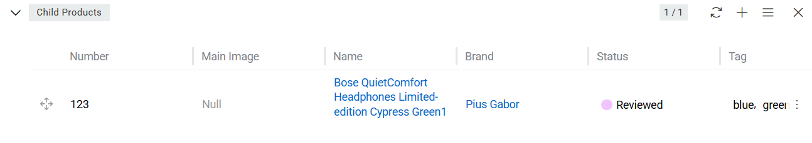{.large}

The fields displayed in this panel are the same as those configured for the product [list view](#listing).

## Working With Entities Related to Products

In the AtroPIM system, the following entities are related to products:
- [attributes](#attributes);
- [categories](#categories);
- [channels](#channels);
- [associated items](#associated-items);
- [associating items](#associating-items);
- [files](#files).

They all are displayed on the corresponding panels on the product record [detail view](../../01.atrocore/04.understanding-ui/docs.md#detail-view) page. If any panel is missing, please, contact your administrator as to your access rights configuration.

To be able to relate more entities to products, please, contact your administrator.

### Attributes

**Product attributes** are characteristics of a certain product that make it distinct from other products, e.g. size, color. Product attributes are to be used as filters.

Product attributes can be added by [Classification](../07.classifications/) to which the given product belongs.

Product attribute records are displayed on the `Attributes` panel within the product record [detail view](../../01.atrocore/04.understanding-ui/docs.md#detail-view) page and are grouped by attribute groups. 

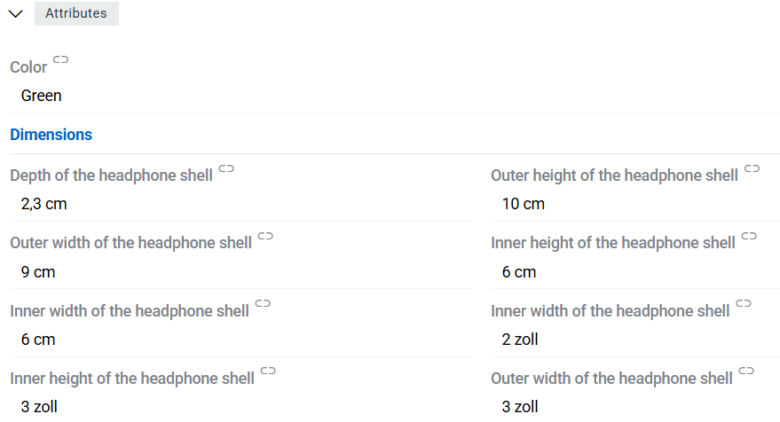{.large}

It is possible to add attributes to a product record, without previously linking them to the Classification of the product by selecting from the list of all attributes available for Product entity.

To link new attribute records to the currently open product, click the `+` button located in the upper right corner of the `Attributes` panel:

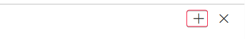{.small}

In the attribute value creation pop-up that appears, select the attribute(s) record from the list of the existing ones:

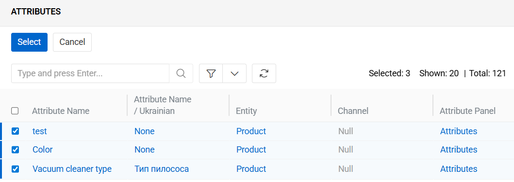{.large}

Click the `Select` button to complete the product attribute creation process or `Cancel` to abort it.

You can alo use the `Add Attribute` option from the single record actions menu to link the already existing attributes to the currently open product record:

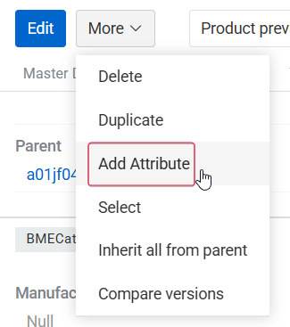{.small}

The "Attributes" pop-up that appears is the same as for the `+` button.

Please, note that attributes linked to products are arranged by attribute groups correspondingly. Their placement depends on the configuration and sort order value of the attribute group to which they belong.

Attribute records linked to a given product can be edited, removed, or inherited using the action buttons displayed on each attribute row.
These controls are visible:

- In Edit mode — for all attributes.
- In View mode — when the user hovers the mouse over an attribute.

These buttons allow users to manage attribute values directly from the product view without navigating to the underlying attribute records.

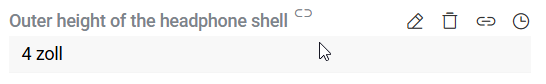{.medium}

The attribute record is removed from the product only after the action is confirmed:

{.medium}

For more information about attributes go to [attributes](../../01.atrocore/03.administration/12.attribute-management/01.attributes/docs.md) page.

### Categories

[Categories](../05.categories/) that are linked to the product record are shown on the `CATEGORIES` field.

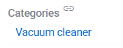{.small}

It is possible to link categories to a product by selecting the existing ones or creating new categories.

Product categories can be viewed, edited, or removed via the corresponding options on the `CATEGORIES` field.

### Channels

[Channels](../06.channels/) that are linked to the product record are shown on the `CHANNELS` field. They are usually used to sort, segment, and prepare product information for online stores.

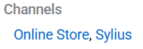{.small}

It is possible to link channels to a product by selecting the existing ones or creating new channels.

Product channels can be viewed, edited, or removed via the corresponding options on the `CHANNELS` field.

### Associated Items

Products that are linked to the currently open product record through the [association](../../01.atrocore/03.administration/11.entity-management/08.associations/), are displayed on its [detail view](../../01.atrocore/04.understanding-ui/docs.md#detail-view) page on the `Associated Items` panel.

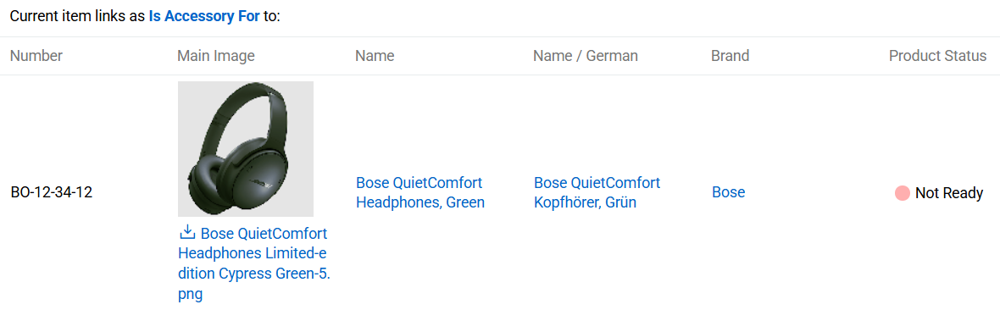{.large}

Panel shows products list. Associated Items are grouped by Association type. 

### Associating Items

Products to which the currently open product record is linked to through the [association](../../01.atrocore/03.administration/11.entity-management/08.associations/), are displayed on its [detail view](../../01.atrocore/04.understanding-ui/docs.md#detail-view) page on the `Associating Items` panel.

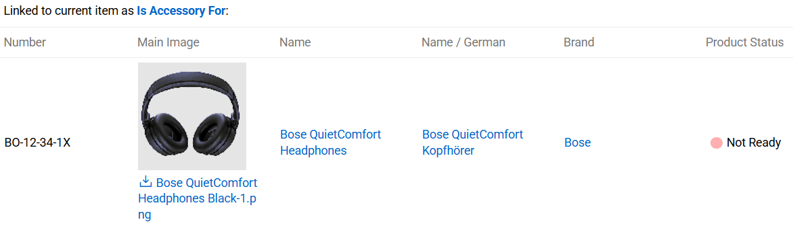{.large}

Panel shows products list. Associating Items are grouped by Association type. 

### Files

Files that are linked to the currently open product record are displayed on its [detail view](../../01.atrocore/04.understanding-ui/docs.md#detail-view) page on the `Files` panel and include the following table columns:
- Preview
- Name
- Type
- File Size (bytes)
- File Modification Date
- Tags

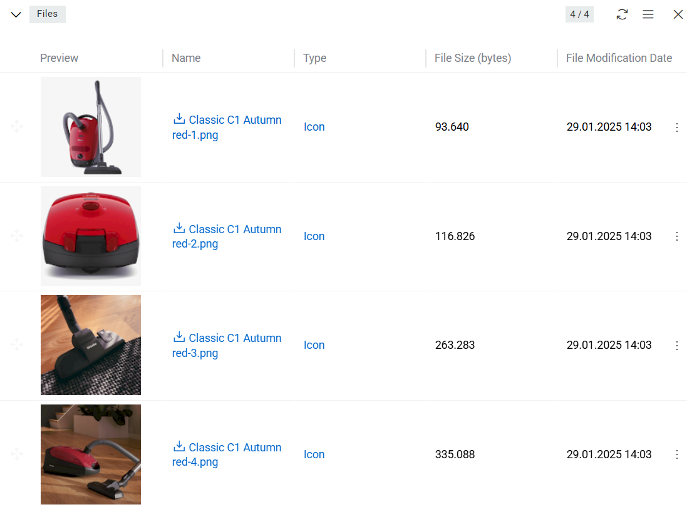{.large}

On this panel, you can link files to the given product record by selecting the existing ones or creating new file records. This can be made by `Upload` option that is unique to `Files` panel.

{.large}

From this option users can upload files in the same manner as on [files](../../01.atrocore/13.file-operations/docs.md#create-a-file-using-the-upload-button) page and uploaded files will be automatically linked to current product.

{.large}

On the `Files` panel you can also define image records order within the given product record via their drag-and-drop:

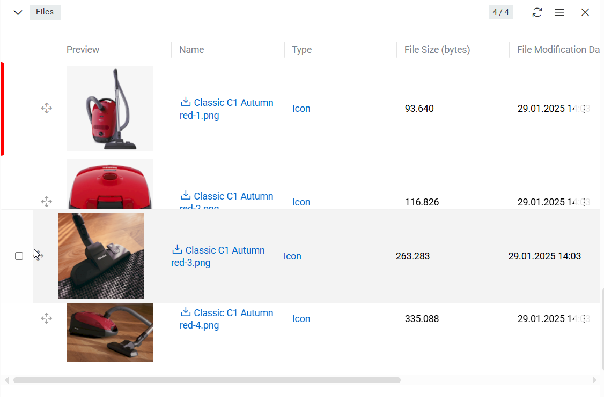{.large}

Users can assign any file of type Image as the Main Image for a product by selecting the Set as Main Image action:

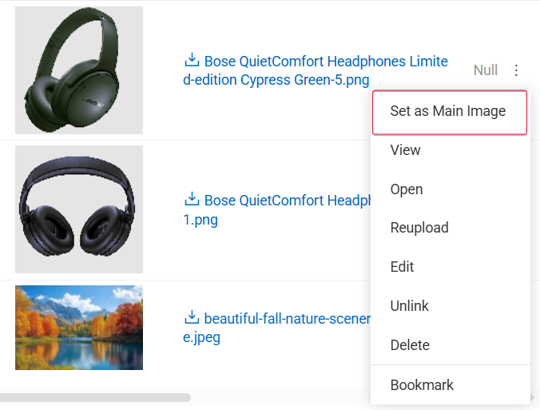{.medium}

Once assigned, this image becomes the primary visual representation of the product.

## Use of dashboards

For quick navigation to products we also recommend using [dashboards](../../01.atrocore/07.dashboards/docs.md). All summarized information about your products can be viewed here. The information according to built-in filters is displayed on dashlets.

## Product Preview

After the product card is fully or partially filled in, you may need to reconsider how the product page will look like in the marketplace or other third-party source where it is exported.
For this purpose, the Product Preview option is possible. This is a variant of [Record Preview](../../01.atrocore/10.html-css-preview/docs.md). It displays the values of product fields and attributes according to the specified template. By default, the system creates a standard template for the product card. You can find it by following path: `Administration / Preview Templates / Product preview`.

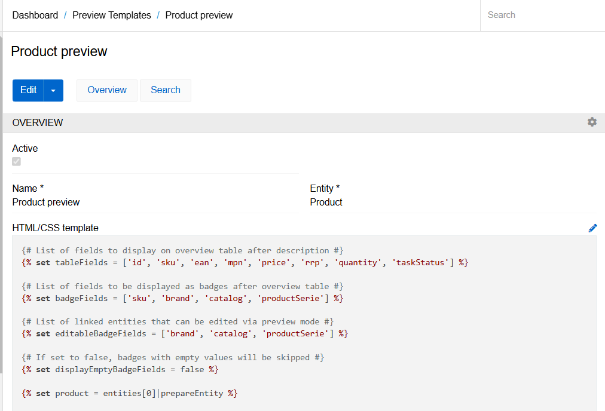{.large}

You can edit the existing template or create new ones is they are needed. As soon as you create a new template in this section, an action with the corresponding name will be automatically added to the selected entity.

The default template includes the product name, a long description, some fields in the form of a table (you can set the list of these fields in section `tableFields` of the template), separately badged fields (`badgeFields`), and the main image. The separate fields set as `editableBadgeFields` can be edited directly in the template. All table fields can be edited by default.

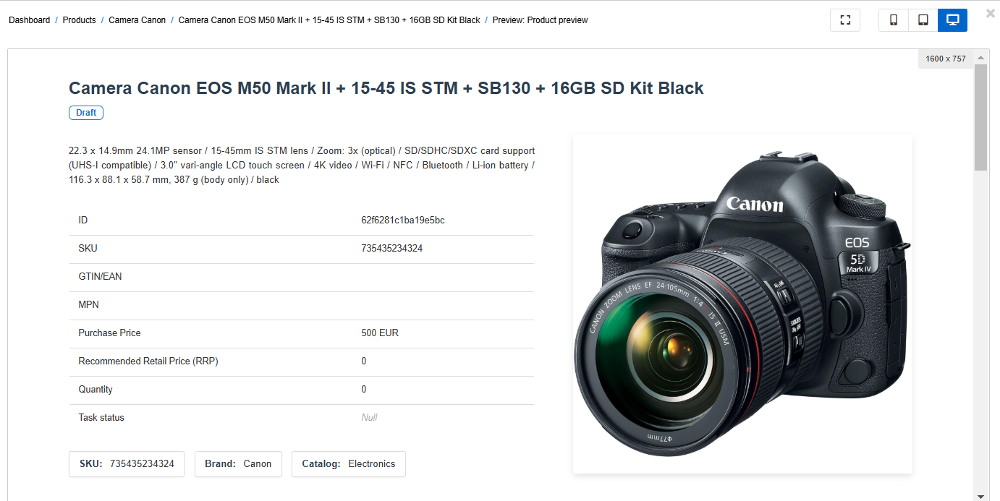{.large}

After the list of fields, the product files, attribute table, and components (if any) are displayed.

By default, product fields and attributes can be edited directly from the preview. To do this, just click on the required element and it will be displayed on the right side of the screen.

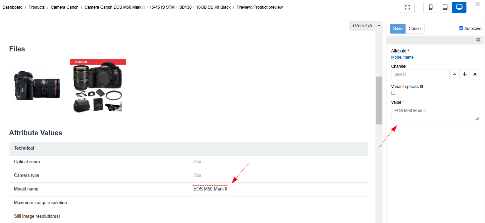{.large}

By clicking on the square icon, you will be able to see all the elements that can be edited. The other three icons allow you to evaluate the view of the product card on different devices (phone, tablet or desktop).

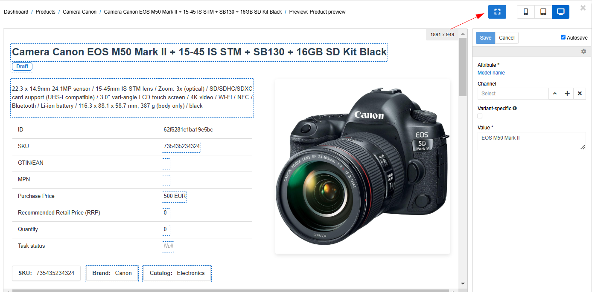{.large}

If the Auto-save checkbox is selected, the changes will be saved automatically. You can uncheck it if you want to save changes by clicking the corresponding button.

If the interface has several languages, you can switch the preview language at the top right of the page. As a result, the name of the fields and attributes and the value of the attribute (if it is multilingual) will be displayed in the selected language.

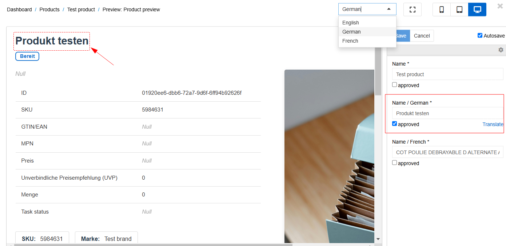{.large}

You can also display field values in all languages at once by using the function `getAllLanguageFields`. For this function, you need to pass the name of the entity and an array of fields (or just a field as a string) for which you want to return all languages.

```
getAllLanguageFields('Product', 'name')
```