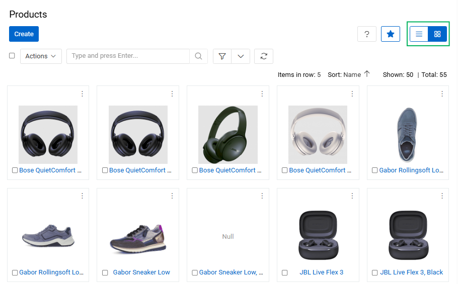
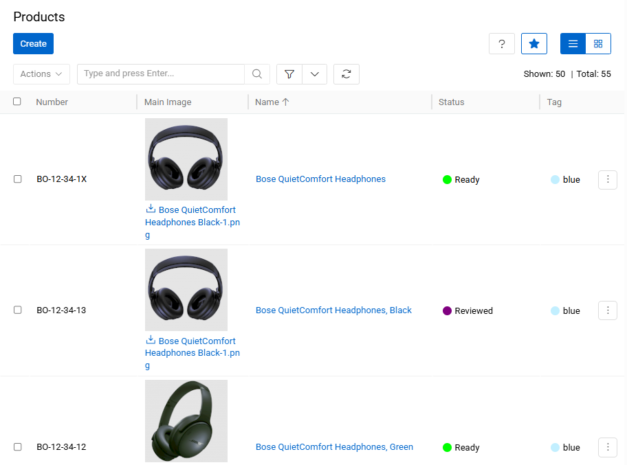
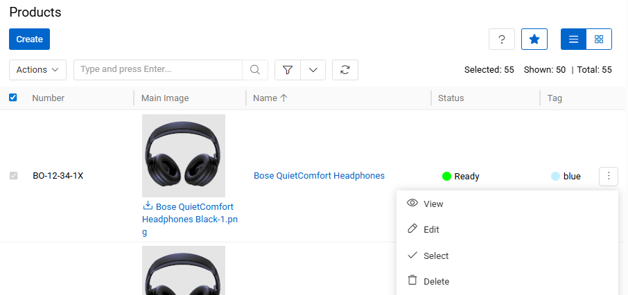

**Product** – an item in physical, virtual, or cyber form, as well as a service offered for sale. Every product is made at a cost and sold at a price.

Product is a [Hierarchy](../../01.atrocore/03.administration/11.entity-management/01.entity-types/index.md#hierarchy) entity type in PIM. Each product can be assigned to a [Classification](../07.classifications/index.md), which defines the attributes to be collected for that product. A product can be assigned to several [categories](../05.categories/index.md), belong to a [brand](../04.brands/index.md), be described in multiple languages, and be prepared for distribution via different [channels](../06.channels/index.md). Products can also be linked to other products through [associations](../../01.atrocore/03.administration/11.entity-management/08.associations/index.md), and different [attribute](../../01.atrocore/03.administration/12.attribute-management/index.md) values can be set per channel.

## Product Fields

The following fields are available on the Product entity out of the box. Mandatory fields are marked with \*. The detail view groups them into panels — **Master Data**, **State**, **Description**, and **Taxonomy** — with Main Image shown in the side panel. Fields not included in the default layout can be added via `Administration > Layouts > Product`.

| **Field** | **Panel** | **Description** |
| --- | --- | --- |
| Main Image | Side panel | Read-only. The primary image of the product, automatically determined from the product's linked files. |
| Name \* | Master Data | The product name. Supports multiple languages if multilingual mode is enabled. |
| Brand | Master Data | Reference to the [Brand](../04.brands/index.md) associated with the product. |
| Number \* | Master Data | The internal or external product identifier (e.g., SKU, article number). Unique; not inherited from parent products. |
| Country of Origin | Master Data | The country where the product was manufactured or produced. |
| Customs Number | Master Data | The customs tariff number for the product (up to 16 characters). |
| Recommended Retail Price (RRP) | Master Data | The suggested retail price, stored with a currency unit. |
| Sort Order | Master Data | The display order among sibling products in the hierarchy. Visible only for root-level products. |
| Status \* | State | The lifecycle state of the product. Default options: Draft, Prepared, Reviewed, Not Ready, Ready. |
| Tag | State | Multi-select tags for categorization, filtering, and quick identification. |
| Active | State | Indicates whether the product is active. Inactive products can be excluded from exports and channel feeds. |
| Short Description | Description | A plain-text summary of the product, typically used in listings or preview contexts. Supports multiple languages. |
| Long Description | Description | A full HTML description with rich formatting support (headings, lists, tables, embedded media, etc.). Intended for detailed marketing or technical content. Supports multiple languages. |
| Classifications | Taxonomy | The [Classifications](../07.classifications/index.md) assigned to the product, which determine which attributes are available. A product can have more than one Classification. |
| Product Group | Taxonomy | Groups the product within an internal product group structure. |
| Categories | Taxonomy | The [Categories](../05.categories/index.md) the product belongs to. A product can be assigned to multiple leaf categories. |
| Channels | Taxonomy | The [Channels](../06.channels/index.md) through which the product is distributed (e.g., online stores, marketplaces). |
| Parent | Taxonomy | The [parent](#parent-products) product in the product hierarchy. |
| GTIN/EAN | — | The product barcode in EAN-8, EAN-12, EAN-13, or EAN-14 format. Not in the default layout. |
| Manufacturer Number (MPN) | — | The manufacturer's part number. Not inherited from parent products. Not in the default layout. |
| Purchase Price | — | The purchase or cost price, stored with a currency unit. Not in the default layout. |
| Quantity | — | The product quantity (minimum 0). Not in the default layout. |
| Default Supplier | — | The default supplier (linked Account) for this product. Not in the default layout. |
| Note | — | A plain-text internal note. Not in the default layout. |

To add new fields or modify the product [entity](../../01.atrocore/03.administration/11.entity-management/index.md), go to `Administration > Entities > Product`.

## View Modes

Products support two [view](../../01.atrocore/04.understanding-ui/index.md) modes: **list view** and **plate view**. Use the view mode switch in the top-right area of the page header to toggle between them. The plate view shows each product as a card with its main image and key fields, which is useful for visually browsing a large catalog.

{.large}

To open the list of products, click `Products` in the navigation menu.

{.large}

By default, the list view displays the following fields: Number, Main Image, Name, Brand, Status, Tag, and Active. Click any sortable column header to sort the list ascending or descending.

### Mass Actions

The following mass actions are available on the product list and plate view pages: Remove, Compare, Merge, Select, Mass Update, Export, Add Relation, Remove Relation, and Delete Attribute.

{.large}

For details on each action, refer to the [Mass Actions](../../01.atrocore/12.mass-actions/index.md) article.

### Single Record Actions

The following actions are available per product record: View, Edit, Delete, and Bookmark.

{.large}

For details, refer to the [Record Management](../../01.atrocore/08.record-management/index.md) article.

### Product-Specific Filters

In addition to all standard [search and filtering](../../01.atrocore/11.search-and-filtering/index.md) options, products support two additional filters:

**Without Main Image** — shows only products that have no Main Image assigned. Useful for identifying records that need visual content before publication or export.

**Multiple Classifications** — shows products assigned to more than one Classification. This is a supported feature that allows a product to belong to multiple Classifications simultaneously.

## Product Hierarchy

Products is a [Hierarchy](../../01.atrocore/03.administration/11.entity-management/01.entity-types/index.md#hierarchy) entity type, meaning product records can be organized in a parent–child structure. This enables inheritance of values and properties from parent products to child products, and allows you to build structured product trees such as product families or variant groups.

Two hierarchy panels are available by default on the product detail view.

### Parent Products

This panel shows the parent product of the current record. If the [Multiple Parents](../../01.atrocore/03.administration/11.entity-management/04.hierarchies-and-inheritance/index.md#core-hierarchy-settings) option is enabled for the entity, more than one parent can be displayed. From this panel you can link an existing product as a parent or remove an existing parent relationship.

> By default, the **Parent** field also appears in the Taxonomy panel of the detail form. An administrator can remove it from the Taxonomy panel via [Layout Management](../../01.atrocore/03.administration/13.user-interface/02.layouts/index.md) to avoid redundancy.

{.large}

### Child Products

This panel displays all child products linked to the current product. Users can open child records directly from this panel or manage relationships by linking or unlinking products.

{.large}

The fields shown in both hierarchy panels match those configured for the product [list view](#view-modes).

## Related Entities

The following entities are related to products and displayed on corresponding panels on the product [detail view](../../01.atrocore/04.understanding-ui/index.md#detail-view) page:

- [Attributes](#attributes)
- [Categories](#categories)
- [Channels](#channels)
- [Associated Items](#associated-items)
- [Associating Items](#associating-items)
- [Files](#files)

If any panel is missing, contact your administrator to check your access rights.

### Attributes

Product attributes are characteristics that distinguish a product from others — for example, size, color, or material. They are displayed on the `Attributes` panel, grouped by [attribute groups](../../01.atrocore/03.administration/12.attribute-management/02.attribute-groups/index.md).

The most efficient way to add attributes to a product is through a [Classification](../07.classifications/index.md) — all attributes defined in the Classification are automatically linked. Attributes can also be linked directly from the `Attributes` panel using the `+` button, unless the administrator has disabled direct linking.

{.large}

For full details, see the [Attributes](../../01.atrocore/03.administration/12.attribute-management/01.attributes/index.md) documentation.

### Categories

[Categories](../05.categories/index.md) linked to the product are shown in the `Categories` field on the product detail view. A product can be assigned to multiple categories. By default, products can only be assigned to leaf categories (categories with no children) — this behavior is configurable in [PIM Settings](../01.administration/index.md).

{.small}

Categories can be linked by selecting existing ones or creating new ones directly from this field.

### Channels

[Channels](../06.channels/index.md) linked to a product are shown in the `CHANNELS` field. Channels represent distribution endpoints — such as online stores, marketplaces, or print catalogs — and are used to control which product information is prepared and exported for each destination.

{.small}

Channels can be linked to a product by selecting existing ones or creating new ones from this field.

### Associated Items

Products linked to the current product through an [association](../../01.atrocore/03.administration/11.entity-management/08.associations/index.md) are displayed on the `Associated Items` panel. Items are grouped by association type.

{.large}

### Associating Items

Products to which the current product is linked through an [association](../../01.atrocore/03.administration/11.entity-management/08.associations/index.md) are displayed on the `Associating Items` panel. Items are grouped by association type.

{.large}

### Files

Files linked to the product are shown on the `Files` panel. Files can be linked by selecting existing ones or uploaded directly from this panel. The display order can be set via drag-and-drop, and any image file can be promoted to the product's Main Image using the row action menu.

{.large}

For more information about file management, see [File Operations](../../01.atrocore/13.file-operations/index.md).

## Product Preview

Product Preview lets you see how a product will appear in a destination such as a marketplace or export feed, you can review exactly how it will look using the built-in product preview. See the [Product Preview](../../01.atrocore/10.html-css-preview/index.md#product-preview-predefined-template) section of the Record Preview article for details on accessing it, filtering by channel and language, editing data, and updating the product status.
