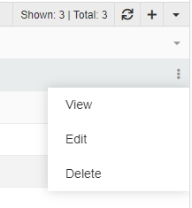

**Product** – an item in physical, virtual, or cyber form, as well as a service offered for sale. Every product is made at a cost and sold at a price.

Product is a [Hierarchy](../../01.atrocore/03.administration/11.entity-management/01.entity-types/index.md#hierarchy) entity type in PIM. Each product can be assigned to a [Classification](../07.classifications/index.md), which defines the attributes to be collected for that product. A product can be assigned to several [categories](../05.categories/index.md), belong to a [brand](../04.brands/index.md), be described in multiple languages, and be prepared for distribution via different [channels](../06.channels/index.md). Products can also be linked to other products through [associations](../../01.atrocore/03.administration/11.entity-management/08.associations/index.md), and different [attribute](../../01.atrocore/03.administration/12.attribute-management/index.md) values can be set per channel.

## Product Fields

The product entity comes with the following preconfigured fields; mandatory fields are marked with \*:

| **Field Name** | **Description** |
| --- | --- |
| Name \* | The unique product name used for identification and display purposes. |
| Active | Indicates whether the product is active. Inactive products can be excluded from exports and listings. |
| Brand | Reference to the [Brand](../04.brands/index.md) associated with the product. |
| Number \* | The internal or external product number (e.g., SKU, model number, or article number). |
| Status \* | Defines the lifecycle state of the product (e.g., Draft, Ready). Available values depend on system configuration. |
| Tag | Used to assign tags for categorization, search, and filtering purposes. |
| Short Description | A brief description of the product, typically used in listings or summary views. |
| Long Description | A detailed description used for extended product information, marketing content, or technical specifications. |
| Classification | Specifies the [Classification](../07.classifications/index.md) assigned to the product, which determines which attributes are available. |
| Main Image | The primary image of the product, used as the default visual representation in the UI. |

To add new fields or modify the product [entity](../../01.atrocore/03.administration/11.entity-management/index.md), go to `Administration > Entities > Product`.

## View Modes

Products support two [view](../../01.atrocore/04.understanding-ui/index.md) modes: **list view** and **plate view**. Use the view mode switch in the top-right area of the page header to toggle between them. The plate view shows each product as a card with its main image and key fields, which is useful for visually browsing a large catalog.

{.large}

To open the list of products, click `Products` in the navigation menu.

{.large}

By default, the list view displays the following fields: Number, Main Image, Name, Brand, Status, Tag, and Active. Click any sortable column header to sort the list ascending or descending.

### Mass Actions

The following mass actions are available on the product list and plate view pages: Remove, Compare, Merge, Select, Mass Update, Export, Add Relation, Remove Relation, and Delete Attribute.

{.large}

For details on each action, refer to the [Mass Actions](../../01.atrocore/12.mass-actions/index.md) article.

### Single Record Actions

The following actions are available per product record: View, Edit, Delete, and Bookmark.

{.large}

For details, refer to the [Record Management](../../01.atrocore/08.record-management/index.md) article.

### Product-Specific Filters

In addition to all standard [search and filtering](../../01.atrocore/11.search-and-filtering/index.md) options, products support two additional filters:

**Without Main Image** — shows only products that have no Main Image assigned. Useful for identifying records that need visual content before publication or export.

**Multiple Classifications** — shows products assigned to more than one Classification. Useful for detecting potential data inconsistencies, as a product is typically expected to belong to a single Classification.

## Product Hierarchy

Products is a [Hierarchy](../../01.atrocore/03.administration/11.entity-management/01.entity-types/index.md#hierarchy) entity type, meaning product records can be organized in a parent–child structure. This enables inheritance of values and properties from parent products to child products, and allows you to build structured product trees such as product families or variant groups.

Two hierarchy panels are available by default on the product detail view.

### Parent Products

This panel shows the parent product of the current record. If the [Multiple Parents](../../01.atrocore/03.administration/11.entity-management/04.hierarchies-and-inheritance/index.md#core-hierarchy-settings) option is enabled for the entity, more than one parent can be displayed. From this panel you can link an existing product as a parent or remove an existing parent relationship.

{.large}

### Child Products

This panel displays all child products linked to the current product. Users can open child records directly from this panel or manage relationships by linking or unlinking products.

{.large}

The fields shown in both hierarchy panels match those configured for the product [list view](#view-modes).

## Related Entities

The following entities are related to products and displayed on corresponding panels on the product [detail view](../../01.atrocore/04.understanding-ui/index.md#detail-view) page:

- [Attributes](#attributes)
- [Categories](#categories)
- [Channels](#channels)
- [Associated Items](#associated-items)
- [Associating Items](#associating-items)
- [Files](#files)

If any panel is missing, contact your administrator to check your access rights.

### Attributes

Product attributes are characteristics that distinguish a product from others — for example, size, color, or material. They are also used as filters in product searches.

The most efficient way to add attributes to a product is through a [Classification](../07.classifications/index.md). When you assign a Classification to a product, all attributes defined in that Classification are automatically linked to it. Attributes can also be linked to a product directly, without going through a Classification, by selecting from the full list of attributes available for the Product entity — unless the administrator has disabled direct attribute linking.

Attributes are displayed on the `Attributes` panel, grouped by [attribute groups](../../01.atrocore/03.administration/12.attribute-management/02.attribute-groups/index.md). Their order depends on the sort order configured for each group.

{.large}

To link a new attribute directly, click the `+` button in the upper right corner of the `Attributes` panel, then select the attribute from the list in the pop-up:

{.small}

Alternatively, use the `Add Attribute` option from the single record actions menu — it opens the same selection pop-up.

{.small}

Attribute values can be edited, removed, or inherited directly from the product view. These controls are visible in Edit mode for all attributes, and in View mode when hovering over an attribute row.

{.medium}

Removing an attribute from a product requires confirmation. For full details on attributes, see the [Attributes](../../01.atrocore/03.administration/12.attribute-management/01.attributes/index.md) documentation.

### Categories

[Categories](../05.categories/index.md) linked to the product are shown in the `Categories` field on the product detail view. A product can be assigned to multiple categories. Categories can be linked by selecting existing ones or creating new ones directly from this field.

{.small}

#### Assigning Categories to a Product

To assign one or more categories to a product, click the `▼` icon in the `Categories` field and select `Select`. In the pop-up, choose the required categories and click `Select`. When categories from different trees have similar names, refer to the **Category Code** to avoid ambiguity.

> Products can only be assigned to **leaf categories** (categories with no child categories). Attempting to link a product to a non-leaf (parent) category will result in an error.

{.large}

When a category is assigned to a product, the product becomes part of that category's hierarchy for navigation and filtering purposes.

#### Assigning Products from the Category Page

You can also manage this relationship from the other direction. On the [category detail view](../05.categories/index.md), the `Products` panel lists all products assigned to that category. Click the `▼` icon in the panel header and select the products to add.

{.large}

#### Bulk Category Assignment

On the product list page, you can add or remove category relationships for multiple products at once using the `Add Relation` and `Remove Relation` [mass actions](../../01.atrocore/12.mass-actions/index.md). After selecting the target products (e.g. using a filter), click `Add Relation` or `Remove Relation`, set the `Select Entity` field to `Product Categories`, and choose the relevant categories.

{.large}

{.large}

### Channels

[Channels](../06.channels/index.md) linked to a product are shown in the `CHANNELS` field. Channels represent distribution endpoints — such as online stores, marketplaces, or print catalogs — and are used to control which product information is prepared and exported for each destination.

{.small}

Channels can be linked to a product by selecting existing ones or creating new ones from this field.

### Associated Items

Products linked to the current product through an [association](../../01.atrocore/03.administration/11.entity-management/08.associations/index.md) are displayed on the `Associated Items` panel. Items are grouped by association type.

{.large}

### Associating Items

Products to which the current product is linked through an [association](../../01.atrocore/03.administration/11.entity-management/08.associations/index.md) are displayed on the `Associating Items` panel. Items are grouped by association type.

{.large}

### Files

Files linked to the product are shown on the `Files` panel, which displays Preview, Name, Type, File Size, File Modification Date, and Tags columns.

{.large}

You can link files to a product by selecting existing ones or uploading new files using the `Upload` option, which is unique to this panel. Uploaded files are automatically linked to the current product.

{.large}

{.large}

The order of images within the product can be defined via drag-and-drop on the `Files` panel:

{.large}

To set any image file as the product's Main Image, use the `Set as Main Image` action in the file row menu:

{.medium}

For more information about file management, see [File Operations](../../01.atrocore/13.file-operations/index.md).

## Dashboards

For quick navigation and an overview of your product data, use [Dashboards](../../01.atrocore/07.dashboards/index.md). Dashlets can display summarized product information based on built-in filters, giving you a quick view of your catalog's status without opening individual records.

## Product Preview

After filling in a product record, you can preview how the product page will appear in a marketplace or other destination where it is exported. This is done using the **Product Preview** feature, a variant of [Record Preview](../../01.atrocore/10.html-css-preview/index.md).

Product Preview renders field values and attributes according to a configurable template. The default template is available at `Administration > Preview Templates > Product preview`.

{.large}

You can edit the existing template or create additional ones. Each new template added here automatically generates a corresponding action on the product record.

The default template includes the product name, long description, a table of configurable fields (`tableFields`), badge fields (`badgeFields`), and the main image. Fields configured as `editableBadgeFields` can be edited directly within the preview; all table fields are editable by default.

{.large}

After the field list, the preview also shows product files, the attribute table, and components (if any).

To edit a field or attribute directly from the preview, click on the element — it will appear in an edit panel on the right side of the screen.

{.large}

The square icon reveals all editable elements. The other three icons let you preview the product card layout on phone, tablet, or desktop.

{.large}

When **Auto-save** is enabled, changes are saved automatically. Uncheck it to save manually.

If multiple interface languages are configured, you can switch the preview language in the top-right corner of the page. The field and attribute names, as well as multilingual attribute values, will update accordingly.

{.large}

To display field values in all configured languages simultaneously, use the `getAllLanguageFields` function in the template. Pass the entity name and the field name (or an array of field names):

```twig
getAllLanguageFields('Product', 'name')
```

For full details on template syntax, see [Twig Templating](../../10.developer-guide/80.twig-tutorial/index.md).
