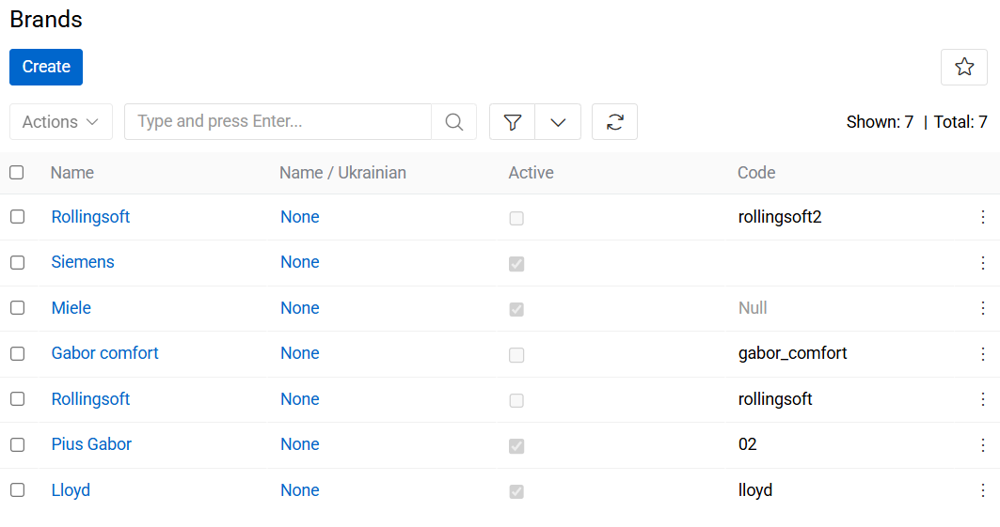
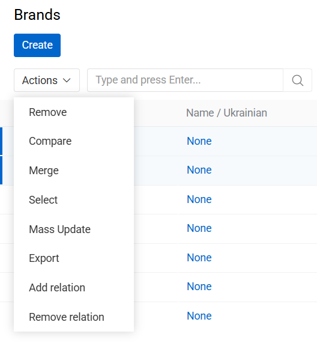
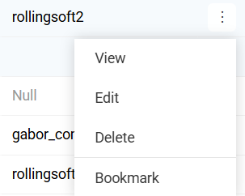
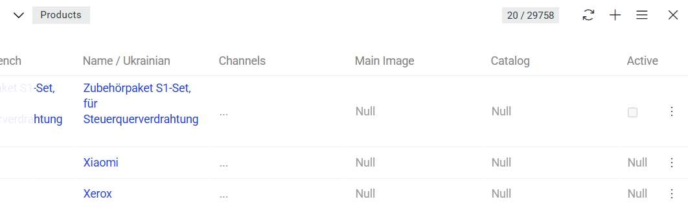
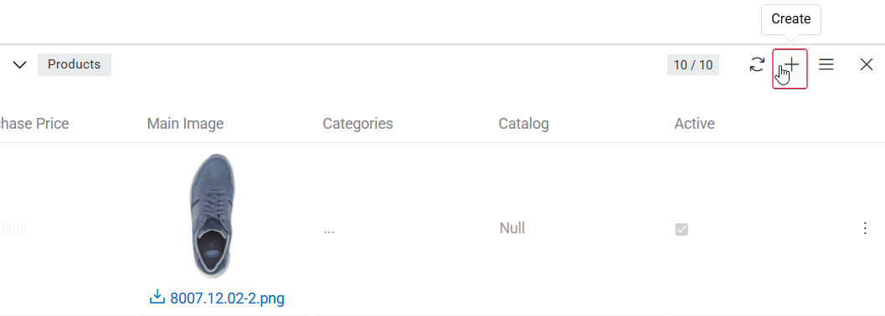
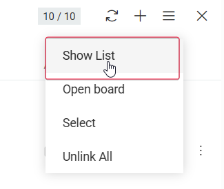

**Brand** – a name, term, design, symbol, or other feature that distinguishes the product from its rivals in the eyes of the customer. Brands are used in business, marketing and advertising to increase sales.

By default, only one brand can be assigned to the product. Brand is optional for the product. It is technically possible to have different brands with same name, because of different IDs that would be assigned to them.

## Brand Fields

The brand entity comes with the following preconfigured fields; mandatory are marked with *:

| **Field Name**           | **Description**                            |
|--------------------------|--------------------------------------------|
| Active               | Activity state of the brand record         |
| Name (multi-lang) *      | Name of the brand (e.g. Apple, Nike, etc.) |
| Code                  | Unique value used to identify the brand. It can only consist of lowercase letters, digits and underscore symbols     |
| Description (multi-lang) | Description of the brand usage                   |

## Listing

To open the list of brand records available in the system, click the `Brands` option in the navigation menu:

{.large}

By default, the following fields are displayed on the [list view](../../01.atrocore/04.understanding-ui/index.md#list-view) page for brand records:
 - Name
 - Active
 - Code

To change the brand records order in the list, click any sortable column title; this will sort the column either ascending or descending.

Brand records can be searched and filtered according to your needs. For details on the search and filtering options, refer to the [**Search and Filtering**](../../01.atrocore/11.search-and-filtering/) article in this user guide.

### Mass Actions

The following mass actions are available for brand records on the list view page:

- Remove
- Compare
- Merge
- Select
- Mass update
- Export
- Add relation
- Remove relation

{.large}

For details on these actions, refer to the [**Mass Actions**](../../01.atrocore/04.understanding-ui/index.md#mass-actions) section of the **Views and Panels** article in this user guide.

### Single Record Actions

The following single record actions are available for brand records on the list view page:

- View
- Edit
- Remove
- Bookmark

{.small}

For details on these actions, please, refer to the [**Single Record Actions**](../../01.atrocore/04.understanding-ui/index.md#single-record-actions) section of the **Views and Panels** article in this user guide.

## Working With Products Related to Brands

Products that are linked to the brand are displayed on its [detail view](../../01.atrocore/04.understanding-ui/index.md#detail-view) page on the `PRODUCTS` panel and include the following table columns:
 - Name
 - Channels
 - Main Image
 - Catalog
 - Active

{.large}

If this panel is missing, please, contact your administrator as to your access rights configuration. Also, to be able to relate more entities to brands, please, contact your administrator.

Users can create a new Product record for the selected brand or link existing Product records to that brand.

{.large}

To see all products linked to the given brand record, use the `Show list` option:

{.small}

To modify a Product record, select the `Edit` option from the single-record actions menu for the corresponding record. To remove a Product record, select the `Delete` option from the single-record actions drop-down list.

To open a brand-related Product record directly from the `PRODUCTS` panel, click the product name in the list. The system will open the Product [detail view](../../01.atrocore/04.understanding-ui/index.md#detail-view) page, where additional actions can be performed based on the user’s assigned permissions.