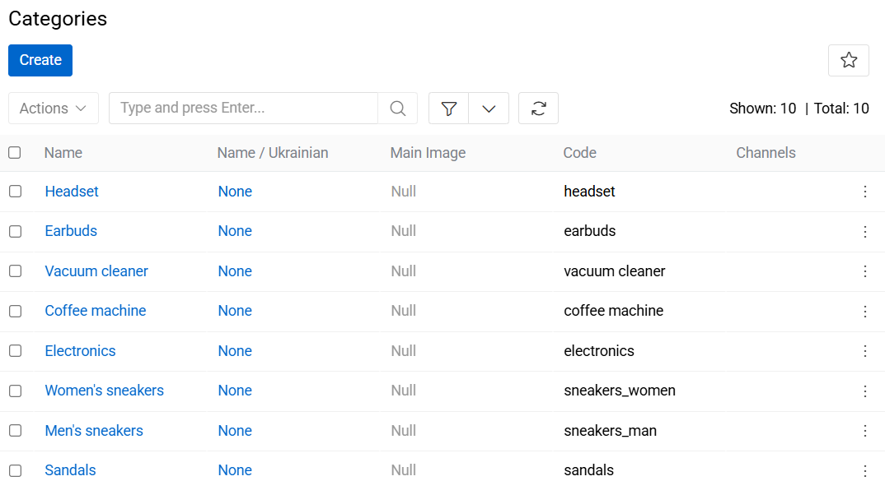
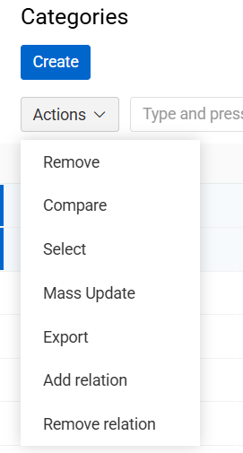
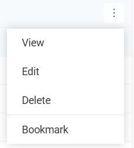
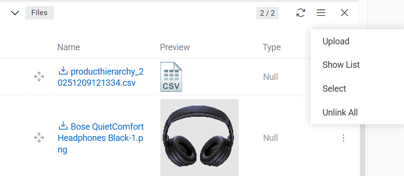
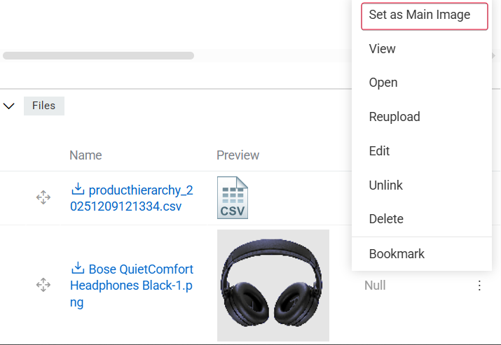
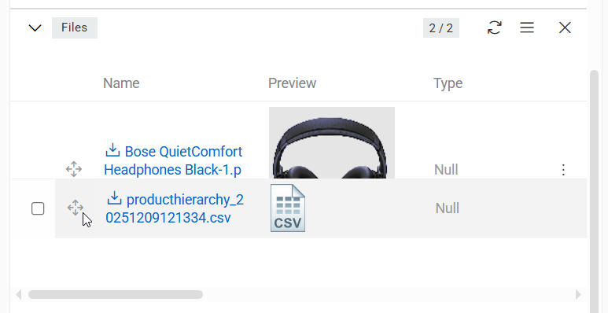
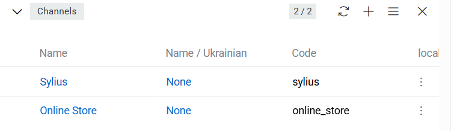
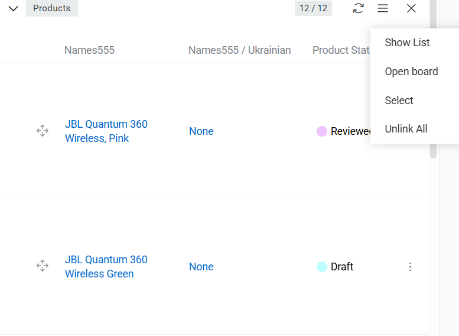
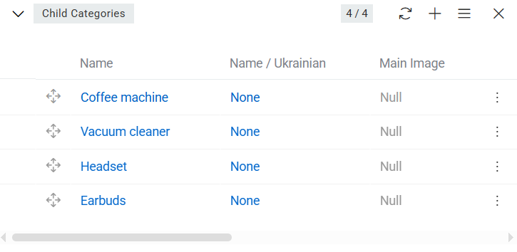

**Category** – an efficient way to organize the products by their type, which helps target consumer find the desired products faster.

Categories make up a powerful tool that can be used not only to sort your content, but also to develop a proper, i.e. meaningful and semantic, structure of your product catalog. Categories have a hierarchical taxonomy, meaning that there are parent and child categories.

**Category tree** – the aggregate of all categories and parent–child relations among them. Category tree starts with a *root category* – a category, which has no parent category, and ends with many branches of categories without subcategories (i.e. *child categories*).

**Parent Category** – a category to which the category is assigned. If "Berlin" is a category, "Germany" may be its parent category.

**Subcategories** – all child categories, assigned to a certain category. Subcategories for category "Germany" may be "Berlin", "Munich", "Hannover" and so on.

There can be many category trees in AtroPIM. Each category can have only one parent category. Each category may have a lot of subcategories. One category can be used in several category trees. Also many products can be assigned to one category, and each product can be assigned to more than one category in accordance with the catalog content.

## One Category Tree vs Multiple Category Trees

Each adopter of [AtroPIM](../../01.atrocore/02.getting-started) may decide for himself what works better for him – setting up and supporting multiple category trees or just one. Irregardless of the choice, it is still possible to synchronize different content for products you want to supply.

## Product Categories in Multiple Languages

Even if you want to manage your product content in different languages, there is no need in maintaining multiple category trees.

There are two ways to set up your product catalog if you carry product information in different languages:

1. Create a separate category tree for each language / locale.
2. Create just one category tree using multi-language fields for the category name.

The first approach is preferable, if you want to provide different channels with different product catalogs, e.g. some product should be transferred to channel 1, but not to channel 2. The second one is a better choice if you want to deliver the product information about all your products to all channels.

## Category Fields

The category entity comes with the following preconfigured fields; mandatory are marked with *:

| **Field Name**           | **Description**                            |
|--------------------------|--------------------------------------------|
| Active                   | Activity state of the category record      |
| Name (multi-lang) *      | The category name							|
| Parent		   | The category to be used as a parent for this category |
| Code *                   | Unique value used to identify the category. It can only consist of lowercase letters, digits and underscore symbols				      |
| Description (multi-lang) | Description of the category usage                  |

To make changes to the category entity (e.g. add new fields or modify category views), go to Administration / Entities / Category.

## Listing

To open the list of category records available in the system, click the `Categories` option in the navigation menu:

{.large}

By default, the following fields are displayed on the [list view](../../01.atrocore/04.understanding-ui/docs.md#list-view) page for category records:
 - Name
 - Main image
 - Code
 - Channels

To change the category records order in the list, click any sortable column title; this will sort the column either ascending or descending.

Category records can be searched and filtered according to your needs. For details on the search and filtering options, refer to the [**Search and Filtering**](../../01.atrocore/11.search-and-filtering) article in this user guide.

To view some category record details, click the name field value of the corresponding record in the list of categories; the [detail view](../../01.atrocore/04.understanding-ui/docs.md#detail-view) page will open showing the category records and the records of the related entities. Alternatively, use the `View` option from the single record actions menu to open the [quick detail](../../01.atrocore/04.understanding-ui/docs.md#quick-detail-view-small-detail-view) pop-up.

### Mass Actions

The following mass actions are available for category records on the list view page:

- Remove
- Compare
- Select
- Mass update
- Export
- Add relation
- Remove relation

{.medium}

For details on these actions, refer to the [**Mass Actions**](../../01.atrocore/04.understanding-ui/docs.md#mass-actions) section of the **Views and Panels** article in this user guide.

### Single Record Actions

The following single record actions are available for category records on the list view page:

- View
- Edit
- Delete
- Bookmark

{.large}

For details on these actions, please, refer to the [**Single Record Actions**](../../01.atrocore/04.understanding-ui/docs.md#single-record-actions) section of the **Views and Panels** article in this user guide.

## Working With Entities Related to Categories

Relations to files, channels, products and child categories are available for all categories by default. These related entities records are displayed on the corresponding panels on the category [detail view](../../01.atrocore/04.understanding-ui/docs.md#detail-view) page. If any panel is missing, please, contact your administrator as to your access rights configuration.

To be able to relate more entities to categories, please, contact your administrator.

### Files

Files that are linked to the currently open category record are displayed on its page on the `FILES` panel.

{.large}

On this panel, you can link files to the given category record by selecting the existing ones (`Select`) or creating new file records (`Upload`).

In the "Files" pop-up that appears, choose the desired file (or files) from the list and press the `Select` button to link the item(s) to the category record.

To set a file as the main image for a category, select the appropriate option in the menu (the file has to be an image). Files linked to the given category record can be viewed, edited, reuploaded, unlink or removed via the corresponding options from the single record actions menu on the `Files` panel:

{.large}

On the `FILES` panel you can also define image records order within the given category record via their drag-and-drop:

{.large}

The changes are saved on the fly.

To view the category related image record from the `FILES` panel, click its name in the images list. The page of the given file will open, where you can perform further actions according to your access rights, configured by the administrator.

### Channels

Channels that are linked to the category record are shown on the `CHANNELS` panel within the category page.

{.large}

### Products

Products that are linked to the category record are shown on the `PRODUCTS` panel within the category page and on the `CATEGORIES` panel within the Product page.

{.large}

### Child categories

Child categories that are linked to the category record are shown on the `CHILD CATEGORIES` panel within the category page.

{.large}