**Category** – an efficient way to organize the products by their type, which helps target consumer find the desired products faster.

Categories make up a powerful tool that can be used not only to sort your content, but also to develop a proper, i.e. meaningful and semantic, structure of your product catalog. Categories have a hierarchical taxonomy, meaning that there are parent and child categories.

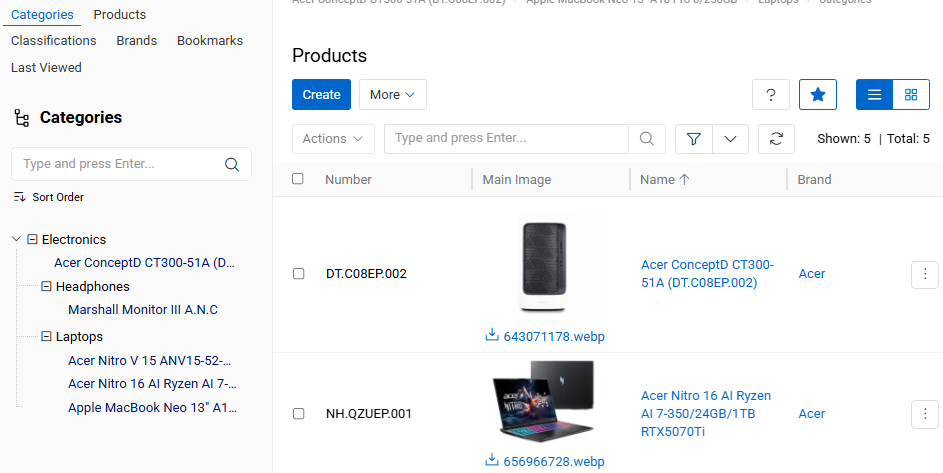{.large}

**Category tree** – the aggregate of all categories and parent–child relations among them. Category tree starts with a *root category* – a category, which has no parent category, and ends with many branches of categories without subcategories (i.e. *child categories*).

## One Category Tree vs Multiple Category Trees

There can be many category trees. Each category can have only one parent category. Each category may have a lot of subcategories. Many products can be assigned to one category, and each product can be assigned to more than one category in accordance with the catalog content.

Each adopter of [AtroPIM](../../01.atrocore/02.getting-started) may decide for himself what works better for him – setting up and supporting multiple category trees or just one. Irregardless of the choice, it is still possible to synchronize different content for products you want to supply.

## PIM Settings

Category-related behavior can be configured via `Administration / PIM Settings`, under the **Category settings** panel.

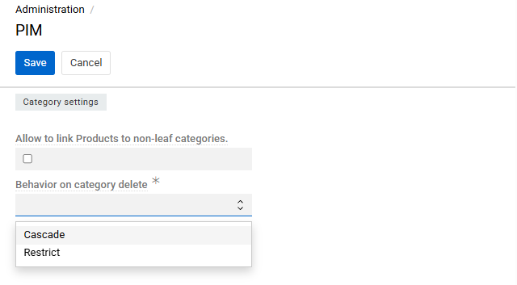{.medium}

- **Allow to link Products to non-leaf categories**: When enabled, products can be assigned to any category, including those that have child categories. When disabled, only leaf categories (those with no subcategories) accept product assignments. This setting is also referenced in [Assigning categories to a product](#assigning-categories-to-a-product).

- **Behavior on category delete** *(required)*: Controls what happens when a category that has subcategories or linked products is deleted.
  - **Cascade** — all subcategories of the deleted category are also removed, and all products linked to it or its subcategories are unlinked from those categories.
  - **Restrict** — deletion is blocked as long as the category has any subcategories or linked products.

For full details on all PIM administration settings, see [PIM Administration](../01.administration/index.md).

## Category Fields

The category entity comes with the following preconfigured fields; mandatory are marked with *:

| **Field Name**           | **Description**                                                                                                                                                               |
|--------------------------|-------------------------------------------------------------------------------------------------------------------------------------------------------------------------------|
| Active                   | Activity state of the category record.                                                                   |
| Name (multi-lang) *      | The category name.                                                                                                                                                            |
| Parent Category          | The category to be used as a parent for this category.                                                                                                                        |
| Code                     | Unique value used to identify the category. It can only consist of lowercase letters, digits and underscore symbols.                                                          |
| Description (multi-lang) | Description of the category usage.                                                                                                                                            |

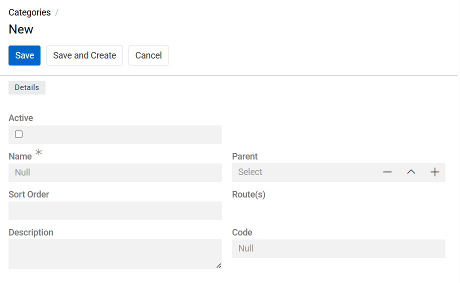{.large}

To make changes to the category [entity](../../01.atrocore/03.administration/11.entity-management/index.md) (e.g. add new fields or modify category views), go to `Administration / Entities / Category`.

## Listing

To open the list of category records available in the system, click the `Categories` option in the navigation menu:

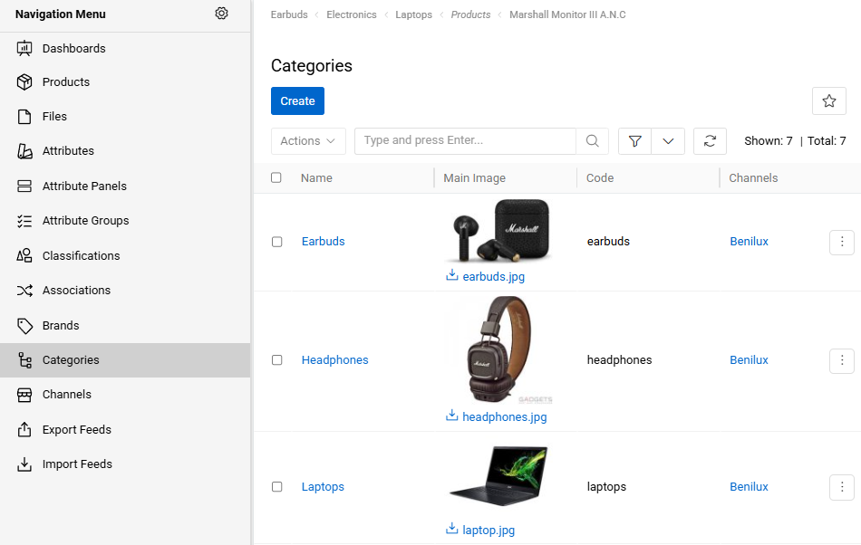{.large}

By default, the following fields are displayed on the [list view](../../01.atrocore/04.understanding-ui/index.md#list-view) page for category records:

- Name
- Main image
- Code
- Channels

To change the category records order in the list, click any sortable column title; this will sort the column either ascending or descending.

Category records can be searched and filtered according to your needs. For details on the search and filtering options, refer to the [**Search and Filtering**](../../01.atrocore/11.search-and-filtering) article in this user guide.

To view some category record details, click the name field value of the corresponding record in the list of categories; the [detail view](../../01.atrocore/04.understanding-ui/index.md#detail-view) page will open showing the category records and the records of the related entities. Alternatively, use the `View` option from the single record actions menu to open the [quick detail](../../01.atrocore/04.understanding-ui/index.md#quick-detail-view-small-detail-view) pop-up.

### Mass Actions

The following mass actions are available for category records on the list view page:

- Remove
- Update
- Export
- Add relation
- Remove relation
- Inherit all from parent

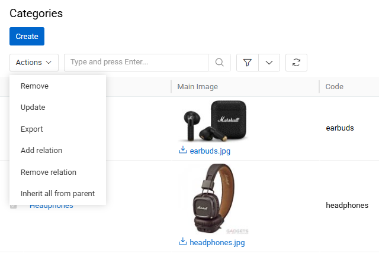{.medium}

For details on these actions, refer to the [**Mass Actions**](../../01.atrocore/04.understanding-ui/index.md#mass-actions) section of the **Views and Panels** article in this user guide.

### Single Record Actions

The following single record actions are available for category records on the list view page:

- View
- Edit
- Select
- Delete
- Bookmark

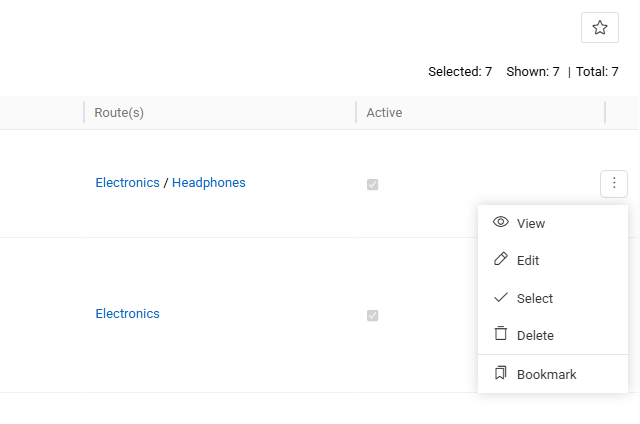{.large}

For details on these actions, please, refer to the [**Single Record Actions**](../../01.atrocore/04.understanding-ui/index.md#single-record-actions) section of the **Views and Panels** article in this user guide.

## Products

Customers search for the desired products in online shops and marketplaces in two ways: via the search function or via categories and sub-categories. Product attributes are used for additional filtering of the products found in either of these two ways. The faster the customer finds the desired product, the more likely he will make a positive purchase decision, that is why correct categorization is of great importance. For marketing purposes, each product is usually assigned to one or more categories.

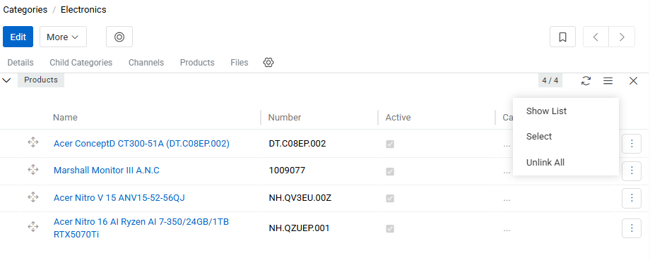{.large}

Products that are linked to the category record are shown on the `Products` panel within the category page, and on the `Categories` field within the [Product](../03.products/index.md#categories) page.

Before categorizing products, make sure that all necessary categories have been created and that the existing category trees are assigned to the corresponding channels, so that these categories can be used for the products distributed via those channels.

### Assigning categories to a product

To assign a product to one or more categories, open the product record and use the `Categories` field on the Taxonomy panel; refer to the [Categories](../03.products/index.md#categories) section of the Products article for details. By default, products can only be assigned to leaf categories (categories with no children); this behavior is configurable in [PIM Settings](#pim-settings). It is a good idea to refer to the category code, as the category names of different trees can be duplicated.

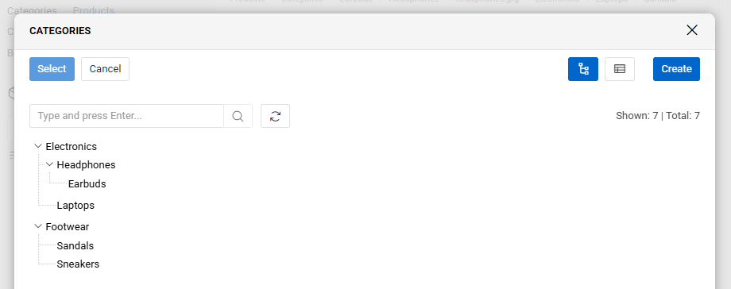{.large}

Categories are displayed as a hierarchical **tree view**, reflecting the parent–child structure of the category trees. You can expand and collapse branches directly in the list. To switch between tree and flat list display, use the tree-view toggle button above the list.

### Assigning products to a category

To add products to a category directly from the category side, open the `Products` panel on the category record, click the `▼` icon and select `Select`. In the opened pop-up, select all the products that should be added and confirm with `Select`.

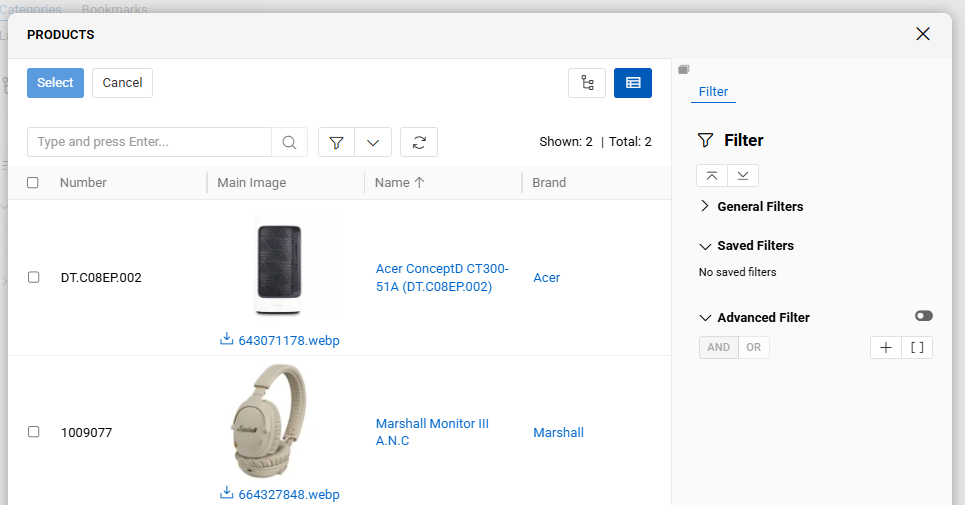{.large}

Products listed in the `Products` panel can be reordered by drag-and-drop. The order is saved per category and is independent for each category tree.

### Mass addition, change, or removal of categories for selected products

On the product list page, a relation to one or more categories can be added or removed for several selected products at once (e.g. after filtering), using the `Add Relation` and `Remove Relation` mass actions.

To do this, click `Add Relation` or `Remove Relation`, select `Categories` in the `Select Entity` field of the opened pop-up, and then select the necessary categories. As a result, the relation between the selected categories and the preselected products is added or removed accordingly.

For general information on this functionality, refer to the [**Mass Actions**](../../01.atrocore/12.mass-actions/index.md) article.

### Product Categories in Multiple Languages

Even if you want to manage your product content in different languages, there is no need in maintaining multiple category trees.

There are two ways to set up your product catalog if you carry product information in different languages:

1. Create a separate category tree for each language / locale.
2. Create just one category tree using multi-language fields for the category name.

The first approach is preferable, if you want to provide different channels with different product catalogs, e.g. some product should be transferred to channel 1, but not to channel 2. The second one is a better choice if you want to deliver the product information about all your products to all channels.

## Working With Other Entities Related to Categories

Relations to files, channels, products and child categories are available for all categories by default. These related entities records are displayed on the corresponding panels on the category [detail view](../../01.atrocore/04.understanding-ui/index.md#detail-view) page. If any panel is missing, please, contact your administrator as to your access rights configuration.

To be able to relate more entities to categories, please, contact your administrator.

### Child categories

Child categories that are linked to the category record are shown on the `Child categories` panel within the category page.

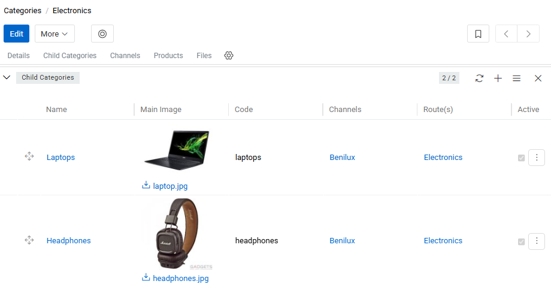{.large}

Child categories can be reordered by drag-and-drop within this panel. The display order is reflected in the category tree view.

### Channels

Channels that are linked to the category record are shown on the `Channels` panel within the category page.

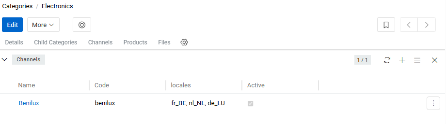{.large}

A category can be associated with multiple channels, and a channel can be associated with multiple categories, which makes it possible to maintain channel-specific category trees. For details on this relationship, refer to the [Channel links to Categories, Listings and Classifications](../06.channels/index.md#channel-links-to-categories-listings-and-classifications) section of the Channels article.

When a new subcategory is created under a parent category, it automatically inherits all channels that are linked to the parent category.

When a product is assigned to a category, it is automatically assigned to the channels to which the category tree of that category is linked.

### Files

Files linked to a category are displayed on the `Files` panel. You can link existing files (**Select**) or upload new ones (**Upload**).

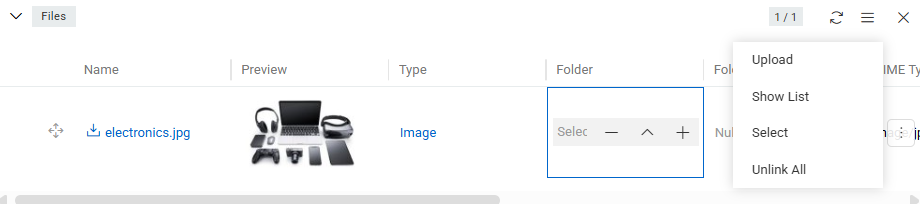{.large}

To set a file as the category's main image, use the appropriate option in the file's action menu (the file must be an image). Files can also be viewed, edited, reuploaded, unlinked, or removed from the same menu. Drag-and-drop reordering of files within the panel is supported; changes are saved immediately.
