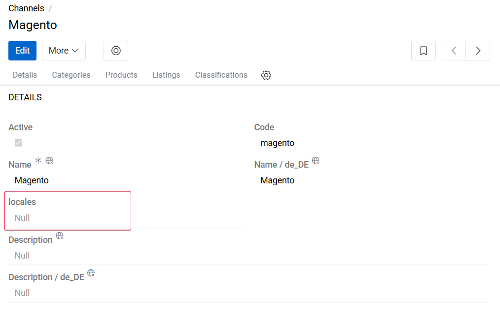
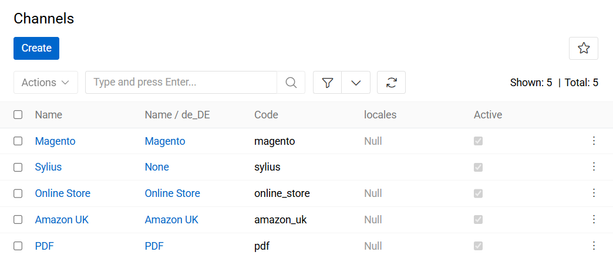
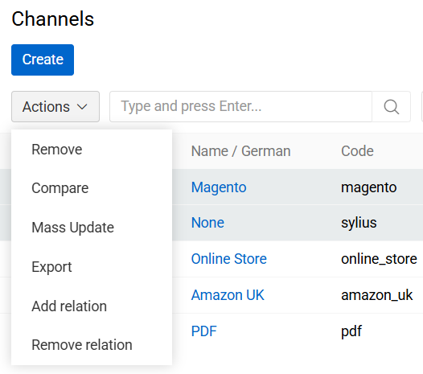
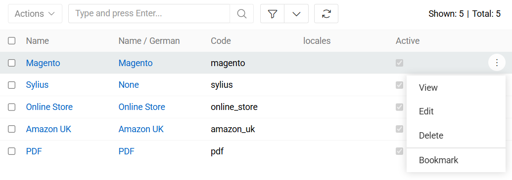
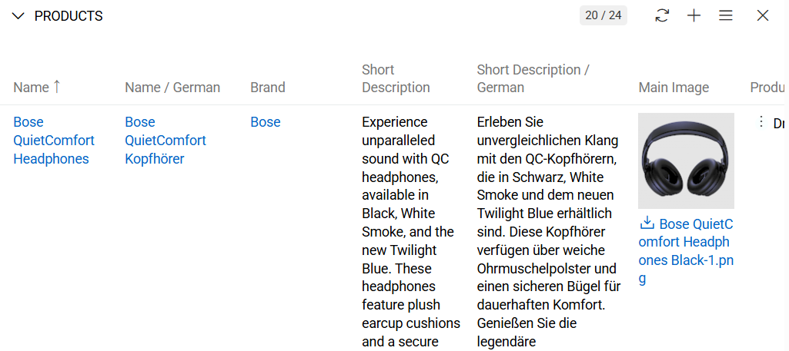
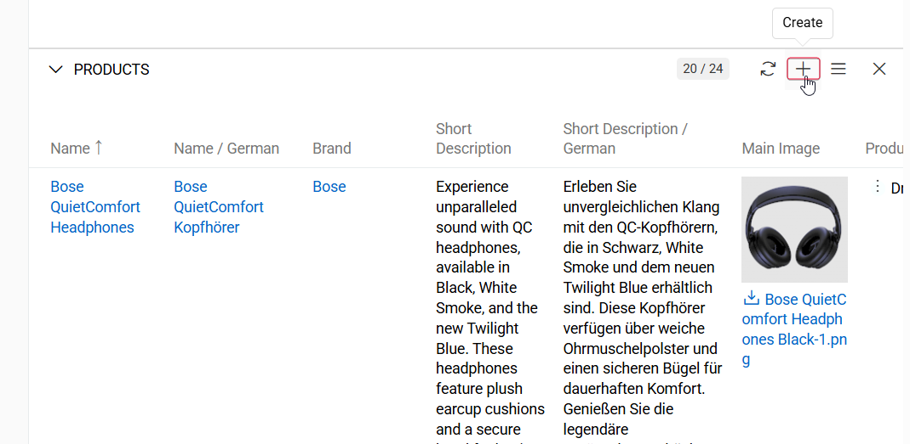
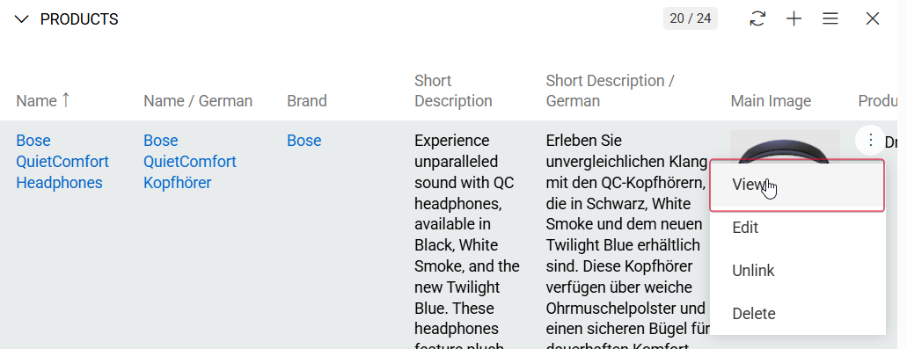

A **Channel** represents a destination or distribution endpoint for product data. Channels are used to control how product information is structured, filtered, and delivered to external or internal systems. Typical channel targets include online stores, marketplaces, mobile applications, print catalogs, or other third-party platforms.

Channels are commonly used to sort, segment, and prepare product information for online stores, ensuring that only relevant data (such as attributes, descriptions, and languages) is exposed per sales channel.

Channel data can be:

- Synchronized with third-party systems (e.g., e-commerce platforms or marketplaces)
- Exported in specific formats according to integration or business requirements

Using channels enables efficient implementation of multichannel and omni-channel strategies by allowing centralized product data management while supporting channel-specific customization.

## Channel Fields

The Channel entity includes the following preconfigured fields. Mandatory fields are marked with an asterisk (*).

| **Field Name**           | **Description**                            |
|--------------------------|--------------------------------------------|
| Active				   | Defines whether the channel is enabled and available for synchronization and export operations.                |
| Name (multi-lang) *	   | Human-readable channel name. Supports multiple languages for international usage.                |
| Code *                   | Unique technical identifier of the channel. Must consist only of lowercase letters, digits, and underscore (_) characters. This value cannot be changed after creation.     |
| Description (multi-lang) *			   | Describes the purpose and usage of the channel. Supports multiple languages.    |

If you want to make changes to the channel entity, e.g. add new fields, or modify channel views, you can do it via administration.

## Locale Configuration

To further limit and control the product information distributed through a channel, a Locale can be specified during channel setup.

When a locale is defined:
- Only product descriptions and texts available in the selected language(s) are transferred.
- This is particularly useful for region-specific online stores or localized catalogs.

{.large}

## Listing

To open the list of channel records available in the system, click the `Channels` option in the navigation menu:

{.large}

By default, the following fields are displayed on the [list view](../../01.atrocore/04.understanding-ui/docs.md#list-view) page for channel records:
 - Name
 - Code
 - Locales
 - Active

Channel records can be searched and filtered according to your needs. For details on the search and filtering options, refer to the [**Search and Filtering**](../../01.atrocore/11.search-and-filtering) article in this user guide.

### Mass Actions

The following mass actions are available for channel records on the list view page:

- Remove
- Mass update
- Export
- Add relation
- Remove relation

{.large}

For details on these actions, refer to the [**Mass Actions**](../../01.atrocore/04.understanding-ui/docs.md#mass-actions) section of the **Views and Panels** article in this user guide.

### Single Record Actions

The following single record actions are available for channel records on the list view page:

- View
- Edit
- Remove
- Bookmark

{.large}

For details on these actions, please, refer to the [**Single Record Actions**](../../01.atrocore/04.understanding-ui/docs.md#single-record-actions) section of the **Views and Panels** article in this user guide.

## Working With Products Related to Channels

Products that are linked to the channel are displayed on its [detail view](../../01.atrocore/04.understanding-ui/docs.md#detail-view) page on the `PRODUCTS` panel and include the following table columns:
 - Name
 - Brand
 - Short Description
 - Main Image
 - Product Status
 - Contents
 - Categories
 - Catalog
 - Active

{.large}

If this panel is not visible, please contact your system administrator to verify your access rights configuration.

Users can create a new Product record for the selected channel or link existing Product records to that channel.

{.large}

To view the channel related product record, click its name in the products list or select the `View` option from the single record actions menu for the appropriate record:

{.large}

To modify a Product record, select the `Edit` option from the single-record actions menu for the corresponding record. To remove a Product record, select the `Delete` option from the single-record actions drop-down list.

To open a channel-related Product record directly from the `PRODUCTS` panel, click the product name in the list. The system will open the Product [detail view](../../01.atrocore/04.understanding-ui/docs.md#detail-view) page, where additional actions can be performed based on the user’s assigned permissions.

## Channel links to Categories, Listings and Classifications

The Channel entity is preconfigured with relationships to several core PIM entities. These relationships define how product data is structured, filtered, and distributed per channel.

The following links are available by default:

| **Entity Name**                                  | **Relationship Type** | **Description**                                                                                                                                                                                                                    |
| ------------------------------------------------ | --------------------- | ---------------------------------------------------------------------------------------------------------------------------------------------------------------------------------------------------------------------------------- |
| [Categories](../05.categories/docs.md)           | Many-to-Many          | Allows a channel to be associated with multiple categories, and a category to be shared across multiple channels. This enables channel-specific category trees, which are commonly used for structuring products in online stores. |
| [Listings](../14.listing/docs.md)                | One-to-Many           | Each channel can contain multiple listings. Listings define channel-specific representations of products and control how products are exported or synchronized for a given channel.                                                |
| [Classifications](../07.classifications/docs.md) | One-to-Many           | Allows assigning multiple classifications to a channel. Classifications determine which attributes are available for products within the channel and enable channel-specific attribute sets.                                       |

These predefined relationships ensure that each channel can maintain its own structure, attribute scope, and product representation while still relying on centralized product data.