The ["AI Integration"](https://store.atrocore.com/en/ai-integration/20202) module is designed to reduce the manual workload by updating values in specific cases using AI engines. Engines such as ChatGPT, Gemini AI, and Jasper AI are supported.

## Basic use case

The basic use case of the module is to create a predefined prompt that can be used multiple times for different products, for example. Everything in the prompt is passed to an AI engine and the answer it gives back is the result of an operation. Depending on the type of use operation, it can be printed only in the frontend or directly in the backend.
When creating a prompt, you can use branch functions to enter values from different fields of an entity, or even values from fields of related entities, using {{ }} and the path to the value you are looking for. The final prompt will display the value instead of {{ }} and the branch function. This way you can have different prompts for different records but with the same structure.

## Connection

Before creating use cases, the [connection](https://help.atrocore.com/latest/atrocore/administration/connections#ai-services) to an AI engine must be set up.

> For one AI engine only one connection can be set.

### ChatGPT

Connection to OpenAI's ChatGPT API for natural language processing, text generation, and conversational AI capabilities within the AtroCore platform.

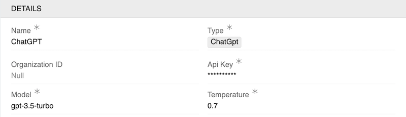

- **Organization ID** (required): The ID of the organization associated with your OpenAI account
- **Api Key** (required): Your OpenAI API key used for authenticating requests to the ChatGPT API
- **Model** (required): The specific ChatGPT model to be used for interactions (e.g., gpt-3.5-turbo, gpt-4)
- **Temperature** (required): A numerical value that controls the randomness of the model's output. Higher values (closer to 1.0) produce more random and creative responses, while lower values (closer to 0.0) produce more focused and deterministic responses

### Gemini AI

Integration with Google's Gemini AI services for advanced machine learning, natural language understanding, and AI-powered features.

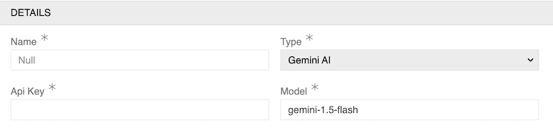

- **Api Key** (required): Your Google AI API key used for authenticating requests to the Gemini AI API
- **Model** (required): The specific Gemini AI model to be used for interactions (e.g., gemini-1.5-flash, gemini-1.5-pro)

### Jasper AI

Connection to Jasper AI platform for content generation, copywriting assistance, and AI-powered content creation tools.

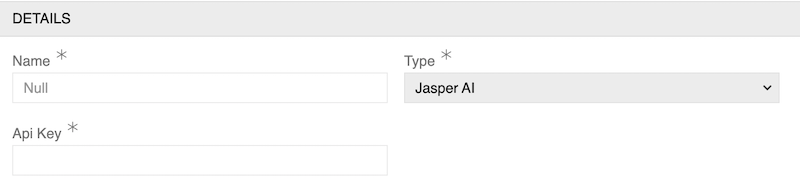

- **Api Key** (required): Your Jasper AI API key used for authenticating requests to the Jasper AI platform

## Base rules

The AI Integration module enables users to send prompts directly to an AI engine. Users can use the values of any field or attribute of a record as text or files to send them as images to an AI engine. This is achieved using [Twig](https://help.atrocore.com/latest/developer-guide/twig-tutorial) guidelines and syntax. The responses provided will be used as data for the field and must be in text format only.

> You cannot use attributes to record AI responses. Instead, you must select fields to ensure you always have somewhere to store them.

### How to send field values to an AI engine

Field values are referenced by using `{{  }}`. In the example prompt below, the value of the Name field (with code `name`) is represented by the entity.name.

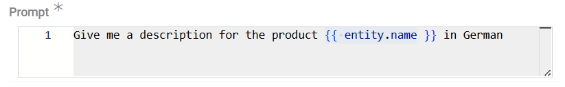{.medium}

### How to send attribute values to an AI engine

Attribute values are referenced by finding them by code and using their values as variables. In the example prompt below, the value of the attribute with code EF000128 is represented by the attributeCode variable.

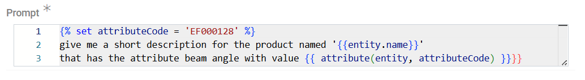{.medium}

### How to send files to an AI engine

Users can use the sharing feature to provide links to the files they want to share with the AI. Here's what it could look like for Gemini AI:

```Prompt

Give me the HTML description format of the following image, give only description: {{ convertFileToBase64(file) }}
```

Files used in this method should not be big due to AI limitations.

## Use cases

AI can update fields in backend and frontend. Let's create prompts for every type.

### Updating values in frontend

To create a predefined prompt that can be used multiple times for different records without affecting the database until the user specifically saves the result, you need an `Suggest Value by AI` action.

Go to `Administration > Actions` and create one with the `Suggest Value by AI` type. The options are mostly the same as for [Suggest Value](../../01.atrocore/03.administration/06.actions/docs.md#suggest-value) action.

! Each action can only affect one field at a time. If the user needs AI for more fields, simply create new **Suggest Value by AI** actions for each field.

Next, select and connect to an AI engine. Select the entity in which you want to use the prompt (`Source Entity`) to create an AI-type action. Then choose a usage method to determine how the button will be configured.

For the `Record action button` usage, select `Display` (as a single button or a dropdown) and check whether you want it to be a mass action. The display options are the same as for the [Suggest Value](../../01.atrocore/03.administration/06.actions/docs.md#suggest-value), and the subsequent steps are the same as for the `Field Action Button` case.

For the `Field action button` usage, select the `Display Field` and `Field`. For quality of use purposes, we suggest selecting the same field as Display Field and Field.

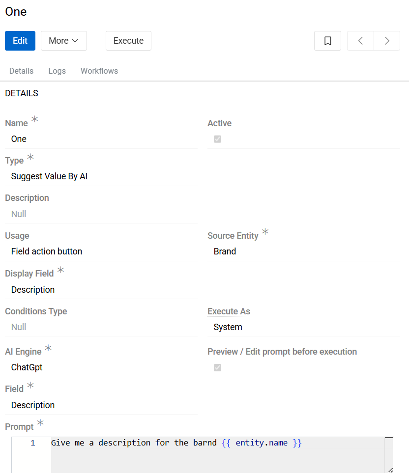{.large}

`Preview / Edit prompt before execution` allows users to double-check prompts before sending them to an AI engine.

Now all the user needs to do is create a prompt that leads to the most appropriate response. This is a case of trial and error and is no different from writing a prompt in AI by hand.

After all the preparation, let's use our prompt.

We will go to Brands and update the brand Hella by using `Field action button` approach. Go to edit mode or use inline edit - now you will see the Suggest Value by AI button. Name of the button is the name of the action.

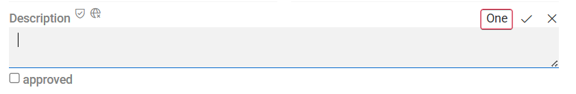{.medium}

As we have selected the Preview / Edit Prompt before running checkbox, we will see a final prompt and can now edit and send it or cancel the action. If the Preview / Edit prompt before running checkbox is not selected, this step is skipped, and the predefined prompt is sent automatically without confirmation.

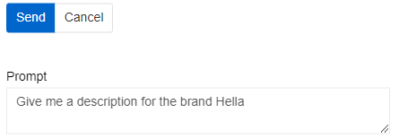{.medium}

If an answer is given, it will appear in the field but will not be saved until the user specifically saves the value. The result given by the AI can also be modified by the user.

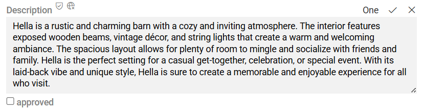{.medium}

### Updating values in backend

A predefined prompt that can be used multiple times on different records, but does not affect the database until the user actually saves the result, can only be used on one record at a time. If the user wants mass updates using AI, a Set value By AI action must be created. This can only be done in the backend and the changes are always written to the database. Go to Administration/Actions and create one with Set value by AI type.

> For Set value By AI functionality to be available, the user needs the ["Workflows"](https://store.atrocore.com/en/workflows/20194) module to be installed.

The basic logic of an action is the same as in the [Suggest value By AI](#updating-values-in-frontend), but instead of a trigger method, the user can choose to display an action and if he wants it to be a mass action. The usage of the created action is the same as in the Update type action.

Here you can see an example of such action:

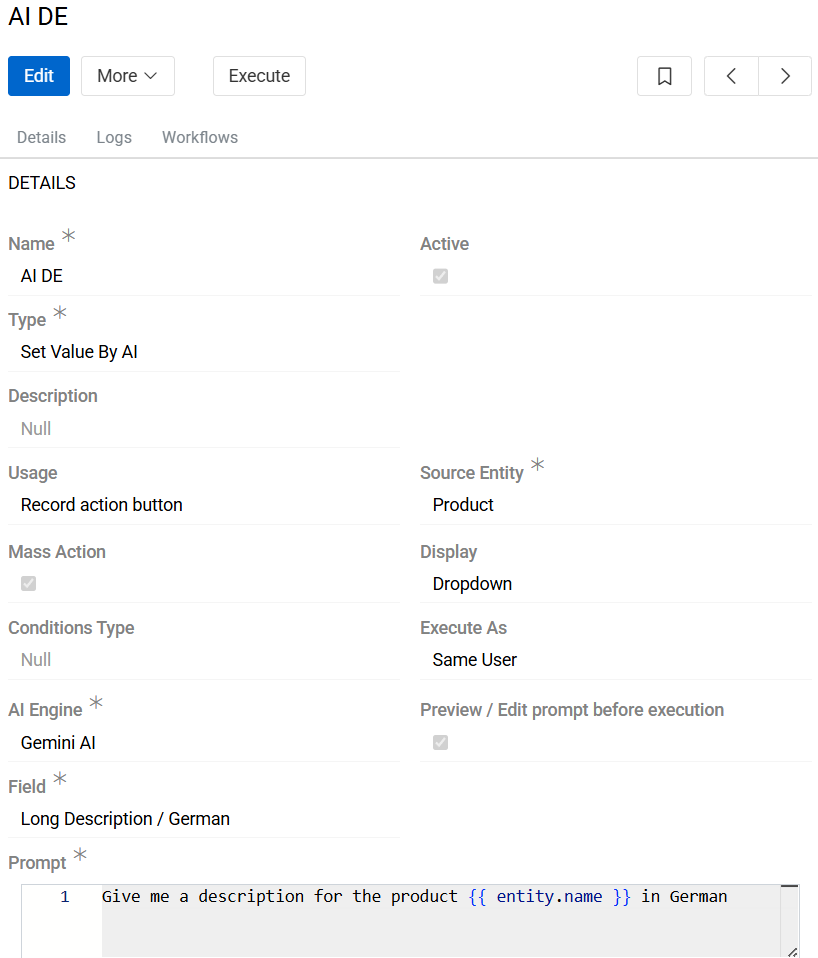{.large}

It can be used in the single record, as a mass action, or as a part of a workflow. The options are the same as for [Set value](../../01.atrocore/03.administration/06.actions/docs.md#update) action.

> For actions that are used as part of a workflow or as part of a mass action with 5 or more records, it is better to leave the Preview/Edit Prompt Before Execution checkbox unchecked so that the user is not forced to confirm multiple prompts that slow down the process.

### Using AI for translations

The [Translations](https://store.atrocore.com/en/translations/20191) module uses the AI capabilities of the DeepL translation tool and allows you to fine-tune translation quality through flexible configuration, rather than relying solely on automatic translation. However, if you only want to use the AI Integration module, you can still translate into different languages. The possibilities for translation are limited only by the capabilities of the AI you are using.

Here you can see an example of how you can use AI Integration module as a translation tool:

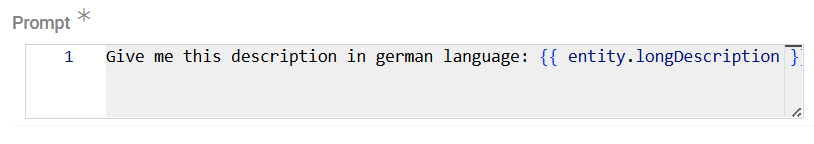{.medium}

This action is configured to translate the value of the `Description` field into German and enter the result into the German `Description` field. For every new filed and language you will have to set a new action.

As you can see from the above example, the Translations module definitely has advantages:

- Setting up translations in it is faster than using the AI Integration module.
- The Translations module uses dedicated translation tools instead of the general AI tools used by the AI Integration module.
- The AI integration module cannot be used to update attributes because they cannot be set as target fields.
- Translations made using the Translations module can be adjusted using glossaries for known words.

Therefore, we recommend using the Translations module for regular translations.
