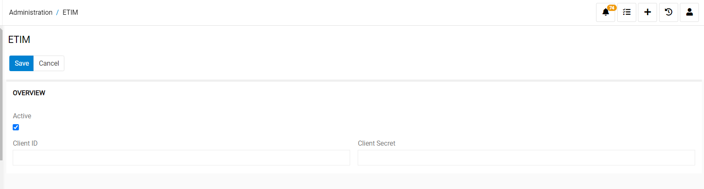
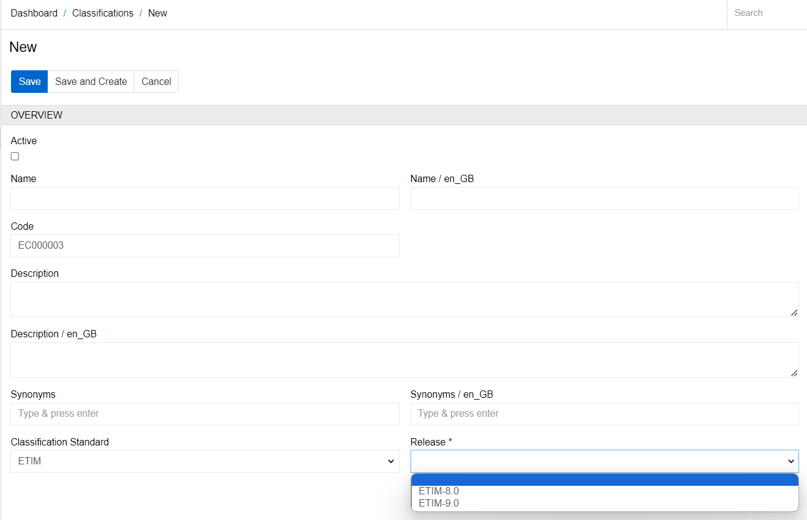
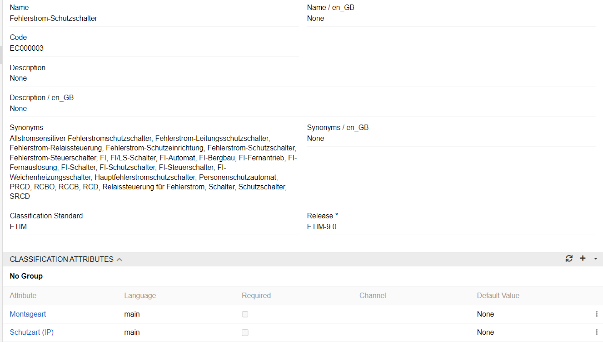
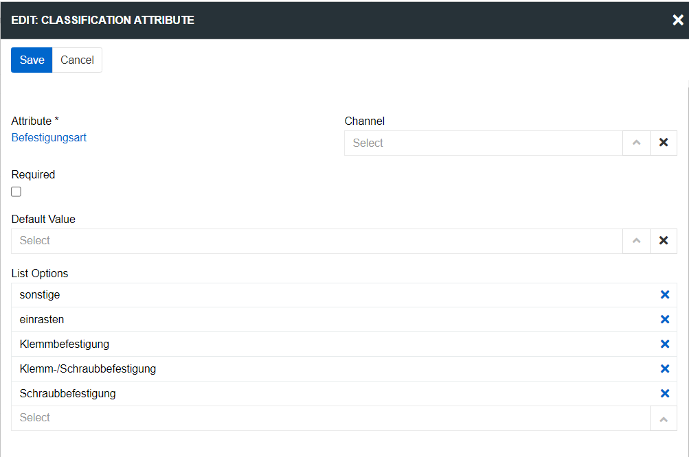

Electro-Technical (or European Technical) Information Model, known as ETIM, is a standardized classification system for technical goods within the electrical and electronic industries. This model was created to establish a common language for describing technical specifications. This standardization streamlines communication between those involved in the production, distribution, and use of these goods.

The ETIM classification model simplifies product description and data transfer between manufacturers and retailers. It supports multilingual product data, enabling businesses to cater to international markets. This model allows suppliers and wholesalers to standardize data flow and exchange product information between countries, benefiting multinational companies operating globally.

**ETIM Classification** module enables to use and extend ETIM classifications. It allows you to significantly simplify the process of creating classifications and adding attributes to them. The installed module allows you to avoid manually adding classification attributes, units and options to attributes of the list type. Currently, the PIM supports following releases of ETIM classifications: ETIM 8.0, ETIM 9.0 and ETIM BMECat 5.0 (BMECat Adapter is needed). This module enables effortless management of product attributes, ensuring compliance with industry guidelines and standards.

## Activation of the ETIM classification

By purchasing or renting the module, you get access data to the ETM classifications in the language you need. In order to activate the module functionality, you need to enter authorization data in fields `Client ID` and `Client Secret` on "Administration / ETIM" page and set checkbox `Active`.

{.large}

## How to create ETIM Classification

To create a new Classification, click `Classifications` in the navigation menu, and then click the `Create Classification` button. The common creation window will open:

{.large}

Set the value "ETIM " for field **Classification Standard** and select the required release for field **Release**. These fields will be added to the entity automatically after the module is activated. After that, in the **Code** field, enter the code of the classification to be added and click the `Save` button. The fields **Name**, **Synonyms**, and **Classification Attributes** will be filled in automatically. Also, all the attributes, units, and list options required for the classification will be automatically created. You can also create classifications using an import feed by importing values for fields "Classification Standard", "Release" and "Code" from the file.

{.large}

Please note that according to the ETIM standard, the same attributes of the list type can have different options for different classifications. To achieve this, the "List options" field was added to the Classification Attribute entity, which allows you to select from the attribute options exactly those that are relevant for the current classification. When the ETIM module is installed, these options will be selected automatically.

{.large}
